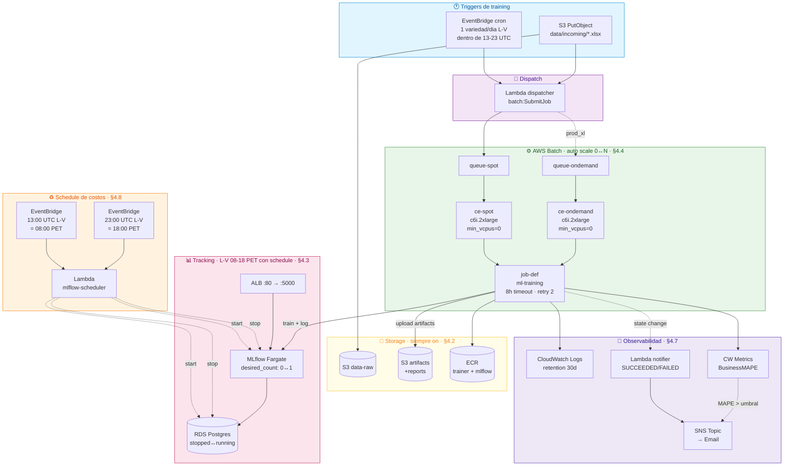
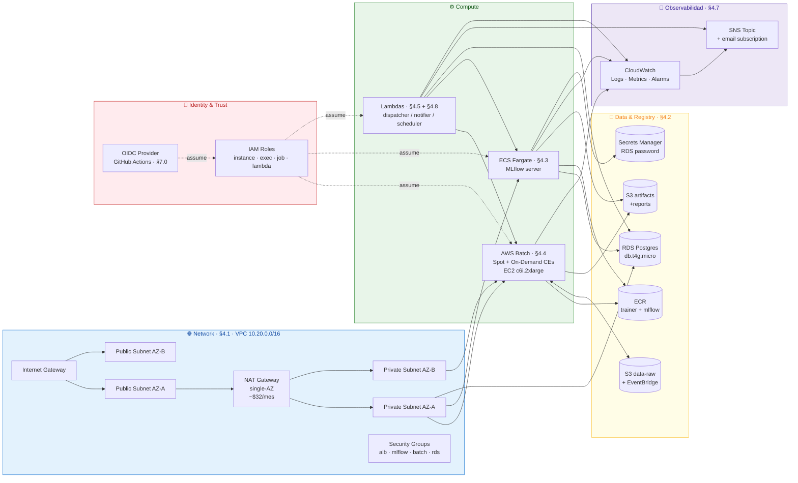

# Guia MLOps AWS — Infra modular en Terraform

> **De novato a experto en MLOps**: esta guia esta disenada para que alguien
> que nunca toco AWS, Terraform o CI/CD pueda implementar un sistema de
> entrenamiento de modelos production-grade, y al terminar entienda los
> trade-offs como un senior. Si ya sos experto, hay un mapa para saltearte
> lo que ya sabes (§P.4).

> **Esta guia es el blueprint unico** del MLOps del proyecto. Aqui viven
> tanto la infra Terraform (§3-§4), el patcheo del codigo del trainer (§6),
> **el CI/CD entero** (§7) y el modelo de promotion (§12). No hay archivos
> reales de workflows en `.github/` — al implementar, se materializan desde
> los bloques YAML embebidos abajo.
>
> **Ubicacion del Terraform**: la guia usa `envs/prod/` como referencia
> generica. La implementacion del proyecto usa **mono-repo** — el Terraform
> vive en `infra/envs/prod/` del mismo repo que el trainer, y los YAML de
> §7 ya tienen ese path. Si en el futuro separas la infra a su propio repo
> (recomendado a partir de ~3 entornos dev/staging/prod), mover `infra/` a
> un repo `ml-training-infra/` y actualizar `working-directory:` en `ci.yml`.
>
> Referencia rapida: `terraform init && terraform plan && terraform apply`.

Esta guia describe la infra de produccion como **modulos Terraform**: cada
modulo encapsula una capa (network, mlflow, batch, ...) con interface clara
(variables / outputs). El compose se hace en `envs/prod/main.tf`.

Diseño detras de la modularizacion:

1. **Aislar blast-radius**: tocar un modulo (p.ej. `batch`) no obliga a re-aplicar otro (p.ej. `mlflow`).
2. **Reutilizable**: el dia que necesites un `envs/dev/` o `envs/staging/`, copias el `prod/` y cambias `tfvars`.
3. **Idempotente**: `terraform apply` se puede correr N veces; el estado vive en S3 + lock en DynamoDB.
4. **Operacion declarativa**: la infra es codigo. PR = cambio de infra revisable.

---

## 📖 P.1 Bienvenida — ¿Para quién es esta guía?

### Para quién es

| Perfil | Qué vas a sacar |
|---|---|
| **Data scientist** que nunca toco AWS | Aprendes a poner tu modelo en produccion sin depender de un equipo de DevOps. |
| **Ingeniero de ML junior** | Pasas de "entreno en mi notebook" a "tengo un sistema que se reentrena solo, con alarmas, gates de calidad y registro versionado". |
| **DevOps que nunca hizo MLOps** | Ves donde difiere de un deploy web tipico (no es lo mismo deployar codigo que deployar un modelo). |
| **Tech lead / arquitecto** | Tenes un blueprint copiable + auditable para sustentar decisiones frente a stakeholders. |
| **Senior MLOps** | Saltate al §P.4 mapa de aprendizaje — tenes un atajo. |

### Qué vas a saber al terminar

Cuando hayas implementado los pasos del §13 (Apendice — checklist), vas a
poder:

- **Operar AWS Batch + ECS Fargate + RDS + ALB + Lambda + EventBridge**
  como un sistema unico que se enciende y apaga solo segun horario.
- **Escribir y leer Terraform** modular (modulos con interface
  variables/outputs, state remoto, locks).
- **Diseñar CI/CD para MLOps** distinguiendo CI/CD de codigo (§7.1) de
  CI/CD de modelos (§7.2 + §12 con gates de calidad).
- **Decidir Spot vs On-Demand** segun duracion y costo de interrupcion (§8.3).
- **Trazar un modelo desde su training run hasta el binario en produccion**
  (run → champion → MLflow Registry version → image tag → Batch job).
- **Justificar trade-offs de seguridad**: TLS vs HTTP, KMS vs SSE-S3,
  Multi-AZ vs single, VPC endpoints vs NAT (§10).
- **Diagnosticar fallos comunes** sin googlear: Spot interrupt vs OOM,
  RDS cold-start, MLflow allowed-hosts, IAM denied (§11).

### Tiempo estimado

Si estas haciendo esto por primera vez, asumi:

| Bloque | Tiempo |
|---|---|
| Leer P.1-P.4 (este prologo + glosario + conceptos + mapa) | 60-90 min |
| Leer §0 a §6 (arquitectura + infra + lambdas) | 4-6 h |
| Leer §7 a §13 (CI/CD + runbook + costos + hardening + troubleshooting) | 3-4 h |
| **Implementar Fase 0 a Fase 5 del checklist (§13)** | **2-3 dias de trabajo enfocado** |
| Implementar Fase 6 (scheduler de costos) | +2-3 horas |
| Implementar Fase 7 (hardening opt-in) | +1-2 dias por cada item |

Total para producir un MLOps level 1 funcionando: **una semana laboral**.

### Cómo leer esta guía

- **Si nunca usaste AWS**: leela **lineal**, secciones P.1 → P.4 → §0 → §13.
  No te saltees el glosario; muchos errores de novato vienen de no
  distinguir "ECS Fargate" de "ECS EC2" o "ALB" de "NLB".
- **Si ya usas AWS pero no MLOps**: leé P.4 (mapa), salta a §0, leé §6
  (codigo del trainer) y §12 (model promotion gate) primero, despues el resto.
- **Si ya hiciste MLOps en otra cloud**: usa la guia como referencia
  (Ctrl+F), no leas lineal. Empezá por §0 (arquitectura) y §13 (checklist).

---

## 📚 P.2 Glosario express

Vocabulario que aparece sin avisar en la guia. Lee esto antes para no
tener que ir a Google a cada rato.

| Termino | Que es en 1 frase |
|---|---|
| **ALB** (Application Load Balancer) | Balanceador HTTP/HTTPS de AWS que distribuye trafico a varios containers/instancias. Aca solo expone MLflow al mundo. |
| **AMI** (Amazon Machine Image) | Snapshot del disco de una EC2. AWS Batch usa AMIs pre-fabricadas con Docker instalado. |
| **ARN** (Amazon Resource Name) | Identificador unico de cada recurso AWS. Formato `arn:aws:<service>:<region>:<account>:<resource>`. |
| **AWS Batch** | Servicio que corre **jobs batch** (no servicios 24/7) en EC2/Fargate. Auto-escala 0↔N segun cuantos jobs hay en la queue. Lo usamos para los entrenamientos. |
| **CI/CD** | Continuous Integration / Continuous Deployment. Pipeline automatico que se dispara con cada push: corre tests, builds, deploys. |
| **Cold start** | El primer request despues de que un servicio estaba apagado es lento porque el container/maquina tiene que bootear. RDS post-stop = ~5 min de cold start. |
| **Compute Environment (CE)** | En AWS Batch, define las EC2 que pueden correr jobs (tipo de instancia, Spot/On-Demand, min/max vCPUs). |
| **ECR** (Elastic Container Registry) | Registry de Docker images de AWS. Tu equivalente privado de DockerHub. |
| **ECS** (Elastic Container Service) | Orquestador de containers de AWS. Tiene 2 modos: **EC2** (vos manejas las maquinas) o **Fargate** (AWS las maneja). Usamos Fargate. |
| **EventBridge** | Bus de eventos de AWS. Dispara cosas por cron, por evento de otro servicio (ej. "S3 PutObject"), o por API custom. |
| **Fargate** | Modo serverless de ECS. Solo decis "necesito X vCPU/Y memoria" y AWS te da el container corriendo. No manejas EC2. |
| **HCL** (HashiCorp Configuration Language) | El lenguaje de Terraform. Sintaxis declarativa, parecida a JSON pero con bloques. |
| **IaC** (Infrastructure as Code) | Definir la infra en archivos versionables (git), no clickeando en una consola. Terraform es la herramienta lider. |
| **IAM** (Identity and Access Management) | El sistema de permisos de AWS. Define quien (usuario/rol/servicio) puede hacer que sobre que recurso. |
| **Idempotente** | Una operacion que podes correr N veces y siempre te deja en el mismo estado. `terraform apply` es idempotente. |
| **Lambda** | Funcion serverless. AWS la ejecuta cuando un trigger la invoca; no manejas servidor. Usamos Lambdas para dispatcher, notifier y scheduler. |
| **MLflow** | Plataforma open-source para tracking de experimentos ML + Model Registry (versiones de modelos en Staging/Production). |
| **NAT Gateway** | Permite que recursos en subnets **privadas** salgan a internet. Cuesta ~$32/mes (el item mas caro). |
| **OIDC** (OpenID Connect) | Protocolo de autenticacion. GitHub Actions lo usa para asumir un IAM role sin necesidad de access keys (secrets de larga duracion). |
| **OOM** (Out of Memory) | El kernel mata el proceso porque pidio mas RAM de la disponible. Causa comun de fallos en jobs ML. |
| **RDS** (Relational Database Service) | Postgres/MySQL/etc managed de AWS. Aca usamos Postgres como backend de MLflow. |
| **S3** (Simple Storage Service) | Storage de objetos de AWS. Lo usamos para data (Excels) y artifacts (modelos, reportes). |
| **Service Linked Role (SLR)** | Un IAM role que AWS crea automaticamente para que cierto servicio funcione (ej. AWS Batch usa uno para crear EC2). |
| **SNS** (Simple Notification Service) | Sistema de pub/sub. Publicamos a un topic SNS y los suscriptores (email, Lambda, SQS) reciben. |
| **Spot** | EC2 a precio reducido (~70% off) pero AWS puede **interrumpirte con 2 min de aviso**. Bueno para jobs con retry, malo para servicios 24/7. |
| **State (Terraform)** | Archivo JSON que Terraform mantiene con el mapping "recurso definido en HCL → recurso real en AWS". Vive en S3 (remoto) con lock en DynamoDB. |
| **STS** (Security Token Service) | Servicio AWS que emite credenciales temporales. OIDC + STS = roles asumidos sin access keys. |
| **VPC** (Virtual Private Cloud) | Tu red privada en AWS. Adentro tenes subnets publicas y privadas. |

---

## 🧠 P.3 Conceptos fundamentales (lee esto si nunca hiciste MLOps)

### P.3.1 ¿Qué es MLOps y por qué importa?

**MLOps** = aplicar a modelos de ML las practicas que la industria de
software ya tiene para codigo (CI/CD, observabilidad, versionado,
reproducibilidad). El problema que resuelve:

- Tu modelo entrenado en una notebook **no es reproducible** (si tu
  laptop muere, perdiste el ambiente, las versiones de pandas/numpy,
  los hyperparams).
- Tu modelo **no se reentrena solo** cuando llega data nueva — alguien
  tiene que correr el script a mano.
- **No sabes que version del modelo esta en produccion** cuando alguien
  reporta una prediccion sospechosa.
- **No tenes alarmas** cuando el modelo degrada (MAPE sube
  silenciosamente y nadie se entera).

Esta guia resuelve los 4 problemas:
1. **Reproducibilidad**: el trainer corre en Docker (image inmutable),
   con commits taggeados en MLflow.
2. **Reentrenamiento automatico**: EventBridge dispara el dispatcher
   cada vez que sube data nueva al S3.
3. **Versionado**: cada training crea una nueva version en MLflow
   Registry. Sabes que SHA de git genero que version.
4. **Alarmas**: CloudWatch monitorea MAPE > umbral y dispara SNS → email.

### P.3.2 ¿Qué es Infrastructure as Code (IaC)?

Antes (forma vieja): "voy a la consola AWS, clico Crear EC2, configuro,
guardo". Problema: ¿como recreas la misma infra en otra cuenta? ¿Quien
toco el SG ayer? ¿Como revertis un cambio?

IaC con Terraform: escribis archivos `.tf` (HCL) que describen el estado
**deseado** de tu infra. Corres `terraform apply` y Terraform calcula
las diferencias entre lo que esta y lo que querés, y aplica los cambios.

Analogia mental: **HTML describe la estructura de una pagina, HCL
describe la estructura de tu infra**. El navegador renderiza el HTML;
Terraform "renderiza" el HCL → recursos reales en AWS.

Ejemplo minimo:
```hcl
resource "aws_s3_bucket" "data" {
  bucket = "mi-bucket-de-datos"
}
```
Eso es todo lo que necesitas para que `terraform apply` te cree un
bucket S3 llamado `mi-bucket-de-datos`. Si lo borras del .tf y
re-aplicas, lo elimina.

### P.3.3 Containers y Docker en 3 minutos

Un **container** es un proceso Linux aislado que incluye TODO lo que
necesita para correr: codigo + dependencias + libs del sistema. Si
funciona en tu laptop, funciona en AWS porque corre el mismo container.

**Docker** es la herramienta para construir y correr containers. El
archivo de receta es el `Dockerfile`. Una vez construido, el container
se sube a un **registry** (Docker Hub, ECR).

Diferencia container vs VM:
- VM: corre un sistema operativo completo. ~1-2 GB, arranca en minutos.
- Container: comparte el kernel del host. ~100-500 MB, arranca en segundos.

En esta guia hay 2 imagenes:
- `ml-training` (el trainer XGB/LGB) — construida por GH Actions.
- `mlflow-with-pg-s3` (MLflow + psycopg2 + boto3) — construida una vez
  a mano y pusheada a ECR.

### P.3.4 Los servicios AWS que vas a usar

Mini-tabla mental para no perderte:

| Servicio | Para que sirve aca | Cuando se enciende |
|---|---|---|
| **S3** | Guardar Excels de input + modelos+reportes de output | Siempre on (no se factura compute, solo storage) |
| **ECR** | Registry de Docker images privado | Siempre on |
| **VPC + subnets + NAT** | La red privada donde viven los servicios | Siempre on |
| **RDS Postgres** | Backend de MLflow (donde guarda experimentos/runs) | L-V 08-18 PET (con scheduler §4.8) |
| **ECS Fargate** | Corre el server de MLflow (la UI web) | L-V 08-18 PET (con scheduler) |
| **ALB** | Expone MLflow al mundo en `:80` | Siempre on |
| **AWS Batch** | Corre los entrenamientos | Solo cuando hay un job (auto 0↔N) |
| **Lambda** | dispatcher (lanza jobs), notifier (envia alertas), scheduler (apaga MLflow) | Solo cuando un trigger las invoca |
| **EventBridge** | Crons + eventos S3 que disparan Lambdas | Siempre on |
| **CloudWatch** | Logs + metricas + alarmas | Siempre on |
| **SNS** | Topic de alertas que manda emails | Solo cuando se publica |

### P.3.5 ¿Por qué OIDC y no AWS access keys?

Forma vieja: en GitHub Settings → Secrets, guardar `AWS_ACCESS_KEY_ID`
y `AWS_SECRET_ACCESS_KEY`. El workflow las usa para llamar a AWS.

Problemas:
- Si el secret se filtra (PR malicioso, dump de logs), el atacante tiene
  acceso "para siempre" hasta que rotes la key.
- Hay que rotar manualmente.
- No sabes cuando se uso (no hay trazabilidad por evento).

Forma nueva con **OIDC**: GitHub Actions le dice a AWS "soy
`repo:tu-org/tu-repo:ref:refs/heads/main`, firmado por GitHub". AWS le
da credenciales **temporales** (60 min) para asumir un IAM role
especifico.

Beneficios:
- Sin secrets de larga duracion en GitHub.
- Auditable en CloudTrail (cada AssumeRoleWithWebIdentity queda
  registrado con el commit SHA del workflow).
- Si tu cuenta de GitHub se compromete, el atacante NO tiene access
  keys de AWS — solo el repo.

Esta guia configura OIDC en §7.0.

### P.3.6 Spot vs On-Demand: el ahorro del 70%

EC2 (las maquinas que corren tus jobs) tiene 3 modelos de pago:

| Modelo | Precio | Garantia |
|---|---|---|
| **On-Demand** | 100% precio listado | AWS NO te interrumpe |
| **Spot** | ~30% precio listado | AWS puede interrumpirte con 2 min de aviso si necesita la capacidad |
| **Reserved** | -40% a -70% precio | Te comprometes a 1-3 años de uso, pagas por adelantado |

Para training de ML que tarda 1-2h, **Spot es perfecto**: si te
interrumpen, tu job-def tiene `retry_strategy { attempts = 2 }` y AWS
Batch lo re-lanza en otra instancia. Probabilidad de Spot interrupt:
~5-10% en c6i.2xlarge.

Para jobs largos (`prod_xl` ~5-6h), el riesgo de interrupcion sube a
20-30%; ahi conviene la queue On-Demand (§8.3).

Para **servicios 24/7** (MLflow Fargate, RDS) NO se usa Spot — no
podes tolerar interrupcion en un servicio que debe responder requests.

### P.3.7 MLflow: el sistema operativo de tus modelos

MLflow tiene 4 componentes; en esta guia usamos 3:

1. **Tracking server** (lo deployamos en ECS Fargate): recibe metricas,
   params y artifacts de cada training run, los guarda en RDS Postgres
   (backend store) y en S3 (artifact store).
2. **Experiments + Runs**: un **experimento** = un nombre (POP, JUPITER, …).
   Un **run** = una ejecucion del training dentro del experimento. Cada
   run tiene metricas (R2, MAPE), params (hyperparams), y artifacts
   (modelo.pkl, reportes.html).
3. **Model Registry**: catalogo de modelos productivos. Cada modelo tiene
   un nombre (`rnd-forest-POP`) y N versiones. Cada version puede estar en
   `None | Staging | Production | Archived`. La promotion a Production
   pasa por el workflow `promote.yml` (§7.2) con gates de calidad.
4. **Models** (NO lo usamos directamente — el patch del trainer en §6
   loguea el pipeline con `mlflow.sklearn.log_model`).

Por que MLflow y no SageMaker / Weights&Biases / Comet:
- **Open source** → portable, sin vendor lock-in.
- **Self-hosted** → tus datos no salen de tu cuenta AWS.
- **Maduro** → 3+ años en produccion en miles de empresas.
- **Compatible con sklearn pipelines** → cero refactor de codigo.

---

## 🗺️ P.4 Mapa de aprendizaje

Tres rutas segun tu nivel. Cada ruta te lleva al mismo final, solo cambia
el orden y lo que podes saltearte.

### Ruta 🥚 Novato — nunca toque AWS / Terraform / MLOps

Leer **TODO** en orden lineal. Estimado: 1 semana de lectura + 2 semanas
de implementacion guiada.

```mermaid
flowchart LR
    P1[P.1-P.4<br/>Prologo] --> S0[§0<br/>Arquitectura]
    S0 --> S1[§1-§1.1<br/>Estructura<br/>+ Prereqs]
    S1 --> S2[§2<br/>Bootstrap]
    S2 --> S3[§3<br/>envs/prod]
    S3 --> S4[§4<br/>Modulos]
    S4 --> S5[§5-§6<br/>Workflow<br/>+ Trainer]
    S5 --> S7[§7<br/>CI/CD]
    S7 --> S8[§8<br/>Runbook]
    S8 --> S9[§9<br/>Costos]
    S9 --> S10[§10<br/>Hardening]
    S10 --> S11[§11<br/>Troubleshooting]
    S11 --> S12[§12<br/>Promotion]
    S12 --> S13[§13<br/>Checklist]
    S13 --> S14[§14<br/>Epilogo]

    classDef done fill:#c8e6c9,stroke:#388e3c
    classDef now fill:#fff3e0,stroke:#f57c00
    class P1,S0,S1,S2,S3,S4,S5,S7,S8,S9,S10,S11,S12,S13,S14 done
```



### Ruta 🐤 Intermedio — uso AWS pero no MLOps

Saltate P.2-P.3 (ya conoces los conceptos). Empezá por:

1. **P.4 (este mapa)** — para ubicar las secciones
2. **§0** Arquitectura objetivo — los diagramas Mermaid te dan el panorama
3. **§6** Codigo del trainer — donde difiere "deploy de codigo" de "deploy de modelo"
4. **§7** CI/CD MLOps — diferencia entre CI/CD de codigo (§7.1) y CI/CD de modelos (§7.2)
5. **§12** Model promotion gate — el corazon de la diferencia
6. **§4** Modulos Terraform — leer por necesidad (Ctrl+F cuando algo no compila)
7. **§13** Checklist — implementar

### Ruta 🦅 Experto — ya hice MLOps en otra cloud

Usa la guia como **referencia**, no como tutorial:

1. **§0** Arquitectura — captar las decisiones (Spot+Fargate, mono-repo, OIDC)
2. **§13** Checklist — implementar
3. **Ctrl+F** sobre el resto cuando algo no cierra
4. **§10** Hardening — items opt-in para subir el nivel
5. **§12** Promotion gate — el modelo de A/B que recomendamos

### Cuando termines: te ubicás en §14 (epilogo) para autoevaluarte

---

## 0. Arquitectura objetivo

> **TZ assumption**: los cron expressions abajo usan **UTC** (estandar
> EventBridge). El horario laboral del proyecto es **08:00–18:00 Peru
> (UTC-5)**, que en UTC son **13:00–23:00**. Si tu TZ cambia, ajustar
> los `cron(...)` en §4.5 y §4.8.

### 0.1 Flujo end-to-end (con auto-encendido y auto-apagado)



### 0.2 Arquitectura por capas



**Operacion**: 1 variedad/dia (L-V), c6i.2xlarge satura sus 4 cores fisicos
por job. La queue Spot cubre `smoke|dev|prod`. La queue on-demand se usa
ad-hoc para `prod_xl` (5-6h) donde una interrupcion de Spot duele. MLflow
+ RDS estan UP solo de **lunes a viernes 08-18 PET** (13-23 UTC); fuera
de esa ventana se apagan automaticamente (§4.8) — los jobs de training
deben programarse dentro de esa ventana.

<details>
<summary>📄 Diagrama ASCII (fallback para terminales sin renderer Mermaid)</summary>

```
                                    ┌──────────────────────────────┐
                                    │  EventBridge                 │
                                    │  - cron 1 variedad/dia L-V   │
                                    │  - S3 PutObject (data-raw)   │
                                    └────────────┬─────────────────┘
                                                 │
                                                 ▼
                                          ┌──────────────┐
                                          │  Lambda      │
                                          │  dispatcher  │
                                          └──────┬───────┘
                                                 │ batch:SubmitJob
                                                 ▼
                              ┌─────────────────────────────────────┐
                              │  AWS Batch                          │
                              │  ┌──────────────┐  ┌──────────────┐ │
                              │  │ queue-spot   │  │ queue-od     │ │
                              │  └──────┬───────┘  └──────┬───────┘ │
                              │  ┌──────▼───────┐  ┌──────▼───────┐ │
                              │  │ ce-spot      │  │ ce-ondemand  │ │
                              │  │ c6i.2xlarge  │  │ c6i.2xlarge  │ │
                              │  └──────────────┘  └──────────────┘ │
                              │  job-def: ml-training (8h, retry 2) │
                              └────────────────────┬────────────────┘
                                                   │
                  ┌────────────────────────────────┼────────────────────────────┐
                  ▼                                ▼                            ▼
       ┌──────────────────┐              ┌──────────────────┐         ┌─────────────────┐
       │ S3 data-raw      │              │ MLflow (Fargate) │         │ S3 mlflow-art   │
       │  +EventBridge    │              │  L-V 08-18 PET   │         │  artifacts/     │
       │  notifications   │              │  ALB :80 → :5000 │         │  reports/       │
       │                  │              │  ↳ RDS Postgres  │         │                 │
       └──────────────────┘              └──────────────────┘         └─────────────────┘
                                                  ▲
                                                  │ start/stop
                                          ┌───────┴────────┐
                                          │  Lambda        │
                                          │  scheduler     │
                                          │  (EB 2 crons)  │
                                          └────────────────┘
```

</details>

---

## 1. Estructura del repo de infra

```
ml-training-infra/
├── envs/
│   └── prod/
│       ├── main.tf              # composicion: llama a los 6 modulos
│       ├── variables.tf         # variables del entorno
│       ├── outputs.tf           # urls/arns para humanos
│       ├── versions.tf          # required_providers + aws default_tags
│       ├── backend.tf           # state remoto (S3 + DynamoDB lock)
│       └── terraform.tfvars     # valores reales (gitignored)
├── modules/
│   ├── network/      # VPC, 2x public/private subnets, NAT, IGW, SGs
│   ├── storage/      # S3 (data + artifacts) + ECR
│   ├── mlflow/       # RDS Postgres + ECS Fargate + ALB
│   ├── batch/        # 2 compute envs (spot + on-demand) + queues + job-def + IAM
│   ├── lambdas/      # dispatcher + notifier + EventBridge rules
│   └── monitoring/   # SNS topic + CW alarms
└── lambdas/
    ├── dispatcher/dispatcher.py
    └── notifier/notifier.py
```

Cada modulo tiene 3 archivos: `main.tf`, `variables.tf`, `outputs.tf`. Los
modulos `network` y `batch` ademas separan IAM en `iam.tf` para legibilidad.

**Convencion**: ningun modulo crea recursos por fuera de su capa. Si
`mlflow` necesita una subnet, la recibe como variable; no la crea.

---

## 1.1 Prerrequisitos (HARD blockers — sin esto, `terraform apply` se rompe)

Antes de tocar Terraform, validar que las piezas externas estan en su sitio. La
lista esta ordenada por orden de fallo cronologico: si saltas la #1, no llegas
a la #2.

### Cuenta y credenciales AWS

- AWS account con un IAM principal que tenga permisos `iam:Create*`, `s3:Create*`,
  `ec2:*`, `dynamodb:*`, `batch:*`, `ecs:*`, `rds:*`, `logs:*`, `events:*`,
  `lambda:*`, `sns:*`, `cloudwatch:*`. Para entornos compartidos, usa un role
  Admin separado para el bootstrap y otro role minimo (descripto en §7) para
  CI/CD.
- AWS CLI v2 instalado y configurado: `aws sts get-caller-identity` debe devolver
  account + arn.
- Region elegida (`us-east-1` por default) decidida **antes** del bootstrap. Mover
  buckets entre regions despues es costoso (replicar) o destructivo (recrear).

### Service quotas (validar **antes** del primer apply)

```bash
# vCPU on-demand limit para Spot (default por cuenta nueva: 5 — insuficiente para c6i.2xlarge)
aws service-quotas get-service-quota --service-code ec2 \
  --quota-code L-3819A6DF --region us-east-1
# c6i.2xlarge usa 8 vCPU. Spot quota suele venir mas alta, pero si la cuenta
# es nueva, abrir ticket: subir L-3819A6DF a >= 16 (cubre 2 jobs paralelos).
```

Otros limits a validar: `Elastic IPs por region` (default 5; necesitamos 1 para NAT),
`VPCs por region` (default 5), `Application Load Balancers` (default 50).

### Herramientas locales

| Herramienta | Version minima | Para que se usa |
|---|---|---|
| Terraform   | 1.7.0         | `terraform plan/apply` |
| Docker      | 24.0+         | Build de la imagen MLflow custom (paso §11.0) y del trainer |
| AWS CLI     | 2.15+         | Bootstrap + verificaciones manuales |
| `jq`        | 1.6+          | Parsear outputs en scripts |
| Git         | 2.40+         | El trainer container espera `git_commit` taggeado en MLflow |

### Decisiones que tomar antes del bootstrap

- `alert_email` real (no @ejemplo.com — debes confirmar la suscripcion SNS).
- Nombre del bucket de state (`${PROJECT}-tfstate-${ACCOUNT}`). Es UNICO por
  cuenta-region — no se puede cambiar despues sin migracion manual.
- Tag opcional `Owner`/`CostCenter` si el equipo usa Cost Allocation Tags.

### Conocimientos que se asumen

Esta guia NO ensena Terraform, AWS Batch, ECS Fargate, ni MLflow. Si te toca
operarla, necesitas familiaridad con: state remoto + locks, IAM trust policies,
VPC + subnets + NAT, security groups, CloudWatch Logs, y el modelo de
artifact store de MLflow. Para onboarding del equipo, recomendado leer en este
orden: AWS Well-Architected Pillar (Security + Reliability) → Terraform tutorials
"Manage State" + "Modules" → este documento.

---

## 2. Bootstrap del backend (UNA vez, antes de `terraform init`)

Terraform necesita un lugar donde guardar el state. Lo creamos a mano una
sola vez (no podemos terraform-izar el bucket que guarda nuestro propio
state — gallina y huevo). Despues, todo lo demas es Terraform puro.

```bash
PROJECT=ml-training
AWS_REGION=us-east-1
ACCOUNT=$(aws sts get-caller-identity --query Account --output text)
TF_BUCKET="${PROJECT}-tfstate-${ACCOUNT}"
TF_LOCK_TABLE="${PROJECT}-tflock"

aws s3api create-bucket --bucket ${TF_BUCKET} --region ${AWS_REGION}
aws s3api put-bucket-versioning --bucket ${TF_BUCKET} \
  --versioning-configuration Status=Enabled
aws s3api put-bucket-encryption --bucket ${TF_BUCKET} \
  --server-side-encryption-configuration \
  '{"Rules":[{"ApplyServerSideEncryptionByDefault":{"SSEAlgorithm":"AES256"}}]}'

aws dynamodb create-table \
  --table-name ${TF_LOCK_TABLE} \
  --attribute-definitions AttributeName=LockID,AttributeType=S \
  --key-schema AttributeName=LockID,KeyType=HASH \
  --billing-mode PAY_PER_REQUEST \
  --region ${AWS_REGION}
```

Tambien creamos el SLR de Spot (necesario para que Batch use Spot Fleet):

```bash
aws iam create-service-linked-role --aws-service-name spotfleet.amazonaws.com 2>/dev/null || true
aws iam create-service-linked-role --aws-service-name batch.amazonaws.com 2>/dev/null || true
```

---

## 3. `envs/prod/` — la composicion

### 3.1 `versions.tf`

```hcl
terraform {
  required_version = ">= 1.7.0"

  required_providers {
    aws     = { source = "hashicorp/aws",     version = "~> 5.60" }
    archive = { source = "hashicorp/archive", version = "~> 2.4"  }
    random  = { source = "hashicorp/random",  version = "~> 3.6"  }
  }
}

provider "aws" {
  region = var.aws_region

  default_tags {
    tags = {
      Project     = var.project
      ManagedBy   = "terraform"
      Environment = "prod"
    }
  }
}
```

### 3.2 `backend.tf`

```hcl
terraform {
  backend "s3" {
    bucket         = "ml-training-tfstate-123456789012"   # del bootstrap
    key            = "ml-training/prod/terraform.tfstate"
    region         = "us-east-1"
    encrypt        = true
    dynamodb_table = "ml-training-tflock"
  }
}
```

### 3.3 `variables.tf`

```hcl
variable "project"            { type = string  default = "ml-training" }
variable "aws_region"         { type = string  default = "us-east-1" }
variable "vpc_cidr"           { type = string  default = "10.20.0.0/16" }
variable "alert_email"        { type = string }
variable "varieties_schedule" { type = list(string)  default = ["POP","JUPITER","VENTURA","SEKOYA","ALLISON","STELLA"] }
variable "default_tuning"     { type = string  default = "prod" }
variable "trainer_image_tag"  { type = string  default = "latest" }
variable "mlflow_image"       { type = string }                          # build via GH Actions
variable "rds_instance_class" { type = string  default = "db.t4g.micro" }
variable "spot_bid_percentage"{ type = number  default = 70 }
variable "job_attempt_seconds"{ type = number  default = 28800 }         # 8h
variable "log_retention_days" { type = number  default = 30 }
variable "mape_alarm_threshold" { type = number  default = 25 }
```

### 3.4 `terraform.tfvars` (gitignored)

```hcl
alert_email  = "tu-email@ejemplo.com"
mlflow_image = "123456789012.dkr.ecr.us-east-1.amazonaws.com/ml-training-mlflow:v3.12.0"
```

### 3.5 `main.tf` — la composicion

```hcl
module "network" {
  source   = "../../modules/network"
  project  = var.project
  vpc_cidr = var.vpc_cidr
}

module "storage" {
  source  = "../../modules/storage"
  project = var.project
}

module "mlflow" {
  source                   = "../../modules/mlflow"
  project                  = var.project
  vpc_id                   = module.network.vpc_id
  public_subnet_ids        = module.network.public_subnet_ids
  private_subnet_ids       = module.network.private_subnet_ids
  sg_alb_id                = module.network.sg_alb_id
  sg_mlflow_id             = module.network.sg_mlflow_id
  sg_rds_id                = module.network.sg_rds_id
  rds_instance_class       = var.rds_instance_class
  rds_allocated_storage_gb = 20
  mlflow_image             = var.mlflow_image
  artifacts_bucket         = module.storage.artifacts_bucket
  log_retention_days       = var.log_retention_days
}

module "batch" {
  source                = "../../modules/batch"
  project               = var.project
  private_subnet_ids    = module.network.private_subnet_ids
  sg_batch_id           = module.network.sg_batch_id
  ecr_trainer_url       = module.storage.ecr_trainer_url
  trainer_image_tag     = var.trainer_image_tag
  spot_bid_percentage   = var.spot_bid_percentage
  tracking_uri          = module.mlflow.tracking_uri
  artifacts_bucket      = module.storage.artifacts_bucket
  artifacts_bucket_arn  = module.storage.artifacts_bucket_arn
  data_bucket           = module.storage.data_bucket
  data_bucket_arn       = module.storage.data_bucket_arn
  job_attempt_seconds   = var.job_attempt_seconds
  log_retention_days    = var.log_retention_days
}

module "monitoring" {
  source               = "../../modules/monitoring"
  project              = var.project
  alert_email          = var.alert_email
  batch_job_queue_name = module.batch.job_queue_spot
  alb_arn              = module.mlflow.alb_arn
  tg_arn               = module.mlflow.tg_arn
  mape_alarm_threshold = var.mape_alarm_threshold
}

module "lambdas" {
  source                 = "../../modules/lambdas"
  project                = var.project
  job_queue_spot_arn     = module.batch.job_queue_spot_arn
  job_queue_ondemand_arn = module.batch.job_queue_ondemand_arn
  job_definition_arn     = module.batch.job_definition_arn
  job_definition_name    = module.batch.job_definition_name
  default_tuning         = var.default_tuning
  data_bucket            = module.storage.data_bucket
  data_bucket_arn        = module.storage.data_bucket_arn
  varieties_schedule     = var.varieties_schedule
  sns_topic_arn          = module.monitoring.sns_topic_arn
  log_retention_days     = var.log_retention_days
  lambdas_src_dir        = "${path.module}/../../lambdas"
}
```

### 3.6 `outputs.tf`

```hcl
output "mlflow_url"            { value = "http://${module.mlflow.alb_dns_name}" }
output "data_bucket"           { value = module.storage.data_bucket }
output "artifacts_bucket"      { value = module.storage.artifacts_bucket }
output "ecr_trainer_repo_url"  { value = module.storage.ecr_trainer_url }
output "batch_job_queue_spot"  { value = module.batch.job_queue_spot }
output "batch_job_queue_od"    { value = module.batch.job_queue_ondemand }
output "sns_alerts_topic"      { value = module.monitoring.sns_topic_arn }
```

---

## 4. Modulos

### 4.1 `modules/network/` — VPC + subnets + NAT + SGs

**Interface (variables)**: `project`, `vpc_cidr`, `azs` (opcional).
**Interface (outputs)**: `vpc_id`, `public_subnet_ids`, `private_subnet_ids`, `sg_{alb,mlflow,batch,rds}_id`.

`modules/network/main.tf`:

```hcl
data "aws_availability_zones" "available" { state = "available" }

locals {
  azs           = length(var.azs) > 0 ? var.azs : slice(data.aws_availability_zones.available.names, 0, 2)
  public_cidrs  = [cidrsubnet(var.vpc_cidr, 8, 0),  cidrsubnet(var.vpc_cidr, 8, 1)]
  private_cidrs = [cidrsubnet(var.vpc_cidr, 8, 10), cidrsubnet(var.vpc_cidr, 8, 11)]
}

resource "aws_vpc" "this" {
  cidr_block           = var.vpc_cidr
  enable_dns_support   = true
  enable_dns_hostnames = true
  tags                 = { Name = "${var.project}-vpc" }
}

resource "aws_internet_gateway" "this" {
  vpc_id = aws_vpc.this.id
  tags   = { Name = "${var.project}-igw" }
}

resource "aws_subnet" "public" {
  count                   = 2
  vpc_id                  = aws_vpc.this.id
  cidr_block              = local.public_cidrs[count.index]
  availability_zone       = local.azs[count.index]
  map_public_ip_on_launch = true
  tags = { Name = "${var.project}-public-${count.index}", Tier = "public" }
}

resource "aws_subnet" "private" {
  count             = 2
  vpc_id            = aws_vpc.this.id
  cidr_block        = local.private_cidrs[count.index]
  availability_zone = local.azs[count.index]
  tags              = { Name = "${var.project}-private-${count.index}", Tier = "private" }
}

resource "aws_eip" "nat" {
  domain = "vpc"
  tags   = { Name = "${var.project}-nat-eip" }
}

# Single-AZ NAT GW para abaratar. Si hace falta HA, duplicar NAT GW + RT.
resource "aws_nat_gateway" "this" {
  allocation_id = aws_eip.nat.id
  subnet_id     = aws_subnet.public[0].id
  tags          = { Name = "${var.project}-nat" }
  depends_on    = [aws_internet_gateway.this]
}

resource "aws_route_table" "public" {
  vpc_id = aws_vpc.this.id
  route { cidr_block = "0.0.0.0/0"  gateway_id = aws_internet_gateway.this.id }
  tags  = { Name = "${var.project}-rt-public" }
}

resource "aws_route_table" "private" {
  vpc_id = aws_vpc.this.id
  route { cidr_block = "0.0.0.0/0"  nat_gateway_id = aws_nat_gateway.this.id }
  tags  = { Name = "${var.project}-rt-private" }
}

resource "aws_route_table_association" "public"  { count = 2  subnet_id = aws_subnet.public[count.index].id   route_table_id = aws_route_table.public.id }
resource "aws_route_table_association" "private" { count = 2  subnet_id = aws_subnet.private[count.index].id  route_table_id = aws_route_table.private.id }

# ─── Security groups (egress libre; ingress por SG-rules separadas) ──────

resource "aws_security_group" "alb"    { name = "${var.project}-alb"    vpc_id = aws_vpc.this.id  egress { from_port=0  to_port=0  protocol="-1"  cidr_blocks=["0.0.0.0/0"] }  ingress { from_port=80  to_port=80  protocol="tcp"  cidr_blocks=["0.0.0.0/0"] } }
resource "aws_security_group" "mlflow" { name = "${var.project}-mlflow" vpc_id = aws_vpc.this.id  egress { from_port=0  to_port=0  protocol="-1"  cidr_blocks=["0.0.0.0/0"] } }
resource "aws_security_group" "batch"  { name = "${var.project}-batch"  vpc_id = aws_vpc.this.id  egress { from_port=0  to_port=0  protocol="-1"  cidr_blocks=["0.0.0.0/0"] } }
resource "aws_security_group" "rds"    { name = "${var.project}-rds"    vpc_id = aws_vpc.this.id  egress { from_port=0  to_port=0  protocol="-1"  cidr_blocks=["0.0.0.0/0"] } }

resource "aws_security_group_rule" "mlflow_from_alb"   { type="ingress"  from_port=5000 to_port=5000 protocol="tcp" source_security_group_id=aws_security_group.alb.id    security_group_id=aws_security_group.mlflow.id }
resource "aws_security_group_rule" "mlflow_from_batch" { type="ingress"  from_port=5000 to_port=5000 protocol="tcp" source_security_group_id=aws_security_group.batch.id  security_group_id=aws_security_group.mlflow.id }
resource "aws_security_group_rule" "rds_from_mlflow"   { type="ingress"  from_port=5432 to_port=5432 protocol="tcp" source_security_group_id=aws_security_group.mlflow.id security_group_id=aws_security_group.rds.id }
```

### 4.2 `modules/storage/` — S3 + ECR

**Interface**: solo `project`. Outputs: `data_bucket`, `artifacts_bucket`, `ecr_trainer_url`, `ecr_mlflow_url` (+ ARNs).

```hcl
data "aws_caller_identity" "current" {}

locals {
  account_short = substr(data.aws_caller_identity.current.account_id, -6, 6)
  data_bucket   = "${var.project}-data-${local.account_short}"
  mlflow_bucket = "${var.project}-mlflow-${local.account_short}"
}

resource "aws_s3_bucket"          "data"   { bucket = local.data_bucket }
resource "aws_s3_bucket"          "mlflow" { bucket = local.mlflow_bucket }

# Versioning + SSE + block-public en los DOS buckets
resource "aws_s3_bucket_versioning"                       "data"   { bucket = aws_s3_bucket.data.id    versioning_configuration { status = "Enabled" } }
resource "aws_s3_bucket_versioning"                       "mlflow" { bucket = aws_s3_bucket.mlflow.id  versioning_configuration { status = "Enabled" } }
resource "aws_s3_bucket_server_side_encryption_configuration" "data"   { bucket = aws_s3_bucket.data.id    rule { apply_server_side_encryption_by_default { sse_algorithm = "AES256" } } }
resource "aws_s3_bucket_server_side_encryption_configuration" "mlflow" { bucket = aws_s3_bucket.mlflow.id  rule { apply_server_side_encryption_by_default { sse_algorithm = "AES256" } } }
resource "aws_s3_bucket_public_access_block" "data"   { bucket = aws_s3_bucket.data.id    block_public_acls=true block_public_policy=true ignore_public_acls=true restrict_public_buckets=true }
resource "aws_s3_bucket_public_access_block" "mlflow" { bucket = aws_s3_bucket.mlflow.id  block_public_acls=true block_public_policy=true ignore_public_acls=true restrict_public_buckets=true }

# data-raw emite eventos a EventBridge (consume el dispatcher Lambda)
resource "aws_s3_bucket_notification" "data_eventbridge" {
  bucket      = aws_s3_bucket.data.id
  eventbridge = true
}

# Lifecycle: borrar versiones antiguas (90d data, 180d mlflow)
resource "aws_s3_bucket_lifecycle_configuration" "data" {
  bucket = aws_s3_bucket.data.id
  rule { id="expire-old"  status="Enabled"  filter {}  noncurrent_version_expiration { noncurrent_days = 90 } }
}
resource "aws_s3_bucket_lifecycle_configuration" "mlflow" {
  bucket = aws_s3_bucket.mlflow.id
  rule { id="expire-old"  status="Enabled"  filter {}  noncurrent_version_expiration { noncurrent_days = 180 } }
}

# ECR repos: trainer + mlflow custom (con scan-on-push)
resource "aws_ecr_repository" "trainer" { name = var.project              image_scanning_configuration { scan_on_push = true } }
resource "aws_ecr_repository" "mlflow"  { name = "${var.project}-mlflow"  image_scanning_configuration { scan_on_push = true } }

resource "aws_ecr_lifecycle_policy" "trainer" {
  repository = aws_ecr_repository.trainer.name
  policy = jsonencode({
    rules = [{
      rulePriority = 1
      description  = "Expire untagged after 7 days"
      selection    = { tagStatus = "untagged"  countType = "sinceImagePushed"  countUnit = "days"  countNumber = 7 }
      action       = { type = "expire" }
    }]
  })
}
```

### 4.3 `modules/mlflow/` — RDS + ECS Fargate + ALB

**Interface**: subnets + SGs (de network), `mlflow_image`, `artifacts_bucket`. Outputs: `alb_dns_name`, `tracking_uri`, `cluster_name`, `service_name`, `rds_instance_id` (este ultimo consumido por el modulo `scheduler` §4.8 para `rds:Start/Stop`).

```hcl
# RDS Postgres + Secret
resource "random_password" "db" {
  length           = 24
  special          = true
  override_special = "!#$%&*-_=+"      # evitar @ y espacios para la URI de MLflow
}

resource "aws_secretsmanager_secret"        "db" { name = "${var.project}/mlflow/db"  recovery_window_in_days = 0 }
resource "aws_secretsmanager_secret_version" "db" { secret_id = aws_secretsmanager_secret.db.id  secret_string = jsonencode({ username = "mlflow", password = random_password.db.result }) }

resource "aws_db_subnet_group" "mlflow" { name = "${var.project}-mlflow"  subnet_ids = var.private_subnet_ids }

resource "aws_db_instance" "mlflow" {
  identifier             = "${var.project}-mlflow"
  engine                 = "postgres"
  engine_version         = "15.7"
  instance_class         = var.rds_instance_class
  allocated_storage      = var.rds_allocated_storage_gb
  storage_type           = "gp3"
  storage_encrypted      = true
  db_name                = "mlflow"
  username               = "mlflow"
  password               = random_password.db.result
  vpc_security_group_ids = [var.sg_rds_id]
  db_subnet_group_name   = aws_db_subnet_group.mlflow.name
  multi_az               = false
  publicly_accessible    = false
  backup_retention_period = 7
  skip_final_snapshot    = true
  apply_immediately      = true
}

# ALB (publico) + TG + listener
resource "aws_lb"               "mlflow" { name = "${var.project}-mlflow"  internal=false  load_balancer_type="application"  security_groups=[var.sg_alb_id]  subnets=var.public_subnet_ids }
resource "aws_lb_target_group"  "mlflow" { name = "${var.project}-mlflow"  port=5000  protocol="HTTP"  target_type="ip"  vpc_id=var.vpc_id  health_check { path="/health"  matcher="200"  interval=30 } }
resource "aws_lb_listener"      "mlflow" { load_balancer_arn = aws_lb.mlflow.arn  port=80  protocol="HTTP"  default_action { type="forward"  target_group_arn=aws_lb_target_group.mlflow.arn } }

# ECS cluster + task-def + service
resource "aws_ecs_cluster"            "this"   { name = "${var.project}-cluster" }
resource "aws_cloudwatch_log_group"   "mlflow" { name = "/aws/ecs/${var.project}-mlflow"  retention_in_days = var.log_retention_days }

resource "aws_iam_role" "ecs_exec" {
  name = "${var.project}-ecs-exec"
  assume_role_policy = jsonencode({ Version="2012-10-17" Statement=[{ Effect="Allow" Principal={ Service="ecs-tasks.amazonaws.com" } Action="sts:AssumeRole" }] })
}
resource "aws_iam_role_policy_attachment" "ecs_exec" { role = aws_iam_role.ecs_exec.name  policy_arn = "arn:aws:iam::aws:policy/service-role/AmazonECSTaskExecutionRolePolicy" }

resource "aws_iam_role" "mlflow_task" {
  name = "${var.project}-mlflow-task"
  assume_role_policy = jsonencode({ Version="2012-10-17" Statement=[{ Effect="Allow" Principal={ Service="ecs-tasks.amazonaws.com" } Action="sts:AssumeRole" }] })
}
resource "aws_iam_role_policy" "mlflow_task_s3" {
  name = "s3-artifacts"  role = aws_iam_role.mlflow_task.id
  policy = jsonencode({ Version="2012-10-17" Statement=[{ Effect="Allow" Action=["s3:ListBucket","s3:GetObject","s3:PutObject","s3:DeleteObject"]
                        Resource = ["arn:aws:s3:::${var.artifacts_bucket}", "arn:aws:s3:::${var.artifacts_bucket}/*"] }] })
}

locals {
  alb_dns        = aws_lb.mlflow.dns_name
  allowed_hosts  = "${local.alb_dns},${local.alb_dns}:*,localhost,localhost:*,127.0.0.1,127.0.0.1:*"
  backend_db_uri = "postgresql://mlflow:${random_password.db.result}@${aws_db_instance.mlflow.endpoint}/mlflow"
  artifact_root  = "s3://${var.artifacts_bucket}/artifacts"
}

resource "aws_ecs_task_definition" "mlflow" {
  family                   = "${var.project}-mlflow"
  network_mode             = "awsvpc"
  requires_compatibilities = ["FARGATE"]
  cpu = "512"  memory = "1024"
  execution_role_arn = aws_iam_role.ecs_exec.arn
  task_role_arn      = aws_iam_role.mlflow_task.arn

  container_definitions = jsonencode([{
    name      = "mlflow"
    image     = var.mlflow_image
    essential = true
    portMappings = [{ containerPort = 5000, protocol = "tcp" }]
    command = [
      "mlflow", "server",
      "--host", "0.0.0.0", "--port", "5000",
      "--allowed-hosts", local.allowed_hosts,
      "--backend-store-uri", local.backend_db_uri,
      "--default-artifact-root", local.artifact_root,
    ]
    logConfiguration = {
      logDriver = "awslogs"
      options = {
        awslogs-group         = aws_cloudwatch_log_group.mlflow.name
        awslogs-region        = data.aws_region.current.name
        awslogs-stream-prefix = "mlflow"
      }
    }
  }])
}

resource "aws_ecs_service" "mlflow" {
  name            = "${var.project}-mlflow"
  cluster         = aws_ecs_cluster.this.id
  task_definition = aws_ecs_task_definition.mlflow.arn
  desired_count   = 1
  launch_type     = "FARGATE"

  network_configuration {
    subnets          = var.private_subnet_ids
    security_groups  = [var.sg_mlflow_id]
    assign_public_ip = false
  }

  load_balancer {
    target_group_arn = aws_lb_target_group.mlflow.arn
    container_name   = "mlflow"
    container_port   = 5000
  }

  depends_on = [aws_lb_listener.mlflow]
}
```

### 4.4 `modules/batch/` — compute envs + queues + job-def + IAM

**Interface**: `private_subnet_ids`, `sg_batch_id`, `ecr_trainer_url`, `tracking_uri`, los buckets de S3, `job_attempt_seconds`. Outputs: `job_queue_spot`, `job_queue_ondemand`, `job_definition_name` (+ ARNs).

`modules/batch/iam.tf`:

```hcl
data "aws_region"          "current" {}
data "aws_caller_identity" "current" {}

# Instance profile (host EC2 de Batch)
resource "aws_iam_role" "instance" {
  name = "${var.project}-batch-instance"
  assume_role_policy = jsonencode({ Version="2012-10-17" Statement=[{ Effect="Allow" Principal={ Service="ec2.amazonaws.com" } Action="sts:AssumeRole" }] })
}
resource "aws_iam_role_policy_attachment" "instance" { role = aws_iam_role.instance.name  policy_arn = "arn:aws:iam::aws:policy/service-role/AmazonEC2ContainerServiceforEC2Role" }
resource "aws_iam_instance_profile"       "instance" { name = "${var.project}-batch-instance"  role = aws_iam_role.instance.name }

# Execution role (lo asume el container al arrancar)
resource "aws_iam_role" "exec" {
  name = "${var.project}-batch-exec"
  assume_role_policy = jsonencode({ Version="2012-10-17" Statement=[{ Effect="Allow" Principal={ Service="ecs-tasks.amazonaws.com" } Action="sts:AssumeRole" }] })
}
resource "aws_iam_role_policy_attachment" "exec" { role = aws_iam_role.exec.name  policy_arn = "arn:aws:iam::aws:policy/service-role/AmazonECSTaskExecutionRolePolicy" }

# Job role (lo que hace el codigo del trainer)
resource "aws_iam_role" "job" {
  name = "${var.project}-batch-job"
  assume_role_policy = jsonencode({ Version="2012-10-17" Statement=[{ Effect="Allow" Principal={ Service="ecs-tasks.amazonaws.com" } Action="sts:AssumeRole" }] })
}
resource "aws_iam_role_policy" "job_s3" {
  name = "s3-data-and-artifacts"  role = aws_iam_role.job.id
  policy = jsonencode({
    Version = "2012-10-17"
    Statement = [
      { Effect = "Allow", Action = ["s3:ListBucket"], Resource = [var.data_bucket_arn, var.artifacts_bucket_arn] },
      { Effect = "Allow", Action = ["s3:GetObject","s3:PutObject","s3:DeleteObject"],
        Resource = ["${var.data_bucket_arn}/*", "${var.artifacts_bucket_arn}/*"] }
    ]
  })
}
resource "aws_iam_role_policy" "job_cw_metrics" {
  name = "cw-metrics-emit"  role = aws_iam_role.job.id
  policy = jsonencode({ Version="2012-10-17" Statement=[{ Effect="Allow" Action=["cloudwatch:PutMetricData"] Resource="*" Condition={ StringEquals={ "cloudwatch:namespace" = "MLTraining" } } }] })
}
```

`modules/batch/main.tf`:

```hcl
resource "aws_cloudwatch_log_group" "batch" {
  name              = "/aws/batch/${var.project}"
  retention_in_days = var.log_retention_days
}

resource "aws_batch_compute_environment" "spot" {
  compute_environment_name = "${var.project}-ce-spot"
  type   = "MANAGED"  state = "ENABLED"
  compute_resources {
    type                = "EC2"
    allocation_strategy = "BEST_FIT_PROGRESSIVE"
    bid_percentage      = var.spot_bid_percentage
    min_vcpus           = 0  max_vcpus = var.spot_max_vcpus  desired_vcpus = 0
    instance_type       = [var.instance_type]
    subnets             = var.private_subnet_ids
    security_group_ids  = [var.sg_batch_id]
    instance_role       = aws_iam_instance_profile.instance.arn
    spot_iam_fleet_role = "arn:aws:iam::${data.aws_caller_identity.current.account_id}:role/aws-service-role/spotfleet.amazonaws.com/AWSServiceRoleForEC2SpotFleet"
  }
}

resource "aws_batch_compute_environment" "ondemand" {
  compute_environment_name = "${var.project}-ce-ondemand"
  type   = "MANAGED"  state = "ENABLED"
  compute_resources {
    type                = "EC2"
    allocation_strategy = "BEST_FIT_PROGRESSIVE"
    min_vcpus           = 0  max_vcpus = var.ondemand_max_vcpus  desired_vcpus = 0
    instance_type       = [var.instance_type]
    subnets             = var.private_subnet_ids
    security_group_ids  = [var.sg_batch_id]
    instance_role       = aws_iam_instance_profile.instance.arn
  }
}

resource "aws_batch_job_queue" "spot"     { name = "${var.project}-queue"           state = "ENABLED" priority = 100  compute_environment_order { order=1  compute_environment = aws_batch_compute_environment.spot.arn } }
resource "aws_batch_job_queue" "ondemand" { name = "${var.project}-queue-ondemand"  state = "ENABLED" priority = 100  compute_environment_order { order=1  compute_environment = aws_batch_compute_environment.ondemand.arn } }

resource "aws_batch_job_definition" "trainer" {
  name = var.project
  type = "container"
  platform_capabilities = ["EC2"]

  retry_strategy { attempts = 2 }
  timeout        { attempt_duration_seconds = var.job_attempt_seconds }   # 8h cubre prod_xl

  container_properties = jsonencode({
    image            = "${var.ecr_trainer_url}:${var.trainer_image_tag}"
    command          = ["--varieties", "POP", "--tuning", "prod"]         # default; el dispatcher lo override-a
    executionRoleArn = aws_iam_role.exec.arn
    jobRoleArn       = aws_iam_role.job.arn
    resourceRequirements = [
      { type = "VCPU",   value = "8" },
      { type = "MEMORY", value = "15000" },
    ]
    environment = [
      { name = "MLFLOW_TRACKING_URI", value = var.tracking_uri },
      { name = "S3_ARTIFACTS_BUCKET", value = var.artifacts_bucket },
      { name = "S3_ARTIFACTS_PREFIX", value = "artifacts" },
      { name = "S3_REPORTS_PREFIX",   value = "reports" },
      { name = "AWS_DEFAULT_REGION",  value = data.aws_region.current.name },
      { name = "EMIT_CW_METRICS",     value = "1" },                      # activa metric custom para alarma de MAPE
    ]
    logConfiguration = {
      logDriver = "awslogs"
      options = {
        awslogs-group         = aws_cloudwatch_log_group.batch.name
        awslogs-region        = data.aws_region.current.name
        awslogs-stream-prefix = "job"
      }
    }
  })
}
```

### 4.5 `modules/lambdas/` — dispatcher + notifier + EventBridge

**Interface**: `job_queue_*_arn`, `job_definition_*`, `varieties_schedule`, `data_bucket`, `sns_topic_arn`, `lambdas_src_dir`. Sin outputs criticos para otros modulos.

`modules/lambdas/dispatcher.tf`:

```hcl
data "aws_region"          "current" {}
data "aws_caller_identity" "current" {}

data "archive_file" "dispatcher" {
  type        = "zip"
  source_dir  = "${var.lambdas_src_dir}/dispatcher"
  output_path = "${path.module}/.build/dispatcher.zip"
}

resource "aws_iam_role" "dispatcher" {
  name = "${var.project}-dispatcher"
  assume_role_policy = jsonencode({ Version="2012-10-17" Statement=[{ Effect="Allow" Principal={ Service="lambda.amazonaws.com" } Action="sts:AssumeRole" }] })
}
resource "aws_iam_role_policy_attachment" "dispatcher_basic" { role = aws_iam_role.dispatcher.name  policy_arn = "arn:aws:iam::aws:policy/service-role/AWSLambdaBasicExecutionRole" }
resource "aws_iam_role_policy" "dispatcher_submit" {
  name = "batch-submit"  role = aws_iam_role.dispatcher.id
  policy = jsonencode({ Version="2012-10-17" Statement=[{
    Effect = "Allow"  Action = ["batch:SubmitJob"]
    Resource = [
      var.job_queue_spot_arn, var.job_queue_ondemand_arn,
      "arn:aws:batch:${data.aws_region.current.name}:${data.aws_caller_identity.current.account_id}:job-definition/${var.job_definition_name}*",
    ]
  }] })
}

resource "aws_cloudwatch_log_group" "dispatcher" { name = "/aws/lambda/${var.project}-dispatcher"  retention_in_days = var.log_retention_days }

resource "aws_lambda_function" "dispatcher" {
  function_name    = "${var.project}-dispatcher"
  role             = aws_iam_role.dispatcher.arn
  filename         = data.archive_file.dispatcher.output_path
  source_code_hash = data.archive_file.dispatcher.output_base64sha256
  runtime          = "python3.13"
  handler          = "dispatcher.lambda_handler"
  timeout          = 30
  memory_size      = 256

  environment {
    variables = {
      JOB_QUEUE           = element(reverse(split("/", var.job_queue_spot_arn)), 0)
      JOB_DEFINITION      = var.job_definition_name
      DEFAULT_TUNING      = var.default_tuning
      DEFAULT_VARIETIES   = "POP"
      DEFAULT_DATA_BUCKET = var.data_bucket
      DEFAULT_DATA_KEY    = "latest/BD_HISTORICO_ACUMULADO.xlsx"
    }
  }
  depends_on = [aws_cloudwatch_log_group.dispatcher]
}

# 1 cron por variedad (1 variedad/dia, dias 5..N del mes a las 06:00 UTC)
resource "aws_cloudwatch_event_rule" "schedule" {
  for_each            = { for i, v in var.varieties_schedule : v => i }
  name                = "${var.project}-train-${lower(each.key)}"
  schedule_expression = "cron(0 6 ${5 + each.value} * ? *)"
  state               = "ENABLED"
}
resource "aws_cloudwatch_event_target" "schedule" {
  for_each = aws_cloudwatch_event_rule.schedule
  rule     = each.value.name
  arn      = aws_lambda_function.dispatcher.arn
  input    = jsonencode({ detail = { varieties = each.key, tuning = var.default_tuning } })
}
resource "aws_lambda_permission" "schedule" {
  for_each      = aws_cloudwatch_event_rule.schedule
  statement_id  = "eb-schedule-${lower(each.key)}"
  action        = "lambda:InvokeFunction"
  function_name = aws_lambda_function.dispatcher.function_name
  principal     = "events.amazonaws.com"
  source_arn    = each.value.arn
}

# Trigger por upload a S3 data-raw
resource "aws_cloudwatch_event_rule" "s3_upload" {
  name        = "${var.project}-data-uploaded"
  state       = "ENABLED"
  event_pattern = jsonencode({
    source      = ["aws.s3"]
    detail-type = ["Object Created"]
    detail = {
      bucket = { name = [var.data_bucket] }
      object = { key = [{ prefix = "incoming/", suffix = "BD_HISTORICO_ACUMULADO.xlsx" }] }
    }
  })
}
resource "aws_cloudwatch_event_target" "s3_upload" { rule = aws_cloudwatch_event_rule.s3_upload.name  arn = aws_lambda_function.dispatcher.arn }
resource "aws_lambda_permission"      "s3_upload" { statement_id="eb-s3-upload" action="lambda:InvokeFunction" function_name=aws_lambda_function.dispatcher.function_name principal="events.amazonaws.com" source_arn=aws_cloudwatch_event_rule.s3_upload.arn }
```

`modules/lambdas/notifier.tf` — analogo al dispatcher pero con event-pattern de Batch state-change (`SUCCEEDED`/`FAILED`).

### 4.6 Codigo Python de las Lambdas (`lambdas/`)

`lambdas/dispatcher/dispatcher.py`:

```python
"""Lambda dispatcher: EventBridge -> AWS Batch SubmitJob."""
import os, re
import boto3

batch = boto3.client("batch")
JOB_QUEUE         = os.environ["JOB_QUEUE"]
JOB_DEFINITION    = os.environ["JOB_DEFINITION"]
DEFAULT_TUNING    = os.environ.get("DEFAULT_TUNING", "prod")
DEFAULT_VARIETIES = os.environ.get("DEFAULT_VARIETIES", "POP")
DEFAULT_BUCKET    = os.environ.get("DEFAULT_DATA_BUCKET", "")
DEFAULT_KEY       = os.environ.get("DEFAULT_DATA_KEY", "")

def _from_schedule(detail):
    return (detail.get("varieties", DEFAULT_VARIETIES),
            detail.get("tuning", DEFAULT_TUNING),
            detail.get("s3_data_bucket", DEFAULT_BUCKET),
            detail.get("s3_data_key", DEFAULT_KEY))

def _from_s3(detail):
    # NO hardcodeamos "all": un upload de Excel dispara DEFAULT_VARIETIES.
    return DEFAULT_VARIETIES, DEFAULT_TUNING, detail["bucket"]["name"], detail["object"]["key"]

def lambda_handler(event, context):
    detail = event.get("detail", {})
    if event.get("source") == "aws.s3":
        varieties, tuning, s3_bucket, s3_key = _from_s3(detail)
    else:
        varieties, tuning, s3_bucket, s3_key = _from_schedule(detail)

    if not (s3_bucket and s3_key):
        raise ValueError("Falta S3_DATA_BUCKET/S3_DATA_KEY")

    job_name = re.sub(r"[^a-zA-Z0-9_-]", "-", f"train-{varieties}-{tuning}")[:128]
    resp = batch.submit_job(
        jobName=job_name, jobQueue=JOB_QUEUE, jobDefinition=JOB_DEFINITION,
        containerOverrides={
            "command": ["--varieties", varieties, "--tuning", tuning],
            "environment": [{"name":"S3_DATA_BUCKET","value":s3_bucket},
                            {"name":"S3_DATA_KEY","value":s3_key}],
        })
    return {"jobId": resp["jobId"], "varieties": varieties, "tuning": tuning,
            "s3_data": f"s3://{s3_bucket}/{s3_key}"}
```

`lambdas/notifier/notifier.py`:

```python
"""Lambda notifier: Batch state-change -> SNS."""
import os
import boto3

sns = boto3.client("sns")
TOPIC_ARN = os.environ["TOPIC_ARN"]

def lambda_handler(event, context):
    detail = event["detail"]
    status = detail["status"]
    if status not in ("SUCCEEDED", "FAILED"):
        return {"skipped": status}
    msg = (f"[ml-training] {status}\n"
           f"jobName={detail.get('jobName','?')}\n"
           f"jobId={detail.get('jobId','?')}\n"
           f"command={' '.join(detail.get('container',{}).get('command',[]))}\n")
    if status == "FAILED":
        msg += f"reason={detail.get('statusReason','(sin razon)')}\n"
    sns.publish(TopicArn=TOPIC_ARN, Subject=f"ml-training {status}", Message=msg)
    return {"published": True}
```

### 4.7 `modules/monitoring/` — SNS + alarmas

**Interface**: `alert_email`, `batch_job_queue_name`, `alb_arn`, `tg_arn`, `mape_alarm_threshold`. Output: `sns_topic_arn`.

```hcl
resource "aws_sns_topic"              "alerts" { name = "${var.project}-alerts" }
resource "aws_sns_topic_subscription" "email"  { topic_arn = aws_sns_topic.alerts.arn  protocol = "email"  endpoint = var.alert_email }
# (la suscripcion email requiere confirmacion manual desde el inbox)

# Alarma 1: cualquier job FAILED en la ultima hora
resource "aws_cloudwatch_metric_alarm" "job_failures" {
  alarm_name = "${var.project}-job-failures"
  namespace  = "AWS/Batch"  metric_name = "FailedJobCount"  statistic = "Sum"
  period     = 3600  evaluation_periods = 1
  threshold  = 0  comparison_operator = "GreaterThanThreshold"
  treat_missing_data = "notBreaching"
  dimensions = { JobQueue = var.batch_job_queue_name }
  alarm_actions = [aws_sns_topic.alerts.arn]
}

# Alarma 2: degradacion del modelo (MAPE > umbral) — se alimenta del custom metric
# que el trainer emite con EMIT_CW_METRICS=1 (ver §6).
resource "aws_cloudwatch_metric_alarm" "mape_pop" {
  alarm_name = "${var.project}-mape-pop-too-high"
  namespace  = "MLTraining"  metric_name = "BusinessMAPE"  statistic = "Average"
  period     = 86400  evaluation_periods = 1
  threshold  = var.mape_alarm_threshold  comparison_operator = "GreaterThanThreshold"
  treat_missing_data = "notBreaching"
  dimensions = { Variety = "POP" }
  alarm_actions = [aws_sns_topic.alerts.arn]
}

# Alarma 3: MLflow Fargate unhealthy 5+ minutos
locals {
  alb_name      = element(split("/", var.alb_arn), length(split("/", var.alb_arn)) - 2)
  alb_id        = element(split("/", var.alb_arn), length(split("/", var.alb_arn)) - 1)
  tg_name       = element(split("/", var.tg_arn),  length(split("/", var.tg_arn))  - 2)
  tg_id         = element(split("/", var.tg_arn),  length(split("/", var.tg_arn))  - 1)
}
resource "aws_cloudwatch_metric_alarm" "mlflow_unhealthy" {
  alarm_name = "${var.project}-mlflow-unhealthy"
  namespace  = "AWS/ApplicationELB"  metric_name = "UnHealthyHostCount"  statistic = "Maximum"
  period     = 60  evaluation_periods = 5
  threshold  = 0  comparison_operator = "GreaterThanThreshold"
  treat_missing_data = "notBreaching"
  dimensions = {
    TargetGroup  = "targetgroup/${local.tg_name}/${local.tg_id}"
    LoadBalancer = "app/${local.alb_name}/${local.alb_id}"
  }
  alarm_actions = [aws_sns_topic.alerts.arn]
}
```

### 4.8 `modules/scheduler/` — auto on/off de MLflow + RDS (L-V 08-18 PET)

Para no pagar **$30/mes idle** de MLflow Fargate + RDS Postgres fuera de
horario laboral, este modulo agrega una Lambda que recibe dos crons
EventBridge (uno para encender, uno para apagar) y opera `ecs:UpdateService`
+ `rds:StartDBInstance`/`StopDBInstance`. Sabado y domingo el sistema
queda apagado entero (cero crons disparan).

**Ahorro estimado**: MLflow+RDS up ~50 horas/semana (5 dias × 10h) vs
168 h/semana antes → ~70% de tiempo apagado → ahorro mensual ~$21
(de $30 a $9). Trade-off: la UI MLflow NO esta disponible fuera de
horario laboral, y el primer request del lunes paga ~5 min de cold-start
de RDS.

**Interface (variables)**: `project`, `ecs_cluster_name`, `ecs_service_name`,
`rds_instance_id`, `tz_offset_hours` (default `-5` para Peru),
`work_start_hour_local` (default `8`), `work_end_hour_local` (default `18`),
`workdays_cron` (default `MON-FRI`), `lambdas_src_dir`.

**Outputs**: `lambda_arn`, `startup_rule_arn`, `shutdown_rule_arn`.

`modules/scheduler/main.tf`:

```hcl
data "aws_region"          "current" {}
data "aws_caller_identity" "current" {}

# Convertir horario local (PET) a UTC para los cron expressions.
# Peru NO usa DST, asi que el offset es estable; otras TZs requeririan
# logica condicional o dos rules (verano/invierno).
locals {
  start_hour_utc = (var.work_start_hour_local - var.tz_offset_hours) % 24
  end_hour_utc   = (var.work_end_hour_local   - var.tz_offset_hours) % 24
}

# Lambda que apaga o enciende MLflow+RDS segun el parametro `action`
# del evento de EventBridge.
data "archive_file" "scheduler" {
  type        = "zip"
  source_dir  = "${var.lambdas_src_dir}/scheduler"
  output_path = "${path.module}/.build/scheduler.zip"
}

resource "aws_iam_role" "scheduler" {
  name = "${var.project}-scheduler"
  assume_role_policy = jsonencode({
    Version = "2012-10-17"
    Statement = [{ Effect = "Allow", Principal = { Service = "lambda.amazonaws.com" }, Action = "sts:AssumeRole" }]
  })
}

resource "aws_iam_role_policy_attachment" "scheduler_basic" {
  role       = aws_iam_role.scheduler.name
  policy_arn = "arn:aws:iam::aws:policy/service-role/AWSLambdaBasicExecutionRole"
}

resource "aws_iam_role_policy" "scheduler_ops" {
  name = "ops"  role = aws_iam_role.scheduler.id
  policy = jsonencode({
    Version = "2012-10-17"
    Statement = [
      {
        Effect   = "Allow"
        Action   = ["ecs:UpdateService", "ecs:DescribeServices"]
        Resource = "arn:aws:ecs:${data.aws_region.current.name}:${data.aws_caller_identity.current.account_id}:service/${var.ecs_cluster_name}/${var.ecs_service_name}"
      },
      {
        Effect   = "Allow"
        Action   = ["rds:StartDBInstance", "rds:StopDBInstance", "rds:DescribeDBInstances"]
        Resource = "arn:aws:rds:${data.aws_region.current.name}:${data.aws_caller_identity.current.account_id}:db:${var.rds_instance_id}"
      },
    ]
  })
}

resource "aws_cloudwatch_log_group" "scheduler" {
  name              = "/aws/lambda/${var.project}-scheduler"
  retention_in_days = 30
}

resource "aws_lambda_function" "scheduler" {
  function_name    = "${var.project}-mlflow-scheduler"
  role             = aws_iam_role.scheduler.arn
  filename         = data.archive_file.scheduler.output_path
  source_code_hash = data.archive_file.scheduler.output_base64sha256
  runtime          = "python3.13"
  handler          = "scheduler.lambda_handler"
  timeout          = 60
  memory_size      = 128

  environment {
    variables = {
      ECS_CLUSTER     = var.ecs_cluster_name
      ECS_SERVICE     = var.ecs_service_name
      RDS_INSTANCE_ID = var.rds_instance_id
    }
  }
  depends_on = [aws_cloudwatch_log_group.scheduler]
}

# ── Cron startup: L-V a las work_start_hour_local PET ─────────────────
resource "aws_cloudwatch_event_rule" "startup" {
  name                = "${var.project}-mlflow-startup"
  description         = "Enciende MLflow+RDS L-V ${var.work_start_hour_local}:00 ${var.tz_offset_hours == -5 ? "PET" : "local"}"
  schedule_expression = "cron(0 ${local.start_hour_utc} ? * ${var.workdays_cron} *)"
  state               = "ENABLED"
}

resource "aws_cloudwatch_event_target" "startup" {
  rule  = aws_cloudwatch_event_rule.startup.name
  arn   = aws_lambda_function.scheduler.arn
  input = jsonencode({ action = "start" })
}

resource "aws_lambda_permission" "startup" {
  statement_id  = "eb-startup"
  action        = "lambda:InvokeFunction"
  function_name = aws_lambda_function.scheduler.function_name
  principal     = "events.amazonaws.com"
  source_arn    = aws_cloudwatch_event_rule.startup.arn
}

# ── Cron shutdown: L-V a las work_end_hour_local PET ──────────────────
resource "aws_cloudwatch_event_rule" "shutdown" {
  name                = "${var.project}-mlflow-shutdown"
  description         = "Apaga MLflow+RDS L-V ${var.work_end_hour_local}:00 ${var.tz_offset_hours == -5 ? "PET" : "local"}"
  schedule_expression = "cron(0 ${local.end_hour_utc} ? * ${var.workdays_cron} *)"
  state               = "ENABLED"
}

resource "aws_cloudwatch_event_target" "shutdown" {
  rule  = aws_cloudwatch_event_rule.shutdown.name
  arn   = aws_lambda_function.scheduler.arn
  input = jsonencode({ action = "stop" })
}

resource "aws_lambda_permission" "shutdown" {
  statement_id  = "eb-shutdown"
  action        = "lambda:InvokeFunction"
  function_name = aws_lambda_function.scheduler.function_name
  principal     = "events.amazonaws.com"
  source_arn    = aws_cloudwatch_event_rule.shutdown.arn
}
```

`modules/scheduler/variables.tf`:

```hcl
variable "project"               { type = string }
variable "ecs_cluster_name"      { type = string }
variable "ecs_service_name"      { type = string }
variable "rds_instance_id"       { type = string }
variable "tz_offset_hours"       { type = number  default = -5 }    # Peru
variable "work_start_hour_local" { type = number  default = 8 }
variable "work_end_hour_local"   { type = number  default = 18 }
variable "workdays_cron"         { type = string  default = "MON-FRI" }
variable "lambdas_src_dir"       { type = string }
```

Componer en `envs/prod/main.tf`:

```hcl
module "scheduler" {
  source            = "../../modules/scheduler"
  project           = var.project
  ecs_cluster_name  = module.mlflow.cluster_name
  ecs_service_name  = module.mlflow.service_name
  rds_instance_id   = module.mlflow.rds_instance_id
  lambdas_src_dir   = "${path.module}/../../lambdas"
  # Overrides opcionales (defaults estan en variables.tf):
  # tz_offset_hours       = -5
  # work_start_hour_local = 8
  # work_end_hour_local   = 18
  # workdays_cron         = "MON-FRI"
}
```

**Codigo Python de la Lambda** (`lambdas/scheduler/scheduler.py`):

```python
"""Lambda mlflow-scheduler: enciende o apaga MLflow Fargate + RDS Postgres.

Disparado por dos EventBridge rules con input distinto:
  - `{"action": "start"}` los dias laborales a las 08:00 PET (13 UTC)
  - `{"action": "stop"}`  los dias laborales a las 18:00 PET (23 UTC)

Idempotente: si ya esta en el estado destino, no hace nada (loguea y sale).
"""
import os

import boto3
from botocore.exceptions import ClientError

ecs = boto3.client("ecs")
rds = boto3.client("rds")

ECS_CLUSTER     = os.environ["ECS_CLUSTER"]
ECS_SERVICE     = os.environ["ECS_SERVICE"]
RDS_INSTANCE_ID = os.environ["RDS_INSTANCE_ID"]


def _ecs_set_desired_count(target: int) -> dict:
    resp = ecs.describe_services(cluster=ECS_CLUSTER, services=[ECS_SERVICE])
    svc = resp["services"][0]
    if svc["desiredCount"] == target:
        return {"ecs": "noop", "desiredCount": target}
    ecs.update_service(cluster=ECS_CLUSTER, service=ECS_SERVICE, desiredCount=target)
    return {"ecs": "updated", "from": svc["desiredCount"], "to": target}


def _rds_transition(action: str) -> dict:
    resp = rds.describe_db_instances(DBInstanceIdentifier=RDS_INSTANCE_ID)
    status = resp["DBInstances"][0]["DBInstanceStatus"]
    try:
        if action == "start" and status == "stopped":
            rds.start_db_instance(DBInstanceIdentifier=RDS_INSTANCE_ID)
            return {"rds": "starting", "from": status}
        if action == "stop" and status == "available":
            rds.stop_db_instance(DBInstanceIdentifier=RDS_INSTANCE_ID)
            return {"rds": "stopping", "from": status}
    except ClientError as exc:
        return {"rds": "error", "code": exc.response["Error"]["Code"], "status": status}
    return {"rds": "noop", "status": status}


def lambda_handler(event, context):
    action = (event or {}).get("action", "")
    if action not in ("start", "stop"):
        raise ValueError(f"action invalido: {action!r} (esperado: start|stop)")

    if action == "start":
        ecs_result = _ecs_set_desired_count(1)
        rds_result = _rds_transition("start")
    else:
        # Apagar ECS primero (drena el ALB target group) antes que RDS,
        # para no dejar el container con queries colgando contra una DB
        # que ya esta parando.
        ecs_result = _ecs_set_desired_count(0)
        rds_result = _rds_transition("stop")

    return {"action": action, **ecs_result, **rds_result}
```

> **Importante para los crons de training (§4.5)**: el cron actual
> `cron(0 6 ${5 + each.value} * ? *)` dispara a las 06:00 UTC = 01:00 PET,
> que cae **fuera del horario laboral**. Si activas este modulo, MLflow
> estara DOWN cuando los jobs intenten conectarse → todos fallaran con
> `Connection refused`. Reemplazar por algo dentro de la ventana laboral,
> escalonando por variedad y solo dias L-V:
>
> ```hcl
> # Ejemplo: POP=Lun 14 UTC, JUPITER=Mar 14 UTC, etc. (1 variedad/dia L-V)
> locals {
>   variety_dow = { POP = "MON", JUPITER = "TUE", VENTURA = "WED",
>                   SEKOYA = "THU", ALLISON = "FRI", STELLA = "MON" }
> }
> resource "aws_cloudwatch_event_rule" "schedule" {
>   for_each            = { for v in var.varieties_schedule : v => v }
>   name                = "${var.project}-train-${lower(each.key)}"
>   schedule_expression = "cron(0 14 ? * ${local.variety_dow[each.key]} *)"
>   state               = "ENABLED"
> }
> ```
>
> STELLA cae tambien lunes porque hay 6 variedades y solo 5 dias L-V.
> Si querés evitar la doble carga del lunes, mover STELLA a las 16:00
> de algun dia (deja 2h entre POP/STELLA suficiente para que termine
> el job anterior).

---

## 5. Workflow

```bash
cd ml-training-infra/envs/prod

# Una sola vez (descarga providers + inicializa state remoto)
terraform init

# Preview de cambios
terraform plan -var-file=terraform.tfvars

# Apply
terraform apply -var-file=terraform.tfvars

# Outputs (URLs y nombres importantes)
terraform output
```

Despues de cada cambio en `*.tf` o `lambdas/*.py`:

```bash
terraform plan
terraform apply
```

`apply` es idempotente: re-correrlo sin cambios da "0 to change". Cambios
en lambdas (.py) se detectan por `source_code_hash` y disparan re-deploy
automatico.

---

## 6. Codigo del trainer — patches necesarios

El repo del trainer (`ml_training/`) ya respeta `MLFLOW_TRACKING_URI`,
`S3_ARTIFACTS_BUCKET`, etc. **Cambio unico necesario** para activar la
alarma de MAPE: emitir custom metric a CloudWatch al final del run.

Patch en `main.py` (despues de `_write_aggregate_summary`):

```python
def _emit_mape_metric(aggregate_path):
    """Emite business_oof_mape de cada variedad como custom metric en CW."""
    if not os.environ.get("EMIT_CW_METRICS"):
        return
    import json
    import boto3
    cw = boto3.client("cloudwatch")
    data = json.loads(open(aggregate_path).read())
    metric_data = []
    for variety, info in data.get("per_variety", {}).items():
        ch = info.get("champion") or {}
        mape = ch.get("champion_mape_oof_business")
        if mape is not None:
            metric_data.append({
                "MetricName": "BusinessMAPE",
                "Dimensions": [{"Name": "Variety", "Value": variety}],
                "Value": float(mape),
                "Unit": "Percent",
            })
    if metric_data:
        cw.put_metric_data(Namespace="MLTraining", MetricData=metric_data)
```

`EMIT_CW_METRICS=1` ya queda inyectado por la job-def (modulo `batch`).

---

## 7. CI/CD MLOps (GitHub Actions + OIDC)

Esta seccion define el pipeline para un **ingeniero senior de ML**: cada
merge a `main` pasa por compuertas de calidad antes de tocar AWS, y cada
deploy es trazable a un commit + image digest + Terraform plan. El IaC NO
construye la imagen del trainer — eso lo hace GH Actions y la pushea a ECR.

### 7.0 Modelo de trust: OIDC (no access keys)

Los workflows asumen un IAM role via **OIDC** (sin secrets de larga
duracion en GitHub). Para crearlo, terraform-izar en un modulo separado
`cicd/` (NO `envs/prod/` — porque CI necesita aplicarse antes de poder
aplicar prod):

```hcl
# modules/cicd/main.tf
resource "aws_iam_openid_connect_provider" "github" {
  url             = "https://token.actions.githubusercontent.com"
  client_id_list  = ["sts.amazonaws.com"]
  thumbprint_list = ["6938fd4d98bab03faadb97b34396831e3780aea1"]
}

resource "aws_iam_role" "gha_deploy" {
  name = "${var.project}-gha-deploy"
  assume_role_policy = jsonencode({
    Version = "2012-10-17"
    Statement = [{
      Effect    = "Allow"
      Principal = { Federated = aws_iam_openid_connect_provider.github.arn }
      Action    = "sts:AssumeRoleWithWebIdentity"
      Condition = {
        StringEquals = {
          "token.actions.githubusercontent.com:aud" = "sts.amazonaws.com"
        }
        StringLike = {
          # IMPORTANTE: pinear por repo + branch (no `repo:*:*`) — un fork
          # malicioso podria asumir el role si se permite cualquier ref.
          "token.actions.githubusercontent.com:sub" = "repo:${var.github_org}/${var.github_repo}:ref:refs/heads/main"
        }
      }
    }]
  })
}

# Permisos: ECR push + Terraform state RW + iam:PassRole para Batch roles
resource "aws_iam_role_policy" "gha_deploy" {
  name = "deploy"  role = aws_iam_role.gha_deploy.id
  policy = jsonencode({
    Version = "2012-10-17"
    Statement = [
      { Effect="Allow", Action=["ecr:GetAuthorizationToken"], Resource="*" },
      { Effect="Allow",
        Action=["ecr:BatchCheckLayerAvailability","ecr:CompleteLayerUpload","ecr:InitiateLayerUpload","ecr:PutImage","ecr:UploadLayerPart","ecr:DescribeImages"],
        Resource=["arn:aws:ecr:${var.aws_region}:${data.aws_caller_identity.current.account_id}:repository/${var.project}*"] },
      # Terraform state
      { Effect="Allow", Action=["s3:GetObject","s3:PutObject","s3:DeleteObject"],
        Resource="arn:aws:s3:::${var.project}-tfstate-*/*" },
      { Effect="Allow", Action=["s3:ListBucket"], Resource="arn:aws:s3:::${var.project}-tfstate-*" },
      { Effect="Allow", Action=["dynamodb:GetItem","dynamodb:PutItem","dynamodb:DeleteItem"],
        Resource="arn:aws:dynamodb:${var.aws_region}:${data.aws_caller_identity.current.account_id}:table/${var.project}-tflock" },
      # Lo necesario para `terraform apply` de los modulos
      { Effect="Allow", Action=["batch:*","ecs:*","iam:GetRole","iam:PassRole","lambda:*","logs:*","events:*","cloudwatch:*","sns:*"],
        Resource="*" },
    ]
  })
}
```

### 7.1 Workflow principal: `.github/workflows/ci.yml`

Corre en **cada PR** + push a `main`. El job `lint` y `security` son las
unicas compuertas que bloquean PRs; `build`, `deploy` y `smoke` solo
disparan en push a `main`. Asume **mono-repo** (`infra/envs/prod/` vive en
el mismo repo); si se separa la infra a otro repo, agregar checkout con
`repository:` + token en el job `deploy`.

> Tests intencionalmente omitidos: el repo todavia no tiene `tests/`.
> Cuando existan, agregar un job `test` antes de `build` con
> `pytest --cov` y un `cov-fail-under` minimo (e.g. 60), y sumar `test`
> a `needs` de `build`. Tambien agregar `test` a los required status
> checks de la branch protection (§7.5).

> Image signing (cosign) omitido por simplicidad. Para activarlo,
> agregar `sigstore/cosign-installer@v3` + `cosign sign --yes <digest>`
> al final del job `build`. Para enforcement, requerir AWS Signer +
> Notation policy en la job-def Batch.

```yaml
name: ci
on:
  pull_request:
    branches: [main]
  push:
    branches: [main]

permissions:
  id-token: write        # requerido para OIDC
  contents: read

env:
  AWS_REGION: us-east-1
  ECR_REPOSITORY: ml-training
  PYTHON_VERSION: "3.13"

jobs:
  # ─── Compuerta 1: Codigo limpio ──────────────────────────────────────
  lint:
    runs-on: ubuntu-latest
    steps:
      - uses: actions/checkout@v4
      - uses: actions/setup-python@v5
        with:
          python-version: ${{ env.PYTHON_VERSION }}
          cache: pip
      - run: pip install ruff==0.6.9
      - run: ruff check src/ scripts/ main.py
      - run: ruff format --check src/ scripts/ main.py

  # ─── Compuerta 2: Security scanning ──────────────────────────────────
  security:
    runs-on: ubuntu-latest
    steps:
      - uses: actions/checkout@v4
      - uses: actions/setup-python@v5
        with:
          python-version: ${{ env.PYTHON_VERSION }}
          cache: pip
      # 2.1 Vulnerabilidades en deps de Python
      - run: pip install pip-audit==2.7.3
      - run: pip-audit -r requirements.txt --strict
      # 2.2 Secrets escapados al repo
      - uses: gitleaks/gitleaks-action@v2
        env:
          GITHUB_TOKEN: ${{ secrets.GITHUB_TOKEN }}
      # 2.3 SAST sobre el codigo (high+medium severity)
      - run: pip install bandit==1.7.10
      - run: bandit -r src/ scripts/ -ll

  # ─── Compuerta 3: Build y push a ECR (solo en push a main) ───────────
  build:
    needs: [lint, security]
    if: github.event_name == 'push' && github.ref == 'refs/heads/main'
    runs-on: ubuntu-latest
    outputs:
      image-tag: ${{ steps.meta.outputs.tag }}
      image-digest: ${{ steps.push.outputs.digest }}
    steps:
      - uses: actions/checkout@v4
      - uses: aws-actions/configure-aws-credentials@v4
        with:
          role-to-assume: arn:aws:iam::${{ vars.AWS_ACCOUNT_ID }}:role/ml-training-gha-deploy
          aws-region: ${{ env.AWS_REGION }}
      - id: ecr
        uses: aws-actions/amazon-ecr-login@v2
      - id: meta
        run: echo "tag=${GITHUB_SHA::7}" >> $GITHUB_OUTPUT
      - uses: docker/setup-buildx-action@v3
      - id: push
        uses: docker/build-push-action@v6
        with:
          context: .
          platforms: linux/amd64
          push: true
          tags: |
            ${{ steps.ecr.outputs.registry }}/${{ env.ECR_REPOSITORY }}:${{ steps.meta.outputs.tag }}
            ${{ steps.ecr.outputs.registry }}/${{ env.ECR_REPOSITORY }}:latest
          build-args: |
            GIT_SHA=${{ github.sha }}
            BUILD_DATE=${{ github.event.head_commit.timestamp }}
            VERSION=${{ steps.meta.outputs.tag }}
          cache-from: type=gha
          cache-to: type=gha,mode=max
      # Vulnerabilidades en la imagen final (falla si encuentra HIGH/CRITICAL)
      - uses: aquasecurity/trivy-action@0.24.0
        with:
          image-ref: ${{ steps.ecr.outputs.registry }}/${{ env.ECR_REPOSITORY }}:${{ steps.meta.outputs.tag }}
          severity: HIGH,CRITICAL
          exit-code: "1"

  # ─── Compuerta 4: Terraform apply en infra/envs/prod/ ────────────────
  deploy:
    needs: build
    runs-on: ubuntu-latest
    environment: production   # gate manual con required reviewers (Settings)
    # Skip si el directorio infra/ todavia no existe en el repo (boot inicial).
    if: hashFiles('infra/envs/prod/main.tf') != ''
    steps:
      - uses: actions/checkout@v4
      - uses: hashicorp/setup-terraform@v3
        with:
          terraform_version: 1.9.5
      - uses: aws-actions/configure-aws-credentials@v4
        with:
          role-to-assume: arn:aws:iam::${{ vars.AWS_ACCOUNT_ID }}:role/ml-training-gha-deploy
          aws-region: ${{ env.AWS_REGION }}
      - working-directory: infra/envs/prod
        run: |
          terraform init
          terraform plan -no-color -out=tfplan \
            -var="trainer_image_tag=${{ needs.build.outputs.image-tag }}"
      - uses: actions/upload-artifact@v4
        with:
          name: tfplan
          path: infra/envs/prod/tfplan
      - working-directory: infra/envs/prod
        run: terraform apply -auto-approve tfplan

  # ─── Compuerta 5: Smoke test post-deploy ─────────────────────────────
  smoke:
    needs: deploy
    runs-on: ubuntu-latest
    steps:
      - uses: aws-actions/configure-aws-credentials@v4
        with:
          role-to-assume: arn:aws:iam::${{ vars.AWS_ACCOUNT_ID }}:role/ml-training-gha-deploy
          aws-region: ${{ env.AWS_REGION }}
      - name: Submit smoke job
        id: submit
        run: |
          JOB_ID=$(aws batch submit-job \
            --job-name "smoke-ci-${GITHUB_SHA::7}" \
            --job-queue ml-training-queue \
            --job-definition ml-training \
            --container-overrides '{"command":["--varieties","POP","--tuning","smoke"]}' \
            --query jobId --output text)
          echo "job-id=$JOB_ID" >> $GITHUB_OUTPUT
      - name: Wait for completion (max 10 min)
        run: |
          for i in $(seq 1 60); do
            STATUS=$(aws batch describe-jobs --jobs ${{ steps.submit.outputs.job-id }} \
                      --query 'jobs[0].status' --output text)
            echo "[$i] status=$STATUS"
            case $STATUS in
              SUCCEEDED) exit 0 ;;
              FAILED)    exit 1 ;;
              *)         sleep 10 ;;
            esac
          done
          echo "Timeout esperando job"
          exit 1
```

### 7.2 Workflow de promotion de modelo: `.github/workflows/promote.yml`

CI/CD para CODIGO es lo trivial; lo distintivo de MLOps es CI/CD para
**modelos**. Este workflow se dispara manualmente (`workflow_dispatch` o
`gh workflow run promote-model -f ...`): toma una version del Model
Registry, valida que pasa los gates, y la transiciona a Staging/Production.
Si `target_stage = Production`, el `environment: Production` requiere
approval humano (configurable en Settings → Environments).

```yaml
name: promote-model

on:
  workflow_dispatch:
    inputs:
      variety:
        description: "Variedad (POP, JUPITER, VENTURA, ...)"
        required: true
        type: string
      version:
        description: "MLflow registry version (numerica)"
        required: true
        type: string
      target_stage:
        description: "Stage destino"
        required: true
        type: choice
        options: [Staging, Production]

permissions:
  id-token: write
  contents: read

jobs:
  validate-and-promote:
    runs-on: ubuntu-latest
    environment: ${{ inputs.target_stage }}
    env:
      MLFLOW_TRACKING_URI: http://${{ vars.MLFLOW_ALB_DNS }}
      # Gates: si los superas, la promotion se aborta.
      MAX_MAPE_PROD: "20.0"
      MAX_GAP_PROD:  "0.15"
    steps:
      - uses: actions/setup-python@v5
        with:
          python-version: "3.13"
          cache: pip
      - uses: aws-actions/configure-aws-credentials@v4
        with:
          role-to-assume: arn:aws:iam::${{ vars.AWS_ACCOUNT_ID }}:role/ml-training-gha-deploy
          aws-region: us-east-1
      - run: pip install mlflow==3.12.0 boto3
      - name: Validate gates antes de promover
        run: |
          python <<'PY'
          import os
          import sys
          import mlflow
          variety = "${{ inputs.variety }}"
          version = "${{ inputs.version }}"
          client = mlflow.MlflowClient()
          mv = client.get_model_version(f"rnd-forest-{variety}", version)
          run = client.get_run(mv.run_id)
          mape = float(run.data.metrics.get("biz_mape_oof", 9e9))
          gap  = float(run.data.metrics.get("overfit_gap",  9e9))
          max_mape = float(os.environ["MAX_MAPE_PROD"])
          max_gap  = float(os.environ["MAX_GAP_PROD"])
          if mape > max_mape:
              sys.exit(f"FAIL: MAPE_oof {mape:.2f} > umbral {max_mape}")
          if gap > max_gap:
              sys.exit(f"FAIL: |gap| {gap:.3f} > umbral {max_gap}")
          print(f"OK: MAPE_oof={mape:.2f}  |gap|={gap:.3f}")
          PY
      - name: Promote en MLflow Registry
        run: |
          mlflow models transition \
            --name "rnd-forest-${{ inputs.variety }}" \
            --version "${{ inputs.version }}" \
            --stage "${{ inputs.target_stage }}" \
            --archive-existing-versions
```

### 7.3 Workflow de Terraform plan en PRs: `.github/workflows/terraform-plan.yml`

Sin esto, los cambios de infraestructura entran a ciegas y solo se ven en
el `deploy` de `main`. Este workflow corre `terraform plan` en cada PR que
toca `infra/` y pega el diff como comentario para revisarlo antes del
merge. Requiere un IAM role **de solo lectura** (`ml-training-gha-readonly`)
distinto al de `ci.yml`, para que un PR malicioso no pueda hacer apply.

```yaml
name: terraform-plan

on:
  pull_request:
    branches: [main]
    paths:
      - "infra/**"
      - ".github/workflows/terraform-plan.yml"

permissions:
  id-token: write
  contents: read
  pull-requests: write   # para postear el comentario en el PR

env:
  AWS_REGION: us-east-1

jobs:
  plan:
    runs-on: ubuntu-latest
    steps:
      - uses: actions/checkout@v4
      - uses: hashicorp/setup-terraform@v3
        with:
          terraform_version: 1.9.5
      - uses: aws-actions/configure-aws-credentials@v4
        with:
          # Role SOLO LECTURA: s3:GetObject + dynamodb:GetItem sobre el
          # backend de tfstate + los Describe/List/Get* que necesita plan.
          role-to-assume: arn:aws:iam::${{ vars.AWS_ACCOUNT_ID }}:role/ml-training-gha-readonly
          aws-region: ${{ env.AWS_REGION }}
      - id: init
        working-directory: infra/envs/prod
        run: terraform init -input=false
      - id: fmt
        working-directory: infra/envs/prod
        run: terraform fmt -check -recursive
        continue-on-error: true
      - id: validate
        working-directory: infra/envs/prod
        run: terraform validate -no-color
      - id: plan
        working-directory: infra/envs/prod
        run: |
          # `latest` como placeholder: el plan en PR NO debe pedir tag
          # nuevo (eso lo decide el job build de ci.yml en push a main).
          terraform plan -no-color -input=false \
            -var="trainer_image_tag=latest" \
            -out=tfplan 2>&1 | tee plan.txt
      - uses: actions/github-script@v7
        if: github.event_name == 'pull_request'
        with:
          script: |
            const fs = require('fs');
            const plan = fs.readFileSync('infra/envs/prod/plan.txt', 'utf8');
            const trimmed = plan.length > 60000
              ? plan.slice(0, 60000) + '\n... (truncated)\n'
              : plan;
            const body = [
              '### Terraform plan',
              `- fmt: \`${{ steps.fmt.outcome }}\``,
              `- validate: \`${{ steps.validate.outcome }}\``,
              `- plan: \`${{ steps.plan.outcome }}\``,
              '',
              '```hcl',
              trimmed,
              '```'
            ].join('\n');
            await github.rest.issues.createComment({
              owner: context.repo.owner,
              repo:  context.repo.repo,
              issue_number: context.issue.number,
              body
            });
```

### 7.4 Otros workflows recomendados (no incluidos pero pensados)

- `.github/workflows/scheduled-cleanup.yml` — cron semanal que limpia artifacts locales viejos (Python inline), versions arch de ECR y aplica S3 lifecycle. Sin esto los costos crecen monotonos.
- `.github/workflows/drift-detection.yml` — cron diario que compara distribuciones nuevas vs baseline con Evidently/Whylogs y publica a CW Metrics. Dispara la alarma de §4.7 si PSI > umbral.

### 7.5 Variables y secrets de GitHub

Configurar en `Settings → Secrets and variables → Actions`:

| Tipo | Nombre | Valor |
|---|---|---|
| Variable | `AWS_ACCOUNT_ID` | 123456789012 |
| Variable | `MLFLOW_ALB_DNS` | `ml-training-mlflow-xxx.us-east-1.elb.amazonaws.com` |

NO hay secrets de AWS aqui — los roles los maneja OIDC. Si en el futuro
ves `AWS_ACCESS_KEY_ID` en secrets, es un olor a antipatron: rotalo a
OIDC. Tampoco hace falta `INFRA_REPO_TOKEN` porque la infra vive en el
**mismo repo** (mono-repo); si se separa a otro repo, agregar:

| Variable | `INFRA_REPO` | `mi-org/ml-training-infra` |
| Secret | `INFRA_REPO_TOKEN` | PAT con `repo:read` para checkout cross-repo |

### 7.6 Branch protection

Sin esto, todo lo anterior es decoracion. En `main`:

- Require pull request before merging
- Require status checks to pass: `lint`, `security`
  (agregar `test` cuando exista `tests/`)
- Require linear history
- Restrict who can push (solo CODEOWNERS)
- Require signed commits (opcional pero recomendable para auditoria)

---

## 8. Runbook

### 8.1 Re-entrenar manualmente una variedad

```bash
QUEUE=$(terraform -chdir=envs/prod output -raw batch_job_queue_spot)
DEF=$(terraform -chdir=envs/prod   output -raw batch_job_definition)

aws batch submit-job \
  --job-name "manual-$(date +%s)" \
  --job-queue ${QUEUE} \
  --job-definition ${DEF} \
  --container-overrides '{"command":["--varieties","JUPITER","--tuning","prod"]}'
```

### 8.2 Recovery: re-entrenar TODAS en un dia (loop manual)

```bash
QUEUE=$(terraform -chdir=envs/prod output -raw batch_job_queue_spot)
DEF=$(terraform -chdir=envs/prod   output -raw batch_job_definition)

for VARIETY in POP JUPITER VENTURA SEKOYA ALLISON STELLA; do
  aws batch submit-job --job-queue ${QUEUE} --job-definition ${DEF} \
    --job-name "recovery-${VARIETY,,}-$(date +%s)" \
    --container-overrides '{"command":["--varieties","'${VARIETY}'","--tuning","prod"]}'
done
```

### 8.3 Spot vs on-demand por preset

| Preset | Wallclock | P(interrupt) | Recomendacion |
|---|---|---|---|
| `smoke`    | ~1 min | ~0% | Spot |
| `dev`      | ~20 min | ~1-2% | Spot |
| `prod`     | ~1.5-2 h | ~5-10% | Spot + retry=2 |
| `prod_xl`  | ~5-6 h | ~20-30% | **on-demand** (queue `-queue-ondemand`) |

```bash
# Para forzar on-demand (prod_xl):
QUEUE_OD=$(terraform -chdir=envs/prod output -raw batch_job_queue_od)
aws batch submit-job --job-queue ${QUEUE_OD} --job-definition ${DEF} \
  --job-name "xl-pop-$(date +%s)" \
  --container-overrides '{"command":["--varieties","POP","--tuning","prod_xl"]}'
```

### 8.4 Rollback de imagen

```bash
# Listar tags
aws ecr describe-images --repository-name ml-training \
  --query 'reverse(sort_by(imageDetails,& imagePushedAt))[*].[imageTags[0],imagePushedAt]' \
  --output table

# Apuntar la job-def a un tag anterior via Terraform
cd envs/prod
terraform apply -var="trainer_image_tag=abc1234"
```

### 8.5 Bajar todo (ahorrar costos) — ORDEN SEGURO

**Importante**: bajar componentes en orden incorrecto produce jobs zombies,
state files corruptos o costos persistentes (NAT GW idle, ALB sin targets).
El orden cronologico abajo respeta dependencias: cada paso espera que el
anterior haya terminado antes de avanzar.

#### Opcion A — Scale-to-0 sin destruir (recomendado para pausas cortas)

Preserva state, history MLflow y datos. Re-arrancar es `bash` reverso.

```bash
PROJECT=ml-training
REGION=us-east-1

# 1) Drenar AWS Batch — esperar jobs RUNNING/RUNNABLE a terminar
#    Sin esto, los jobs quedan en STARVED si bajas el CE y reaparecen como
#    FAILED si subis luego. Para casos de urgencia, cancelar explicito.
for STATUS in SUBMITTED PENDING RUNNABLE STARTING RUNNING; do
  aws batch list-jobs --job-queue ${PROJECT}-queue --job-status ${STATUS} \
    --query 'jobSummaryList[*].jobId' --output text | tr '\t' '\n' | \
    while read JOB_ID; do
      [ -n "$JOB_ID" ] && aws batch cancel-job --job-id "$JOB_ID" --reason "graceful-shutdown" || true
    done
done
# Esperar a que la queue este vacia (poll cada 30s, max 10 min)
for i in $(seq 1 20); do
  N=$(aws batch list-jobs --job-queue ${PROJECT}-queue --job-status RUNNING --query 'length(jobSummaryList)')
  [ "$N" -eq 0 ] && break
  echo "[$i/20] jobs RUNNING=$N; esperando..."  &&  sleep 30
done

# 2) Disable Job Queues (no aceptan jobs nuevos)
aws batch update-job-queue --job-queue ${PROJECT}-queue           --state DISABLED
aws batch update-job-queue --job-queue ${PROJECT}-queue-ondemand  --state DISABLED

# 3) Disable Compute Environments (Spot + On-demand)
#    Batch espera ~1-2 min antes de terminar las EC2 host.
aws batch update-compute-environment --compute-environment ${PROJECT}-ce-spot     --state DISABLED
aws batch update-compute-environment --compute-environment ${PROJECT}-ce-ondemand --state DISABLED

# 4) Scale ECS Fargate de MLflow a 0 tasks (drena ALB target group)
aws ecs update-service --cluster ${PROJECT}-cluster \
  --service ${PROJECT}-mlflow --desired-count 0
# Esperar deregister del target group
aws ecs wait services-stable --cluster ${PROJECT}-cluster --services ${PROJECT}-mlflow

# 5) Stop RDS (deja la DB en stopped, no se factura compute)
#    Nota: AWS auto-arranca la DB despues de 7 dias por compliance — re-stop
#    si la pausa es mas larga, o usa la Opcion B (destroy).
aws rds stop-db-instance --db-instance-identifier ${PROJECT}-mlflow

# OK: el sistema queda en idle. NO hay compute corriendo. Solo costos
# residuales: NAT GW (~$32/mes), ALB (~$18/mes idle), S3, ECR. Total ~$55/mes.
# Para bajarlo a casi 0, usar Opcion B.
```

Para **re-arrancar** desde scale-to-0:

```bash
aws rds start-db-instance --db-instance-identifier ${PROJECT}-mlflow
aws rds wait db-instance-available --db-instance-identifier ${PROJECT}-mlflow

aws ecs update-service --cluster ${PROJECT}-cluster --service ${PROJECT}-mlflow --desired-count 1
aws ecs wait services-stable --cluster ${PROJECT}-cluster --services ${PROJECT}-mlflow

aws batch update-compute-environment --compute-environment ${PROJECT}-ce-spot     --state ENABLED
aws batch update-compute-environment --compute-environment ${PROJECT}-ce-ondemand --state ENABLED
aws batch update-job-queue --job-queue ${PROJECT}-queue           --state ENABLED
aws batch update-job-queue --job-queue ${PROJECT}-queue-ondemand  --state ENABLED
```

#### Opcion B — Destruir todo (idempotente)

Para apagar permanentemente o cuando vas a reaplicar de cero. Sigue el
mismo orden de drenado (1-4 arriba), luego:

```bash
# 6) Vaciar buckets S3 con data (Terraform NO los borra si tienen contenido)
#    SOLO si querés borrar artifacts viejos; si querés conservar history,
#    skip este paso y aceptar el costo residual (~$2/mes por TB de S3).
# aws s3 rm s3://${PROJECT}-data-${ACCOUNT:0:6}    --recursive
# aws s3 rm s3://${PROJECT}-mlflow-${ACCOUNT:0:6}  --recursive

# 7) Destroy
cd envs/prod
terraform destroy -var-file=terraform.tfvars
#    Toma ~10-15 min: RDS y ALB son lentos. Si la NAT GW queda colgada,
#    `terraform destroy -target=module.network.aws_nat_gateway.this` primero.

# (los buckets quedan si no los vaciaste; force_destroy_buckets=false por default)
```

#### Diferencia entre opciones

| Concepto | Opcion A (pausar) | Opcion B (destruir) |
|---|---|---|
| Costo residual | ~$55/mes (NAT + ALB + S3) | ~$2/mes (solo S3) |
| Tiempo de re-arranque | ~5 min | ~15 min (full apply) |
| Riesgo de drift | Bajo | Cero (state limpio) |
| Cuando usar | Vacaciones, pausa corta | Decommission, migracion |

### 8.6 Distinguir interrupcion de Spot vs fallo del codigo

```bash
aws batch list-jobs --job-queue ml-training-queue --job-status FAILED \
  --max-results 10 --query 'jobSummaryList[*].[jobName,jobId,statusReason]' \
  --output table
# statusReason "Host EC2 (instance ...) terminated" -> Spot interrupt
# statusReason con exit code != 0 -> fallo del codigo
```

### 8.7 Shutdown limpio DENTRO del job de training

Cuando un job termina (SUCCEEDED, FAILED o Spot interrupt), el orden de
shutdown del proceso importa: liberar recursos en orden incorrecto deja
runs MLflow abiertos, figuras matplotlib en RAM o uploads S3 a medias.
La cadena correcta — ya implementada en el codigo del trainer pero
documentada aqui para auditoria — es:

```
┌─────────────────────────────────────────────────────────┐
│ AWS Batch envia SIGTERM (Spot interrupt o cancel-job)   │
│   o el proceso termina naturalmente con sys.exit(N).    │
└────────────────────┬────────────────────────────────────┘
                     │ tini propaga SIGTERM al python child (PID 1 -> child)
                     ▼
┌─────────────────────────────────────────────────────────┐
│ main.py finaliza el ciclo for variety:                  │
│   1. variety_runner.run_variety termina o aborta.       │
│   2. orchestration.cleanup.cleanup_state(logger,label): │
│        - plt.close("all")                               │
│        - if mlflow.active_run(): mlflow.end_run()       │
│        - gc.collect()                                   │
└────────────────────┬────────────────────────────────────┘
                     ▼
┌─────────────────────────────────────────────────────────┐
│ _write_aggregate_summary -> artifacts/run_summary_*.json│
│   (atomico: write a .tmp + rename)                      │
└────────────────────┬────────────────────────────────────┘
                     ▼
┌─────────────────────────────────────────────────────────┐
│ s3_sync.sync_to_s3 (si S3_ARTIFACTS_BUCKET seteado)     │
│   - try/except: nunca tira excepcion al caller          │
│   - sube artifacts/ + reports/ a S3                     │
└────────────────────┬────────────────────────────────────┘
                     ▼
┌─────────────────────────────────────────────────────────┐
│ (Opcional) _emit_mape_metric -> CloudWatch              │
│   solo si EMIT_CW_METRICS=1 (job-def lo inyecta)        │
└────────────────────┬────────────────────────────────────┘
                     ▼
┌─────────────────────────────────────────────────────────┐
│ sys.exit(0 if not failed else 1)                        │
│   - Batch lee exit code -> SUCCEEDED / FAILED           │
│   - awslogs flushea ultimo buffer a CloudWatch          │
│   - Container es terminado por Batch                    │
└─────────────────────────────────────────────────────────┘
```

**Garantias importantes**:
- `STOPSIGNAL SIGTERM` en el Dockerfile asegura que Batch envia la senal
  correcta (no SIGKILL inmediato). `tini` la propaga al hijo Python.
- `cleanup_state` se invoca al final de **cada variedad** dentro del bucle
  (no solo al final del job), asi una variedad que crashea no contamina
  la siguiente.
- `s3_sync` falla silenciosamente: si pierde una red transitoria, los
  artefactos locales viven en el EFS/EBS del job hasta que Batch limpia
  el container (~5 min de grace). En la siguiente run aparecen en S3
  con timestamp anterior.
- El custom metric `BusinessMAPE` SOLO se emite si toda la cadena anterior
  llego sana — un fallo no envenena la alarma de §4.7.

**Que NO hace el trainer al apagar** (intencional):
- No para servicios externos (MLflow Fargate, RDS). Esos viven mas que el
  job y los apagas a mano si querés ahorrar (§8.5 Opcion A).
- No borra logs locales (`/app/logs/`). El container muere y los logs
  estan en CloudWatch via awslogs driver. Los locales son ephemeral.
- No cancela jobs paralelos. Cada variedad es un proceso independiente y
  no comparten state (ADR-002).

---

## 9. Costos estimados (mensual, region us-east-1, 1 variedad/dia)

Dos escenarios segun el modulo `scheduler` (§4.8) este activo o no:

### 9.1 Sin scheduler (MLflow + RDS 24/7) — escenario default

| Servicio | Recurso | Costo aprox |
|---|---|---|
| AWS Batch (Spot) | c6i.2xlarge × 6 jobs/mes × 1.5h | ~$1.20 |
| AWS Batch (Spot) | overhead (provision, idle) | ~$2 |
| ECS Fargate (MLflow) | 0.5 vCPU / 1 GB, 24/7 | ~$15 |
| RDS Postgres | db.t4g.micro, 20 GB gp3 | ~$15 |
| ALB | 1 ALB compartido | ~$18 |
| NAT Gateway | 1 NAT, single-AZ | ~$32 |
| S3 + ECR | data + artifacts + 2 repos | ~$2 |
| CloudWatch | Logs + alarms + metrics | ~$3 |
| Route 53 (opcional) | dominio MLflow | ~$0.50 |
| **Total** | | **~$88/mes** |

### 9.2 Con scheduler activo (L-V 08-18 PET) — escenario recomendado

| Servicio | Diferencia | Costo aprox |
|---|---|---|
| ECS Fargate (MLflow) | up ~50h/sem (vs 168h) ≈ 30% del tiempo | ~$4.5 (−$10.5) |
| RDS Postgres | up ~50h/sem ≈ 30% del tiempo | ~$4.5 (−$10.5) |
| Lambda scheduler | 2 invocaciones/dia × 5 dias × 4 semanas = 40/mes | <$0.01 |
| EventBridge rules | 40 invocaciones/mes | <$0.01 |
| **Resto** | igual al escenario 9.1 | igual |
| **Total** | | **~$67/mes** |

Ahorro: **~$21/mes** (~24% del total). Trade-off: la UI MLflow NO esta
disponible fuera de horario laboral, y el primer request del lunes 08:00
paga ~5 min de cold-start de RDS.

### 9.3 Otras optimizaciones disponibles

- **NAT GW** es el item mas caro. Si no necesitas que el trainer hable
  con Internet (ya que pulla via VPC endpoints), podes eliminarlo y usar
  endpoints de S3, ECR, Logs, Secrets (§10.3) — ahorras ~$32/mes.
- **Bajar todo manualmente** durante vacaciones (§8.5) — ahorras
  ~$55/mes (todo menos NAT+ALB+S3+ECR).
- **Apagar permanentemente** con `terraform destroy` — costo residual
  solo S3 + ECR (~$2/mes).

---

## 10. Hardening production-grade (opt-in, accionable)

El default ($88/mes) cubre el caso base con seguridad razonable. Cada item
abajo es UN PR de Terraform que sube la postura sin migracion destructiva.
Adoptar segun necesidad/regulacion, no todo a la vez.

### 10.1 TLS en el ALB (ACM cert + redirect HTTP→HTTPS)

```hcl
# modules/mlflow/main.tf — agregar
resource "aws_acm_certificate" "mlflow" {
  domain_name       = var.mlflow_domain          # ej: mlflow.ml.empresa.com
  validation_method = "DNS"
  lifecycle { create_before_destroy = true }
}

resource "aws_lb_listener" "mlflow_https" {
  load_balancer_arn = aws_lb.mlflow.arn
  port              = 443
  protocol          = "HTTPS"
  ssl_policy        = "ELBSecurityPolicy-TLS13-1-2-2021-06"
  certificate_arn   = aws_acm_certificate.mlflow.arn
  default_action {
    type             = "forward"
    target_group_arn = aws_lb_target_group.mlflow.arn
  }
}

# Reemplazar el listener :80 existente por uno que solo redirige a HTTPS
resource "aws_lb_listener" "mlflow_redirect" {
  load_balancer_arn = aws_lb.mlflow.arn
  port              = 80
  protocol          = "HTTP"
  default_action {
    type = "redirect"
    redirect { port = "443"  protocol = "HTTPS"  status_code = "HTTP_301" }
  }
}
```

Tambien hace falta abrir SG `alb` al puerto 443 y un Route 53 alias record
hacia el ALB. Costo adicional: $0 (ACM en us-east-1 es gratis si lo usa
ALB).

### 10.2 WAF v2 sobre el ALB (rate limit + managed rules)

Sin esto, MLflow UI esta expuesta a internet con HTTP basico — un bot que
descubra el endpoint puede abrir miles de runs y romper el Postgres.

```hcl
resource "aws_wafv2_web_acl" "mlflow" {
  name  = "${var.project}-mlflow"  scope = "REGIONAL"
  default_action { allow {} }
  rule {
    name = "AWS-AWSManagedRulesCommonRuleSet"  priority = 1
    override_action { none {} }
    statement { managed_rule_group_statement { name = "AWSManagedRulesCommonRuleSet"  vendor_name = "AWS" } }
    visibility_config { sampled_requests_enabled = true  cloudwatch_metrics_enabled = true  metric_name = "common" }
  }
  rule {
    name = "RateLimit"  priority = 2
    action { block {} }
    statement { rate_based_statement { limit = 2000  aggregate_key_type = "IP" } }
    visibility_config { sampled_requests_enabled = true  cloudwatch_metrics_enabled = true  metric_name = "rate" }
  }
  visibility_config { sampled_requests_enabled = true  cloudwatch_metrics_enabled = true  metric_name = "mlflow-waf" }
}

resource "aws_wafv2_web_acl_association" "mlflow" {
  resource_arn = aws_lb.mlflow.arn
  web_acl_arn  = aws_wafv2_web_acl.mlflow.arn
}
```

Costo: ~$8/mes WebACL + $0.60/M requests. Para una UI interna, despreciable.

### 10.3 VPC endpoints (eliminar NAT GW — ahorra ~$32/mes)

NAT GW es el item mas caro. Si el trainer NO necesita internet (solo S3,
ECR, CW Logs, Secrets), reemplazar por endpoints:

```hcl
# modules/network/endpoints.tf (nuevo archivo)
resource "aws_vpc_endpoint" "s3" {
  vpc_id            = aws_vpc.this.id
  service_name      = "com.amazonaws.${data.aws_region.current.name}.s3"
  vpc_endpoint_type = "Gateway"
  route_table_ids   = [aws_route_table.private.id]
}

locals {
  interface_endpoints = ["ecr.api","ecr.dkr","logs","secretsmanager","monitoring"]
}

resource "aws_vpc_endpoint" "interface" {
  for_each            = toset(local.interface_endpoints)
  vpc_id              = aws_vpc.this.id
  service_name        = "com.amazonaws.${data.aws_region.current.name}.${each.key}"
  vpc_endpoint_type   = "Interface"
  subnet_ids          = aws_subnet.private[*].id
  security_group_ids  = [aws_security_group.batch.id]
  private_dns_enabled = true
}

# Despues de validar que todo funciona, eliminar:
# - aws_nat_gateway.this
# - aws_eip.nat
# - el route a 0.0.0.0/0 en route_table.private
```

Costo: cada interface endpoint ~$7/mes × 5 = $35. Net: 0 ahorro inmediato,
PERO si tu trafico de NAT supera ~10 GB/mes ya empezas a ahorrar. Mas
importante: trafico nunca sale a internet — postura de seguridad mejor.

### 10.4 Multi-AZ RDS + automated backups extendidos

Si MLflow tracking es critico (auditoria de modelos en Production), el
default `multi_az=false skip_final_snapshot=true backup_retention=7` es
inadecuado.

```hcl
# modules/mlflow/main.tf — modificar
resource "aws_db_instance" "mlflow" {
  # ...
  multi_az                    = true                    # standby en otra AZ
  backup_retention_period     = 30                      # 30d en vez de 7
  deletion_protection         = true                    # bloquea destroy accidental
  skip_final_snapshot         = false
  final_snapshot_identifier   = "${var.project}-mlflow-final-${formatdate("YYYYMMDD",timestamp())}"
  performance_insights_enabled = true
}
```

Costo: ~+$15/mes (RDS Multi-AZ duplica). Considerar si el modelo en
Registry alimenta decisiones de negocio.

### 10.5 KMS-CMK en vez de AES256 default

Compliance frameworks (PCI, HIPAA, SOC2) generalmente requieren KMS
customer-managed key con rotation policy. Reemplazar SSE-S3 por SSE-KMS:

```hcl
resource "aws_kms_key" "ml" {
  description             = "ml-training data + artifacts"
  enable_key_rotation     = true
  deletion_window_in_days = 30
}

resource "aws_s3_bucket_server_side_encryption_configuration" "data" {
  bucket = aws_s3_bucket.data.id
  rule {
    apply_server_side_encryption_by_default {
      sse_algorithm     = "aws:kms"
      kms_master_key_id = aws_kms_key.ml.arn
    }
    bucket_key_enabled = true   # bajo costo: el ALB factura por request KMS
  }
}
# Idem para mlflow bucket, RDS (storage_encrypted=true + kms_key_id), Secrets.
```

Costo: ~$1/mes por key + $0.03 por 10k requests KMS. Bucket key reduce
los requests 10×. Total despreciable salvo bajo trafico.

### 10.6 DR cross-region (replicar state + buckets)

Si la region us-east-1 cae (ha pasado), querés poder re-apply Terraform en
us-west-2 y montar todo en <2h. Setup minimo:

```hcl
# S3 cross-region replication
resource "aws_s3_bucket_replication_configuration" "data" {
  role   = aws_iam_role.replication.arn
  bucket = aws_s3_bucket.data.id
  rule {
    id     = "replicate-all"  status = "Enabled"
    filter {}
    destination {
      bucket        = aws_s3_bucket.data_replica.arn      # bucket en us-west-2
      storage_class = "STANDARD_IA"                       # mas barato para replica fria
    }
  }
}
```

Costo: +20% del storage S3 (replica completa). El state file de Terraform
debe replicarse aparte (S3 versioning + replication en el bucket de
tfstate). DR runbook completo merece su propio doc — fuera del scope aqui.

### 10.7 ECR image signing (cosign + AWS Signer)

Garantiza que el trainer que corre Batch fue construido por tu CI/CD y no
introducido manualmente. Ya cubierto por el workflow §7.1 (cosign keyless).
Para imponerlo en el cluster, agregar policy a la job-def que requiere
firma valida — esto requiere AWS Signer + Notation, mas alla del scope.

### 10.8 Decisiones a revisar (tabla de referencia rapida)

| Item | Hoy | Cuando reconsiderar | Ver §  |
|---|---|---|---|
| ALB publico HTTP | SG abierto 0.0.0.0/0 sin TLS | tener dominio interno o exposicion a internet | 10.1 |
| WAF | no instalado | UI accesible mas alla de la VPN corporativa | 10.2 |
| NAT GW | $32/mes | trafico NAT > 10 GB/mes O postura zero-egress | 10.3 |
| RDS single-AZ | 20 GB, backup 7d | Registry alimenta decisiones de negocio | 10.4 |
| SSE-S3 | AES256 default | regulacion (PCI/HIPAA/SOC2) | 10.5 |
| Single-region | sin DR | RPO/RTO contractuales | 10.6 |
| Drift detection | no incluido | despues de 3 meses de prod | §7.3 |
| MLflow self-hosted | v3.12.0 | SageMaker MLflow managed GA en tu region | — |

---

## 11. Troubleshooting comun

### 11.1 Job se queda en RUNNABLE eternamente

```bash
aws batch describe-job-queues --job-queues ml-training-queue \
  --query 'jobQueues[0].status'
aws batch describe-compute-environments \
  --compute-environments ml-training-ce-spot \
  --query 'computeEnvironments[0].statusReason'
```

Causas comunes:
- vCPU quota agotada → `Service Quotas` console → request increase
  (L-3819A6DF para Spot, L-1216C47A para on-demand).
- SG `batch` sin egress → no puede llegar a ECR para pull. Check: `egress
  0.0.0.0/0` en `aws_security_group.batch`.
- Subnet privada sin ruta a internet (NAT GW caido) → si moviste a VPC
  endpoints, falta el endpoint de `ecr.dkr` o `s3`.

### 11.2 MLflow responde 403 Forbidden / "Invalid Host header"

Sintoma: el trainer recibe `Connection refused` o `403` al conectar a
`http://mlflow:5000`. Causa: MLflow 3.x valida `Host` header anti
DNS-rebinding (issue conocido tras `mlflow/server/security_utils.py`).

Fix: en la job-def y/o `aws_ecs_task_definition.mlflow`, asegurar que
`--allowed-hosts` incluye el DNS por el que conecta el cliente:

```
# Para Batch (cliente conecta al ALB DNS):
--allowed-hosts <ALB-DNS>,<ALB-DNS>:*,localhost,localhost:*
# Para Docker compose local (cliente conecta al service name):
--allowed-hosts mlflow,mlflow:*,localhost,localhost:*
```

### 11.3 RDS Postgres "too many connections"

MLflow server abre 1-2 conexiones por request. Con `db.t4g.micro` (max
`max_connections=87`) y trafico > 50 RPS, se satura. Soluciones:

1. Subir instance class a `db.t4g.small` (max 170 conn). +$15/mes.
2. Configurar pgbouncer entre MLflow y RDS (no incluido en la guia, requiere
   un container extra en el ECS task).
3. Limitar concurrencia de MLflow workers via `--workers 2`.

### 11.4 Spot interrupt mid-training (job FAILED)

Sintoma: `statusReason="Host EC2 (instance i-xxx) terminated"`. El retry
de la job-def (`attempts=2`) re-encola el job en otra Spot instance.

Si el preset `prod_xl` (5-6h) se interrumpe repetidamente: mover al
`-queue-ondemand`. Ver tabla §8.3.

### 11.5 Terraform apply: "state lock"

```
Error: Error acquiring the state lock
Lock Info:
  ID: 8ed24ac2-...
```

Causa: un apply anterior crasheo dejando el lock en DynamoDB. Si nadie mas
esta corriendo terraform AHORA:

```bash
terraform force-unlock <LOCK_ID>
```

Si la causa es un CI/CD interrumpido, validar primero que no haya un
workflow ejecutandose.

### 11.6 S3 sync del trainer falla con 403

Causa tipica: el job role (`ml-training-batch-job`) no tiene `s3:PutObject`
sobre el bucket destino. Validar:

```bash
aws iam get-role-policy --role-name ml-training-batch-job --policy-name s3-data-and-artifacts
```

Si la policy esta bien pero sigue fallando, chequear bucket policy: una
deny explicita override-a permisos del role.

### 11.7 Job arranca pero MLflow apagado por schedule (§4.8)

Sintoma: el job de Batch arranca, pero el trainer logueas `ConnectionRefused`
o `psycopg2.OperationalError` contra el ALB de MLflow. Causa: el cron del
training dispara fuera de la ventana laboral (08-18 PET), o un dia
sabado/domingo, cuando MLflow + RDS estan apagados por el scheduler.

Verificar el estado actual:

```bash
PROJECT=ml-training
# ECS service: desiredCount tiene que ser 1
aws ecs describe-services --cluster ${PROJECT}-cluster \
  --services ${PROJECT}-mlflow \
  --query 'services[0].[desiredCount,runningCount]' --output text

# RDS: status tiene que ser "available"
aws rds describe-db-instances --db-instance-identifier ${PROJECT}-mlflow \
  --query 'DBInstances[0].DBInstanceStatus' --output text
```

Si el status es `stopped` o `desiredCount=0`, hay dos fixes:

1. **Forzar encendido manual** (one-shot):
   ```bash
   aws lambda invoke --function-name ${PROJECT}-mlflow-scheduler \
     --payload '{"action":"start"}' --cli-binary-format raw-in-base64-out /tmp/out.json
   # Esperar ~5 min para que RDS pase a available
   ```
2. **Mover el cron del job al rango 13-23 UTC L-V** (recomendado). El
   bloque de ejemplo esta al final de §4.8. Si tu cron es a las 06 UTC,
   MLflow estara DOWN y todos los jobs fallaran sistematicamente — no es
   un caso de mala suerte sino un mismatch de schedules.

### 11.8 Cold-start de RDS lento el primer request del dia

Sintoma: el primer request a MLflow despues de que el scheduler enciende
(08:00 PET = 13:00 UTC L-V) tarda ~5 min. Causa esperada: RDS Postgres
tarda 4-7 min en pasar de `stopped` a `available` luego de
`StartDBInstance`. ECS Fargate ademas tarda ~1 min en levantar la task.

Mitigaciones:
- **Programar el cron de los jobs 15 min despues del cron de startup**
  (e.g. startup 13:00 UTC → primer job 13:15 UTC). Asi el job no encuentra
  RDS en transicion.
- **Adelantar el startup** (e.g. 12:45 UTC = 07:45 PET) para que a las
  08:00 PET ya este caliente.
- **Mover a Aurora Serverless v2** (out of scope de esta guia) — cold-start
  baja a <30s pero costo base sube.

---

## 12. Model promotion gate (CI/CD para modelos)

CI/CD para CODIGO es lo facil; el CI/CD distintivo de MLOps es para
**modelos**. Un campeon nuevo NO entra a Production a ciegas — pasa por:

1. **Quality gate automatico** (`CHAMPION_MAX_MAPE`, `CHAMPION_MAX_GAP`) ya
   implementado en `src/step_05_evaluate/champion.py`. Si lo falla, no se
   registra siquiera.
2. **Bake en Staging** por N dias: el workflow `promote.yml` (§7.2) sube a
   `Staging`, donde un batch de inferencia A/B compara contra el campeon
   actual de Production usando los mismos inputs.
3. **Approval gate humano** + Production. El environment `production` en
   GitHub Actions tiene "Required reviewers" → un humano debe aprobar el
   workflow_dispatch antes de que se ejecute.

El gate que NO existe pero conviene agregar a `promote.yml`:

```python
# Comparacion A/B contra Production actual
mc = mlflow.MlflowClient()
new_version  = mc.get_model_version(f"rnd-forest-{variety}", new_v)
prod_version = mc.get_latest_versions(f"rnd-forest-{variety}", stages=["Production"])[0]

new_mape  = float(mc.get_run(new_version.run_id ).data.metrics["biz_mape_oof"])
prod_mape = float(mc.get_run(prod_version.run_id).data.metrics["biz_mape_oof"])

# Permitir promote SOLO si el candidato mejora >= 2pp o el actual fallo gate
assert new_mape <= prod_mape - 2.0 or prod_mape > 25.0, \
    f"Candidato {new_mape:.2f} no mejora suficiente sobre prod {prod_mape:.2f}"
```

Esto evita el patron "se promovio porque era mas nuevo" — la promotion
queda data-driven.

---

## 13. Apendice — checklist de implementacion

Orden cronologico, dependencias arriba. Cada `[ ]` es un step que puede
fallar y bloquear los siguientes — no saltar.

**Fase 0: prerequisitos (§1.1)**
- [ ] AWS account + IAM principal con permisos de bootstrap
- [ ] AWS CLI v2 + Terraform 1.7+ + Docker 24+ + jq + git
- [ ] Service quotas validados (L-3819A6DF Spot vCPU, EIPs, ALBs)
- [ ] Region decidida + `alert_email` real + `Owner` tag (si corresponde)

**Fase 1: bootstrap (§2)**
- [ ] `aws s3api create-bucket` para tfstate (versioning + SSE + block-public)
- [ ] `aws dynamodb create-table` para tflock (PAY_PER_REQUEST)
- [ ] `aws iam create-service-linked-role` para Spot y Batch

**Fase 2: imagenes (§4.2 + §6)**
- [ ] Build imagen MLflow custom (`docker/mlflow/Dockerfile`) y push a ECR
- [ ] Build imagen trainer (`Dockerfile` raiz) y push a ECR — solo para
      validar; el CI/CD se encargara despues
- [ ] Verificar que `mlflow_image` en `terraform.tfvars` apunta al digest correcto

**Fase 3: CI/CD (§7)**
- [ ] Modulo `cicd/` con OIDC provider + roles `gha-deploy` y `gha-readonly` (§7.0)
- [ ] Crear `.github/workflows/ci.yml` copiando el YAML de §7.1
- [ ] Crear `.github/workflows/promote.yml` copiando el YAML de §7.2
- [ ] Crear `.github/workflows/terraform-plan.yml` copiando el YAML de §7.3
- [ ] Variables de GH (`AWS_ACCOUNT_ID`, `MLFLOW_ALB_DNS`) configuradas (§7.5)
- [ ] Environments `production`, `Staging`, `Production` con required reviewers
- [ ] Branch protection en `main` con required checks `lint`, `security` (§7.6)

**Fase 4: infra base (§3)**
- [ ] `terraform.tfvars` con `alert_email`, `mlflow_image`, `trainer_image_tag`
- [ ] `terraform init` apuntando al backend del paso 1
- [ ] `terraform plan` revisado (sin sorpresas)
- [ ] `terraform apply` — toma 10-15 min (RDS y ALB son lentos)
- [ ] `terraform output` capturado en un secret/wiki para referencia

**Fase 5: verificacion (§8 + §11)**
- [ ] Confirmar suscripcion email del SNS desde el inbox
- [ ] Acceder a MLflow UI via ALB DNS — debe responder 200 OK
- [ ] Smoke test §8.1 con `--tuning smoke` desde `aws batch submit-job`
- [ ] Subir Excel de prueba a `s3://...data/incoming/` y verificar que el
      dispatcher dispara un job (cronologia en CW Logs del Lambda)
- [ ] Disparar fallo a proposito (`docker run` con exit 1) y verificar
      que el notifier publica a SNS y la alarma de §4.7 dispara

**Fase 6: optimizacion de costos (§4.8, opcional pero recomendado)**
- [ ] Agregar `module "scheduler"` en `envs/prod/main.tf` (snippet en §4.8)
- [ ] Crear `lambdas/scheduler/scheduler.py` con el codigo de §4.8
- [ ] `terraform apply` — crea Lambda + 2 EventBridge rules (startup L-V 13 UTC, shutdown L-V 23 UTC)
- [ ] Mover cron de training a la ventana 13-23 UTC L-V (snippet al final de §4.8)
- [ ] Validar que el lunes 08:00 PET MLflow + RDS arrancan solos
      (`aws ecs describe-services` + `aws rds describe-db-instances`)
- [ ] Validar que el viernes 18:00 PET ambos se apagan solos
- [ ] Verificar ahorro en Cost Explorer despues de 2 semanas

**Fase 7: hardening (§10, opcional)**
- [ ] TLS + Route 53 alias record (§10.1)
- [ ] WAF (§10.2) si la UI sale de la VPN
- [ ] Multi-AZ RDS (§10.4) si el Registry es critico
- [ ] Model promotion gate (§12) con approval humano

Cuando todos los checks de la Fase 5 estan verdes, el sistema esta en
**production-ready level 1**. La Fase 6 baja costos ~$21/mes con un
cold-start de RDS aceptable. La Fase 7 lo lleva a **production-ready
level 2**.

---

## 🎓 14. Epílogo: ¿En qué nivel estás ahora?

Si llegaste hasta aca leyendo y/o implementando, ya no sos novato. Esta
seccion te ayuda a auto-evaluarte y saber por donde seguir.

### 14.1 Checklist de skills adquiridos

Marcá lo que **podes hacer sin googlear**. Si te falta algo, vuelve a la
seccion correspondiente.

**🟢 Conceptos**
- [ ] Explicar la diferencia entre CI/CD de codigo y CI/CD de modelos. (§7 + §12)
- [ ] Decidir Spot vs On-Demand en funcion del wallclock del job. (§8.3)
- [ ] Decidir si una alarma debe ser CloudWatch metric o Lambda custom. (§4.7)
- [ ] Diferenciar `MLflow Tracking Server` de `MLflow Model Registry`. (P.3.7)
- [ ] Explicar por que NAT GW + ALB son los items mas caros del stack y como bajarlos. (§9 + §10.3)

**🟢 Terraform**
- [ ] Estructurar un repo de infra con `envs/` + `modules/`. (§1)
- [ ] Setear backend remoto con S3 + DynamoDB lock. (§2)
- [ ] Escribir un modulo con interface clara (variables + outputs). (§4.1-§4.8)
- [ ] Resolver un state lock colgado. (§11.5)
- [ ] Hacer un rollback por imagen sin destruir nada. (§8.4)

**🟢 AWS**
- [ ] Configurar AWS Batch con Spot + On-Demand queues separadas. (§4.4)
- [ ] Deployar un servicio en ECS Fargate con ALB y RDS. (§4.3)
- [ ] Escribir un IAM role minimo con OIDC trust para GitHub Actions. (§7.0)
- [ ] Diagnosticar un job RUNNABLE eterno. (§11.1)
- [ ] Distinguir un Spot interrupt de un fallo de codigo. (§8.6)

**🟢 MLflow + Modelos**
- [ ] Promover un modelo a Production con gates de calidad. (§12)
- [ ] Comparar dos versiones del Registry en una metrica de negocio. (§7.2)
- [ ] Conectar el trainer a un MLflow server remoto via ENV var. (§6)
- [ ] Emitir custom metrics a CloudWatch desde el trainer. (§6)

**🟢 CI/CD**
- [ ] Diseñar un workflow con compuertas (lint → security → build → deploy → smoke). (§7.1)
- [ ] Diferenciar PR-check de push-to-main en el mismo workflow. (§7.1)
- [ ] Configurar branch protection con required status checks. (§7.6)
- [ ] Disparar `terraform plan` automatico en PRs con comentario diff. (§7.3)

**🟢 Operacion**
- [ ] Re-entrenar manualmente una variedad. (§8.1)
- [ ] Bajar todo el stack en orden seguro sin perder data. (§8.5)
- [ ] Encender/apagar MLflow + RDS automaticamente por horario. (§4.8)

Si tenes **40+ items marcados** sobre 32, sos **MLOps junior solido**.
Si tenes **20+ y los implementaste**, sos **MLOps mid** con ownership real
del sistema. Para llegar a **senior**, ver §14.3.

### 14.2 Auto-evaluación: 3 preguntas que un senior te haría

Si las podes responder sin abrir la guia, estas en nivel senior:

1. **"Llega una variedad nueva (STELLA) con solo 80 filas. ¿La entrenamos?"**
   <details><summary>Respuesta esperada</summary>

   No. `MIN_ROWS_PER_VARIETY = 100` en `src/config.py` la excluye del
   `task data:split`. Si bajas el umbral, el champion gate de MAPE va a
   rechazarla por overfitting. Mejor: esperar mas data o reportar al
   negocio que esa variedad no se puede modelar todavia.
   </details>

2. **"El job de POP del lunes fallo. ¿Que hago primero?"**
   <details><summary>Respuesta esperada</summary>

   1. `aws batch describe-jobs --jobs <id>` → mirar `statusReason`.
      Si dice "Host EC2 ... terminated" → Spot interrupt, el retry ya lo
      relanzó, esperar.
   2. Si es exit code != 0 → ir a CW Logs `/aws/batch/ml-training` y
      buscar la traceback.
   3. Si es `Connection refused` contra MLflow → §11.7 (probable scheduler
      con MLflow off).
   4. Re-run manual con §8.1 cuando este corregido.
   </details>

3. **"El equipo quiere usar este stack para 3 entornos (dev/staging/prod). ¿Que cambias?"**
   <details><summary>Respuesta esperada</summary>

   1. Copiar `envs/prod/` a `envs/dev/` y `envs/staging/`, cambiar
      `tfvars` (tier mas chico de RDS, sin Multi-AZ, retencion logs
      menor).
   2. Crear 3 buckets de tfstate separados (o 3 keys distintas dentro
      del mismo bucket).
   3. Decidir si los 3 entornos van al MISMO MLflow server o cada uno
      al suyo. Recomendado: uno por entorno, con experimentos por
      variedad + entorno como tag.
   4. Mover infra a su propio repo (ADR-007 lo permite cuando hay 3+
      entornos).
   5. CI/CD multi-env: `ci.yml` con matriz por entorno + environments
      `dev`/`staging`/`prod` con approvals progresivos.
   </details>

### 14.3 Próximos pasos hacia "senior MLOps"

Una vez implementado lo de esta guia, los siguientes desafios para
seguir creciendo:

**Mes 1-3 post-implementacion**
- Implementar Fase 7 (hardening) item por item: TLS, WAF, VPC endpoints, KMS.
- Escribir tu primer test (ADR-008 → ADR-010 superseding).
- Agregar `CODEOWNERS` para `infra/**` y `src/step_04_train/**`.
- Migrar a Aurora Serverless v2 si el cold-start molesta.

**Mes 3-6**
- **Drift detection**: implementar el workflow `drift-detection.yml`
  mencionado en §7.4. Evidently es la libreria mas usada.
- **Feature store**: migrar `data/training/DB-HISTORICA.xlsx` a un
  feature store real (SageMaker Feature Store, Feast).
- **Model serving online**: hoy el modelo se carga via
  `mlflow.pyfunc.load_model()`. Para latencia <100ms, deployar a
  SageMaker Endpoint o BentoML.
- **Canary deploys de modelos**: NO solo Staging→Production sino
  rolling 10%→50%→100% con monitoreo.

**Mes 6-12**
- **Multi-region DR**: §10.6 lo describe a alto nivel.
- **Cost optimization avanzada**: Compute Savings Plans (Fargate -50%
  a 1-3 años), Reserved Instances RDS.
- **Compliance**: SOC2, HIPAA, PCI segun el negocio. Implica activar
  KMS-CMK, image signing, audit logs estructurados.
- **Plataforma propia**: el equipo de ML quiere abstracciones — armas
  un SDK interno (`from mlops_sdk import train`) que oculte AWS Batch.

### 14.4 Recursos para profundizar

Lo que esta guia simplificó pero merece estudio dedicado:

| Tema | Recurso recomendado |
|---|---|
| Terraform avanzado | "Terraform: Up & Running" (Yevgeniy Brikman) |
| AWS Well-Architected | [AWS Well-Architected Tool](https://aws.amazon.com/architecture/well-architected/) — leer Pillar Security + Reliability |
| MLflow profundo | Docs oficiales `mlflow.org/docs/latest` + el repo `mlflow/mlflow` |
| MLOps en general | "Designing Machine Learning Systems" (Chip Huyen) |
| CI/CD de modelos | "Practical MLOps" (Noah Gift) |
| Container security | "Container Security" (Liz Rice) |
| Observabilidad | "Observability Engineering" (Charity Majors) |

### 14.5 Cuando vuelvas a leer esta guía en 6 meses

Cosas que vas a ver con otros ojos:

- §0 arquitectura: vas a poder dibujarla en una servilleta sin abrir el
  archivo.
- §4 modulos Terraform: vas a notar lo que esta SIMPLIFICADO (ej. NAT
  single-AZ vs HA, RDS sin Multi-AZ).
- §7 CI/CD: vas a querer agregar tests, signing, drift detection — y
  vas a saber DONDE encajan exactamente.
- §10 hardening: lo que era "opt-in opcional" ahora va a ser "deuda
  tecnica que hay que pagar".
- §12 promotion gate: te vas a dar cuenta que el A/B simple es solo el
  primer escalon — vas a querer canary, shadow mode, multi-armed bandit.

Eso significa que **creciste**. La guia no cambio; vos si.

---

> Si seguis estos pasos y dudas, abrí un issue en el repo con el tag
> `mlops-question` y mencioná la seccion exacta donde te trabaste. La
> guia se mantiene viva mientras se use.
