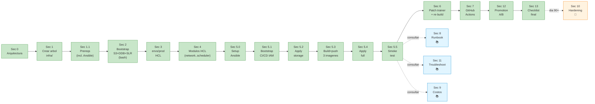
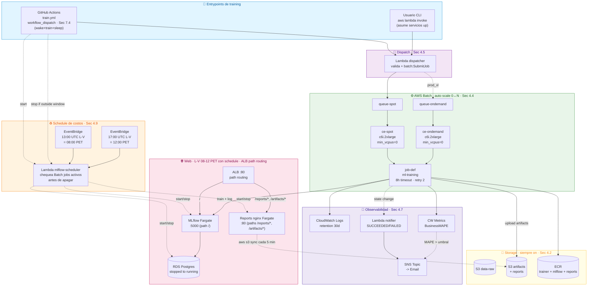
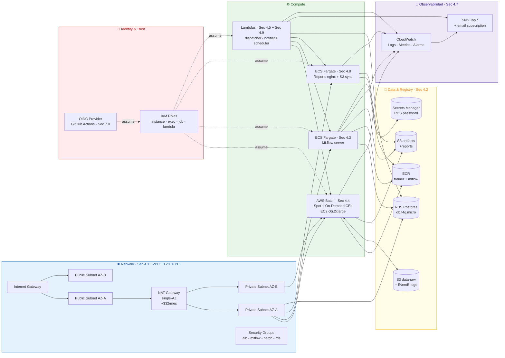
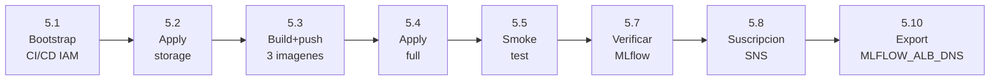

# Guia MLOps AWS — Infra modular en Terraform

> **Camino unico para MLOps expert**: esta guia es lineal y ejecutable de
> arriba abajo. Cada seccion construye una pieza del sistema en orden de
> dependencia — empezas con cero archivos y al final tenes una infra
> production-grade corriendo en AWS con CI/CD, alarmas, scheduler de
> costos y model promotion gate. No hay rutas alternativas: las
> decisiones tecnicas ya estan lockeadas (Sec 0.3) y los items "opt-in"
> estan marcados como 🔮 FUTURO para que sepas que NO los necesitas para
> el dia 1.
>
> **Leyenda de marcadores** (aparecen al inicio de cada seccion no obvia):
>
> | Marcador | Significado |
> |---|---|
> | ⭐ HACER | Parte del camino unico. Implementar tal cual, en orden. |
> | 📚 REFERENCIA | No es accion — es info que vas a necesitar leer mientras implementas. |
> | 🔮 FUTURO | Mejora opt-in. No tocar en la primera vuelta. Volver despues de 3 meses en prod. |

> **Esta guia es el blueprint unico** del MLOps del proyecto. Aqui viven
> tanto la infra Terraform (Sec 3-Sec 4), el patcheo del codigo del trainer (Sec 6),
> **el CI/CD entero** (Sec 7) y el modelo de promotion (Sec 12). No hay archivos
> reales de workflows en `.github/` — al implementar, se materializan desde
> los bloques YAML embebidos abajo.
>
> **Ubicacion del Terraform**: **mono-repo**. El Terraform vive en
> `infra/envs/prod/` del mismo repo que el trainer, y los YAML de Sec 7 ya
> tienen ese path. Si el dia de manana hay que separar la infra a otro
> repo (3+ entornos), ver Sec 14.2 pregunta 3.
>
> Referencia rapida: `terraform init && terraform plan && terraform apply`.

Esta guia describe la infra de produccion como **modulos Terraform**: cada
modulo encapsula una capa (network, mlflow, batch, ...) con interface clara
(variables / outputs). El compose se hace en `envs/prod/main.tf`.

Diseño detras de la modularizacion:

1. **Aislar blast-radius**: tocar un modulo (p.ej. `batch`) no obliga a re-aplicar otro (p.ej. `mlflow`).
2. **Reutilizable**: el dia que necesites un `envs/dev/` o `envs/staging/`, copias el `prod/` y cambias `tfvars`.
3. **Idempotente**: `terraform apply` se puede correr N veces; el estado vive en S3 + lock en DynamoDB.
4. **Operacion declarativa**: la infra es codigo. PR = cambio de infra revisable.

---

## 📖 P.1 Para quién es esta guía y cómo se lee

### Audiencia única: MLOps senior / experto

Esta guia asume que ya operaste production-grade en alguna otra forma y
manejas con soltura:

- AWS a nivel operativo: IAM trust policies, VPC + subnets + NAT, SG
  ingress/egress, CloudWatch Logs, ECR push/pull.
- Terraform modular: state remoto + locks, modulos con
  `variables/outputs`, `terraform plan/apply`, debugging de drift.
- Docker + multi-stage builds, GitHub Actions con OIDC.
- MLflow Tracking + Model Registry (experiments, runs, stages
  `None|Staging|Production`).
- Spot vs On-Demand, cold-start de RDS, idempotencia en deploys.

Esta guia NO ensena ninguno de esos fundamentos — los usa. Si falta
alguno, las secciones **P.2 (glosario)** y **P.3 (conceptos)** son
📚 REFERENCIA colapsada que podes abrir si necesitas refrescar una
sigla puntual, pero **no son parte del camino principal**.

### Cómo leer (camino unico, consecutivo, sobre tu repo actual)

Lectura **lineal y constructiva**: cada seccion arma una pieza concreta
sobre la anterior. **No clones un repo nuevo** — todo se construye dentro
de tu repo del trainer ya existente (mono-repo). Al final, junto al
codigo Python del trainer convive un `infra/` con toda la IaC y
`.github/workflows/*.yml` con el CI/CD.

NO hay rutas alternativas, NO hay decisiones que tomar (ya estan tomadas
en Sec 0.3). Si en algun momento ves un marcador 🔮 FUTURO saltatelo —
son mejoras opt-in para despues de prod.

Para saber donde estas en cada momento, cada seccion ⭐ HACER arranca con
un bloque **📍 Estado** que dice "que tenes antes" y "que vas a tener
despues" — te da feedback de avance sin tener que reconstruir el mapa
mental.

Mapa lineal de lo que se va armando (mismo orden de las secciones):

| Paso | Sec | Que construye / valida |
|---|---|---|
| 1 | **0** | Arquitectura + decisiones lockeadas (no escribis codigo, te alineas con el target) |
| 2 | **1** | Crear el arbol de carpetas `infra/` |
| 3 | **1.1** | Validar prerrequisitos (cuenta, quotas, herramientas) |
| 4 | **2** | Bootstrap del backend Terraform (S3 + DynamoDB lock, SLRs) |
| 5 | **3** | Escribir `envs/prod/` (versions, backend, variables, main, outputs) |
| 6 | **4.1-4.4** | Modulos `network`, `storage`, `mlflow`, `batch` (la infra pesada) |
| 7 | **4.5-4.6** | Modulo `lambdas` + codigo Python (dispatcher + notifier) |
| 8 | **4.7** | Modulo `monitoring` (SNS + alarmas) |
| 9 | **4.8** | Modulo `reports` (nginx Fargate sirviendo S3 en `/reports/*` y `/artifacts/*`) |
| 10 | **4.9** | Modulo `scheduler` (auto on/off MLflow+Reports+RDS L-V 08-12 PET — ⭐ desde dia 1) |
| 11 | **5** | Primer `terraform init && plan && apply` |
| 12 | **6** | Patch del trainer (emite custom metric MAPE a CloudWatch) |
| 13 | **7.0** | Modulo `cicd` (OIDC provider + roles GHA) |
| 14 | **7.1-7.4** | Workflows GitHub Actions (`ci.yml`, `promote.yml`, `terraform-plan.yml`, **`train.yml`**) |
| 15 | **7.6-7.7** | Configurar variables de GH + branch protection |
| 16 | **8** | Runbook: smoke test, recovery, rollback (📚 referencia operativa) |
| 17 | **11** | Troubleshooting (📚 referencia para cuando algo falle) |
| 18 | **12** | Model promotion gate (data-driven, no por antigüedad) |
| 19 | **13** | Checklist final de validacion |

Lo que NO esta en el camino principal (todo marcado 🔮 FUTURO en el cuerpo):

- **Sec 7.5** workflows extras (cleanup, drift detection)
- **Sec 10** hardening (TLS, WAF, VPC endpoints, Multi-AZ, KMS-CMK, DR cross-region, image signing)

### Que vas a tener al terminar

- MLflow tracking + Registry + dashboard de reports HTML, accesibles via ALB en un solo endpoint (path routing `/`, `/reports/*`, `/artifacts/*`) **L-V 08-12 PET**.
- Training **100% manual** via `ansible-playbook playbooks/train.yml` (mismo comando funciona en tu laptop y en GitHub Actions).
- AWS Batch + ECS Fargate + RDS + ALB + Lambdas + EventBridge **provisionados con Terraform**; deploy, training, rollback, scale-to-0 y model promotion **orquestados con Ansible**. Scheduler que apaga los servicios web a las 12:00 PM.
- Pipeline GH Actions con compuertas: lint → security → **ansible-lint** → build → deploy → smoke. Cada paso productivo invoca un playbook de `ansible/`.
- Model promotion gate con quality gates automaticos + approval humano.
- Alarmas CloudWatch + SNS por email para job FAILED y MAPE > umbral.
- Costo mensual operando: **~$64/mes** (Sec 9.1).

### Tiempo estimado

| Bloque | Tiempo |
|---|---|
| Leer Sec 0 a Sec 6 (arquitectura + infra + lambdas) | 4-6 h |
| Leer Sec 7 a Sec 13 (CI/CD + runbook + costos + troubleshooting + promotion) | 3-4 h |
| Implementar Fase 0 a Fase 8 del checklist (Sec 13) | 2-3 dias de trabajo enfocado |

Total: **una semana laboral**.

---

## 📚 P.2 Glosario express  ·  REFERENCIA (colapsada)

> 📚 **REFERENCIA** — no es accion. Saltatela: la audiencia experto ya
> conoce el vocabulario. Expandi solo si te aparece una sigla que no
> te suene mientras lees Sec 0+.

<details>
<summary>Abrir glosario AWS/MLOps</summary>

Vocabulario que aparece sin avisar en la guia.

| Termino | Que es en 1 frase |
|---|---|
| **ALB** (Application Load Balancer) | Balanceador HTTP/HTTPS de AWS que distribuye trafico a varios containers/instancias. Aca solo expone MLflow al mundo. |
| **AMI** (Amazon Machine Image) | Snapshot del disco de una EC2. AWS Batch usa AMIs pre-fabricadas con Docker instalado. |
| **Ansible** | Herramienta de orquestacion/configuracion declarativa-en-YAML. Aca la usamos como capa imperativa sobre Terraform: invocar Lambdas, esperar jobs, drenar queues, promote modelos. |
| **Ansible collection** | Bundle distribuible de roles+modulos+plugins (`amazon.aws`, `community.docker`, etc.). Se instala con `ansible-galaxy collection install`. |
| **Ansible playbook** | Archivo YAML que orquesta tasks contra hosts (en nuestro caso solo `localhost`). Cada playbook corresponde a una operacion completa (deploy, train, rollback). |
| **Ansible role** | Unidad reutilizable de tasks parametrizables. Encapsula logica (ej. role `terraform/` envuelve init/plan/apply). |
| **ARN** (Amazon Resource Name) | Identificador unico de cada recurso AWS. Formato `arn:aws:<service>:<region>:<account>:<resource>`. |
| **AWS Batch** | Servicio que corre **jobs batch** (no servicios 24/7) en EC2/Fargate. Auto-escala 0↔N segun cuantos jobs hay en la queue. Lo usamos para los entrenamientos. |
| **CI/CD** | Continuous Integration / Continuous Deployment. Pipeline automatico que se dispara con cada push: corre tests, builds, deploys. |
| **Cold start** | El primer request despues de que un servicio estaba apagado es lento porque el container/maquina tiene que bootear. RDS post-stop = ~5 min de cold start. |
| **Compute Environment (CE)** | En AWS Batch, define las EC2 que pueden correr jobs (tipo de instancia, Spot/On-Demand, min/max vCPUs). |
| **ECR** (Elastic Container Registry) | Registry de Docker images de AWS. Tu equivalente privado de DockerHub. |
| **ECS** (Elastic Container Service) | Orquestador de containers de AWS. Tiene 2 modos: **EC2** (vos manejas las maquinas) o **Fargate** (AWS las maneja). Usamos Fargate. |
| **EventBridge** | Bus de eventos de AWS. Dispara cosas por cron, por evento de otro servicio (ej. "S3 PutObject"), o por API custom. |
| **Fargate** | Modo serverless de ECS. Solo decis "necesito X vCPU/Y memoria" y AWS te da el container corriendo. No manejas EC2. |
| **HCL** (HashiCorp Configuration Language) | El lenguaje de Terraform. Sintaxis declarativa, parecida a JSON pero con bloques. |
| **IaC** (Infrastructure as Code) | Definir la infra en archivos versionables (git), no clickeando en una consola. Terraform es la herramienta lider. |
| **IAM** (Identity and Access Management) | El sistema de permisos de AWS. Define quien (usuario/rol/servicio) puede hacer que sobre que recurso. |
| **Idempotente** | Una operacion que podes correr N veces y siempre te deja en el mismo estado. `terraform apply` es idempotente. |
| **Lambda** | Funcion serverless. AWS la ejecuta cuando un trigger la invoca; no manejas servidor. Usamos Lambdas para dispatcher, notifier y scheduler. |
| **MLflow** | Plataforma open-source para tracking de experimentos ML + Model Registry (versiones de modelos en Staging/Production). |
| **NAT Gateway** | Permite que recursos en subnets **privadas** salgan a internet. Cuesta ~$32/mes (el item mas caro). |
| **OIDC** (OpenID Connect) | Protocolo de autenticacion. GitHub Actions lo usa para asumir un IAM role sin necesidad de access keys (secrets de larga duracion). |
| **OOM** (Out of Memory) | El kernel mata el proceso porque pidio mas RAM de la disponible. Causa comun de fallos en jobs ML. |
| **RDS** (Relational Database Service) | Postgres/MySQL/etc managed de AWS. Aca usamos Postgres como backend de MLflow. |
| **S3** (Simple Storage Service) | Storage de objetos de AWS. Lo usamos para data (Excels) y artifacts (modelos, reportes). |
| **Service Linked Role (SLR)** | Un IAM role que AWS crea automaticamente para que cierto servicio funcione (ej. AWS Batch usa uno para crear EC2). |
| **SNS** (Simple Notification Service) | Sistema de pub/sub. Publicamos a un topic SNS y los suscriptores (email, Lambda, SQS) reciben. |
| **Spot** | EC2 a precio reducido (~70% off) pero AWS puede **interrumpirte con 2 min de aviso**. Bueno para jobs con retry, malo para servicios 24/7. |
| **State (Terraform)** | Archivo JSON que Terraform mantiene con el mapping "recurso definido en HCL → recurso real en AWS". Vive en S3 (remoto) con lock en DynamoDB. |
| **STS** (Security Token Service) | Servicio AWS que emite credenciales temporales. OIDC + STS = roles asumidos sin access keys. |
| **VPC** (Virtual Private Cloud) | Tu red privada en AWS. Adentro tenes subnets publicas y privadas. |

</details>

---

## 🧠 P.3 Conceptos fundamentales  ·  REFERENCIA (colapsada)

> 📚 **REFERENCIA** — fundamentos de MLOps/IaC/Spot/MLflow para quien
> falte alguna pieza. Audiencia experto: saltatela. Expandi solo si
> necesitas refrescar un concepto puntual.

<details>
<summary>Abrir conceptos fundamentales</summary>

### P.3.1 ¿Qué es MLOps y por qué importa?

**MLOps** = aplicar a modelos de ML las practicas que la industria de
software ya tiene para codigo (CI/CD, observabilidad, versionado,
reproducibilidad). El problema que resuelve:

- Tu modelo entrenado en una notebook **no es reproducible** (si tu
  laptop muere, perdiste el ambiente, las versiones de pandas/numpy,
  los hyperparams).
- Tu modelo **no se reentrena solo** cuando llega data nueva — alguien
  tiene que correr el script a mano.
- **No sabes que version del modelo esta en produccion** cuando alguien
  reporta una prediccion sospechosa.
- **No tenes alarmas** cuando el modelo degrada (MAPE sube
  silenciosamente y nadie se entera).

Esta guia resuelve los 4 problemas:
1. **Reproducibilidad**: el trainer corre en Docker (image inmutable),
   con commits taggeados en MLflow.
2. **Reentrenamiento automatico**: EventBridge dispara el dispatcher
   cada vez que sube data nueva al S3.
3. **Versionado**: cada training crea una nueva version en MLflow
   Registry. Sabes que SHA de git genero que version.
4. **Alarmas**: CloudWatch monitorea MAPE > umbral y dispara SNS → email.

### P.3.2 ¿Qué es Infrastructure as Code (IaC)?

Antes (forma vieja): "voy a la consola AWS, clico Crear EC2, configuro,
guardo". Problema: ¿como recreas la misma infra en otra cuenta? ¿Quien
toco el SG ayer? ¿Como revertis un cambio?

IaC con Terraform: escribis archivos `.tf` (HCL) que describen el estado
**deseado** de tu infra. Corres `terraform apply` y Terraform calcula
las diferencias entre lo que esta y lo que querés, y aplica los cambios.

Analogia mental: **HTML describe la estructura de una pagina, HCL
describe la estructura de tu infra**. El navegador renderiza el HTML;
Terraform "renderiza" el HCL → recursos reales en AWS.

Ejemplo minimo:
```hcl
resource "aws_s3_bucket" "data" {
  bucket = "mi-bucket-de-datos"
}
```
Eso es todo lo que necesitas para que `terraform apply` te cree un
bucket S3 llamado `mi-bucket-de-datos`. Si lo borras del .tf y
re-aplicas, lo elimina.

### P.3.3 Containers y Docker en 3 minutos

Un **container** es un proceso Linux aislado que incluye TODO lo que
necesita para correr: codigo + dependencias + libs del sistema. Si
funciona en tu laptop, funciona en AWS porque corre el mismo container.

**Docker** es la herramienta para construir y correr containers. El
archivo de receta es el `Dockerfile`. Una vez construido, el container
se sube a un **registry** (Docker Hub, ECR).

Diferencia container vs VM:
- VM: corre un sistema operativo completo. ~1-2 GB, arranca en minutos.
- Container: comparte el kernel del host. ~100-500 MB, arranca en segundos.

En esta guia hay 2 imagenes:
- `ml-training` (el trainer Random Forest sklearn) — construida por GH Actions.
- `${PROJECT}-mlflow` (MLflow server + psycopg2 + boto3) — construida una vez
  a mano y pusheada a ECR (ver Fase 4 del checklist en Sec 13).

### P.3.4 Los servicios AWS que vas a usar

Mini-tabla mental para no perderte:

| Servicio | Para que sirve aca | Cuando se enciende |
|---|---|---|
| **S3** | Guardar Excels de input + modelos+reportes de output | Siempre on (no se factura compute, solo storage) |
| **ECR** | Registry de Docker images privado | Siempre on |
| **VPC + subnets + NAT** | La red privada donde viven los servicios | Siempre on |
| **RDS Postgres** | Backend de MLflow (donde guarda experimentos/runs) | L-V 08-12 PET (con scheduler Sec 4.9) |
| **ECS Fargate** | Corre MLflow server + Reports nginx (UI + dashboards) | L-V 08-12 PET (con scheduler) |
| **ALB** | Expone MLflow al mundo en `:80` | Siempre on |
| **AWS Batch** | Corre los entrenamientos | Solo cuando hay un job (auto 0↔N) |
| **Lambda** | dispatcher (lanza jobs), notifier (envia alertas), scheduler (apaga MLflow) | Solo cuando un trigger las invoca |
| **EventBridge** | Crons + eventos S3 que disparan Lambdas | Siempre on |
| **CloudWatch** | Logs + metricas + alarmas | Siempre on |
| **SNS** | Topic de alertas que manda emails | Solo cuando se publica |

### P.3.5 ¿Por qué OIDC y no AWS access keys?

Forma vieja: en GitHub Settings → Secrets, guardar `AWS_ACCESS_KEY_ID`
y `AWS_SECRET_ACCESS_KEY`. El workflow las usa para llamar a AWS.

Problemas:
- Si el secret se filtra (PR malicioso, dump de logs), el atacante tiene
  acceso "para siempre" hasta que rotes la key.
- Hay que rotar manualmente.
- No sabes cuando se uso (no hay trazabilidad por evento).

Forma nueva con **OIDC**: GitHub Actions le dice a AWS "soy
`repo:tu-org/tu-repo:ref:refs/heads/main`, firmado por GitHub". AWS le
da credenciales **temporales** (60 min) para asumir un IAM role
especifico.

Beneficios:
- Sin secrets de larga duracion en GitHub.
- Auditable en CloudTrail (cada AssumeRoleWithWebIdentity queda
  registrado con el commit SHA del workflow).
- Si tu cuenta de GitHub se compromete, el atacante NO tiene access
  keys de AWS — solo el repo.

Esta guia configura OIDC en Sec 7.0.

### P.3.6 Spot vs On-Demand: el ahorro del 70%

EC2 (las maquinas que corren tus jobs) tiene 3 modelos de pago:

| Modelo | Precio | Garantia |
|---|---|---|
| **On-Demand** | 100% precio listado | AWS NO te interrumpe |
| **Spot** | ~30% precio listado | AWS puede interrumpirte con 2 min de aviso si necesita la capacidad |
| **Reserved** | -40% a -70% precio | Te comprometes a 1-3 años de uso, pagas por adelantado |

Para training de ML que tarda 1-2h, **Spot es perfecto**: si te
interrumpen, tu job-def tiene `retry_strategy { attempts = 2 }` y AWS
Batch lo re-lanza en otra instancia. Probabilidad de Spot interrupt:
~5-10% en c6i.2xlarge.

Para jobs largos (`prod_xl` ~5-6h), el riesgo de interrupcion sube a
20-30%; ahi conviene la queue On-Demand (Sec 8.3).

Para **servicios 24/7** (MLflow Fargate, RDS) NO se usa Spot — no
podes tolerar interrupcion en un servicio que debe responder requests.

### P.3.7 MLflow: el sistema operativo de tus modelos

MLflow tiene 4 componentes; en esta guia usamos 3:

1. **Tracking server** (lo deployamos en ECS Fargate): recibe metricas,
   params y artifacts de cada training run, los guarda en RDS Postgres
   (backend store) y en S3 (artifact store).
2. **Experiments + Runs**: un **experimento** = un nombre (POP, JUPITER, …).
   Un **run** = una ejecucion del training dentro del experimento. Cada
   run tiene metricas (R2, MAPE), params (hyperparams), y artifacts
   (modelo.pkl, reportes.html).
3. **Model Registry**: catalogo de modelos productivos. Cada modelo tiene
   un nombre (`rnd-forest-POP`) y N versiones. Cada version puede estar en
   `None | Staging | Production | Archived`. La promotion a Production
   pasa por el workflow `promote.yml` (Sec 7.2) con gates de calidad.
4. **Models** (NO lo usamos directamente — el patch del trainer en Sec 6
   loguea el pipeline con `mlflow.sklearn.log_model`).

Por que MLflow y no SageMaker / Weights&Biases / Comet:
- **Open source** → portable, sin vendor lock-in.
- **Self-hosted** → tus datos no salen de tu cuenta AWS.
- **Maduro** → 3+ años en produccion en miles de empresas.
- **Compatible con sklearn pipelines** → cero refactor de codigo.

</details>

---

## 🗺️ P.4 Mapa lineal de implementación  ·  ⭐ HACER (camino unico)

Camino unico de implementacion. Cada nodo construye sobre el anterior y
deja un artefacto verificable. NO hay alternativas — si ves una decision
abierta (Spot vs OD, scheduler si/no, TLS si/no), ya esta lockeada en
Sec 0.3.



**Resumen de los marcadores en el cuerpo**:

- ⭐ HACER: Sec 0 → 1 → 1.1 → 2 → 3 → 4 → **5.0 setup Ansible → 5.1 bootstrap CI/CD → 5.2 apply storage → 5.3 build+push → 5.4 apply full → 5.5 smoke** → 6 (+ re-build) → 7 → 12 → 13
- 📚 REFERENCIA (consultar mientras implementas): P.2, P.3, Sec 8, Sec 9, Sec 11, Sec 14
- 🔮 FUTURO (no tocar dia 1): Sec 7.5, **toda Sec 10**, parts de Sec 8.5 (Opcion B destroy)

**Cuando entra cada herramienta** (camino secuencial):

| Herramienta | Aparece en | Por que |
|---|---|---|
| **Bash** | Sec 2 (bootstrap S3+DDB+SLR) | Setup one-shot pre-Terraform; nada que orquestar todavia. |
| **Terraform (HCL)** | Sec 3 + Sec 4 | Definir infra de forma declarativa. Solo escribimos archivos `.tf`. |
| **Ansible** | Sec 5.0 | Necesitamos aplicar el HCL y ya hay pasos imperativos (apply parcial, build/push, wait services). |
| **Docker (build/push)** | Sec 5.3 | Las imagenes alimentan la job-def Batch + ECS task-defs antes del apply full. Lo orquesta Ansible. |
| **GitHub Actions** | Sec 7 | Ya tenes todo funcionando local. Faltaba: trigger automatico = mismo `ansible-playbook` con OIDC. |

---

## 0. Arquitectura objetivo  ·  ⭐ HACER (alinear, no codear)

> **TZ assumption**: los cron expressions abajo usan **UTC** (estandar
> EventBridge). El horario laboral del proyecto es **08:00–18:00 Peru
> (UTC-5)**, que en UTC son **13:00–23:00**. Si tu TZ cambia, ajustar
> los `cron(...)` en Sec 4.5 y Sec 4.9.

### 0.1 Flujo end-to-end (con auto-encendido y auto-apagado)



### 0.2 Arquitectura por capas



**Operacion**: training es **100% manual** — vos invocas `aws lambda invoke ml-training-dispatcher`
con la(s) variedad(es) que quieras correr (Sec 4.5). c6i.2xlarge satura
sus 4 cores fisicos por job. La queue Spot cubre `smoke|dev|prod`. La
queue on-demand se usa solo para `prod_xl` (5-6h) donde una interrupcion
de Spot duele. **MLflow + Reports + RDS** estan UP solo de **lunes a
viernes 08-12 PET** (13-17 UTC); fuera de esa ventana se apagan
automaticamente (Sec 4.9) — lanzar los trainings dentro de esa ventana.

<details>
<summary>📄 Diagrama ASCII (fallback para terminales sin renderer Mermaid)</summary>

```
                                    ┌──────────────────────────────┐
                                    │  EventBridge                 │
                                    │  - cron 1 variedad/dia L-V   │
                                    │  - S3 PutObject (data-raw)   │
                                    └────────────┬─────────────────┘
                                                 │
                                                 ▼
                                          ┌──────────────┐
                                          │  Lambda      │
                                          │  dispatcher  │
                                          └──────┬───────┘
                                                 │ batch:SubmitJob
                                                 ▼
                              ┌─────────────────────────────────────┐
                              │  AWS Batch                          │
                              │  ┌──────────────┐  ┌──────────────┐ │
                              │  │ queue-spot   │  │ queue-od     │ │
                              │  └──────┬───────┘  └──────┬───────┘ │
                              │  ┌──────▼───────┐  ┌──────▼───────┐ │
                              │  │ ce-spot      │  │ ce-ondemand  │ │
                              │  │ c6i.2xlarge  │  │ c6i.2xlarge  │ │
                              │  └──────────────┘  └──────────────┘ │
                              │  job-def: ml-training (8h, retry 2) │
                              └────────────────────┬────────────────┘
                                                   │
                  ┌────────────────────────────────┼────────────────────────────┐
                  ▼                                ▼                            ▼
       ┌──────────────────┐              ┌──────────────────┐         ┌─────────────────┐
       │ S3 data-raw      │              │ MLflow (Fargate) │         │ S3 mlflow-art   │
       │  +EventBridge    │              │  L-V 08-12 PET   │         │  artifacts/     │
       │  notifications   │              │  ALB :80 → :5000 │         │  reports/       │
       │                  │              │  ↳ RDS Postgres  │         │                 │
       └──────────────────┘              └──────────────────┘         └─────────────────┘
                                                  ▲
                                                  │ start/stop
                                          ┌───────┴────────┐
                                          │  Lambda        │
                                          │  scheduler     │
                                          │  (EB 2 crons)  │
                                          └────────────────┘
```

</details>

### 0.3 Decisiones tecnicas lockeadas

> Estas 5 decisiones son el **default no-negociable** del camino unico. Si
> queres cambiarlas, leeas la contraparte 🔮 FUTURO en Sec 10 — pero
> recien despues de tener el sistema en prod. No tocar antes.

| Decision | Eleccion lockeada | Alternativa (🔮 FUTURO) | Por que ahora |
|---|---|---|---|
| **Compute para training** | 2 queues: Spot (default `smoke/dev/prod`) + On-Demand (solo `prod_xl`). Retry=2. | Solo Spot / solo OD / Fargate Spot | -70% costo en jobs corto. Retry cubre interrupciones. OD reservada para `prod_xl` donde 5-6h × P(20-30%) duele. |
| **Invocacion de training** | **2 mecanismos** complementarios: (a) **GitHub Actions `train.yml`** via `workflow_dispatch` (Sec 7.4) → wake-train-sleep automatico. (b) `aws lambda invoke <dispatcher>` manual (Sec 4.5) → solo submit (asume servicios up). Sin crons EventBridge, sin S3 PutObject trigger. | Crons + S3 trigger | (a) Cualquier user puede entrenar desde GitHub UI con un click, eligiendo variedad. El workflow wake-ea servicios si estan apagados, hace el training, y los apaga si quedaron up por el. (b) Util cuando ya sabes que los servicios estan up (durante la ventana 08-12 o porque otro train.yml los wake-eo). |
| **Servicios web up: MLflow + Reports + RDS** | **2 mecanismos** que comparten infra: (1) Scheduler EventBridge **L-V 08-12 PET** para que users browsen. (2) Workflow `train.yml` wake-ea fuera de ventana cuando se dispara training. Antes de apagar a las 12:00, el scheduler **chequea Batch jobs RUNNING** y posterga si hay activos. Sabado/domingo apagado entero (cero crons + cero workflows manuales). | 24/7 | UI de tracking + dashboard de reports HTML accesibles a vos y otros users 4h/dia laborales. Training puede correr fuera de ventana sin desperdiciar $$ (auto-apaga). |
| **Egress a Internet desde subnet privada** | NAT Gateway single-AZ ($32/mes). | VPC endpoints (Sec 10.3) | Setup simple; el costo es razonable si trafico NAT < 10 GB/mes. Endpoints solo ganan a alto trafico o por postura zero-egress. |
| **TLS + Multi-AZ + WAF** | NO. ALB :80 HTTP, RDS single-AZ, sin WAF. | Sec 10.1 (TLS), 10.2 (WAF), 10.4 (Multi-AZ) | Default barato + suficiente para un MLflow interno detras de VPN/SG restrictivo. Si la UI sale a Internet abierta → activar antes de exposicion publica. |

**Endpoints en produccion** (un solo ALB, path-based routing):

| Path | Servicio | Equivalente local |
|---|---|---|
| `http://<ALB-DNS>/` | MLflow UI (tracking + Registry) | `http://localhost:5000` |
| `http://<ALB-DNS>/reports/` | Dashboards HTML por variedad (nginx + S3 sync) | `http://localhost:8080/reports/` |
| `http://<ALB-DNS>/artifacts/` | Artifacts crudos por run (nginx + S3 sync) | `http://localhost:8080/artifacts/` |

**Consecuencias operativas** (saberlas antes de avanzar a Sec 1):

- El sistema esta UP **solo L-V 08-12 PET** (4h/dia). Fuera de esa ventana los 3 endpoints arriba responden con el ALB 503 (target group vacio).
- **Training es manual**. Vos decidis cuando y que variedades correr con `aws batch submit-job` (Sec 8.1) o `aws lambda invoke ml-training-dispatcher --payload '{"detail":{"varieties":"POP,JUPITER","tuning":"prod"}}' ...`. El job se auto-apaga al terminar (AWS Batch es ephemeral por diseno).
- Para que el training pueda loguear a MLflow, **lanzarlo dentro de la ventana 08-12 PET**. Si lanzas a 11:30 y el job dura 1.5h, va a perder la conexion a MLflow a las 12:00. Mover a `prod_xl` (queue on-demand) NO ayuda — MLflow estara apagado igual.
- Sabado/domingo el sistema entero esta apagado. Para retrain de emergencia: invocar la Lambda scheduler con `{"action":"start"}` (ver Sec 11.7).
- El primer request del lunes 08:00 PET paga ~5 min de cold-start de RDS. Mitigado adelantando startup 15 min (Sec 11.8).

---

## 1. Estructura del repo de infra  ·  ⭐ HACER

> **📍 Estado**
> - **Antes**: solo tu repo del trainer con codigo Python.
> - **Despues**: el mismo repo, mas un subdirectorio `infra/` con la
>   estructura vacia de modulos Terraform y carpetas para codigo de
>   Lambdas. Todavia ningun `.tf` tiene contenido — eso llega en Sec 3-4.

Estructura objetivo (al final de la Sec 4 todos estos archivos van a
existir con contenido). El modulo `cicd/` y la composicion `envs/cicd/`
aparecen en **Sec 5.1** (cuando empieza Ansible).

```
infra/                            # vive en la raiz del mono-repo del trainer
├── envs/
│   └── prod/
│       ├── main.tf              # composicion: llama a los 7 modulos
│       ├── variables.tf         # variables del entorno
│       ├── outputs.tf           # urls/arns para humanos
│       ├── versions.tf          # required_providers + aws default_tags
│       ├── backend.tf           # state remoto (S3 + DynamoDB lock)
│       └── terraform.tfvars     # valores reales (gitignored)
├── modules/
│   ├── network/      # VPC, 2x public/private subnets, NAT, IGW, SGs
│   ├── storage/      # S3 (data + artifacts) + ECR
│   ├── mlflow/       # RDS Postgres + ECS Fargate (MLflow server) + ALB
│   ├── reports/      # ECS Fargate (nginx + S3 sync) + ALB listener rule
│   ├── batch/        # 2 compute envs (spot + on-demand) + queues + job-def + IAM
│   ├── lambdas/      # dispatcher (invokable manual) + notifier
│   ├── monitoring/   # SNS topic + CW alarms
│   ├── scheduler/    # auto on/off MLflow+RDS+Reports L-V 08-12 PET (Sec 4.9)
│   └── cicd/         # OIDC provider + roles GHA (Sec 5.1; state separado en envs/cicd/)
└── lambdas/
    ├── dispatcher/dispatcher.py
    ├── notifier/notifier.py
    └── scheduler/scheduler.py
```

### Posicionarse en la raiz del repo

**Ruta absoluta**:
```
c:\Users\CarlosAlexanderAbant\Documents\Proyectos\ml_random_forest\ml_training\
```

```powershell
# PowerShell — verificar que estas en la raiz correcta
cd c:\Users\CarlosAlexanderAbant\Documents\Proyectos\ml_random_forest\ml_training\
Test-Path .git    # debe imprimir True (raiz del repo git)
```
```bash
# Bash equivalente
cd /c/Users/CarlosAlexanderAbant/Documents/Proyectos/ml_random_forest/ml_training/
ls .git           # debe listar el dir
```

### Crear el arbol de carpetas y archivos vacios

**Para Linux/macOS/WSL/Git-bash**:

```bash
# Desde la raiz del repo (ml_training/)
mkdir -p infra/envs/prod
mkdir -p infra/modules/{network,storage,mlflow,reports,batch,lambdas,monitoring,scheduler,cicd}
mkdir -p infra/lambdas/{dispatcher,notifier,scheduler}

# Stubs vacios para que la estructura quede commiteable antes de tener contenido
touch infra/envs/prod/{main.tf,variables.tf,outputs.tf,versions.tf,backend.tf}

# .gitignore para no commitear secrets ni build artifacts
echo "terraform.tfvars" >> infra/.gitignore
echo ".build/"          >> infra/.gitignore
echo ".terraform/"      >> infra/.gitignore
echo "*.tfstate*"       >> infra/.gitignore
```

**Para Windows PowerShell**:

```powershell
# Desde la raiz del repo (ml_training\)
New-Item -ItemType Directory -Force -Path `
  infra\envs\prod, `
  infra\modules\network, infra\modules\storage, infra\modules\mlflow, `
  infra\modules\reports, infra\modules\batch, infra\modules\lambdas, `
  infra\modules\monitoring, infra\modules\scheduler, infra\modules\cicd, `
  infra\lambdas\dispatcher, infra\lambdas\notifier, infra\lambdas\scheduler | Out-Null

# Stubs vacios para envs/prod
"main.tf","variables.tf","outputs.tf","versions.tf","backend.tf" | ForEach-Object {
  New-Item -ItemType File -Force -Path "infra\envs\prod\$_" | Out-Null
}

# .gitignore para no commitear secrets ni build artifacts
@"
terraform.tfvars
.build/
.terraform/
*.tfstate*
"@ | Out-File -Encoding utf8 -Append infra\.gitignore
```

### Verificar que el arbol quedo correcto

```powershell
# PowerShell
Get-ChildItem -Recurse -Directory infra | Select-Object -ExpandProperty FullName
```
```bash
# Bash
tree infra -L 3   # o `find infra -type d` si no tenes `tree`
```

Deberias ver exactamente los 14 directorios listados arriba en el arbol
objetivo. Si falta alguno, los `module "..." { source = "../../modules/..." }`
en Sec 3.5 fallaran con `Module not installed`.

**Convenciones**:
- Cada modulo tiene 3 archivos minimos: `main.tf`, `variables.tf`, `outputs.tf`. Los modulos `network` y `batch` separan IAM en `iam.tf` para legibilidad.
- Ningun modulo crea recursos por fuera de su capa. Si `mlflow` necesita una subnet, la recibe como variable; no la crea.
- `terraform.tfvars` esta gitignored (contiene `alert_email` y digests de imagenes).
- `.build/` (donde Terraform deja los zip de Lambdas) tambien gitignored.

**Validar antes de avanzar**:

```bash
tree infra -L 3   # o `ls -R infra` si no tenes `tree`
```

Debe verse la estructura listada arriba. Si falta alguna carpeta, los
`module "..." { source = "../../modules/..." }` en Sec 3.5 fallaran con
`Module not installed`.

---

## 1.1 Prerrequisitos  ·  ⭐ HACER (HARD blockers — sin esto, `terraform apply` se rompe)

> **📍 Estado**
> - **Antes**: arbol `infra/` vacio creado.
> - **Despues**: cuenta AWS + CLI + quotas + herramientas locales
>   verificadas. Estas en condicion de empezar a crear recursos.

Antes de tocar Terraform, validar que las piezas externas estan en su sitio. La
lista esta ordenada por orden de fallo cronologico: si saltas la #1, no llegas
a la #2.

### 1.1.1 Cuenta y credenciales AWS — checklist con verificacion

- [ ] **AWS account con un IAM principal Admin (o equivalente)** con permisos
  para `iam:Create*`, `s3:Create*`, `ec2:*`, `dynamodb:*`, `batch:*`, `ecs:*`,
  `rds:*`, `logs:*`, `events:*`, `lambda:*`, `sns:*`, `cloudwatch:*`. Para
  entornos compartidos, usa un role Admin separado para el bootstrap y otro
  role minimo (descripto en Sec 7) para CI/CD.

- [ ] **AWS CLI v2 instalado**. Verificar:
  ```bash
  aws --version    # Esperado: aws-cli/2.15.x o superior
  ```

- [ ] **AWS CLI configurado**. Verificar:
  ```bash
  aws sts get-caller-identity
  # Esperado: JSON con UserId, Account, Arn. Si falla "Unable to locate credentials",
  # correr: aws configure  (te pide AccessKey, SecretKey, region=us-east-1, format=json)
  ```

- [ ] **Region decidida**: `us-east-1` por default. Mover buckets entre regions
  despues es costoso (replicar) o destructivo (recrear). Si vas a usar otra,
  cambiar `AWS_REGION` en TODOS los archivos antes del bootstrap.

### 1.1.2 Service quotas — validar **antes** del primer apply

**Check 1 — vCPU para Spot** (default cuenta nueva: 5, insuficiente para `c6i.2xlarge`):

```bash
aws service-quotas get-service-quota --service-code ec2 \
  --quota-code L-3819A6DF --region us-east-1 \
  --query 'Quota.Value'
# c6i.2xlarge usa 8 vCPU. Necesitas >= 16 para 2 jobs paralelos.
# Si Value < 16, abrir ticket en AWS Console > Service Quotas > Request Increase.
```

**Check 2 — Elastic IPs por region** (default 5, necesitamos 1 para NAT):

```bash
aws service-quotas get-service-quota --service-code ec2 \
  --quota-code L-0263D0A3 --region us-east-1 --query 'Quota.Value'
# Esperado: >= 5
```

**Check 3 — VPCs por region** (default 5):

```bash
aws service-quotas get-service-quota --service-code vpc \
  --quota-code L-F678F1CE --region us-east-1 --query 'Quota.Value'
# Esperado: >= 5
```

**Check 4 — Application Load Balancers por region** (default 50):

```bash
aws service-quotas get-service-quota --service-code elasticloadbalancing \
  --quota-code L-53DA6B97 --region us-east-1 --query 'Quota.Value'
# Esperado: >= 50
```

### 1.1.3 Herramientas locales — checklist con comandos de verificacion

| Herramienta | Comando de verificacion | Version minima |
|---|---|---|
| Terraform   | `terraform -version`   | `>= 1.7.0` |
| Docker      | `docker --version`     | `>= 24.0` (para Sec 5.3 build + push) |
| AWS CLI     | `aws --version`        | `>= 2.15` |
| `jq`        | `jq --version`         | `>= 1.6` (parsear outputs en scripts) |
| Git         | `git --version`        | `>= 2.40` (trainer container espera `git_commit` taggeado en MLflow) |
| **Ansible** | `ansible --version`    | `>= 2.17` (`ansible-core`, no la distro completa) |
| **Ansible-lint** | `ansible-lint --version` | `>= 24.7` (gate de CI en Sec 7.1) |
| Python      | `python --version`     | `>= 3.11` (para `boto3` + `mlflow` del runtime de los playbooks) |

**Verificar todos de un saque**:

```bash
terraform -version && docker --version && aws --version && jq --version && git --version && ansible --version && ansible-lint --version
```

Si falta alguno, instalalo antes de avanzar:
- **Terraform**: https://developer.hashicorp.com/terraform/downloads
- **AWS CLI v2**: https://aws.amazon.com/cli/
- **Docker Desktop**: https://www.docker.com/products/docker-desktop/
- **jq**: `winget install jqlang.jq` (Windows) o `brew install jq` (mac) o `apt install jq` (linux)
- **Ansible**: venv dedicado recomendado para no chocar con la version del sistema:
  ```bash
  python -m venv ~/.venvs/ansible
  source ~/.venvs/ansible/bin/activate          # PowerShell: ~/.venvs/ansible/Scripts/Activate.ps1
  pip install "ansible-core>=2.17" "ansible-lint>=24.7" "boto3>=1.35" "botocore>=1.35" "docker>=7.0" "mlflow>=3.12.0"
  ```
  > En Windows, `ansible-core` no corre nativamente — usar WSL2 (Ubuntu)
  > para Ansible. PowerShell se reserva para Terraform/AWS-CLI.

### 1.1.4 Decisiones que tomar antes del bootstrap

- [ ] **`alert_email` real** (no @ejemplo.com — vas a recibir un mail de SNS
  que tenes que confirmar para que las alarmas funcionen).
- [ ] **Nombre del bucket de state** (`${PROJECT}-tfstate-${ACCOUNT}`). Es UNICO
  por cuenta-region — no se puede cambiar despues sin migracion manual.
- [ ] **Tags opcionales** `Owner`/`CostCenter` si el equipo usa Cost Allocation Tags.

### 1.1.5 Conocimientos que se asumen

La guia asume MLOps senior/experto con manejo de:
- State remoto + locks (S3 + DynamoDB).
- IAM trust policies.
- VPC + subnets + NAT.
- Security groups.
- CloudWatch Logs.
- Modelo de artifact store de MLflow.

Si necesitas onboarding mas guiado, ver P.2 (glosario) y P.3 (conceptos) —
ambos colapsados al inicio.

---

## 2. Bootstrap del backend  ·  ⭐ HACER (UNA vez, antes de `terraform init`)

> **📍 Estado**
> - **Antes**: prereqs OK, pero cero recursos en AWS.
> - **Despues**: bucket S3 para tfstate + tabla DynamoDB para lock +
>   Service-Linked Roles de Spot y Batch ya creados. Terraform puede
>   guardar state remoto desde aca.

### 2.1 Por que es a mano (contexto)

Terraform necesita un lugar donde guardar el state. No podemos terraform-izar
el bucket que guarda nuestro propio state (gallina y huevo). Por eso este
paso se hace a mano UNA sola vez. Despues, todo lo demas es Terraform puro
y este script no se vuelve a correr nunca.

### 2.2 Crear el archivo `infra/bootstrap.sh`

**🗂️ Archivo a crear**: `infra/bootstrap.sh`

**Ruta absoluta** (Windows):
```
c:\Users\CarlosAlexanderAbant\Documents\Proyectos\ml_random_forest\ml_training\infra\bootstrap.sh
```

**Por que existe este archivo**: queda guardado en el repo como documentacion
de "asi se armo el backend". Si despliegan en otra cuenta AWS (staging, otra
prod), corren `bash infra/bootstrap.sh` y queda igual.

**Contenido a pegar** (el script es idempotente: si ya existen, no rompe):

```bash
#!/usr/bin/env bash
set -euo pipefail

PROJECT=ml-training
AWS_REGION=us-east-1
ACCOUNT=$(aws sts get-caller-identity --query Account --output text)
TF_BUCKET="${PROJECT}-tfstate-${ACCOUNT}"
TF_LOCK_TABLE="${PROJECT}-tflock"

echo "=== [1/6] Creando bucket S3 para Terraform state: ${TF_BUCKET}"
aws s3api create-bucket --bucket "${TF_BUCKET}" --region "${AWS_REGION}" \
  2>/dev/null || echo "    (bucket ya existe, ok)"

echo "=== [2/6] Habilitando versioning (rollback de state)"
aws s3api put-bucket-versioning --bucket "${TF_BUCKET}" \
  --versioning-configuration Status=Enabled

echo "=== [3/6] Habilitando encriptacion AES256"
aws s3api put-bucket-encryption --bucket "${TF_BUCKET}" \
  --server-side-encryption-configuration \
  '{"Rules":[{"ApplyServerSideEncryptionByDefault":{"SSEAlgorithm":"AES256"}}]}'

echo "=== [4/6] Bloqueando acceso publico al bucket"
aws s3api put-public-access-block --bucket "${TF_BUCKET}" \
  --public-access-block-configuration \
  "BlockPublicAcls=true,IgnorePublicAcls=true,BlockPublicPolicy=true,RestrictPublicBuckets=true"

echo "=== [5/6] Creando tabla DynamoDB para state locking: ${TF_LOCK_TABLE}"
aws dynamodb create-table \
  --table-name "${TF_LOCK_TABLE}" \
  --attribute-definitions AttributeName=LockID,AttributeType=S \
  --key-schema AttributeName=LockID,KeyType=HASH \
  --billing-mode PAY_PER_REQUEST \
  --region "${AWS_REGION}" 2>/dev/null || echo "    (tabla ya existe, ok)"

echo "=== [6/6] Creando Service-Linked Roles para Spot y Batch"
aws iam create-service-linked-role --aws-service-name spotfleet.amazonaws.com 2>/dev/null \
  || echo "    (SLR Spot ya existe, ok)"
aws iam create-service-linked-role --aws-service-name batch.amazonaws.com 2>/dev/null \
  || echo "    (SLR Batch ya existe, ok)"

echo ""
echo "Bootstrap completo. Anota estos valores para infra/envs/prod/backend.tf (Sec 3.2):"
echo "  bucket         = \"${TF_BUCKET}\""
echo "  dynamodb_table = \"${TF_LOCK_TABLE}\""
echo "  region         = \"${AWS_REGION}\""
```

**Como crear el archivo**:

PowerShell (Windows):
```powershell
New-Item -ItemType File -Force -Path infra\bootstrap.sh | Out-Null
# Abrir infra\bootstrap.sh en VSCode (u otro editor) y pegar el contenido de arriba.
```

Git Bash / WSL / Linux / macOS:
```bash
# Crear el archivo y abrirlo en tu editor para pegar el contenido:
touch infra/bootstrap.sh
code infra/bootstrap.sh   # o vim, nano, etc.
chmod +x infra/bootstrap.sh
```

### 2.3 Ejecutar el script (UNA sola vez)

Desde la raiz del repo (`ml_training/`):

```bash
bash infra/bootstrap.sh
```

**Salida esperada** (~30 segundos):
```
=== [1/6] Creando bucket S3 para Terraform state: ml-training-tfstate-123456789012
=== [2/6] Habilitando versioning (rollback de state)
=== [3/6] Habilitando encriptacion AES256
=== [4/6] Bloqueando acceso publico al bucket
=== [5/6] Creando tabla DynamoDB para state locking: ml-training-tflock
=== [6/6] Creando Service-Linked Roles para Spot y Batch

Bootstrap completo. Anota estos valores para infra/envs/prod/backend.tf (Sec 3.2):
  bucket         = "ml-training-tfstate-123456789012"
  dynamodb_table = "ml-training-tflock"
  region         = "us-east-1"
```

### 2.4 Verificar que todo se creo (4 checks)

```bash
# Check 1 — bucket existe y tiene versioning
aws s3api get-bucket-versioning \
  --bucket ml-training-tfstate-$(aws sts get-caller-identity --query Account --output text)
# Esperado: { "Status": "Enabled" }

# Check 2 — encriptacion del bucket
aws s3api get-bucket-encryption \
  --bucket ml-training-tfstate-$(aws sts get-caller-identity --query Account --output text)
# Esperado: SSEAlgorithm AES256 en el JSON

# Check 3 — tabla DynamoDB activa
aws dynamodb describe-table --table-name ml-training-tflock \
  --region us-east-1 --query 'Table.TableStatus'
# Esperado: "ACTIVE"

# Check 4 — Service-Linked Roles existen
aws iam list-roles \
  --query 'Roles[?contains(RoleName, `AWSServiceRoleForEC2Spot`) || contains(RoleName, `AWSServiceRoleForBatch`)].RoleName'
# Esperado: ambos roles en la lista
```

Si los 4 checks pasan, el bootstrap esta listo.

### 2.5 Anotar el nombre del bucket

Anota el nombre exacto del bucket (lo imprimio el script al final):

```
ml-training-tfstate-<ACCOUNT_ID>
```

Lo vas a usar en `infra/envs/prod/backend.tf` (Seccion 3.2).

---

## 3. `envs/prod/` — la composicion  ·  ⭐ HACER

> **📍 Estado**
> - **Antes**: backend remoto listo, pero los `.tf` de `envs/prod/`
>   estan vacios.
> - **Despues**: los 5 archivos de `envs/prod/` (versions, backend,
>   variables, main, outputs) tienen contenido y declaran la composicion
>   de los 7 modulos. Todavia no se aplica nada — los modulos referenciados
>   estan vacios. Eso se llena en Sec 4.

**Carpeta donde van TODOS estos archivos**:
```
c:\Users\CarlosAlexanderAbant\Documents\Proyectos\ml_random_forest\ml_training\infra\envs\prod\
```

**Verificar que la carpeta existe** (deberia estar de la Sec 1):

```powershell
# PowerShell
Test-Path infra\envs\prod   # debe imprimir True
```
```bash
# Bash
ls -la infra/envs/prod      # debe listar el directorio
```

Si no existe, volver a Sec 1 y correr los `mkdir`.

---

### 3.1 `versions.tf`

**🗂️ Archivo a crear**: `infra/envs/prod/versions.tf`

**Ruta absoluta**:
```
c:\Users\CarlosAlexanderAbant\Documents\Proyectos\ml_random_forest\ml_training\infra\envs\prod\versions.tf
```

**Por que existe**: declara las versiones de Terraform y de cada provider
(AWS, archive, random). El `default_tags` aplica tags `Project/ManagedBy/Environment`
a TODO recurso AWS que cree este modulo — clave para cost allocation y auditoria.

**Contenido a pegar**:

```hcl
terraform {
  required_version = ">= 1.7.0"

  required_providers {
    aws     = { source = "hashicorp/aws",     version = "~> 5.60" }
    archive = { source = "hashicorp/archive", version = "~> 2.4"  }
    random  = { source = "hashicorp/random",  version = "~> 3.6"  }
  }
}

provider "aws" {
  region = var.aws_region

  default_tags {
    tags = {
      Project     = var.project
      ManagedBy   = "terraform"
      Environment = "prod"
    }
  }
}
```

**Como crear el archivo** (PowerShell):
```powershell
New-Item -ItemType File -Force -Path infra\envs\prod\versions.tf | Out-Null
code infra\envs\prod\versions.tf   # abrir y pegar el contenido
```

---

### 3.2 `backend.tf`

**🗂️ Archivo a crear**: `infra/envs/prod/backend.tf`

**Ruta absoluta**:
```
c:\Users\CarlosAlexanderAbant\Documents\Proyectos\ml_random_forest\ml_training\infra\envs\prod\backend.tf
```

**Por que existe**: le dice a Terraform que guarde el state en el bucket S3 que
creaste en la Sec 2, y que use la tabla DynamoDB para locking. Sin esto,
Terraform escribiria `terraform.tfstate` en tu disco local y perderias el track
si cambias de maquina.

**⚠️ ANTES de pegar**: reemplaza `123456789012` por TU AWS Account ID. Lo
obtenes con:

```bash
aws sts get-caller-identity --query Account --output text
```

**Contenido a pegar** (con tu account ID en lugar de `123456789012`):

```hcl
terraform {
  backend "s3" {
    bucket         = "ml-training-tfstate-123456789012"   # <-- TU account id de la Sec 2.5
    key            = "ml-training/prod/terraform.tfstate"
    region         = "us-east-1"
    encrypt        = true
    dynamodb_table = "ml-training-tflock"
  }
}
```

**Como crear el archivo**:
```powershell
New-Item -ItemType File -Force -Path infra\envs\prod\backend.tf | Out-Null
code infra\envs\prod\backend.tf
```

---

### 3.3 `variables.tf`

**🗂️ Archivo a crear**: `infra/envs/prod/variables.tf`

**Ruta absoluta**:
```
c:\Users\CarlosAlexanderAbant\Documents\Proyectos\ml_random_forest\ml_training\infra\envs\prod\variables.tf
```

**Por que existe**: declara las variables de entrada del entorno prod. Algunas
tienen `default` (no las tenes que pasar); las que NO tienen default (`alert_email`,
`mlflow_image`) las pones en `terraform.tfvars` (Sec 3.4).

**Contenido a pegar**:

```hcl
variable "project"            { type = string  default = "ml-training" }
variable "aws_region"         { type = string  default = "us-east-1" }
variable "vpc_cidr"           { type = string  default = "10.20.0.0/16" }
variable "alert_email"        { type = string }
# Lista usada solo como referencia operativa (no dispara crons — training es manual).
# El dispatcher Lambda valida que el `varieties` recibido este en esta lista.
variable "varieties_allowed"  { type = list(string)  default = ["POP","JUPITER","VENTURA","SEKOYA","ALLISON","STELLA"] }
variable "default_tuning"     { type = string  default = "prod" }
variable "trainer_image_tag"  { type = string  default = "latest" }
variable "mlflow_image"       { type = string }                          # build via GH Actions
variable "rds_instance_class" { type = string  default = "db.t4g.micro" }
variable "spot_bid_percentage"{ type = number  default = 70 }
variable "job_attempt_seconds"{ type = number  default = 28800 }         # 8h
variable "log_retention_days" { type = number  default = 30 }
variable "mape_alarm_threshold" { type = number  default = 25 }
```

**Como crear el archivo**:
```powershell
New-Item -ItemType File -Force -Path infra\envs\prod\variables.tf | Out-Null
code infra\envs\prod\variables.tf
```

---

### 3.4 `terraform.tfvars` (gitignored — NO commitear)

**🗂️ Archivo a crear**: `infra/envs/prod/terraform.tfvars`

**Ruta absoluta**:
```
c:\Users\CarlosAlexanderAbant\Documents\Proyectos\ml_random_forest\ml_training\infra\envs\prod\terraform.tfvars
```

**Por que existe**: contiene los valores reales (email, image digests) que NO
pueden ir al repo publico. Esta linea ya esta en `infra/.gitignore` (Sec 1), pero
si crees que se va a commitear, ejecuta `git check-ignore -v infra/envs/prod/terraform.tfvars`
y confirma que sale ignorado.

**⚠️ ANTES de pegar**: reemplaza `tu-email@ejemplo.com` por tu email real, y
`123456789012` por tu account id.

**Contenido a pegar** (con tus valores reales):

```hcl
alert_email  = "tu-email@ejemplo.com"
mlflow_image = "123456789012.dkr.ecr.us-east-1.amazonaws.com/ml-training-mlflow:v3.12.0"
```

**Nota**: la imagen de MLflow todavia no existe en ECR — la vas a buildear en
Sec 5.3 (Fase 6 del checklist). Pone el tag que vas a usar (`v3.12.0`) y
dejalo asi por ahora.

**Como crear el archivo**:
```powershell
New-Item -ItemType File -Force -Path infra\envs\prod\terraform.tfvars | Out-Null
code infra\envs\prod\terraform.tfvars
```

**Verificar que esta gitignored**:
```bash
git check-ignore -v infra/envs/prod/terraform.tfvars
# Esperado: infra/.gitignore:1:terraform.tfvars  infra/envs/prod/terraform.tfvars
```

---

### 3.5 `main.tf` — la composicion (llama a los 7 modulos)

**🗂️ Archivo a crear**: `infra/envs/prod/main.tf`

**Ruta absoluta**:
```
c:\Users\CarlosAlexanderAbant\Documents\Proyectos\ml_random_forest\ml_training\infra\envs\prod\main.tf
```

**Por que existe**: es el "orquestador" que llama a los 7 modulos (network,
storage, mlflow, reports, batch, monitoring, lambdas, scheduler) y los conecta.
Cada `module "X"` lee outputs de los anteriores (ej: `mlflow` recibe `vpc_id` de
`network`). Los modulos NO existen todavia — esto solo declara la composicion.
Los rellenas en Sec 4.

**Contenido a pegar**:

```hcl
module "network" {
  source   = "../../modules/network"
  project  = var.project
  vpc_cidr = var.vpc_cidr
}

module "storage" {
  source  = "../../modules/storage"
  project = var.project
}

module "mlflow" {
  source                   = "../../modules/mlflow"
  project                  = var.project
  vpc_id                   = module.network.vpc_id
  public_subnet_ids        = module.network.public_subnet_ids
  private_subnet_ids       = module.network.private_subnet_ids
  sg_alb_id                = module.network.sg_alb_id
  sg_mlflow_id             = module.network.sg_mlflow_id
  sg_rds_id                = module.network.sg_rds_id
  rds_instance_class       = var.rds_instance_class
  rds_allocated_storage_gb = 20
  mlflow_image             = var.mlflow_image
  artifacts_bucket         = module.storage.artifacts_bucket
  log_retention_days       = var.log_retention_days
}

# Reports nginx Fargate: sirve dashboards HTML y artifacts desde S3
# (replica del servicio `reports` del docker-compose local en :8080).
# Comparte ALB con MLflow via listener rules: /reports/* y /artifacts/* -> nginx.
module "reports" {
  source              = "../../modules/reports"
  project             = var.project
  vpc_id              = module.network.vpc_id
  private_subnet_ids  = module.network.private_subnet_ids
  sg_alb_id           = module.network.sg_alb_id
  ecs_cluster_id      = module.mlflow.cluster_id
  ecs_cluster_name    = module.mlflow.cluster_name
  alb_listener_arn    = module.mlflow.alb_listener_arn
  artifacts_bucket    = module.storage.artifacts_bucket
  artifacts_bucket_arn = module.storage.artifacts_bucket_arn
  log_retention_days  = var.log_retention_days
}

module "batch" {
  source                = "../../modules/batch"
  project               = var.project
  private_subnet_ids    = module.network.private_subnet_ids
  sg_batch_id           = module.network.sg_batch_id
  ecr_trainer_url       = module.storage.ecr_trainer_url
  trainer_image_tag     = var.trainer_image_tag
  spot_bid_percentage   = var.spot_bid_percentage
  tracking_uri          = module.mlflow.tracking_uri
  artifacts_bucket      = module.storage.artifacts_bucket
  artifacts_bucket_arn  = module.storage.artifacts_bucket_arn
  data_bucket           = module.storage.data_bucket
  data_bucket_arn       = module.storage.data_bucket_arn
  job_attempt_seconds   = var.job_attempt_seconds
  log_retention_days    = var.log_retention_days
}

module "monitoring" {
  source               = "../../modules/monitoring"
  project              = var.project
  alert_email          = var.alert_email
  batch_job_queue_name = module.batch.job_queue_spot
  alb_arn              = module.mlflow.alb_arn
  tg_arn               = module.mlflow.tg_arn
  mape_alarm_threshold = var.mape_alarm_threshold
}

module "lambdas" {
  source                 = "../../modules/lambdas"
  project                = var.project
  job_queue_spot_arn     = module.batch.job_queue_spot_arn
  job_queue_ondemand_arn = module.batch.job_queue_ondemand_arn
  job_definition_arn     = module.batch.job_definition_arn
  job_definition_name    = module.batch.job_definition_name
  default_tuning         = var.default_tuning
  data_bucket            = module.storage.data_bucket
  data_bucket_arn        = module.storage.data_bucket_arn
  varieties_allowed      = var.varieties_allowed
  sns_topic_arn          = module.monitoring.sns_topic_arn
  log_retention_days     = var.log_retention_days
  lambdas_src_dir        = "${path.module}/../../lambdas"
}

# Scheduler activo desde dia 1 (decision 3 de Sec 0.3).
# Apaga/enciende los 3 servicios web (MLflow + Reports + RDS) en bloque L-V 08-12 PET.
# Antes de apagar, chequea Batch jobs activos (regla anti-conflicto Mode 1 vs Mode 2).
module "scheduler" {
  source                    = "../../modules/scheduler"
  project                   = var.project
  ecs_cluster_name          = module.mlflow.cluster_name
  ecs_service_name_mlflow   = module.mlflow.service_name
  ecs_service_name_reports  = module.reports.service_name
  rds_instance_id           = module.mlflow.rds_instance_id
  batch_queue_spot_name     = module.batch.job_queue_spot
  batch_queue_ondemand_name = module.batch.job_queue_ondemand
  work_end_hour_local       = 12               # 12:00 PM PET (decision 3 de Sec 0.3)
  lambdas_src_dir           = "${path.module}/../../lambdas"
}
```

---

### 3.6 `outputs.tf`

**🗂️ Archivo a crear**: `infra/envs/prod/outputs.tf`

**Ruta absoluta**:
```
c:\Users\CarlosAlexanderAbant\Documents\Proyectos\ml_random_forest\ml_training\infra\envs\prod\outputs.tf
```

**Por que existe**: expone los valores que vas a necesitar leer desde la
terminal o desde scripts (URL de MLflow, nombre del bucket, ARN del job queue).
Despues del `terraform apply` los lees con `terraform output mlflow_url`,
`terraform output -raw batch_job_definition`, etc.

**Contenido a pegar**:

```hcl
output "mlflow_url"              { value = "http://${module.mlflow.alb_dns_name}" }
output "data_bucket"             { value = module.storage.data_bucket }
output "artifacts_bucket"        { value = module.storage.artifacts_bucket }
output "ecr_trainer_repo_url"    { value = module.storage.ecr_trainer_url }
output "batch_job_queue_spot"    { value = module.batch.job_queue_spot }
output "batch_job_queue_od"      { value = module.batch.job_queue_ondemand }
# Necesario para los comandos del runbook Sec 8.1/8.2 (`terraform output -raw batch_job_definition`).
output "batch_job_definition"    { value = module.batch.job_definition_name }
output "sns_alerts_topic"        { value = module.monitoring.sns_topic_arn }
```

**Como crear el archivo**:
```powershell
New-Item -ItemType File -Force -Path infra\envs\prod\outputs.tf | Out-Null
code infra\envs\prod\outputs.tf
```

---

### 3.7 Verificar que los 5 archivos quedaron bien

```powershell
# PowerShell — listar los .tf
Get-ChildItem infra\envs\prod\*.tf, infra\envs\prod\terraform.tfvars
```

```bash
# Bash — listar y mostrar tamaños
ls -la infra/envs/prod/
```

Deberias ver:
- `versions.tf`     (~600 bytes)
- `backend.tf`      (~250 bytes)
- `variables.tf`    (~800 bytes)
- `terraform.tfvars` (gitignored, ~150 bytes)
- `main.tf`         (~2.5 KB)
- `outputs.tf`      (~700 bytes)

**Sintaxis Terraform OK?** Todavia no podes correr `terraform init` porque los
modulos referenciados estan vacios — eso se llena en Sec 4. Pero podes validar
la sintaxis HCL del entorno con:

```bash
# Desde infra/envs/prod/
cd infra/envs/prod
terraform fmt -check -recursive .   # debe terminar sin output (formato OK)
```

Si `terraform fmt` reporta cambios, los aplica con `terraform fmt -recursive .`.

---

## 4. Modulos  ·  ⭐ HACER (todas las subseciones 4.1-4.9)

> **📍 Estado**
> - **Antes**: `envs/prod/main.tf` referencia 7 modulos vacios.
> - **Despues**: cada modulo tiene su `main.tf` (+ `variables.tf`,
>   `outputs.tf`, opcionalmente `iam.tf`) con el HCL completo. Las
>   Lambdas tambien tienen su codigo Python en `infra/lambdas/`.
>   `terraform init` puede correr sin errores de "Module not installed".

### Como leer esta seccion (regla unica)

**Cada bloque de codigo HCL en esta seccion ES UN ARCHIVO que tenes que crear.**
El primer comentario del bloque te dice la ruta relativa, ej:

```hcl
# modules/network/main.tf       <-- ESTO ES LA RUTA del archivo a crear
data "aws_availability_zones" "available" { ... }
...
```

Ese archivo va en la ruta absoluta:
```
c:\Users\CarlosAlexanderAbant\Documents\Proyectos\ml_random_forest\ml_training\infra\modules\network\main.tf
```

**Crear cualquier archivo de esta seccion** (patron generico):

```powershell
# PowerShell — reemplazar <ruta-relativa> por la ruta del comentario
New-Item -ItemType File -Force -Path infra\<ruta-relativa-windows> | Out-Null
code infra\<ruta-relativa-windows>
# Despues, pegar el contenido del bloque (sin el comentario de ruta) en el editor.
```

```bash
# Bash equivalente
touch infra/<ruta-relativa>
code infra/<ruta-relativa>
```

**Resumen de los archivos a crear en Seccion 4** (creas todos, luego pegas
contenido en cada uno):

```
infra/modules/network/main.tf
infra/modules/network/variables.tf
infra/modules/network/outputs.tf
infra/modules/network/iam.tf                  (en algunas guias)
infra/modules/storage/main.tf
infra/modules/storage/variables.tf
infra/modules/storage/outputs.tf
infra/modules/mlflow/main.tf
infra/modules/mlflow/variables.tf
infra/modules/mlflow/outputs.tf
infra/modules/reports/main.tf
infra/modules/reports/variables.tf
infra/modules/reports/outputs.tf
infra/modules/batch/main.tf
infra/modules/batch/iam.tf
infra/modules/batch/variables.tf
infra/modules/batch/outputs.tf
infra/modules/lambdas/main.tf
infra/modules/lambdas/variables.tf
infra/modules/monitoring/main.tf
infra/modules/monitoring/variables.tf
infra/modules/monitoring/outputs.tf
infra/modules/scheduler/main.tf
infra/modules/scheduler/variables.tf
infra/lambdas/dispatcher/dispatcher.py        (Python — Sec 4.6)
infra/lambdas/notifier/notifier.py            (Python — Sec 4.6)
infra/lambdas/scheduler/scheduler.py          (Python — Sec 4.9)
```

**Crear todos los archivos vacios de un saque** (asi solo te queda pegar
contenido):

```powershell
# PowerShell — desde la raiz del repo
$archivos = @(
  "infra\modules\network\main.tf","infra\modules\network\variables.tf","infra\modules\network\outputs.tf",
  "infra\modules\storage\main.tf","infra\modules\storage\variables.tf","infra\modules\storage\outputs.tf",
  "infra\modules\mlflow\main.tf","infra\modules\mlflow\variables.tf","infra\modules\mlflow\outputs.tf",
  "infra\modules\reports\main.tf","infra\modules\reports\variables.tf","infra\modules\reports\outputs.tf",
  "infra\modules\batch\main.tf","infra\modules\batch\iam.tf","infra\modules\batch\variables.tf","infra\modules\batch\outputs.tf",
  "infra\modules\lambdas\main.tf","infra\modules\lambdas\variables.tf",
  "infra\modules\monitoring\main.tf","infra\modules\monitoring\variables.tf","infra\modules\monitoring\outputs.tf",
  "infra\modules\scheduler\main.tf","infra\modules\scheduler\variables.tf",
  "infra\lambdas\dispatcher\dispatcher.py",
  "infra\lambdas\notifier\notifier.py",
  "infra\lambdas\scheduler\scheduler.py"
)
$archivos | ForEach-Object { New-Item -ItemType File -Force -Path $_ | Out-Null }
Write-Host "Archivos creados:" $archivos.Count
```

```bash
# Bash equivalente
mkdir -p infra/lambdas/{dispatcher,notifier,scheduler}
touch infra/modules/network/{main,variables,outputs}.tf \
      infra/modules/storage/{main,variables,outputs}.tf \
      infra/modules/mlflow/{main,variables,outputs}.tf \
      infra/modules/reports/{main,variables,outputs}.tf \
      infra/modules/batch/{main,iam,variables,outputs}.tf \
      infra/modules/lambdas/{main,variables}.tf \
      infra/modules/monitoring/{main,variables,outputs}.tf \
      infra/modules/scheduler/{main,variables}.tf \
      infra/lambdas/dispatcher/dispatcher.py \
      infra/lambdas/notifier/notifier.py \
      infra/lambdas/scheduler/scheduler.py
```

Despues de crear los archivos vacios, segui las subsecciones 4.1-4.9 y pega
el contenido en cada uno (el primer comentario del bloque te dice cual).

---

### Convencion para `variables.tf` y `outputs.tf` de cada modulo

Las subsecciones 4.1-4.8 muestran el `main.tf` (y `iam.tf` donde aplica) de
cada modulo. Cada `var.*` referenciada en el `main.tf` debe estar declarada
en el `variables.tf` del modulo, y cada output que `envs/prod/main.tf`
consume (`module.X.foo`) debe estar declarado en el `outputs.tf` del modulo.

Para no repetir un bloque en cada subseccion, aca van los `variables.tf` /
`outputs.tf` consolidados que cubren todo lo que las subsecciones referencian:

<details>
<summary>📂 <code>modules/network/variables.tf</code> + <code>outputs.tf</code></summary>

```hcl
# modules/network/variables.tf
variable "project"   { type = string }
variable "vpc_cidr"  { type = string }
variable "azs"       { type = list(string)  default = [] }   # si vacia, se eligen las 2 primeras del region
```

```hcl
# modules/network/outputs.tf
output "vpc_id"             { value = aws_vpc.this.id }
output "public_subnet_ids"  { value = aws_subnet.public[*].id }
output "private_subnet_ids" { value = aws_subnet.private[*].id }
output "sg_alb_id"          { value = aws_security_group.alb.id }
output "sg_mlflow_id"       { value = aws_security_group.mlflow.id }
output "sg_batch_id"        { value = aws_security_group.batch.id }
output "sg_rds_id"          { value = aws_security_group.rds.id }
```

</details>

<details>
<summary>📂 <code>modules/storage/variables.tf</code> + <code>outputs.tf</code></summary>

```hcl
# modules/storage/variables.tf
variable "project" { type = string }
```

```hcl
# modules/storage/outputs.tf
output "data_bucket"          { value = aws_s3_bucket.data.id }
output "data_bucket_arn"      { value = aws_s3_bucket.data.arn }
output "artifacts_bucket"     { value = aws_s3_bucket.mlflow.id }
output "artifacts_bucket_arn" { value = aws_s3_bucket.mlflow.arn }
output "ecr_trainer_url"      { value = aws_ecr_repository.trainer.repository_url }
output "ecr_mlflow_url"       { value = aws_ecr_repository.mlflow.repository_url }
```

</details>

<details>
<summary>📂 <code>modules/mlflow/variables.tf</code> + <code>outputs.tf</code></summary>

```hcl
# modules/mlflow/variables.tf
variable "project"                  { type = string }
variable "vpc_id"                   { type = string }
variable "public_subnet_ids"        { type = list(string) }
variable "private_subnet_ids"       { type = list(string) }
variable "sg_alb_id"                { type = string }
variable "sg_mlflow_id"             { type = string }
variable "sg_rds_id"                { type = string }
variable "rds_instance_class"       { type = string }
variable "rds_allocated_storage_gb" { type = number  default = 20 }
variable "mlflow_image"             { type = string }
variable "artifacts_bucket"         { type = string }
variable "log_retention_days"       { type = number  default = 30 }
```

```hcl
# modules/mlflow/outputs.tf
output "alb_dns_name"     { value = aws_lb.mlflow.dns_name }
output "alb_arn"          { value = aws_lb.mlflow.arn }
output "alb_listener_arn" { value = aws_lb_listener.mlflow.arn }     # consumido por modules/reports/ para agregar listener_rule
output "tg_arn"           { value = aws_lb_target_group.mlflow.arn }
output "tracking_uri"     { value = "http://${aws_lb.mlflow.dns_name}" }
output "cluster_id"       { value = aws_ecs_cluster.this.id }        # consumido por modules/reports/
output "cluster_name"     { value = aws_ecs_cluster.this.name }
output "service_name"     { value = aws_ecs_service.mlflow.name }
output "rds_instance_id"  { value = aws_db_instance.mlflow.identifier }
```

</details>

<details>
<summary>📂 <code>modules/batch/variables.tf</code> + <code>outputs.tf</code></summary>

```hcl
# modules/batch/variables.tf
variable "project"               { type = string }
variable "private_subnet_ids"    { type = list(string) }
variable "sg_batch_id"           { type = string }
variable "ecr_trainer_url"       { type = string }
variable "trainer_image_tag"     { type = string  default = "latest" }
variable "spot_bid_percentage"   { type = number  default = 70 }
variable "spot_max_vcpus"        { type = number  default = 16 }   # 2 jobs paralelos c6i.2xlarge
variable "ondemand_max_vcpus"    { type = number  default = 16 }
variable "instance_type"         { type = string  default = "c6i.2xlarge" }
variable "tracking_uri"          { type = string }
variable "artifacts_bucket"      { type = string }
variable "artifacts_bucket_arn"  { type = string }
variable "data_bucket"           { type = string }
variable "data_bucket_arn"       { type = string }
variable "job_attempt_seconds"   { type = number  default = 28800 }
variable "log_retention_days"    { type = number  default = 30 }
```

```hcl
# modules/batch/outputs.tf
output "job_queue_spot"         { value = aws_batch_job_queue.spot.name }
output "job_queue_spot_arn"     { value = aws_batch_job_queue.spot.arn }
output "job_queue_ondemand"     { value = aws_batch_job_queue.ondemand.name }
output "job_queue_ondemand_arn" { value = aws_batch_job_queue.ondemand.arn }
output "job_definition_name"    { value = aws_batch_job_definition.trainer.name }
output "job_definition_arn"     { value = aws_batch_job_definition.trainer.arn }
```

</details>

<details>
<summary>📂 <code>modules/lambdas/variables.tf</code></summary>

```hcl
# modules/lambdas/variables.tf
variable "project"                { type = string }
variable "job_queue_spot_arn"     { type = string }
variable "job_queue_ondemand_arn" { type = string }
variable "job_definition_arn"     { type = string }
variable "job_definition_name"    { type = string }
variable "default_tuning"         { type = string  default = "prod" }
variable "data_bucket"            { type = string }
variable "data_bucket_arn"        { type = string }
variable "varieties_allowed"      { type = list(string) }   # whitelist para dispatcher.py
variable "sns_topic_arn"          { type = string }
variable "log_retention_days"     { type = number  default = 30 }
variable "lambdas_src_dir"        { type = string }
```

(este modulo no expone outputs criticos para otros modulos)

</details>

<details>
<summary>📂 <code>modules/monitoring/variables.tf</code> + <code>outputs.tf</code></summary>

```hcl
# modules/monitoring/variables.tf
variable "project"              { type = string }
variable "alert_email"          { type = string }
variable "batch_job_queue_name" { type = string }
variable "alb_arn"              { type = string }
variable "tg_arn"               { type = string }
variable "mape_alarm_threshold" { type = number  default = 25 }
```

```hcl
# modules/monitoring/outputs.tf
output "sns_topic_arn" { value = aws_sns_topic.alerts.arn }
```

</details>

<details>
<summary>📂 <code>modules/cicd/variables.tf</code> + <code>outputs.tf</code> (consumido por Sec 7.0)</summary>

```hcl
# modules/cicd/variables.tf
variable "project"     { type = string }
variable "aws_region"  { type = string }
variable "github_org"  { type = string }
variable "github_repo" { type = string }
```

```hcl
# modules/cicd/outputs.tf
output "gha_deploy_role_arn"   { value = aws_iam_role.gha_deploy.arn }
output "gha_readonly_role_arn" { value = aws_iam_role.gha_readonly.arn }
```

</details>

`modules/scheduler/variables.tf` ya esta enteramente listado dentro de la
Sec 4.9 (no necesita un bloque extra aca).

### 4.1 `modules/network/` — VPC + subnets + NAT + SGs  ·  ⭐ HACER

**Interface (variables)**: `project`, `vpc_cidr`, `azs` (opcional).
**Interface (outputs)**: `vpc_id`, `public_subnet_ids`, `private_subnet_ids`, `sg_{alb,mlflow,batch,rds}_id`.

`modules/network/main.tf`:

```hcl
data "aws_availability_zones" "available" { state = "available" }

locals {
  azs           = length(var.azs) > 0 ? var.azs : slice(data.aws_availability_zones.available.names, 0, 2)
  public_cidrs  = [cidrsubnet(var.vpc_cidr, 8, 0),  cidrsubnet(var.vpc_cidr, 8, 1)]
  private_cidrs = [cidrsubnet(var.vpc_cidr, 8, 10), cidrsubnet(var.vpc_cidr, 8, 11)]
}

resource "aws_vpc" "this" {
  cidr_block           = var.vpc_cidr
  enable_dns_support   = true
  enable_dns_hostnames = true
  tags                 = { Name = "${var.project}-vpc" }
}

resource "aws_internet_gateway" "this" {
  vpc_id = aws_vpc.this.id
  tags   = { Name = "${var.project}-igw" }
}

resource "aws_subnet" "public" {
  count                   = 2
  vpc_id                  = aws_vpc.this.id
  cidr_block              = local.public_cidrs[count.index]
  availability_zone       = local.azs[count.index]
  map_public_ip_on_launch = true
  tags = { Name = "${var.project}-public-${count.index}", Tier = "public" }
}

resource "aws_subnet" "private" {
  count             = 2
  vpc_id            = aws_vpc.this.id
  cidr_block        = local.private_cidrs[count.index]
  availability_zone = local.azs[count.index]
  tags              = { Name = "${var.project}-private-${count.index}", Tier = "private" }
}

resource "aws_eip" "nat" {
  domain = "vpc"
  tags   = { Name = "${var.project}-nat-eip" }
}

# Single-AZ NAT GW para abaratar. Si hace falta HA, duplicar NAT GW + RT.
resource "aws_nat_gateway" "this" {
  allocation_id = aws_eip.nat.id
  subnet_id     = aws_subnet.public[0].id
  tags          = { Name = "${var.project}-nat" }
  depends_on    = [aws_internet_gateway.this]
}

resource "aws_route_table" "public" {
  vpc_id = aws_vpc.this.id
  route { cidr_block = "0.0.0.0/0"  gateway_id = aws_internet_gateway.this.id }
  tags  = { Name = "${var.project}-rt-public" }
}

resource "aws_route_table" "private" {
  vpc_id = aws_vpc.this.id
  route { cidr_block = "0.0.0.0/0"  nat_gateway_id = aws_nat_gateway.this.id }
  tags  = { Name = "${var.project}-rt-private" }
}

resource "aws_route_table_association" "public"  { count = 2  subnet_id = aws_subnet.public[count.index].id   route_table_id = aws_route_table.public.id }
resource "aws_route_table_association" "private" { count = 2  subnet_id = aws_subnet.private[count.index].id  route_table_id = aws_route_table.private.id }

# ─── Security groups (egress libre; ingress por SG-rules separadas) ──────

resource "aws_security_group" "alb"    { name = "${var.project}-alb"    vpc_id = aws_vpc.this.id  egress { from_port=0  to_port=0  protocol="-1"  cidr_blocks=["0.0.0.0/0"] }  ingress { from_port=80  to_port=80  protocol="tcp"  cidr_blocks=["0.0.0.0/0"] } }
resource "aws_security_group" "mlflow" { name = "${var.project}-mlflow" vpc_id = aws_vpc.this.id  egress { from_port=0  to_port=0  protocol="-1"  cidr_blocks=["0.0.0.0/0"] } }
resource "aws_security_group" "batch"  { name = "${var.project}-batch"  vpc_id = aws_vpc.this.id  egress { from_port=0  to_port=0  protocol="-1"  cidr_blocks=["0.0.0.0/0"] } }
resource "aws_security_group" "rds"    { name = "${var.project}-rds"    vpc_id = aws_vpc.this.id  egress { from_port=0  to_port=0  protocol="-1"  cidr_blocks=["0.0.0.0/0"] } }

resource "aws_security_group_rule" "mlflow_from_alb"   { type="ingress"  from_port=5000 to_port=5000 protocol="tcp" source_security_group_id=aws_security_group.alb.id    security_group_id=aws_security_group.mlflow.id }
resource "aws_security_group_rule" "mlflow_from_batch" { type="ingress"  from_port=5000 to_port=5000 protocol="tcp" source_security_group_id=aws_security_group.batch.id  security_group_id=aws_security_group.mlflow.id }
resource "aws_security_group_rule" "rds_from_mlflow"   { type="ingress"  from_port=5432 to_port=5432 protocol="tcp" source_security_group_id=aws_security_group.mlflow.id security_group_id=aws_security_group.rds.id }
```

### 4.2 `modules/storage/` — S3 + ECR  ·  ⭐ HACER

**Interface**: solo `project`. Outputs: `data_bucket`, `artifacts_bucket`, `ecr_trainer_url`, `ecr_mlflow_url` (+ ARNs).

```hcl
data "aws_caller_identity" "current" {}

locals {
  account_short = substr(data.aws_caller_identity.current.account_id, -6, 6)
  data_bucket   = "${var.project}-data-${local.account_short}"
  mlflow_bucket = "${var.project}-mlflow-${local.account_short}"
}

resource "aws_s3_bucket"          "data"   { bucket = local.data_bucket }
resource "aws_s3_bucket"          "mlflow" { bucket = local.mlflow_bucket }

# Versioning + SSE + block-public en los DOS buckets
resource "aws_s3_bucket_versioning"                       "data"   { bucket = aws_s3_bucket.data.id    versioning_configuration { status = "Enabled" } }
resource "aws_s3_bucket_versioning"                       "mlflow" { bucket = aws_s3_bucket.mlflow.id  versioning_configuration { status = "Enabled" } }
resource "aws_s3_bucket_server_side_encryption_configuration" "data"   { bucket = aws_s3_bucket.data.id    rule { apply_server_side_encryption_by_default { sse_algorithm = "AES256" } } }
resource "aws_s3_bucket_server_side_encryption_configuration" "mlflow" { bucket = aws_s3_bucket.mlflow.id  rule { apply_server_side_encryption_by_default { sse_algorithm = "AES256" } } }
resource "aws_s3_bucket_public_access_block" "data"   { bucket = aws_s3_bucket.data.id    block_public_acls=true block_public_policy=true ignore_public_acls=true restrict_public_buckets=true }
resource "aws_s3_bucket_public_access_block" "mlflow" { bucket = aws_s3_bucket.mlflow.id  block_public_acls=true block_public_policy=true ignore_public_acls=true restrict_public_buckets=true }

# data-raw emite eventos a EventBridge (consume el dispatcher Lambda)
resource "aws_s3_bucket_notification" "data_eventbridge" {
  bucket      = aws_s3_bucket.data.id
  eventbridge = true
}

# Lifecycle: borrar versiones antiguas (90d data, 180d mlflow)
resource "aws_s3_bucket_lifecycle_configuration" "data" {
  bucket = aws_s3_bucket.data.id
  rule { id="expire-old"  status="Enabled"  filter {}  noncurrent_version_expiration { noncurrent_days = 90 } }
}
resource "aws_s3_bucket_lifecycle_configuration" "mlflow" {
  bucket = aws_s3_bucket.mlflow.id
  rule { id="expire-old"  status="Enabled"  filter {}  noncurrent_version_expiration { noncurrent_days = 180 } }
}

# ECR repos: trainer + mlflow custom (con scan-on-push)
resource "aws_ecr_repository" "trainer" { name = var.project              image_scanning_configuration { scan_on_push = true } }
resource "aws_ecr_repository" "mlflow"  { name = "${var.project}-mlflow"  image_scanning_configuration { scan_on_push = true } }

resource "aws_ecr_lifecycle_policy" "trainer" {
  repository = aws_ecr_repository.trainer.name
  policy = jsonencode({
    rules = [{
      rulePriority = 1
      description  = "Expire untagged after 7 days"
      selection    = { tagStatus = "untagged"  countType = "sinceImagePushed"  countUnit = "days"  countNumber = 7 }
      action       = { type = "expire" }
    }]
  })
}
```

### 4.3 `modules/mlflow/` — RDS + ECS Fargate + ALB  ·  ⭐ HACER

**Interface**: subnets + SGs (de network), `mlflow_image`, `artifacts_bucket`. Outputs: `alb_dns_name`, `tracking_uri`, `cluster_name`, `service_name`, `rds_instance_id` (este ultimo consumido por el modulo `scheduler` Sec 4.9 para `rds:Start/Stop`).

```hcl
# RDS Postgres + Secret
resource "random_password" "db" {
  length           = 24
  special          = true
  override_special = "!#$%&*-_=+"      # evitar @ y espacios para la URI de MLflow
}

resource "aws_secretsmanager_secret"        "db" { name = "${var.project}/mlflow/db"  recovery_window_in_days = 0 }
resource "aws_secretsmanager_secret_version" "db" { secret_id = aws_secretsmanager_secret.db.id  secret_string = jsonencode({ username = "mlflow", password = random_password.db.result }) }

resource "aws_db_subnet_group" "mlflow" { name = "${var.project}-mlflow"  subnet_ids = var.private_subnet_ids }

resource "aws_db_instance" "mlflow" {
  identifier             = "${var.project}-mlflow"
  engine                 = "postgres"
  engine_version         = "15.7"
  instance_class         = var.rds_instance_class
  allocated_storage      = var.rds_allocated_storage_gb
  storage_type           = "gp3"
  storage_encrypted      = true
  db_name                = "mlflow"
  username               = "mlflow"
  password               = random_password.db.result
  vpc_security_group_ids = [var.sg_rds_id]
  db_subnet_group_name   = aws_db_subnet_group.mlflow.name
  multi_az               = false
  publicly_accessible    = false
  backup_retention_period = 7
  skip_final_snapshot    = true
  apply_immediately      = true
}

# ALB (publico) + TG + listener
resource "aws_lb"               "mlflow" { name = "${var.project}-mlflow"  internal=false  load_balancer_type="application"  security_groups=[var.sg_alb_id]  subnets=var.public_subnet_ids }
resource "aws_lb_target_group"  "mlflow" { name = "${var.project}-mlflow"  port=5000  protocol="HTTP"  target_type="ip"  vpc_id=var.vpc_id  health_check { path="/health"  matcher="200"  interval=30 } }
resource "aws_lb_listener"      "mlflow" { load_balancer_arn = aws_lb.mlflow.arn  port=80  protocol="HTTP"  default_action { type="forward"  target_group_arn=aws_lb_target_group.mlflow.arn } }

# ECS cluster + task-def + service
resource "aws_ecs_cluster"            "this"   { name = "${var.project}-cluster" }
resource "aws_cloudwatch_log_group"   "mlflow" { name = "/aws/ecs/${var.project}-mlflow"  retention_in_days = var.log_retention_days }

resource "aws_iam_role" "ecs_exec" {
  name = "${var.project}-ecs-exec"
  assume_role_policy = jsonencode({ Version="2012-10-17" Statement=[{ Effect="Allow" Principal={ Service="ecs-tasks.amazonaws.com" } Action="sts:AssumeRole" }] })
}
resource "aws_iam_role_policy_attachment" "ecs_exec" { role = aws_iam_role.ecs_exec.name  policy_arn = "arn:aws:iam::aws:policy/service-role/AmazonECSTaskExecutionRolePolicy" }

resource "aws_iam_role" "mlflow_task" {
  name = "${var.project}-mlflow-task"
  assume_role_policy = jsonencode({ Version="2012-10-17" Statement=[{ Effect="Allow" Principal={ Service="ecs-tasks.amazonaws.com" } Action="sts:AssumeRole" }] })
}
resource "aws_iam_role_policy" "mlflow_task_s3" {
  name = "s3-artifacts"  role = aws_iam_role.mlflow_task.id
  policy = jsonencode({ Version="2012-10-17" Statement=[{ Effect="Allow" Action=["s3:ListBucket","s3:GetObject","s3:PutObject","s3:DeleteObject"]
                        Resource = ["arn:aws:s3:::${var.artifacts_bucket}", "arn:aws:s3:::${var.artifacts_bucket}/*"] }] })
}

locals {
  alb_dns        = aws_lb.mlflow.dns_name
  allowed_hosts  = "${local.alb_dns},${local.alb_dns}:*,localhost,localhost:*,127.0.0.1,127.0.0.1:*"
  backend_db_uri = "postgresql://mlflow:${random_password.db.result}@${aws_db_instance.mlflow.endpoint}/mlflow"
  artifact_root  = "s3://${var.artifacts_bucket}/artifacts"
}

resource "aws_ecs_task_definition" "mlflow" {
  family                   = "${var.project}-mlflow"
  network_mode             = "awsvpc"
  requires_compatibilities = ["FARGATE"]
  cpu = "512"  memory = "1024"
  execution_role_arn = aws_iam_role.ecs_exec.arn
  task_role_arn      = aws_iam_role.mlflow_task.arn

  container_definitions = jsonencode([{
    name      = "mlflow"
    image     = var.mlflow_image
    essential = true
    portMappings = [{ containerPort = 5000, protocol = "tcp" }]
    command = [
      "mlflow", "server",
      "--host", "0.0.0.0", "--port", "5000",
      "--allowed-hosts", local.allowed_hosts,
      "--backend-store-uri", local.backend_db_uri,
      "--default-artifact-root", local.artifact_root,
    ]
    logConfiguration = {
      logDriver = "awslogs"
      options = {
        awslogs-group         = aws_cloudwatch_log_group.mlflow.name
        awslogs-region        = data.aws_region.current.name
        awslogs-stream-prefix = "mlflow"
      }
    }
  }])
}

resource "aws_ecs_service" "mlflow" {
  name            = "${var.project}-mlflow"
  cluster         = aws_ecs_cluster.this.id
  task_definition = aws_ecs_task_definition.mlflow.arn
  desired_count   = 1
  launch_type     = "FARGATE"

  network_configuration {
    subnets          = var.private_subnet_ids
    security_groups  = [var.sg_mlflow_id]
    assign_public_ip = false
  }

  load_balancer {
    target_group_arn = aws_lb_target_group.mlflow.arn
    container_name   = "mlflow"
    container_port   = 5000
  }

  depends_on = [aws_lb_listener.mlflow]
}
```

### 4.4 `modules/batch/` — compute envs + queues + job-def + IAM  ·  ⭐ HACER

**Interface**: `private_subnet_ids`, `sg_batch_id`, `ecr_trainer_url`, `tracking_uri`, los buckets de S3, `job_attempt_seconds`. Outputs: `job_queue_spot`, `job_queue_ondemand`, `job_definition_name` (+ ARNs).

`modules/batch/iam.tf`:

```hcl
data "aws_region"          "current" {}
data "aws_caller_identity" "current" {}

# Instance profile (host EC2 de Batch)
resource "aws_iam_role" "instance" {
  name = "${var.project}-batch-instance"
  assume_role_policy = jsonencode({ Version="2012-10-17" Statement=[{ Effect="Allow" Principal={ Service="ec2.amazonaws.com" } Action="sts:AssumeRole" }] })
}
resource "aws_iam_role_policy_attachment" "instance" { role = aws_iam_role.instance.name  policy_arn = "arn:aws:iam::aws:policy/service-role/AmazonEC2ContainerServiceforEC2Role" }
resource "aws_iam_instance_profile"       "instance" { name = "${var.project}-batch-instance"  role = aws_iam_role.instance.name }

# Execution role (lo asume el container al arrancar)
resource "aws_iam_role" "exec" {
  name = "${var.project}-batch-exec"
  assume_role_policy = jsonencode({ Version="2012-10-17" Statement=[{ Effect="Allow" Principal={ Service="ecs-tasks.amazonaws.com" } Action="sts:AssumeRole" }] })
}
resource "aws_iam_role_policy_attachment" "exec" { role = aws_iam_role.exec.name  policy_arn = "arn:aws:iam::aws:policy/service-role/AmazonECSTaskExecutionRolePolicy" }

# Job role (lo que hace el codigo del trainer)
resource "aws_iam_role" "job" {
  name = "${var.project}-batch-job"
  assume_role_policy = jsonencode({ Version="2012-10-17" Statement=[{ Effect="Allow" Principal={ Service="ecs-tasks.amazonaws.com" } Action="sts:AssumeRole" }] })
}
resource "aws_iam_role_policy" "job_s3" {
  name = "s3-data-and-artifacts"  role = aws_iam_role.job.id
  policy = jsonencode({
    Version = "2012-10-17"
    Statement = [
      { Effect = "Allow", Action = ["s3:ListBucket"], Resource = [var.data_bucket_arn, var.artifacts_bucket_arn] },
      { Effect = "Allow", Action = ["s3:GetObject","s3:PutObject","s3:DeleteObject"],
        Resource = ["${var.data_bucket_arn}/*", "${var.artifacts_bucket_arn}/*"] }
    ]
  })
}
resource "aws_iam_role_policy" "job_cw_metrics" {
  name = "cw-metrics-emit"  role = aws_iam_role.job.id
  policy = jsonencode({ Version="2012-10-17" Statement=[{ Effect="Allow" Action=["cloudwatch:PutMetricData"] Resource="*" Condition={ StringEquals={ "cloudwatch:namespace" = "MLTraining" } } }] })
}
```

`modules/batch/main.tf`:

```hcl
resource "aws_cloudwatch_log_group" "batch" {
  name              = "/aws/batch/${var.project}"
  retention_in_days = var.log_retention_days
}

resource "aws_batch_compute_environment" "spot" {
  compute_environment_name = "${var.project}-ce-spot"
  type   = "MANAGED"  state = "ENABLED"
  compute_resources {
    type                = "EC2"
    allocation_strategy = "BEST_FIT_PROGRESSIVE"
    bid_percentage      = var.spot_bid_percentage
    min_vcpus           = 0  max_vcpus = var.spot_max_vcpus  desired_vcpus = 0
    instance_type       = [var.instance_type]
    subnets             = var.private_subnet_ids
    security_group_ids  = [var.sg_batch_id]
    instance_role       = aws_iam_instance_profile.instance.arn
    spot_iam_fleet_role = "arn:aws:iam::${data.aws_caller_identity.current.account_id}:role/aws-service-role/spotfleet.amazonaws.com/AWSServiceRoleForEC2SpotFleet"
  }
}

resource "aws_batch_compute_environment" "ondemand" {
  compute_environment_name = "${var.project}-ce-ondemand"
  type   = "MANAGED"  state = "ENABLED"
  compute_resources {
    type                = "EC2"
    allocation_strategy = "BEST_FIT_PROGRESSIVE"
    min_vcpus           = 0  max_vcpus = var.ondemand_max_vcpus  desired_vcpus = 0
    instance_type       = [var.instance_type]
    subnets             = var.private_subnet_ids
    security_group_ids  = [var.sg_batch_id]
    instance_role       = aws_iam_instance_profile.instance.arn
  }
}

resource "aws_batch_job_queue" "spot"     { name = "${var.project}-queue"           state = "ENABLED" priority = 100  compute_environment_order { order=1  compute_environment = aws_batch_compute_environment.spot.arn } }
resource "aws_batch_job_queue" "ondemand" { name = "${var.project}-queue-ondemand"  state = "ENABLED" priority = 100  compute_environment_order { order=1  compute_environment = aws_batch_compute_environment.ondemand.arn } }

resource "aws_batch_job_definition" "trainer" {
  name = var.project
  type = "container"
  platform_capabilities = ["EC2"]

  retry_strategy { attempts = 2 }
  timeout        { attempt_duration_seconds = var.job_attempt_seconds }   # 8h cubre prod_xl

  container_properties = jsonencode({
    image            = "${var.ecr_trainer_url}:${var.trainer_image_tag}"
    command          = ["--varieties", "POP", "--tuning", "prod"]         # default; el dispatcher lo override-a
    executionRoleArn = aws_iam_role.exec.arn
    jobRoleArn       = aws_iam_role.job.arn
    resourceRequirements = [
      { type = "VCPU",   value = "8" },
      { type = "MEMORY", value = "15000" },
    ]
    environment = [
      { name = "MLFLOW_TRACKING_URI", value = var.tracking_uri },
      { name = "S3_ARTIFACTS_BUCKET", value = var.artifacts_bucket },
      { name = "S3_ARTIFACTS_PREFIX", value = "artifacts" },
      { name = "S3_REPORTS_PREFIX",   value = "reports" },
      { name = "AWS_DEFAULT_REGION",  value = data.aws_region.current.name },
      { name = "EMIT_CW_METRICS",     value = "1" },                      # activa metric custom para alarma de MAPE
    ]
    logConfiguration = {
      logDriver = "awslogs"
      options = {
        awslogs-group         = aws_cloudwatch_log_group.batch.name
        awslogs-region        = data.aws_region.current.name
        awslogs-stream-prefix = "job"
      }
    }
  })
}
```

### 4.5 `modules/lambdas/` — dispatcher (invokable manual) + notifier  ·  ⭐ HACER

**Interface**: `job_queue_*_arn`, `job_definition_*`, `varieties_allowed`, `data_bucket`, `sns_topic_arn`, `lambdas_src_dir`. Sin outputs criticos para otros modulos.

> **Training 100% manual** (decision 2 de Sec 0.3). Este modulo NO crea
> ningun cron EventBridge ni trigger de S3. La Lambda dispatcher existe
> como **entrypoint controlado**: la invocas a mano con `aws lambda
> invoke` cuando quieras entrenar una o varias variedades. Esto te da:
>
> - Predictibilidad: nada corre sin que vos lo lances.
> - Ergonomia: `aws lambda invoke --payload '{"detail":{"varieties":"POP,JUPITER","tuning":"prod"}}' ...` es mas corto que armar el `containerOverrides` completo de `batch submit-job`.
> - Validacion: la Lambda valida que las variedades esten en `var.varieties_allowed` antes de submit.
> - Auditoria: cada invocacion deja log en CloudWatch (quien la disparo y con que payload).
>
> El notifier de Sec 4.5 (mas abajo) SI tiene un trigger automatico —
> dispara cuando un job Batch cambia a SUCCEEDED/FAILED para que llegue
> el email via SNS. Eso es notificacion reactiva, no training automatico.

`modules/lambdas/dispatcher.tf`:

```hcl
data "aws_region"          "current" {}
data "aws_caller_identity" "current" {}

data "archive_file" "dispatcher" {
  type        = "zip"
  source_dir  = "${var.lambdas_src_dir}/dispatcher"
  output_path = "${path.module}/.build/dispatcher.zip"
}

resource "aws_iam_role" "dispatcher" {
  name = "${var.project}-dispatcher"
  assume_role_policy = jsonencode({ Version="2012-10-17" Statement=[{ Effect="Allow" Principal={ Service="lambda.amazonaws.com" } Action="sts:AssumeRole" }] })
}
resource "aws_iam_role_policy_attachment" "dispatcher_basic" { role = aws_iam_role.dispatcher.name  policy_arn = "arn:aws:iam::aws:policy/service-role/AWSLambdaBasicExecutionRole" }
resource "aws_iam_role_policy" "dispatcher_submit" {
  name = "batch-submit"  role = aws_iam_role.dispatcher.id
  policy = jsonencode({ Version="2012-10-17" Statement=[{
    Effect = "Allow"  Action = ["batch:SubmitJob"]
    Resource = [
      var.job_queue_spot_arn, var.job_queue_ondemand_arn,
      "arn:aws:batch:${data.aws_region.current.name}:${data.aws_caller_identity.current.account_id}:job-definition/${var.job_definition_name}*",
    ]
  }] })
}

resource "aws_cloudwatch_log_group" "dispatcher" { name = "/aws/lambda/${var.project}-dispatcher"  retention_in_days = var.log_retention_days }

resource "aws_lambda_function" "dispatcher" {
  function_name    = "${var.project}-dispatcher"
  role             = aws_iam_role.dispatcher.arn
  filename         = data.archive_file.dispatcher.output_path
  source_code_hash = data.archive_file.dispatcher.output_base64sha256
  runtime          = "python3.13"
  handler          = "dispatcher.lambda_handler"
  timeout          = 30
  memory_size      = 256

  environment {
    variables = {
      JOB_QUEUE           = element(reverse(split("/", var.job_queue_spot_arn)), 0)
      JOB_QUEUE_OD        = element(reverse(split("/", var.job_queue_ondemand_arn)), 0)
      JOB_DEFINITION      = var.job_definition_name
      DEFAULT_TUNING      = var.default_tuning
      DEFAULT_DATA_BUCKET = var.data_bucket
      DEFAULT_DATA_KEY    = "latest/BD_HISTORICO_ACUMULADO.xlsx"
      VARIETIES_ALLOWED   = join(",", var.varieties_allowed)
    }
  }
  depends_on = [aws_cloudwatch_log_group.dispatcher]
}

# NO hay EventBridge rules de cron ni S3 PutObject aca (decision 2 de Sec 0.3:
# training es 100% manual). La Lambda se invoca a mano:
#
#   aws lambda invoke --function-name ml-training-dispatcher \
#     --payload '{"detail":{"varieties":"POP,JUPITER","tuning":"prod"}}' \
#     --cli-binary-format raw-in-base64-out /tmp/out.json
#
# El permiso de invocacion lo otorga el IAM principal del user (no se
# necesita aws_lambda_permission porque no hay servicio AWS que invoque).
```

`modules/lambdas/notifier.tf`:

```hcl
data "archive_file" "notifier" {
  type        = "zip"
  source_dir  = "${var.lambdas_src_dir}/notifier"
  output_path = "${path.module}/.build/notifier.zip"
}

resource "aws_iam_role" "notifier" {
  name = "${var.project}-notifier"
  assume_role_policy = jsonencode({ Version="2012-10-17" Statement=[{ Effect="Allow" Principal={ Service="lambda.amazonaws.com" } Action="sts:AssumeRole" }] })
}
resource "aws_iam_role_policy_attachment" "notifier_basic" {
  role       = aws_iam_role.notifier.name
  policy_arn = "arn:aws:iam::aws:policy/service-role/AWSLambdaBasicExecutionRole"
}
resource "aws_iam_role_policy" "notifier_publish" {
  name = "sns-publish"  role = aws_iam_role.notifier.id
  policy = jsonencode({ Version="2012-10-17" Statement=[{
    Effect="Allow" Action=["sns:Publish"] Resource=var.sns_topic_arn
  }] })
}

resource "aws_cloudwatch_log_group" "notifier" {
  name              = "/aws/lambda/${var.project}-notifier"
  retention_in_days = var.log_retention_days
}

resource "aws_lambda_function" "notifier" {
  function_name    = "${var.project}-notifier"
  role             = aws_iam_role.notifier.arn
  filename         = data.archive_file.notifier.output_path
  source_code_hash = data.archive_file.notifier.output_base64sha256
  runtime          = "python3.13"
  handler          = "notifier.lambda_handler"
  timeout          = 30
  memory_size      = 128
  environment { variables = { TOPIC_ARN = var.sns_topic_arn } }
  depends_on = [aws_cloudwatch_log_group.notifier]
}

# Trigger: cualquier transicion de jobs Batch a SUCCEEDED o FAILED
resource "aws_cloudwatch_event_rule" "batch_state" {
  name        = "${var.project}-batch-state"
  state       = "ENABLED"
  event_pattern = jsonencode({
    source      = ["aws.batch"]
    detail-type = ["Batch Job State Change"]
    detail      = { status = ["SUCCEEDED", "FAILED"] }
  })
}
resource "aws_cloudwatch_event_target" "batch_state" {
  rule = aws_cloudwatch_event_rule.batch_state.name
  arn  = aws_lambda_function.notifier.arn
}
resource "aws_lambda_permission" "batch_state" {
  statement_id  = "eb-batch-state"
  action        = "lambda:InvokeFunction"
  function_name = aws_lambda_function.notifier.function_name
  principal     = "events.amazonaws.com"
  source_arn    = aws_cloudwatch_event_rule.batch_state.arn
}
```

### 4.6 Codigo Python de las Lambdas (`lambdas/`)  ·  ⭐ HACER

`lambdas/dispatcher/dispatcher.py`:

```python
"""Lambda dispatcher: entrypoint manual para AWS Batch SubmitJob.

Invocacion tipica:
    aws lambda invoke --function-name ml-training-dispatcher \
        --payload '{"detail":{"varieties":"POP,JUPITER","tuning":"prod"}}' \
        --cli-binary-format raw-in-base64-out /tmp/out.json

Tambien admite override del input data:
    --payload '{"detail":{"varieties":"POP","tuning":"prod","s3_data_bucket":"...","s3_data_key":"..."}}'
"""
import os
import re
import boto3

batch = boto3.client("batch")
JOB_QUEUE          = os.environ["JOB_QUEUE"]            # spot queue (default)
JOB_QUEUE_OD       = os.environ["JOB_QUEUE_OD"]         # on-demand queue (solo para prod_xl)
JOB_DEFINITION     = os.environ["JOB_DEFINITION"]
DEFAULT_TUNING     = os.environ.get("DEFAULT_TUNING", "prod")
DEFAULT_BUCKET     = os.environ.get("DEFAULT_DATA_BUCKET", "")
DEFAULT_KEY        = os.environ.get("DEFAULT_DATA_KEY", "")
VARIETIES_ALLOWED  = set(os.environ.get("VARIETIES_ALLOWED", "").split(","))


def _pick_queue(tuning: str) -> str:
    # prod_xl (5-6h wallclock, P(spot interrupt) ~ 20-30%) -> on-demand.
    # smoke/dev/prod (1.5-2h) -> spot con retry=2.
    return JOB_QUEUE_OD if tuning == "prod_xl" else JOB_QUEUE


def _validate(varieties: str) -> list[str]:
    parsed = [v.strip().upper() for v in varieties.split(",") if v.strip()]
    if not parsed:
        raise ValueError("varieties vacio")
    invalid = [v for v in parsed if v not in VARIETIES_ALLOWED]
    if invalid:
        raise ValueError(f"variedades no permitidas: {invalid}. Allowed: {sorted(VARIETIES_ALLOWED)}")
    return parsed


def lambda_handler(event, context):
    detail = (event or {}).get("detail", {})
    varieties_raw = detail.get("varieties")
    tuning        = detail.get("tuning", DEFAULT_TUNING)
    s3_bucket     = detail.get("s3_data_bucket", DEFAULT_BUCKET)
    s3_key        = detail.get("s3_data_key", DEFAULT_KEY)

    if not varieties_raw:
        raise ValueError("falta 'varieties' en el payload (ej. 'POP' o 'POP,JUPITER')")
    if not (s3_bucket and s3_key):
        raise ValueError("falta s3_data_bucket / s3_data_key (ni override ni defaults configurados)")

    _validate(varieties_raw)
    queue = _pick_queue(tuning)
    varieties_arg = ",".join(_validate(varieties_raw))

    job_name = re.sub(r"[^a-zA-Z0-9_-]", "-", f"train-{varieties_arg}-{tuning}")[:128]
    resp = batch.submit_job(
        jobName=job_name, jobQueue=queue, jobDefinition=JOB_DEFINITION,
        containerOverrides={
            "command": ["--varieties", varieties_arg, "--tuning", tuning],
            "environment": [{"name": "S3_DATA_BUCKET", "value": s3_bucket},
                            {"name": "S3_DATA_KEY",    "value": s3_key}],
        })
    return {"jobId": resp["jobId"], "queue": queue,
            "varieties": varieties_arg, "tuning": tuning,
            "s3_data": f"s3://{s3_bucket}/{s3_key}"}
```

`lambdas/notifier/notifier.py`:

```python
"""Lambda notifier: Batch state-change -> SNS."""
import os
import boto3

sns = boto3.client("sns")
TOPIC_ARN = os.environ["TOPIC_ARN"]

def lambda_handler(event, context):
    detail = event["detail"]
    status = detail["status"]
    if status not in ("SUCCEEDED", "FAILED"):
        return {"skipped": status}
    msg = (f"[ml-training] {status}\n"
           f"jobName={detail.get('jobName','?')}\n"
           f"jobId={detail.get('jobId','?')}\n"
           f"command={' '.join(detail.get('container',{}).get('command',[]))}\n")
    if status == "FAILED":
        msg += f"reason={detail.get('statusReason','(sin razon)')}\n"
    sns.publish(TopicArn=TOPIC_ARN, Subject=f"ml-training {status}", Message=msg)
    return {"published": True}
```

### 4.7 `modules/monitoring/` — SNS + alarmas  ·  ⭐ HACER

**Interface**: `alert_email`, `batch_job_queue_name`, `alb_arn`, `tg_arn`, `mape_alarm_threshold`. Output: `sns_topic_arn`.

```hcl
resource "aws_sns_topic"              "alerts" { name = "${var.project}-alerts" }
resource "aws_sns_topic_subscription" "email"  { topic_arn = aws_sns_topic.alerts.arn  protocol = "email"  endpoint = var.alert_email }
# (la suscripcion email requiere confirmacion manual desde el inbox)

# Alarma 1: cualquier job FAILED en la ultima hora
resource "aws_cloudwatch_metric_alarm" "job_failures" {
  alarm_name = "${var.project}-job-failures"
  namespace  = "AWS/Batch"  metric_name = "FailedJobCount"  statistic = "Sum"
  period     = 3600  evaluation_periods = 1
  threshold  = 0  comparison_operator = "GreaterThanThreshold"
  treat_missing_data = "notBreaching"
  dimensions = { JobQueue = var.batch_job_queue_name }
  alarm_actions = [aws_sns_topic.alerts.arn]
}

# Alarma 2: degradacion del modelo (MAPE > umbral) — se alimenta del custom metric
# que el trainer emite con EMIT_CW_METRICS=1 (ver Sec 6).
resource "aws_cloudwatch_metric_alarm" "mape_pop" {
  alarm_name = "${var.project}-mape-pop-too-high"
  namespace  = "MLTraining"  metric_name = "BusinessMAPE"  statistic = "Average"
  period     = 86400  evaluation_periods = 1
  threshold  = var.mape_alarm_threshold  comparison_operator = "GreaterThanThreshold"
  treat_missing_data = "notBreaching"
  dimensions = { Variety = "POP" }
  alarm_actions = [aws_sns_topic.alerts.arn]
}

# Alarma 3: MLflow Fargate unhealthy 5+ minutos
locals {
  alb_name      = element(split("/", var.alb_arn), length(split("/", var.alb_arn)) - 2)
  alb_id        = element(split("/", var.alb_arn), length(split("/", var.alb_arn)) - 1)
  tg_name       = element(split("/", var.tg_arn),  length(split("/", var.tg_arn))  - 2)
  tg_id         = element(split("/", var.tg_arn),  length(split("/", var.tg_arn))  - 1)
}
resource "aws_cloudwatch_metric_alarm" "mlflow_unhealthy" {
  alarm_name = "${var.project}-mlflow-unhealthy"
  namespace  = "AWS/ApplicationELB"  metric_name = "UnHealthyHostCount"  statistic = "Maximum"
  period     = 60  evaluation_periods = 5
  threshold  = 0  comparison_operator = "GreaterThanThreshold"
  treat_missing_data = "notBreaching"
  dimensions = {
    TargetGroup  = "targetgroup/${local.tg_name}/${local.tg_id}"
    LoadBalancer = "app/${local.alb_name}/${local.alb_id}"
  }
  alarm_actions = [aws_sns_topic.alerts.arn]
}
```

### 4.8 `modules/reports/` — nginx Fargate sirviendo S3 (/reports/* y /artifacts/*)  ·  ⭐ HACER

Replica del servicio `reports` del `docker-compose.yml` local (puerto 8080
con nginx + autoindex sobre `./reports/` y `./artifacts/`). En produccion:

- **Fargate task** con imagen `nginx:1.27-alpine` + entrypoint custom que sincroniza `s3://${artifacts_bucket}/reports/` y `s3://${artifacts_bucket}/artifacts/` a `/usr/share/nginx/html/` cada 5 min en background.
- **Target group + listener rule** en el ALB de MLflow: paths `/reports/*` y `/artifacts/*` rutean al TG de reports (prioridad 100, antes que el default que va a MLflow).
- **Mismo scheduler** (Sec 4.9) lo apaga/enciende junto con MLflow.

**Interface (variables)**: `project`, `vpc_id`, `private_subnet_ids`,
`sg_alb_id`, `ecs_cluster_id`, `ecs_cluster_name`, `alb_listener_arn`,
`artifacts_bucket`, `artifacts_bucket_arn`, `log_retention_days`.

**Outputs**: `service_name` (consumido por scheduler Sec 4.9), `tg_arn`.

`modules/reports/main.tf`:

```hcl
data "aws_region" "current" {}

# ─── SG dedicado: ingress 80 desde ALB SG, egress libre (S3 + ECR + Logs) ───
resource "aws_security_group" "reports" {
  name   = "${var.project}-reports"
  vpc_id = var.vpc_id
  egress { from_port = 0  to_port = 0  protocol = "-1"  cidr_blocks = ["0.0.0.0/0"] }
}

resource "aws_security_group_rule" "reports_from_alb" {
  type                     = "ingress"
  from_port                = 80  to_port = 80  protocol = "tcp"
  source_security_group_id = var.sg_alb_id
  security_group_id        = aws_security_group.reports.id
}

# ─── Target group + listener rule path-based (prio 100) ─────────────────────
resource "aws_lb_target_group" "reports" {
  name        = "${var.project}-reports"
  port        = 80
  protocol    = "HTTP"
  target_type = "ip"
  vpc_id      = var.vpc_id
  health_check { path = "/health" matcher = "200" interval = 30 }
}

resource "aws_lb_listener_rule" "reports" {
  listener_arn = var.alb_listener_arn
  priority     = 100   # antes que el default que rutea a MLflow

  action {
    type             = "forward"
    target_group_arn = aws_lb_target_group.reports.arn
  }
  condition {
    path_pattern { values = ["/reports/*", "/artifacts/*"] }
  }
}

# ─── IAM: task role con s3:Get/List sobre el artifacts bucket ───────────────
resource "aws_iam_role" "reports_exec" {
  name = "${var.project}-reports-exec"
  assume_role_policy = jsonencode({ Version="2012-10-17" Statement=[{ Effect="Allow" Principal={ Service="ecs-tasks.amazonaws.com" } Action="sts:AssumeRole" }] })
}
resource "aws_iam_role_policy_attachment" "reports_exec" {
  role       = aws_iam_role.reports_exec.name
  policy_arn = "arn:aws:iam::aws:policy/service-role/AmazonECSTaskExecutionRolePolicy"
}

resource "aws_iam_role" "reports_task" {
  name = "${var.project}-reports-task"
  assume_role_policy = jsonencode({ Version="2012-10-17" Statement=[{ Effect="Allow" Principal={ Service="ecs-tasks.amazonaws.com" } Action="sts:AssumeRole" }] })
}
resource "aws_iam_role_policy" "reports_task_s3" {
  name = "s3-read"  role = aws_iam_role.reports_task.id
  policy = jsonencode({
    Version = "2012-10-17"
    Statement = [
      { Effect="Allow", Action=["s3:ListBucket"], Resource=var.artifacts_bucket_arn },
      { Effect="Allow", Action=["s3:GetObject"],  Resource="${var.artifacts_bucket_arn}/*" },
    ]
  })
}

# ─── Log group ──────────────────────────────────────────────────────────────
resource "aws_cloudwatch_log_group" "reports" {
  name              = "/aws/ecs/${var.project}-reports"
  retention_in_days = var.log_retention_days
}

# ─── Task def: nginx:alpine + AWS CLI sidecar para sync S3 → /usr/share/nginx/html/
# Usamos un solo container con un entrypoint que arranca el sync en background
# y luego nginx en foreground. La imagen oficial nginx:1.27-alpine no trae aws-cli,
# asi que armamos una imagen pequena (Dockerfile en docker/reports/Dockerfile, ver abajo).
resource "aws_ecs_task_definition" "reports" {
  family                   = "${var.project}-reports"
  network_mode             = "awsvpc"
  requires_compatibilities = ["FARGATE"]
  cpu    = "256"     # 0.25 vCPU
  memory = "512"     # 0.5 GB
  execution_role_arn = aws_iam_role.reports_exec.arn
  task_role_arn      = aws_iam_role.reports_task.arn

  container_definitions = jsonencode([{
    name      = "reports"
    image     = "${var.ecr_reports_url}:${var.reports_image_tag}"
    essential = true
    portMappings = [{ containerPort = 80, protocol = "tcp" }]
    environment = [
      { name = "S3_BUCKET",    value = var.artifacts_bucket },
      { name = "SYNC_INTERVAL_SEC", value = "300" },        # refresh cada 5 min
      { name = "AWS_DEFAULT_REGION", value = data.aws_region.current.name },
    ]
    healthCheck = {
      command  = ["CMD-SHELL", "wget -q -O- http://localhost/health || exit 1"]
      interval = 30
      timeout  = 5
      retries  = 3
    }
    logConfiguration = {
      logDriver = "awslogs"
      options = {
        awslogs-group         = aws_cloudwatch_log_group.reports.name
        awslogs-region        = data.aws_region.current.name
        awslogs-stream-prefix = "reports"
      }
    }
  }])
}

resource "aws_ecs_service" "reports" {
  name            = "${var.project}-reports"
  cluster         = var.ecs_cluster_id
  task_definition = aws_ecs_task_definition.reports.arn
  desired_count   = 1
  launch_type     = "FARGATE"

  network_configuration {
    subnets          = var.private_subnet_ids
    security_groups  = [aws_security_group.reports.id]
    assign_public_ip = false
  }

  load_balancer {
    target_group_arn = aws_lb_target_group.reports.arn
    container_name   = "reports"
    container_port   = 80
  }

  depends_on = [aws_lb_listener_rule.reports]
}
```

`modules/reports/variables.tf`:

```hcl
variable "project"               { type = string }
variable "vpc_id"                { type = string }
variable "private_subnet_ids"    { type = list(string) }
variable "sg_alb_id"             { type = string }
variable "ecs_cluster_id"        { type = string }
variable "ecs_cluster_name"      { type = string }
variable "alb_listener_arn"      { type = string }
variable "artifacts_bucket"      { type = string }
variable "artifacts_bucket_arn"  { type = string }
variable "ecr_reports_url"       { type = string }   # output del modulo storage (agregar repo "reports")
variable "reports_image_tag"     { type = string  default = "latest" }
variable "log_retention_days"    { type = number  default = 30 }
```

```hcl
# modules/reports/outputs.tf
output "service_name" { value = aws_ecs_service.reports.name }
output "tg_arn"       { value = aws_lb_target_group.reports.arn }
output "sg_id"        { value = aws_security_group.reports.id }
```

### Imagen del container reports (`docker/reports/`)

Necesitamos `nginx:1.27-alpine` + `aws-cli` (para sync) + un entrypoint que
sincronice S3 → local volume + arranque nginx. Reutilizamos el `nginx-reports.conf`
del repo (mismo del docker-compose local).

`docker/reports/Dockerfile`:

```dockerfile
FROM nginx:1.27-alpine

# aws-cli (Alpine ya tiene python3 + pip — agregar ~30 MB)
RUN apk add --no-cache aws-cli bash

# Conf nginx — misma del docker-compose local (autoindex + force download joblib/xlsx).
COPY docker/nginx-reports.conf /etc/nginx/conf.d/default.conf

# Endpoint /health para el target group
RUN mkdir -p /usr/share/nginx/html && echo "OK" > /usr/share/nginx/html/health

COPY docker/reports/entrypoint.sh /entrypoint.sh
RUN chmod +x /entrypoint.sh

EXPOSE 80
STOPSIGNAL SIGTERM
ENTRYPOINT ["/entrypoint.sh"]
```

`docker/reports/entrypoint.sh`:

```bash
#!/usr/bin/env bash
set -euo pipefail

ROOT=/usr/share/nginx/html
BUCKET="${S3_BUCKET:?missing}"
INTERVAL="${SYNC_INTERVAL_SEC:-300}"

mkdir -p "$ROOT/reports" "$ROOT/artifacts"

# Sync inicial (bloqueante: si falla, el container retry-ea con awslogs)
echo "[reports] initial sync de s3://${BUCKET}/{reports,artifacts}/ -> ${ROOT}/"
aws s3 sync "s3://${BUCKET}/reports/"   "${ROOT}/reports/"   --delete
aws s3 sync "s3://${BUCKET}/artifacts/" "${ROOT}/artifacts/" --delete

# Sync periodico en background
(
  while true; do
    sleep "${INTERVAL}"
    aws s3 sync "s3://${BUCKET}/reports/"   "${ROOT}/reports/"   --delete >> /var/log/sync.log 2>&1 || true
    aws s3 sync "s3://${BUCKET}/artifacts/" "${ROOT}/artifacts/" --delete >> /var/log/sync.log 2>&1 || true
  done
) &

# nginx en foreground (PID 1 -> recibe SIGTERM directo)
exec nginx -g 'daemon off;'
```

**Importante**: agregar al modulo `storage/` un repo ECR mas (`reports`)
para esta imagen. En `modules/storage/main.tf`:

```hcl
resource "aws_ecr_repository" "reports" { name = "${var.project}-reports"  image_scanning_configuration { scan_on_push = true } }
```

Y en `modules/storage/outputs.tf`:

```hcl
output "ecr_reports_url" { value = aws_ecr_repository.reports.repository_url }
```

La imagen se construye una vez via `ansible-playbook build_and_push.yml`
(mismo patron que `mlflow` custom). Ver Sec 5.3.

---

### 4.9 `modules/scheduler/` — auto on/off de MLflow + Reports + RDS (L-V 08-12 PET)  ·  ⭐ HACER (dia 1)

> **Lockeado en Sec 0.3 (decision 3)**: este modulo es parte del camino
> unico. Sin el, pagas MLflow+Reports+RDS 24/7 (~$24/mes extra). Con el
> activo solo estan up 4h/dia L-V (~12% del tiempo) y ahorras ~$24/mes.

Este modulo agrega una Lambda que recibe dos crons EventBridge (uno
para encender, uno para apagar) y opera:

- `ecs:UpdateService` sobre **2 servicios** (MLflow + Reports nginx) — los pone en desiredCount=1 al iniciar y desiredCount=0 al cerrar.
- `rds:StartDBInstance` / `rds:StopDBInstance` sobre la instancia Postgres de MLflow.

Sabado y domingo el sistema entero queda apagado (cero crons disparan).

**Ahorro estimado**: MLflow+Reports+RDS up ~20 horas/semana (5 dias × 4h)
vs 168 h/semana 24/7 → ~88% de tiempo apagado.

**Interface (variables)**: `project`, `ecs_cluster_name`,
`ecs_service_name_mlflow`, `ecs_service_name_reports`, `rds_instance_id`,
`tz_offset_hours` (default `-5` para Peru), `work_start_hour_local`
(default `8`), `work_end_hour_local` (default `12`), `workdays_cron`
(default `MON-FRI`), `lambdas_src_dir`.

**Outputs**: `lambda_arn`, `startup_rule_arn`, `shutdown_rule_arn`.

`modules/scheduler/main.tf`:

```hcl
data "aws_region"          "current" {}
data "aws_caller_identity" "current" {}

# Convertir horario local (PET) a UTC para los cron expressions.
# Peru NO usa DST, asi que el offset es estable; otras TZs requeririan
# logica condicional o dos rules (verano/invierno).
locals {
  start_hour_utc = (var.work_start_hour_local - var.tz_offset_hours) % 24
  end_hour_utc   = (var.work_end_hour_local   - var.tz_offset_hours) % 24
}

# Lambda que apaga o enciende MLflow+RDS segun el parametro `action`
# del evento de EventBridge.
data "archive_file" "scheduler" {
  type        = "zip"
  source_dir  = "${var.lambdas_src_dir}/scheduler"
  output_path = "${path.module}/.build/scheduler.zip"
}

resource "aws_iam_role" "scheduler" {
  name = "${var.project}-scheduler"
  assume_role_policy = jsonencode({
    Version = "2012-10-17"
    Statement = [{ Effect = "Allow", Principal = { Service = "lambda.amazonaws.com" }, Action = "sts:AssumeRole" }]
  })
}

resource "aws_iam_role_policy_attachment" "scheduler_basic" {
  role       = aws_iam_role.scheduler.name
  policy_arn = "arn:aws:iam::aws:policy/service-role/AWSLambdaBasicExecutionRole"
}

resource "aws_iam_role_policy" "scheduler_ops" {
  name = "ops"  role = aws_iam_role.scheduler.id
  policy = jsonencode({
    Version = "2012-10-17"
    Statement = [
      {
        Effect   = "Allow"
        Action   = ["ecs:UpdateService", "ecs:DescribeServices"]
        Resource = [
          "arn:aws:ecs:${data.aws_region.current.name}:${data.aws_caller_identity.current.account_id}:service/${var.ecs_cluster_name}/${var.ecs_service_name_mlflow}",
          "arn:aws:ecs:${data.aws_region.current.name}:${data.aws_caller_identity.current.account_id}:service/${var.ecs_cluster_name}/${var.ecs_service_name_reports}",
        ]
      },
      {
        Effect   = "Allow"
        Action   = ["rds:StartDBInstance", "rds:StopDBInstance", "rds:DescribeDBInstances"]
        Resource = "arn:aws:rds:${data.aws_region.current.name}:${data.aws_caller_identity.current.account_id}:db:${var.rds_instance_id}"
      },
      {
        # Necesario para chequear Batch jobs activos antes del shutdown
        # (regla anti-conflicto Mode 1 vs Mode 2 — ver Sec 0.3 decision 3).
        Effect   = "Allow"
        Action   = ["batch:ListJobs"]
        Resource = "*"
      },
    ]
  })
}

resource "aws_cloudwatch_log_group" "scheduler" {
  name              = "/aws/lambda/${var.project}-scheduler"
  retention_in_days = 30
}

resource "aws_lambda_function" "scheduler" {
  function_name    = "${var.project}-mlflow-scheduler"
  role             = aws_iam_role.scheduler.arn
  filename         = data.archive_file.scheduler.output_path
  source_code_hash = data.archive_file.scheduler.output_base64sha256
  runtime          = "python3.13"
  handler          = "scheduler.lambda_handler"
  timeout          = 60
  memory_size      = 128

  environment {
    variables = {
      ECS_CLUSTER         = var.ecs_cluster_name
      ECS_SERVICE_MLFLOW  = var.ecs_service_name_mlflow
      ECS_SERVICE_REPORTS = var.ecs_service_name_reports
      RDS_INSTANCE_ID     = var.rds_instance_id
      # Comma-separated list para que el shutdown chequee jobs activos antes de apagar
      BATCH_QUEUES        = "${var.batch_queue_spot_name},${var.batch_queue_ondemand_name}"
    }
  }
  depends_on = [aws_cloudwatch_log_group.scheduler]
}

# ── Cron startup: L-V a las work_start_hour_local PET ─────────────────
resource "aws_cloudwatch_event_rule" "startup" {
  name                = "${var.project}-mlflow-startup"
  description         = "Enciende MLflow+RDS L-V ${var.work_start_hour_local}:00 ${var.tz_offset_hours == -5 ? "PET" : "local"}"
  schedule_expression = "cron(0 ${local.start_hour_utc} ? * ${var.workdays_cron} *)"
  state               = "ENABLED"
}

resource "aws_cloudwatch_event_target" "startup" {
  rule  = aws_cloudwatch_event_rule.startup.name
  arn   = aws_lambda_function.scheduler.arn
  input = jsonencode({ action = "start" })
}

resource "aws_lambda_permission" "startup" {
  statement_id  = "eb-startup"
  action        = "lambda:InvokeFunction"
  function_name = aws_lambda_function.scheduler.function_name
  principal     = "events.amazonaws.com"
  source_arn    = aws_cloudwatch_event_rule.startup.arn
}

# ── Cron shutdown: L-V a las work_end_hour_local PET ──────────────────
resource "aws_cloudwatch_event_rule" "shutdown" {
  name                = "${var.project}-mlflow-shutdown"
  description         = "Apaga MLflow+RDS L-V ${var.work_end_hour_local}:00 ${var.tz_offset_hours == -5 ? "PET" : "local"}"
  schedule_expression = "cron(0 ${local.end_hour_utc} ? * ${var.workdays_cron} *)"
  state               = "ENABLED"
}

resource "aws_cloudwatch_event_target" "shutdown" {
  rule  = aws_cloudwatch_event_rule.shutdown.name
  arn   = aws_lambda_function.scheduler.arn
  input = jsonencode({ action = "stop" })
}

resource "aws_lambda_permission" "shutdown" {
  statement_id  = "eb-shutdown"
  action        = "lambda:InvokeFunction"
  function_name = aws_lambda_function.scheduler.function_name
  principal     = "events.amazonaws.com"
  source_arn    = aws_cloudwatch_event_rule.shutdown.arn
}
```

`modules/scheduler/variables.tf`:

```hcl
variable "project"                   { type = string }
variable "ecs_cluster_name"          { type = string }
variable "ecs_service_name_mlflow"   { type = string }
variable "ecs_service_name_reports"  { type = string }
variable "rds_instance_id"           { type = string }
variable "batch_queue_spot_name"     { type = string }   # para chequear jobs activos pre-shutdown
variable "batch_queue_ondemand_name" { type = string }
variable "tz_offset_hours"           { type = number  default = -5 }    # Peru
variable "work_start_hour_local"     { type = number  default = 8 }
variable "work_end_hour_local"       { type = number  default = 12 }    # 12:00 PM PET (Sec 0.3)
variable "workdays_cron"             { type = string  default = "MON-FRI" }
variable "lambdas_src_dir"           { type = string }
```

(Ya esta compuesto en `envs/prod/main.tf` — ver Sec 3.5 module `scheduler`.)

**Codigo Python de la Lambda** (`lambdas/scheduler/scheduler.py`):

```python
"""Lambda mlflow-scheduler: enciende o apaga MLflow + Reports + RDS Postgres.

Disparado por:
  - EventBridge cron L-V 13 UTC (= 08 PET) con {"action": "start"} -> wake up services
  - EventBridge cron L-V 17 UTC (= 12 PET) con {"action": "stop"}  -> shutdown
  - GitHub Actions train.yml (Sec 7.4) con {"action": "start"} / {"action": "stop"}

Anti-conflicto: el shutdown chequea Batch jobs RUNNING/RUNNABLE/STARTING antes de
apagar. Si hay alguno activo, NO apaga (deja el sistema up; el siguiente cron del
otro dia volvera a chequear). Esto cubre el caso "training cruza el limite de 12 PM"
sin race conditions.

Idempotente: si ya esta en el estado destino, no hace nada.
"""
import os

import boto3
from botocore.exceptions import ClientError

ecs   = boto3.client("ecs")
rds   = boto3.client("rds")
batch = boto3.client("batch")

ECS_CLUSTER         = os.environ["ECS_CLUSTER"]
ECS_SERVICE_MLFLOW  = os.environ["ECS_SERVICE_MLFLOW"]
ECS_SERVICE_REPORTS = os.environ["ECS_SERVICE_REPORTS"]
RDS_INSTANCE_ID     = os.environ["RDS_INSTANCE_ID"]
BATCH_QUEUES        = [q for q in os.environ.get("BATCH_QUEUES", "").split(",") if q]

ECS_SERVICES = [ECS_SERVICE_MLFLOW, ECS_SERVICE_REPORTS]

# Estados de Batch que indican "job todavia consumiendo MLflow" — incluye RUNNABLE
# porque puede ya haber abierto conexion durante init aunque no este corriendo full.
ACTIVE_BATCH_STATUSES = ("SUBMITTED", "PENDING", "RUNNABLE", "STARTING", "RUNNING")


def _has_active_batch_jobs() -> tuple[bool, list[dict]]:
    """Returns (any_active, list_of_active_jobs_summary)."""
    active = []
    for queue in BATCH_QUEUES:
        for status in ACTIVE_BATCH_STATUSES:
            resp = batch.list_jobs(jobQueue=queue, jobStatus=status, maxResults=10)
            for j in resp.get("jobSummaryList", []):
                active.append({"jobId": j["jobId"], "queue": queue, "status": status})
    return bool(active), active


def _ecs_set_desired_count(service: str, target: int) -> dict:
    resp = ecs.describe_services(cluster=ECS_CLUSTER, services=[service])
    svc = resp["services"][0]
    if svc["desiredCount"] == target:
        return {"service": service, "result": "noop", "desiredCount": target}
    ecs.update_service(cluster=ECS_CLUSTER, service=service, desiredCount=target)
    return {"service": service, "result": "updated", "from": svc["desiredCount"], "to": target}


def _rds_transition(action: str) -> dict:
    resp = rds.describe_db_instances(DBInstanceIdentifier=RDS_INSTANCE_ID)
    status = resp["DBInstances"][0]["DBInstanceStatus"]
    try:
        if action == "start" and status == "stopped":
            rds.start_db_instance(DBInstanceIdentifier=RDS_INSTANCE_ID)
            return {"rds": "starting", "from": status}
        if action == "stop" and status == "available":
            rds.stop_db_instance(DBInstanceIdentifier=RDS_INSTANCE_ID)
            return {"rds": "stopping", "from": status}
    except ClientError as exc:
        return {"rds": "error", "code": exc.response["Error"]["Code"], "status": status}
    return {"rds": "noop", "status": status}


def lambda_handler(event, context):
    action = (event or {}).get("action", "")
    if action not in ("start", "stop"):
        raise ValueError(f"action invalido: {action!r} (esperado: start|stop)")

    if action == "stop":
        # Anti-conflicto: si hay training corriendo, NO apagar — esperar al
        # proximo cron. Esto cubre "training pasa 12 PM" sin matar el job.
        any_active, jobs = _has_active_batch_jobs()
        if any_active:
            return {"action": "stop", "result": "deferred",
                    "reason": "active_batch_jobs_present",
                    "active_jobs": jobs}

    # Orden de operaciones:
    # - start: ambos ECS + RDS en paralelo (MLflow Fargate retry-ea hasta que RDS este up).
    # - stop: ECS primero (drena ALB target group), RDS despues (sin queries colgando).
    target = 1 if action == "start" else 0
    ecs_results = [_ecs_set_desired_count(svc, target) for svc in ECS_SERVICES]
    rds_result  = _rds_transition(action)

    return {"action": action, "result": "applied",
            "ecs": ecs_results, **rds_result}
```

> **Recordatorio operativo**: training es **manual** (Sec 0.3 decision 2).
> Lanzar `aws lambda invoke ml-training-dispatcher` o `aws batch submit-job`
> dentro de la ventana 13-17 UTC L-V (08-12 PET) para que MLflow + RDS +
> Reports esten UP cuando el job arranca. Fuera de esa ventana el job
> arrancara igual (Batch es ephemeral) pero fallara con `Connection
> refused` contra MLflow.

---

## 5. Workflow Ansible + Terraform  ·  ⭐ HACER (primer apply de toda la infra)

> **📍 Estado**
> - **Antes**: HCL completo en disco (Sec 3 + Sec 4), cero recursos
>   compute/data en AWS (solo el bucket de tfstate de Sec 2).
> - **Despues** (al cierre de Sec 5.10):
>   - `ansible/` armado **incrementalmente** (cada subseccion agrega lo
>     que necesita): `ansible.cfg` + `requirements.yml` + `inventory` +
>     `group_vars/all.yml` (todas las vars de infra) + roles `terraform/`
>     + `ecr_push/` + `batch_submit/` + playbooks `bootstrap_cicd` +
>     `deploy` + `plan` + `build_and_push` + `smoke`.
>   - AWS: OIDC provider + 2 IAM roles GHA, VPC + RDS + ECS Fargate +
>     ALB + AWS Batch + Lambdas + EventBridge + SNS + CloudWatch ECR con
>     3 imagenes pusheadas.
>   - Validacion: `smoke.yml` paso (job SUCCEEDED), MLflow UI responde 200.
> - **Falta despues**: patch trainer (Sec 6) para emitir BusinessMAPE,
>   CI/CD (Sec 7) para automatizar deploy desde push a `main`, runbook
>   ops (Sec 8) cuando algo falle.

### Por que Ansible aca

Hasta Sec 4 todo era **declarativo** (Terraform). De aca en adelante hay
acciones **imperativas** que Terraform hace mal: invocar Lambdas, esperar
jobs Batch, hacer scale-to-0 segun la hora, drenar queues, validar gates
de modelos. Sin Ansible esos pasos viven como comandos sueltos en bash
(CI/CD + runbook) — difíciles de testear, no idempotentes, repetidos en
3 lugares.

**Contrato**:
- Terraform = **dueño del IaC**: crea/modifica recursos AWS via `apply`.
- Ansible = **orquestador**: corre `terraform`, invoca Lambdas, espera
  jobs, hace promotion de modelos. Cada acción es un playbook.
- CI/CD (Sec 7) y runbook (Sec 8) **NO duplican logica**: ambos invocan
  los mismos playbooks de `ansible/`.

### 5.0 Antes de empezar: instalar Ansible CLI  ·  ⭐ HACER (UNA vez)

**Por que ahora**: 5.1-5.5 corren `ansible-playbook ...`. Necesitas el
binario `ansible` (y `ansible-galaxy` para descargar collections) en tu PATH.
**Esta seccion NO crea archivos Ansible** — eso pasa en 5.1 cuando
necesitemos el primer playbook, y se va expandiendo en cada subseccion
siguiente.

```bash
# venv dedicado (en Windows usar WSL2 — ansible-core no corre nativo)
python -m venv ~/.venvs/ansible
source ~/.venvs/ansible/bin/activate

pip install "ansible-core>=2.17" "ansible-lint>=24.7" \
            "boto3>=1.35" "botocore>=1.35" "docker>=7.0" "mlflow>=3.12.0"

ansible --version          # esperar >=2.17
```

Las **collections** Ansible (amazon.aws, community.aws, community.docker)
se instalan con `ansible-galaxy collection install -r requirements.yml`
**cuando creemos** `requirements.yml` en Sec 5.1.

> **Convencion en esta guia**: cada subseccion 5.1-5.5 introduce los
> archivos Ansible que necesita para su paso (playbook, role, o lineas
> nuevas en `group_vars/all.yml`). Asi armas `ansible/` incrementalmente
> — nunca tenes que pegar codigo "anticipado" para algo que recien usaras
> 3 subsecciones despues.

<details>
<summary>Manifiesto final (referencia — no pegar de un saque)</summary>

Cuando termines 5.1-5.5 + Sec 7-8, tu `ansible/` tendra:

```
ansible/
├── ansible.cfg                 (5.1.3)
├── .ansible-lint               (Sec 7.0.6)
├── .gitignore                  (5.1.3)
├── requirements.yml            (5.1.4, ampliado en 5.3.1)
├── inventory/localhost.yml     (5.1.5)
├── group_vars/all.yml          (5.1.5 v1, ampliado en 5.2.1 / 5.3.2 / 5.5.1 / Sec 7.0.5 / Sec 8.5)
├── roles/
│   ├── terraform/              (5.1.6)
│   ├── ecr_push/               (5.3.3)
│   ├── batch_submit/           (5.5.2: main + submit + wait)
│   ├── scheduler_invoke/       (Sec 7.0.5)
│   ├── mlflow_promote/         (Sec 7.0.5)
│   └── batch_drain/            (Sec 8.5)
└── playbooks/
    ├── bootstrap_cicd.yml      (5.1.7)
    ├── deploy.yml              (5.2.2)
    ├── build_and_push.yml      (5.3.4)
    ├── smoke.yml               (5.5.3)
    ├── plan.yml                (5.6)
    ├── train.yml               (Sec 7.0.5)
    ├── promote.yml             (Sec 7.0.5)
    ├── retrain.yml             (Sec 8.1)
    ├── rollback.yml            (Sec 8.4)
    ├── scale_down.yml          (Sec 8.5)
    ├── scale_up.yml            (Sec 8.5)
    └── destroy.yml             (Sec 8.5)
```

</details>

---

### Resumen visual del camino 5.1 → 5.10



Cada subseccion abajo abre con **"Por que ahora"** (2-3 lineas) explicando que herramienta entra y cubriendo que necesidad.

---

### 5.1 Bootstrap CI/CD (OIDC provider + 2 roles GHA)  ·  ⭐ HACER

**Por que ahora**: antes del apply full conviene aplicar un **modulo chico**
para verificar que el role `terraform/` (Sec 5.1.6) funciona y que tu IAM
principal puede escribir el state. Este modulo crea SOLO el OIDC provider
+ 2 IAM roles que Sec 7 va a necesitar — recursos baratos, rapidos de
destruir si algo sale mal.

**Por que OIDC y no AWS access keys en GitHub Secrets**: access keys son
de larga duracion → si se filtran rotacion manual y auditoria dolorosa.
OIDC = GitHub Actions presenta un JWT firmado, AWS lo intercambia por
credenciales temporales (1h). Cero secrets de AWS en GitHub.

#### 5.1.1 HCL del modulo `cicd/`

```hcl
# infra/modules/cicd/main.tf
data "aws_caller_identity" "current" {}

resource "aws_iam_openid_connect_provider" "github" {
  url             = "https://token.actions.githubusercontent.com"
  client_id_list  = ["sts.amazonaws.com"]
  thumbprint_list = ["6938fd4d98bab03faadb97b34396831e3780aea1"]
}

resource "aws_iam_role" "gha_deploy" {
  name = "${var.project}-gha-deploy"
  assume_role_policy = jsonencode({
    Version = "2012-10-17"
    Statement = [{
      Effect    = "Allow"
      Principal = { Federated = aws_iam_openid_connect_provider.github.arn }
      Action    = "sts:AssumeRoleWithWebIdentity"
      Condition = {
        StringEquals = {
          "token.actions.githubusercontent.com:aud" = "sts.amazonaws.com"
        }
        StringLike = {
          # IMPORTANTE: pinear por repo + branch. Un fork malicioso podria
          # asumir el role si se permite `repo:*:*`.
          "token.actions.githubusercontent.com:sub" = "repo:${var.github_org}/${var.github_repo}:ref:refs/heads/main"
        }
      }
    }]
  })
}

resource "aws_iam_role_policy" "gha_deploy" {
  name = "deploy"
  role = aws_iam_role.gha_deploy.id
  policy = jsonencode({
    Version = "2012-10-17"
    Statement = [
      { Effect="Allow", Action=["ecr:GetAuthorizationToken"], Resource="*" },
      { Effect="Allow",
        Action=["ecr:BatchCheckLayerAvailability","ecr:CompleteLayerUpload","ecr:InitiateLayerUpload","ecr:PutImage","ecr:UploadLayerPart","ecr:DescribeImages"],
        Resource=["arn:aws:ecr:${var.aws_region}:${data.aws_caller_identity.current.account_id}:repository/${var.project}*"] },
      { Effect="Allow", Action=["s3:GetObject","s3:PutObject","s3:DeleteObject"],
        Resource="arn:aws:s3:::${var.project}-tfstate-*/*" },
      { Effect="Allow", Action=["s3:ListBucket"], Resource="arn:aws:s3:::${var.project}-tfstate-*" },
      { Effect="Allow", Action=["dynamodb:GetItem","dynamodb:PutItem","dynamodb:DeleteItem"],
        Resource="arn:aws:dynamodb:${var.aws_region}:${data.aws_caller_identity.current.account_id}:table/${var.project}-tflock" },
      { Effect="Allow", Action=["batch:*","ecs:*","iam:GetRole","iam:PassRole","lambda:*","logs:*","events:*","cloudwatch:*","sns:*"],
        Resource="*" },
    ]
  })
}

# Rol de SOLO LECTURA usado por terraform-plan.yml (Sec 7.3)
resource "aws_iam_role" "gha_readonly" {
  name = "${var.project}-gha-readonly"
  assume_role_policy = jsonencode({
    Version = "2012-10-17"
    Statement = [{
      Effect    = "Allow"
      Principal = { Federated = aws_iam_openid_connect_provider.github.arn }
      Action    = "sts:AssumeRoleWithWebIdentity"
      Condition = {
        StringEquals = {
          "token.actions.githubusercontent.com:aud" = "sts.amazonaws.com"
        }
        StringLike = {
          "token.actions.githubusercontent.com:sub" = "repo:${var.github_org}/${var.github_repo}:*"
        }
      }
    }]
  })
}

resource "aws_iam_role_policy" "gha_readonly" {
  name = "readonly"
  role = aws_iam_role.gha_readonly.id
  policy = jsonencode({
    Version = "2012-10-17"
    Statement = [
      { Effect="Allow", Action=["s3:GetObject","s3:ListBucket"],
        Resource=["arn:aws:s3:::${var.project}-tfstate-*","arn:aws:s3:::${var.project}-tfstate-*/*"] },
      { Effect="Allow", Action=["dynamodb:GetItem","dynamodb:PutItem","dynamodb:DeleteItem"],
        Resource="arn:aws:dynamodb:${var.aws_region}:${data.aws_caller_identity.current.account_id}:table/${var.project}-tflock" },
      { Effect="Allow", Action=[
          "batch:Describe*","batch:List*",
          "ecs:Describe*","ecs:List*",
          "ec2:Describe*",
          "elasticloadbalancing:Describe*",
          "iam:Get*","iam:List*",
          "lambda:Get*","lambda:List*",
          "logs:Describe*","logs:Get*",
          "events:Describe*","events:List*",
          "cloudwatch:Describe*","cloudwatch:Get*","cloudwatch:List*",
          "sns:Get*","sns:List*",
          "rds:Describe*","rds:List*",
          "secretsmanager:Describe*","secretsmanager:Get*","secretsmanager:List*",
          "ecr:Describe*","ecr:Get*","ecr:List*",
        ], Resource="*" },
    ]
  })
}
```

```hcl
# infra/modules/cicd/variables.tf
variable "project"     { type = string }
variable "aws_region"  { type = string }
variable "github_org"  { type = string }
variable "github_repo" { type = string }
```

```hcl
# infra/modules/cicd/outputs.tf
output "gha_deploy_role_arn"   { value = aws_iam_role.gha_deploy.arn }
output "gha_readonly_role_arn" { value = aws_iam_role.gha_readonly.arn }
```

#### 5.1.2 Composicion `envs/cicd/` (state separado)

El modulo `cicd/` vive en su propio state, no en `envs/prod/`. **Por que
separado**: CI/CD tiene que existir antes de poder aplicar `envs/prod/`
desde GHA — circular dependency si comparten state.

```bash
mkdir -p infra/envs/cicd
```

```hcl
# infra/envs/cicd/main.tf
terraform {
  required_version = ">= 1.7.0"
  required_providers { aws = { source = "hashicorp/aws", version = "~> 5.60" } }
  backend "s3" {
    bucket         = "ml-training-tfstate-<ACCOUNT>"   # del bootstrap Sec 2
    key            = "ml-training/cicd/terraform.tfstate"
    region         = "us-east-1"
    encrypt        = true
    dynamodb_table = "ml-training-tflock"
  }
}
provider "aws" { region = "us-east-1" }

module "cicd" {
  source       = "../../modules/cicd"
  project      = "ml-training"
  aws_region   = "us-east-1"
  github_org   = "<TU-ORG>"
  github_repo  = "<TU-REPO>"
}
```

#### 5.1.3 Primera aparicion de Ansible: arbol minimo + `ansible.cfg`

Para correr `ansible-playbook` necesitas (1) un directorio `ansible/` con
`ansible.cfg` que apunte a inventory y roles, (2) un inventory, (3) un
`group_vars/`. Esta subseccion arma SOLO eso — nada de roles ni playbooks
todavia.

```bash
mkdir -p ansible/{inventory,group_vars}
```

```ini
# ansible/ansible.cfg
[defaults]
inventory             = inventory/localhost.yml
roles_path            = roles
collections_paths     = ./collections:~/.ansible/collections
host_key_checking     = False
stdout_callback       = yaml
forks                 = 10
retry_files_enabled   = False
gathering             = explicit
interpreter_python    = auto_silent
deprecation_warnings  = False

[inventory]
enable_plugins        = yaml, host_list

[ssh_connection]
pipelining            = True
```

```gitignore
# ansible/.gitignore
collections/
*.retry
.vault_pass
```

#### 5.1.4 `requirements.yml` (version inicial)

Solo dos collections: `amazon.aws` (para `rds_instance_info` y modulos AWS)
y `community.aws` (utils). Las otras se agregan **cuando aparecen** —
`community.docker` en 5.3, etc.

```yaml
# ansible/requirements.yml
collections:
  - name: amazon.aws
    version: ">=8.0.0"
  - name: community.aws
    version: ">=8.0.0"
```

**Instalar**:

```bash
cd ansible
ansible-galaxy collection install -r requirements.yml -p ./collections
```

#### 5.1.5 `inventory/localhost.yml` + `group_vars/all.yml` (v1)

```yaml
# ansible/inventory/localhost.yml
all:
  hosts:
    localhost:
      ansible_connection: local
      ansible_python_interpreter: "{{ ansible_playbook_python }}"
```

`group_vars/all.yml` arranca **chico**. Solo las vars que `bootstrap_cicd.yml`
necesita: `project`, `aws_region`, `aws_account_id`, `terraform_cicd_dir`.
Mas adelante 5.2 / 5.3 / 5.5 le van agregando lineas.

```yaml
# ansible/group_vars/all.yml — version 1 (Sec 5.1.5)
project:        ml-training
aws_region:     us-east-1
aws_account_id: "{{ lookup('env', 'AWS_ACCOUNT_ID') }}"

# Terraform composiciones (5.1 solo usa cicd_dir)
terraform_cicd_dir: "{{ playbook_dir }}/../../infra/envs/cicd"
```

#### 5.1.6 Role `terraform/` — wrapper idempotente sobre `terraform <cmd>`

Encapsula `init`/`plan`/`apply`/`destroy` y registra outputs como facts.
Se reusa en **todos** los playbooks que tocan Terraform: `bootstrap_cicd.yml`
(esta seccion), `deploy.yml` (5.2), `rollback.yml` (Sec 8), `destroy.yml`
(Sec 8). Por eso lo definimos UNA vez, aca.

```bash
mkdir -p ansible/roles/terraform/{tasks,defaults}
```

```yaml
# ansible/roles/terraform/defaults/main.yml
terraform_action:          apply            # init | plan | apply | destroy | output
terraform_workspace:       "{{ terraform_dir }}"
terraform_init:            true
terraform_var_file_path:   terraform.tfvars # "" para skip el flag -var-file
terraform_extra_vars:      {}               # dict; ej {trainer_image_tag: "abc1234"}
terraform_auto_approve:    true
terraform_plan_out:        tfplan
terraform_capture_outputs: true
terraform_target:          ""               # "" o "module.storage" para -target
```

```yaml
# ansible/roles/terraform/tasks/main.yml
- name: "[terraform] verificar binario en PATH"
  ansible.builtin.command: terraform version
  register: tf_version
  changed_when: false

- name: "[terraform] init (idempotente)"
  ansible.builtin.command:
    cmd: terraform init -input=false
    chdir: "{{ terraform_workspace }}"
  when: terraform_init | bool
  register: tf_init
  changed_when:
    - tf_init.stdout is defined
    - "'has been successfully initialized' in tf_init.stdout"

- name: "[terraform] plan (var-file y -target opcionales + -var inline)"
  ansible.builtin.shell:
    chdir: "{{ terraform_workspace }}"
    cmd: >-
      terraform plan -input=false -no-color
      -var-file={{ terraform_var_file_path }}
      -var={{ k }}={{ v }} 
      -target={{ terraform_target }}
      -out={{ terraform_plan_out }}
  when: terraform_action in ['plan', 'apply']
  register: tf_plan
  changed_when:
    - tf_plan.stdout is defined
    - "'No changes' not in tf_plan.stdout"

- name: "[terraform] resumen del plan (ultimas 5 lineas)"
  ansible.builtin.debug:
    msg: "{{ tf_plan.stdout_lines[-5:] }}"
  when:
    - terraform_action in ['plan', 'apply']
    - tf_plan.stdout_lines is defined

- name: "[terraform] apply (consume tfplan exacto)"
  ansible.builtin.command:
    cmd: terraform apply -input=false -no-color {{ terraform_plan_out }}
    chdir: "{{ terraform_workspace }}"
  when:
    - terraform_action == 'apply'
    - terraform_auto_approve | bool
  register: tf_apply
  changed_when:
    - tf_apply.stdout is defined
    - "'Apply complete' in tf_apply.stdout"
    - "'0 added, 0 changed, 0 destroyed' not in tf_apply.stdout"

- name: "[terraform] destroy (con -target opcional)"
  ansible.builtin.shell:
    chdir: "{{ terraform_workspace }}"
    cmd: >-
      terraform destroy -input=false -no-color -auto-approve
      -var-file={{ terraform_var_file_path }}
      -target={{ terraform_target }}
  when: terraform_action == 'destroy'
  register: tf_destroy

- name: "[terraform] capturar outputs como facts"
  ansible.builtin.command:
    cmd: terraform output -json
    chdir: "{{ terraform_workspace }}"
  when:
    - terraform_capture_outputs | bool
    - terraform_action in ['apply', 'output']
  register: tf_outputs_raw
  changed_when: false

- name: "[terraform] exponer outputs en tf_outputs"
  ansible.builtin.set_fact:
    tf_outputs: "{{ tf_outputs_raw.stdout | from_json }}"
  when:
    - terraform_capture_outputs | bool
    - tf_outputs_raw.stdout is defined
    - tf_outputs_raw.stdout | length > 0
```

**Lo importante del role**:
- `init` es idempotente (Terraform descarga solo lo que falta). El guard
  `tf_init.stdout is defined` evita crash si la task fue skipeada.
- `plan` queda en `tfplan`; `apply` consume ESE plan exacto → sin race.
- `terraform_var_file_path: ""` permite skipear el flag (lo aprovecha
  `bootstrap_cicd.yml` abajo, porque `envs/cicd/` no usa tfvars).
- `terraform_target: "module.storage"` habilita `-target=...` (Sec 5.2).
- `tf_outputs` queda como fact (`tf_outputs.mlflow_url.value`, etc.).

#### 5.1.7 Playbook `bootstrap_cicd.yml`

```bash
mkdir -p ansible/playbooks
```

```yaml
# ansible/playbooks/bootstrap_cicd.yml
- name: Bootstrap CI/CD (OIDC provider + GHA roles)
  hosts: localhost
  gather_facts: false
  tasks:
    - name: Apply infra/envs/cicd
      ansible.builtin.include_role:
        name: terraform
      vars:
        terraform_action: apply
        terraform_workspace: "{{ terraform_cicd_dir }}"
        terraform_var_file_path: ""        # sin tfvars (skip el flag)

    - name: Mostrar ARNs de los roles GHA
      ansible.builtin.debug:
        msg:
          gha_deploy_arn:   "{{ tf_outputs.gha_deploy_role_arn.value | default('?') }}"
          gha_readonly_arn: "{{ tf_outputs.gha_readonly_role_arn.value | default('?') }}"
```

> Asegurate de que `infra/modules/cicd/outputs.tf` exporta
> `gha_deploy_role_arn` y `gha_readonly_role_arn` (`value = aws_iam_role.gha_deploy.arn`
> y equivalente readonly) para que el debug funcione.

#### 5.1.8 Ejecutar

```bash
cd ansible
export AWS_ACCOUNT_ID=123456789012        # tu account real
ansible-playbook playbooks/bootstrap_cicd.yml
```

**Esperar 3 recursos**: 1 OIDC provider + 2 IAM roles + 2 role policies =
~30 segundos. Si esto falla, tu role `terraform/` tiene un bug — corregilo
antes de seguir (mucho mejor descubrirlo aca que en el apply de 80 recursos).

Output esperado al final:

```
gha_deploy_arn:   arn:aws:iam::<ACCOUNT>:role/ml-training-gha-deploy
gha_readonly_arn: arn:aws:iam::<ACCOUNT>:role/ml-training-gha-readonly
```

Anotalos — los workflows de Sec 7 los referencian.

---

### 5.2 Apply parcial: solo el modulo `storage` (crea ECR + S3)  ·  ⭐ HACER

**Por que apply parcial primero**: las 3 imagenes Docker (trainer, mlflow,
reports) viven en ECR. ECR lo crea Terraform (modulo `storage`). PERO el
apply full incluye la job-def de Batch + ECS task-defs que **referencian
las imagenes** — si no existen en ECR, falla. Chicken-and-egg.

**Solucion**: apply solo `module.storage` → push las 3 imagenes (Sec 5.3)
→ apply el resto (Sec 5.4).

#### 5.2.1 Expandir `group_vars/all.yml`: agregar `terraform_dir`

Hasta ahora `all.yml` solo tenia el path al `cicd/`. Para los apply de
`envs/prod/` agregamos el path `terraform_dir`:

```yaml
# ansible/group_vars/all.yml — agregar (no reemplazar todo el archivo)
terraform_dir: "{{ playbook_dir }}/../../infra/envs/prod"
```

#### 5.2.2 Playbook `deploy.yml`

Lo usamos para 2 cosas: apply parcial con `-target` (este paso) y apply
full (Sec 5.4). Mismo playbook, distinto `-e`.

```yaml
# ansible/playbooks/deploy.yml
- name: Apply infra envs/prod via Terraform
  hosts: localhost
  gather_facts: false
  vars:
    trainer_image_tag: "{{ trainer_image_tag | default('latest') }}"
    terraform_target:  "{{ terraform_target  | default('') }}"
  tasks:
    - name: Apply infra
      ansible.builtin.include_role:
        name: terraform
      vars:
        terraform_action: apply
        terraform_workspace: "{{ terraform_dir }}"
        terraform_extra_vars:
          trainer_image_tag: "{{ trainer_image_tag }}"

    - name: Mostrar URLs principales (solo si hay outputs)
      ansible.builtin.debug:
        msg:
          mlflow_url:        "{{ tf_outputs.mlflow_url.value | default('(parcial — sin URLs todavia)') }}"
          batch_queue_spot:  "{{ tf_outputs.batch_job_queue_spot.value | default('?') }}"
          batch_queue_od:    "{{ tf_outputs.batch_job_queue_od.value | default('?') }}"
          job_definition:    "{{ tf_outputs.batch_job_definition.value | default('?') }}"
      when: tf_outputs is defined

    - name: Smoke check MLflow ALB (solo si el output existe)
      ansible.builtin.uri:
        url: "{{ tf_outputs.mlflow_url.value }}"
        status_code: 200
        timeout: 10
      retries: 6
      delay: 30
      register: mlflow_probe
      until: mlflow_probe.status == 200
      when:
        - tf_outputs is defined
        - tf_outputs.mlflow_url.value is defined
```

> Nota: en el apply parcial de 5.2 el output `mlflow_url` no existe todavia
> (Terraform aun no creo el ALB) — por eso los `default(...)` y los guards
> `when: tf_outputs.mlflow_url.value is defined`. En 5.4 (full) sí existe.

#### 5.2.3 Ejecutar

```bash
cd ansible
ansible-playbook playbooks/deploy.yml -e terraform_target=module.storage
```

**Esperar ~10 recursos**: 3 repos ECR + 2 buckets S3 + 2 bucket-policies +
versioning + SSE + block-public. ~30 segundos.

**Validar**:

```bash
aws ecr describe-repositories --query 'repositories[*].repositoryName' --output text
# Esperado (separado por TAB): ml-training  ml-training-mlflow  ml-training-reports
```

---

### 5.3 Build + push de las 3 imagenes a ECR  ·  ⭐ HACER

**Por que Docker/ECR ahora**: el trainer corre como container en Batch,
MLflow y Reports como containers en Fargate. Las 3 viven en ECR. **Sin
las 3 imagenes pusheadas, el apply full de Sec 5.4 falla** porque la job-def
de Batch y los task-defs ECS referencian image tags que no existen.

**Por que un role Ansible y no `docker build`/`docker push` sueltos**: el
playbook hace login a ECR automatico, build con BUILD_ARGS reproducibles
(GIT_SHA, BUILD_DATE), trivy scan post-push, deja el digest como fact para
pasos siguientes, y **es el mismo comando que CI/CD corre** (Sec 7.1) — sin
divergencia local/CI.

#### 5.3.1 Ampliar `requirements.yml` con `community.docker`

El role `ecr_push/` (abajo) usa modulos de `community.docker` que todavia
no instalamos. Agregar al `requirements.yml`:

```yaml
# ansible/requirements.yml — agregar al final
  - name: community.docker
    version: ">=3.10.0"
```

Y reinstalar (idempotente, solo descarga la nueva):

```bash
cd ansible
ansible-galaxy collection install -r requirements.yml -p ./collections --upgrade
```

#### 5.3.2 Expandir `group_vars/all.yml`: agregar ECR

```yaml
# ansible/group_vars/all.yml — agregar al final
ecr_registry:   "{{ aws_account_id }}.dkr.ecr.{{ aws_region }}.amazonaws.com"
ecr_repository: "{{ project }}"        # default; cada build_and_push lo override
```

#### 5.3.3 Role `ecr_push/`

```yaml
# ansible/roles/ecr_push/tasks/main.yml
- name: "[ecr_push] obtener login token de ECR"
  ansible.builtin.command:
    cmd: aws ecr get-login-password --region {{ aws_region }}
  register: ecr_login
  changed_when: false
  no_log: true

- name: "[ecr_push] docker login al registry"
  community.docker.docker_login:
    registry_url: "{{ ecr_registry }}"
    username: AWS
    password: "{{ ecr_login.stdout }}"
    reauthorize: true

- name: "[ecr_push] build image"
  community.docker.docker_image_build:
    name: "{{ ecr_registry }}/{{ ecr_repository }}"
    tag: "{{ image_tag }}"
    path: "{{ build_context | default(playbook_dir + '/../..') }}"
    dockerfile: "{{ dockerfile | default('Dockerfile') }}"
    platform: linux/amd64
    cache_from:
      - "{{ ecr_registry }}/{{ ecr_repository }}:latest"
    args:
      GIT_SHA:    "{{ git_sha | default(image_tag) }}"
      BUILD_DATE: "{{ ansible_date_time.iso8601 | default(lookup('pipe', 'date -u +%Y-%m-%dT%H:%M:%SZ')) }}"
      VERSION:    "{{ image_tag }}"

- name: "[ecr_push] tag :latest"
  community.docker.docker_image:
    name: "{{ ecr_registry }}/{{ ecr_repository }}:{{ image_tag }}"
    repository: "{{ ecr_registry }}/{{ ecr_repository }}:latest"
    source: local
    force_tag: true

- name: "[ecr_push] push <tag> + latest"
  community.docker.docker_image:
    name: "{{ ecr_registry }}/{{ ecr_repository }}:{{ item }}"
    push: true
    source: local
  loop:
    - "{{ image_tag }}"
    - latest

- name: "[ecr_push] resolver digest del push"
  ansible.builtin.command:
    cmd: >-
      aws ecr describe-images
        --repository-name {{ ecr_repository }}
        --image-ids imageTag={{ image_tag }}
        --query 'imageDetails[0].imageDigest' --output text
  register: ecr_digest
  changed_when: false

- name: "[ecr_push] exponer digest como fact"
  ansible.builtin.set_fact:
    pushed_image_tag:    "{{ image_tag }}"
    pushed_image_digest: "{{ ecr_digest.stdout | trim }}"

- name: "[ecr_push] cosign keyless sign (solo si -e cosign_sign=true)"
  ansible.builtin.command:
    cmd: cosign sign --yes {{ ecr_registry }}/{{ ecr_repository }}@{{ pushed_image_digest }}
  when: cosign_sign | default(false) | bool
```

#### 5.3.4 Playbook `build_and_push.yml` (parametrizado para las 3 imagenes)

```yaml
# ansible/playbooks/build_and_push.yml
- name: Build + push una imagen a ECR
  hosts: localhost
  gather_facts: true                      # ansible_date_time para BUILD_DATE
  vars:
    image:     "{{ image     | default('trainer') }}"   # trainer | mlflow | reports
    image_tag: "{{ image_tag | default(lookup('pipe', 'git rev-parse --short HEAD')) }}"
    _spec:
      trainer:
        repo:       "{{ project }}"
        context:    "{{ playbook_dir }}/../.."
        dockerfile: "Dockerfile"
      mlflow:
        repo:       "{{ project }}-mlflow"
        context:    "{{ playbook_dir }}/../../docker/mlflow"
        dockerfile: "Dockerfile"
      reports:
        repo:       "{{ project }}-reports"
        context:    "{{ playbook_dir }}/../../docker/reports"
        dockerfile: "Dockerfile"
  tasks:
    - ansible.builtin.include_role:
        name: ecr_push
      vars:
        ecr_repository: "{{ _spec[image].repo }}"
        build_context:  "{{ _spec[image].context }}"
        dockerfile:     "{{ _spec[image].dockerfile }}"

    - name: Trivy scan (HIGH/CRITICAL falla)
      ansible.builtin.command:
        cmd: >-
          trivy image --severity HIGH,CRITICAL --exit-code 1 --no-progress
          {{ ecr_registry }}/{{ _spec[image].repo }}:{{ pushed_image_tag }}
      register: trivy
      changed_when: false
      failed_when: trivy.rc not in [0, 1]
      when: image == 'trainer'              # solo escaneamos el que mas cambia

    - ansible.builtin.debug:
        msg:
          image:  "{{ ecr_registry }}/{{ _spec[image].repo }}:{{ pushed_image_tag }}"
          digest: "{{ pushed_image_digest }}"
```

#### 5.3.5 Pushear las 3 imagenes

```bash
# MLflow custom (Dockerfile.mlflow) — tag estable, cambia raro
ansible-playbook playbooks/build_and_push.yml -e image=mlflow  -e image_tag=v3.12.0

# Reports nginx — tag estable
ansible-playbook playbooks/build_and_push.yml -e image=reports -e image_tag=v1

# Trainer — tag = SHA corto del commit actual (cambia en cada release)
ansible-playbook playbooks/build_and_push.yml -e image=trainer -e image_tag=$(git rev-parse --short HEAD)
```

**Anotar los tags** — los necesitas en `infra/envs/prod/terraform.tfvars`
para Sec 5.4:

```hcl
mlflow_image      = "<ACCOUNT>.dkr.ecr.us-east-1.amazonaws.com/ml-training-mlflow:v3.12.0"
trainer_image_tag = "<sha-corto-real>"
reports_image_tag = "v1"
```

---

### 5.4 Apply full de `envs/prod/`  ·  ⭐ HACER

**Por que ahora**: ECR creado (Sec 5.2), imagenes pusheadas (Sec 5.3),
tfvars actualizado. El apply full ya tiene todo lo que necesita.

```bash
cd ansible
export AWS_ACCOUNT_ID=123456789012        # idem Sec 5.1
ansible-playbook playbooks/deploy.yml -e trainer_image_tag=$(git rev-parse --short HEAD)
```

**Que hace internamente** (role `terraform`):

1. `terraform init` en `infra/envs/prod/` (idempotente).
2. `terraform plan -var-file=terraform.tfvars -var=trainer_image_tag=<sha> -out=tfplan`.
3. Muestra las ultimas 5 lineas del plan.
4. `terraform apply tfplan`.
5. Captura `terraform output -json` en el fact `tf_outputs`.
6. Imprime URLs principales (`mlflow_url`, `batch_job_queue_spot`, etc.).
7. Probea `GET /` en el ALB de MLflow con 6 reintentos cada 30s (~3 min para que ECS quede healthy).

**Esperar ~70-90 recursos nuevos** (storage ya esta — Sec 5.2): VPC + subnets
+ NAT + SGs + RDS + ECS cluster + services + ALB + TG + Batch CEs + queues
+ job-def + Lambdas + EventBridge + SNS + alarmas. Total **~12-18 min**
(RDS toma 8-10, ALB 2-3, ECS services 2-3).

**Errores tipicos**:
- `init` → `Error loading state: Access Denied`: tu IAM principal no puede leer el bucket de tfstate (Sec 2). Verifica permisos.
- `apply` → `ResourceLimitExceeded` (EIPs/VPCs): volver a Sec 1.1.2, pedir aumento de quota.
- `apply` → `Cannot find image ml-training:<sha>`: Sec 5.3 no se completo. Re-push.

---

### 5.5 Smoke test (validar el deploy real)  ·  ⭐ HACER

**Por que smoke test**: el `apply` puede completar sin error pero los permisos
IAM, la red, la job-def o la imagen pueden estar mal. Un job de Batch real
(preset `smoke` = ~1 min de wallclock) ejercita el camino end-to-end:
ECS Fargate boot → ALB → MLflow → S3 → CloudWatch → SUCCEEDED.

**Por que un role Ansible**: parametrizado, idempotente, reusable desde CI/CD
(Sec 7.1) sin reescribir bash.

#### 5.5.1 Expandir `group_vars/all.yml`: agregar Batch

```yaml
# ansible/group_vars/all.yml — agregar al final
batch_queue_spot:     "{{ project }}-queue"
batch_queue_ondemand: "{{ project }}-queue-ondemand"
batch_job_definition: "{{ project }}"
```

#### 5.5.2 Role `batch_submit/` (split en main/submit/wait)

**Por que tres archivos**: 2 casos de uso distintos.
- `main.yml` = submit + wait → lo usa este smoke y el runbook (`retrain.yml`).
- Solo `wait.yml` → lo usa `train.yml` cuando la Lambda dispatcher ya hizo el submit (Sec 7.0.5).

> Nota: no usamos `amazon.aws.batch_job` porque ese modulo NO EXISTE. AWS Ansible
> collections cubren CRUD de CE/Queue/JobDefinition pero no submit-job. Llamamos
> al CLI via `command:`.

```yaml
# ansible/roles/batch_submit/tasks/main.yml
- ansible.builtin.import_tasks: submit.yml
- ansible.builtin.import_tasks: wait.yml
```

```yaml
# ansible/roles/batch_submit/tasks/submit.yml
- name: "[batch_submit] submit-job via aws cli"
  ansible.builtin.command:
    cmd: >-
      aws batch submit-job
        --job-name {{ job_name | default(project + '-manual-' + (lookup('pipe', 'date +%s'))) }}
        --job-queue {{ job_queue }}
        --job-definition {{ job_definition }}
        --container-overrides {{ {'command': container_command} | to_json | quote }}
        --query jobId --output text
  register: submitted_job
  changed_when: submitted_job.rc == 0

- name: "[batch_submit] capturar jobId como fact"
  ansible.builtin.set_fact:
    batch_job_id: "{{ submitted_job.stdout | trim }}"

- ansible.builtin.debug:
    msg: "Submitted jobId={{ batch_job_id }}"
```

```yaml
# ansible/roles/batch_submit/tasks/wait.yml
- name: "[batch_submit] validar batch_job_id"
  ansible.builtin.assert:
    that:
      - batch_job_id is defined
      - batch_job_id | length > 0
    fail_msg: "wait.yml requiere batch_job_id como fact previo"

- name: "[batch_submit] poll hasta SUCCEEDED/FAILED (timeout = {{ wait_minutes }}min)"
  ansible.builtin.command:
    cmd: >-
      aws batch describe-jobs --jobs {{ batch_job_id }}
        --query 'jobs[0].status' --output text
  register: job_status
  changed_when: false
  retries: "{{ ((wait_minutes | int) * 60 / (poll_seconds | int)) | int }}"
  delay: "{{ poll_seconds | int }}"
  until: job_status.stdout in ['SUCCEEDED', 'FAILED']

- name: "[batch_submit] capturar statusReason si FAILED"
  ansible.builtin.command:
    cmd: >-
      aws batch describe-jobs --jobs {{ batch_job_id }}
        --query 'jobs[0].statusReason' --output text
  register: job_reason
  when: job_status.stdout == 'FAILED'
  changed_when: false

- name: "[batch_submit] fallar el playbook si el job fallo"
  ansible.builtin.fail:
    msg: "Job {{ batch_job_id }} FAILED — reason: {{ job_reason.stdout | default('(sin reason)') }}"
  when: job_status.stdout == 'FAILED'

- ansible.builtin.debug:
    msg: "Job {{ batch_job_id }} = {{ job_status.stdout }}"
```

#### 5.5.3 Playbook `smoke.yml`

```yaml
# ansible/playbooks/smoke.yml
- name: Smoke test post-deploy (submit + wait)
  hosts: localhost
  gather_facts: false
  tasks:
    - ansible.builtin.include_role:
        name: batch_submit
      vars:
        job_name:           "smoke-{{ lookup('env', 'GITHUB_SHA') | default('local', true) | truncate(7, true, '') }}-{{ lookup('pipe', 'date +%s') }}"
        job_queue:          "{{ batch_queue_spot }}"
        job_definition:     "{{ batch_job_definition }}"
        container_command:  ["--varieties", "POP", "--tuning", "smoke"]
        wait_minutes:       10
        poll_seconds:       10
```

#### 5.5.4 Ejecutar

```bash
ansible-playbook playbooks/smoke.yml
```

**Esperar ~2 min total**: Spot EC2 boot (~30s) + container pull (~10s) +
preset smoke (~60s) + cleanup. Si pasa a `SUCCEEDED`, **el sistema esta
funcionando end-to-end**.

Si falla:
- `FAILED` con `statusReason: Host EC2 ... terminated` → Spot interrupt. Re-correr.
- `FAILED` con exit code != 0 → ver CW Logs `/aws/batch/ml-training`.
- `FAILED` con `Cannot pull container image` → Sec 5.3 no se completo o el tag de tfvars no matchea ECR.

---

### 5.6 Plan-only para futuras revisiones  ·  📚 REFERENCIA

Cuando edites HCL o `lambdas/*.py` y queras ver el diff antes de aplicar.
Este es un playbook nuevo — definirlo recien aca porque hasta ahora siempre
fuimos directo al `apply`.

```yaml
# ansible/playbooks/plan.yml
- name: Plan infra envs/prod (preview, no aplica)
  hosts: localhost
  gather_facts: false
  vars:
    trainer_image_tag: "{{ trainer_image_tag | default('latest') }}"
  tasks:
    - ansible.builtin.include_role:
        name: terraform
      vars:
        terraform_action: plan
        terraform_workspace: "{{ terraform_dir }}"
        terraform_extra_vars:
          trainer_image_tag: "{{ trainer_image_tag }}"
```

**Uso**:

```bash
cd ansible
ansible-playbook playbooks/plan.yml
```

Util durante refactors o antes de un PR. NO modifica AWS.

### 5.7 Outputs externos + verificacion MLflow  ·  📚 REFERENCIA

Cuando necesites un valor concreto en tu shell (ej. para `curl`):

```bash
( cd ../infra/envs/prod && terraform output -json ) | jq -r '.mlflow_url.value'

# Verificar MLflow vivo (el deploy.yml ya lo hace, esto es a mano)
ALB=$( ( cd ../infra/envs/prod && terraform output -raw mlflow_url ) )
curl -I "$ALB"
# Esperado: HTTP/1.1 200 OK
```

Dentro de playbooks **no necesitas esto** — el fact `tf_outputs` ya esta
disponible despues de cualquier role `terraform/` con `terraform_capture_outputs: true`.

### 5.8 Confirmar la suscripcion SNS de alertas  ·  ⭐ HACER

**Por que manual**: AWS exige confirmacion humana de la suscripcion para
evitar spam. NO es automatizable via Terraform/Ansible (compliance).

Despues del apply de Sec 5.4 te llega un email a `alert_email`
(de `terraform.tfvars`). **Click en "Confirm subscription"** o no recibis
las alarmas de Sec 4.7.

### 5.9 Ciclo de cambios subsiguientes  ·  📚 REFERENCIA

Despues de cualquier edicion en `*.tf` o `lambdas/*.py`:

```bash
ansible-playbook playbooks/plan.yml      # ver que va a cambiar
ansible-playbook playbooks/deploy.yml    # aplicar
```

`deploy.yml` es idempotente: re-correrlo sin cambios imprime `Plan: 0 to add,
0 to change, 0 to destroy` y la task `apply` no se marca como `changed`.
Cambios en lambdas (`.py`) se detectan por `source_code_hash` y disparan
re-deploy automatico.

### 5.10 Setear `MLFLOW_ALB_DNS` en tu env  ·  ⭐ HACER (UNA vez tras el primer apply)

**Por que ahora**: el playbook `promote.yml` (Sec 7.0.5) y el role
`mlflow_promote` necesitan apuntar al MLflow server. La variable se
puede leer de Terraform output, pero exportarla en tu shell evita
re-ejecutar `terraform output` en cada playbook.

```bash
export MLFLOW_ALB_DNS=$( ( cd ../infra/envs/prod && terraform output -raw mlflow_url ) | sed 's|^http://||' )
```
```powershell
$env:MLFLOW_ALB_DNS = (Set-Location ..\infra\envs\prod; terraform output -raw mlflow_url) -replace '^http://',''
Set-Location ..\..\..\ansible
```

En GitHub Actions, la misma variable se setea como `vars.MLFLOW_ALB_DNS`
(Sec 7.6).

---

## 6. Codigo del trainer — patches necesarios  ·  ⭐ HACER

> **📍 Estado**
> - **Antes**: infra en AWS, pero el trainer todavia no emite la metrica
>   `BusinessMAPE` que dispara la alarma de Sec 4.7.
> - **Despues**: patch aplicado en `main.py`. Cuando se vuelva a buildear
>   la imagen (Sec 7.1 build), los jobs van a publicar a CloudWatch
>   namespace `MLTraining` y la alarma puede dispararse.

### 6.1 Localizar el archivo a editar

**🗂️ Archivo a modificar**: `main.py` (del trainer)

**Ruta absoluta**:
```
c:\Users\CarlosAlexanderAbant\Documents\Proyectos\ml_random_forest\ml_training\main.py
```

**Verificar que existe**:
```powershell
Test-Path main.py     # debe imprimir True
```

### 6.2 Por que el patch

El trainer ya respeta `MLFLOW_TRACKING_URI`, `S3_ARTIFACTS_BUCKET`, etc.
**Lo unico que falta** para activar la alarma de MAPE de Sec 4.7 es que el
job, al terminar, escriba el `business_oof_mape` de cada variedad como
custom metric en CloudWatch (namespace `MLTraining`). Sin esto, la alarma
no tiene metric source y no se dispara.

### 6.3 Agregar la funcion `_emit_mape_metric`

**Abrir el archivo**:
```powershell
code main.py
```

**Buscar la funcion** `_write_aggregate_summary` (Ctrl+F en VSCode). El patch
va INMEDIATAMENTE DESPUES de esa funcion.

**Pegar este bloque** (no reemplaza nada — es codigo nuevo):

```python
def _emit_mape_metric(aggregate_path):
    """Emite business_oof_mape de cada variedad como custom metric en CW.

    Solo activo si EMIT_CW_METRICS=1 (inyectado por la job-def del modulo batch).
    En training local NO se ejecuta — la env var no esta seteada.
    """
    if not os.environ.get("EMIT_CW_METRICS"):
        return
    import json
    import boto3
    cw = boto3.client("cloudwatch")
    data = json.loads(open(aggregate_path).read())
    metric_data = []
    for variety, info in data.get("per_variety", {}).items():
        ch = info.get("champion") or {}
        mape = ch.get("champion_mape_oof_business")
        if mape is not None:
            metric_data.append({
                "MetricName": "BusinessMAPE",
                "Dimensions": [{"Name": "Variety", "Value": variety}],
                "Value": float(mape),
                "Unit": "Percent",
            })
    if metric_data:
        cw.put_metric_data(Namespace="MLTraining", MetricData=metric_data)
```

### 6.4 Llamar a la funcion desde el flujo principal

**Buscar la linea** donde se llama a `_write_aggregate_summary(...)` y **agregar
la llamada** inmediatamente despues, pasando el mismo `aggregate_path`:

```python
_write_aggregate_summary(aggregate_path, ...)
_emit_mape_metric(aggregate_path)       # <-- LINEA NUEVA
```

### 6.5 Verificar que el patch no rompe el training local

```bash
# Local NO tiene EMIT_CW_METRICS seteado, asi que la funcion sale en linea 2 (early return).
docker compose run --rm trainer --varieties POP --tuning smoke
# Debe terminar sin tocar CloudWatch (no hay credenciales boto3 en local).
```

### 6.6 Commit local

```bash
git add main.py
git commit -m "feat(trainer): emitir BusinessMAPE a CloudWatch para alarmas"
```

### 6.7 Re-build + push del trainer con el patch  ·  ⭐ HACER

**Por que ahora**: el patch esta en `main.py` (Python) pero la imagen
de ECR (Sec 5.3) todavia tiene el codigo viejo. Hay que reconstruir y
pushear la imagen, despues `terraform apply` para que la job-def apunte
al nuevo tag.

```bash
cd ansible
NEW_TAG=$(git rev-parse --short HEAD)

# Re-build + push (reusa el playbook de Sec 5.3)
ansible-playbook playbooks/build_and_push.yml -e image=trainer -e image_tag=$NEW_TAG

# Actualizar la job-def para usar el nuevo tag (reusa deploy.yml de Sec 5.4)
ansible-playbook playbooks/deploy.yml -e trainer_image_tag=$NEW_TAG
```

**Validar** que la metrica fluye: correr un job real y verificar en
CloudWatch namespace `MLTraining`:

```bash
ansible-playbook playbooks/smoke.yml          # 2 min
aws cloudwatch list-metrics --namespace MLTraining \
  --query 'Metrics[*].[MetricName,Dimensions[0].Value]' --output table
# Esperado: BusinessMAPE | POP
```

**Nota**: `EMIT_CW_METRICS=1` lo inyecta la job-def del modulo `batch` (Sec 4.4),
asi que en AWS Batch la metrica se emite; en local NO porque la env var no esta.

---

## 7. Automatizar con GitHub Actions  ·  ⭐ HACER

> **📍 Estado**
> - **Antes**: ya tenes todo corriendo via Ansible local (Sec 5 completa +
>   Sec 6 patch trainer aplicado). El trainer emite BusinessMAPE. El smoke
>   paso. Estas trabajando en tu laptop.
> - **Despues**: cada push a `main` corre **los mismos playbooks** que
>   ejecutas local, en runners de GitHub, con OIDC en vez de tus creds.
>   4 workflows: `ci.yml` (build+deploy+smoke), `promote.yml`,
>   `terraform-plan.yml`, `train.yml`. Variables y branch protection
>   configuradas.

**Por que GHA ahora**: ya validaste todo local con `ansible-playbook ...`.
Lo unico que falta es que se dispare solo cuando alguien hace push, sin
que vos corras nada en tu laptop. GHA = trigger + runner gratuito que
asume el role `gha_deploy` via OIDC (creado en Sec 5.1) y ejecuta el
mismo playbook.

**Principio de diseno: workflows finos, playbooks gordos**.
- Los `.yml` de GHA hacen 3 cosas: checkout, configure-aws-credentials (OIDC), `ansible-playbook ...`.
- La logica (build, push, terraform apply, lambda invoke, wait jobs) ya
  vive en `ansible/` desde Sec 5/8.
- Beneficio: lo que CI/CD corre es **lo mismo** que corres local. Si funciona
  en tu laptop, funciona en CI (y viceversa).

### Como leer esta seccion (regla unica)

**Cada bloque YAML en esta seccion ES UN ARCHIVO que tenes que crear.**
El primer comentario del bloque te dice la ruta relativa.

**Archivos a crear en esta seccion** (resumen):

```
ansible/roles/scheduler_invoke/tasks/main.yml  (YAML — Sec 7.0.5)
ansible/roles/mlflow_promote/tasks/main.yml    (YAML — Sec 7.0.5)
ansible/playbooks/train.yml                    (YAML — Sec 7.0.5)
ansible/playbooks/promote.yml                  (YAML — Sec 7.0.5)
ansible/.ansible-lint                          (YAML — Sec 7.0.6)

.github/workflows/ci.yml                       (YAML — Sec 7.1)
.github/workflows/promote.yml                  (YAML — Sec 7.2)
.github/workflows/terraform-plan.yml           (YAML — Sec 7.3)
.github/workflows/train.yml                    (YAML — Sec 7.4)
```

Los archivos `infra/modules/cicd/*.tf` + `infra/envs/cicd/main.tf` y los
roles `ecr_push`, `batch_submit` + playbooks `build_and_push`, `smoke` YA
estan creados (Sec 5.1 + 5.3 + 5.5). Esta seccion solo agrega lo que falta.

**Crear los stubs**:

```powershell
# PowerShell — desde la raiz del repo
$archivos = @(
  ".github\workflows\ci.yml",".github\workflows\promote.yml",
  ".github\workflows\terraform-plan.yml",".github\workflows\train.yml"
)
$archivos | ForEach-Object { New-Item -ItemType File -Force -Path $_ | Out-Null }
```

```bash
# Bash equivalente
mkdir -p .github/workflows
touch .github/workflows/{ci,promote,terraform-plan,train}.yml
```

---

### 7.0 Modelo de trust: OIDC (ya creado en Sec 5.1)  ·  📚 REFERENCIA

Los workflows de las siguientes subsecciones asumen el IAM role
`ml-training-gha-deploy` (o `-readonly` para PRs) via **OIDC**, sin secrets
de larga duracion. **Esos roles ya estan creados** en Sec 5.1 (HCL del
modulo `cicd/` + composicion `envs/cicd/` + `ansible-playbook bootstrap_cicd.yml`).

Si saltaste Sec 5.1, volve y ejecuta el bootstrap antes de continuar:

```bash
cd ansible
ansible-playbook playbooks/bootstrap_cicd.yml
```

Despues de eso, los ARNs `ml-training-gha-deploy` y `ml-training-gha-readonly`
existen en tu cuenta — los workflows abajo los asumen via OIDC.

---

### 7.0.5 Roles y playbooks adicionales que CI/CD necesita  ·  ⭐ HACER

Los workflows de Sec 7.1-7.4 reusan:
- Lo ya creado en Sec 5: role `terraform/` + role `ecr_push/` + role
  `batch_submit/` + playbooks `deploy.yml`, `plan.yml`, `bootstrap_cicd.yml`,
  `build_and_push.yml`, `smoke.yml`.
- Lo nuevo que se define abajo: role `scheduler_invoke/` (lo necesita
  `train.yml`), role `mlflow_promote/` (lo necesita `promote.yml`), y los
  playbooks `train.yml` + `promote.yml`.

#### Expandir `group_vars/all.yml`: agregar Lambdas + ECS + RDS + ventana scheduler + ALB

Los roles abajo usan vars que todavia no estan en `all.yml`. Sumar:

```yaml
# ansible/group_vars/all.yml — agregar al final
# Lambdas
dispatcher_lambda: "{{ project }}-dispatcher"
scheduler_lambda:  "{{ project }}-mlflow-scheduler"

# ECS / RDS / ALB
ecs_cluster:     "{{ project }}-cluster"
mlflow_service:  "{{ project }}-mlflow"
reports_service: "{{ project }}-reports"
rds_instance:    "{{ project }}-mlflow"
mlflow_alb_dns:  "{{ lookup('env', 'MLFLOW_ALB_DNS') | default('', true) }}"

# Ventana del scheduler (debe matchear modules/scheduler de Sec 4.9)
work_window_start_utc: 13          # 08 PET
work_window_end_utc:   17          # 12 PET
work_dow_max:          5           # L-V (1=Mon ... 7=Sun)
```

#### Role `scheduler_invoke/` — wake/sleep de los servicios web

**Por que ahora**: el workflow `train.yml` (Sec 7.4) tiene que prender
MLflow+RDS+Reports si estan apagados (scheduler de Sec 4.9 los duerme
fuera de la ventana laboral). Esta es la primera vez que un playbook tiene
que **invocar una Lambda** — Ansible lo hace via `aws lambda invoke`.

Invoca la Lambda `mlflow-scheduler` con `{action: start|stop}`. NO usamos
`amazon.aws.lambda_execute` (depende de la version de la collection y a
veces no esta disponible) — usamos `aws lambda invoke` via `command`,
que siempre funciona si `aws cli` esta en PATH.

```yaml
# ansible/roles/scheduler_invoke/tasks/main.yml
- name: "[scheduler_invoke] invocar Lambda action={{ scheduler_action }}"
  ansible.builtin.command:
    cmd: >-
      aws lambda invoke
        --function-name {{ scheduler_lambda }}
        --payload {{ {'action': scheduler_action} | to_json | quote }}
        --cli-binary-format raw-in-base64-out
        /tmp/scheduler_{{ scheduler_action }}.json
  register: lambda_result
  changed_when: lambda_result.rc == 0

- name: "[scheduler_invoke] leer respuesta Lambda"
  ansible.builtin.slurp:
    src: "/tmp/scheduler_{{ scheduler_action }}.json"
  register: lambda_response_raw

- ansible.builtin.debug:
    msg: "{{ lambda_response_raw.content | b64decode }}"

- name: "[scheduler_invoke] esperar RDS available (solo en start)"
  amazon.aws.rds_instance_info:
    region: "{{ aws_region }}"
    db_instance_identifier: "{{ rds_instance }}"
  register: rds_info
  retries: 30                                # ~5 min cold-start
  delay: 10
  until: rds_info.instances[0].db_instance_status == 'available'
  when: scheduler_action == 'start'

- name: "[scheduler_invoke] esperar ECS services stable (solo en start)"
  ansible.builtin.command:
    cmd: >-
      aws ecs wait services-stable
        --cluster {{ ecs_cluster }}
        --services {{ mlflow_service }} {{ reports_service }}
  changed_when: false
  when: scheduler_action == 'start'
```

#### Playbook `train.yml` — wake → train → sleep (anti-conflict con scheduler de Sec 4.9)

```yaml
# ansible/playbooks/train.yml
- name: Train one or more varieties (wake services if needed, sleep when done)
  hosts: localhost
  gather_facts: false
  vars:
    # CLI: -e "variety=POP,JUPITER tuning=prod"
    variety: "{{ variety | default('POP') }}"
    tuning:  "{{ tuning  | default('prod') }}"
  tasks:
    - name: Inspeccionar desiredCount de los servicios web
      ansible.builtin.command:
        cmd: >-
          aws ecs describe-services
            --cluster {{ ecs_cluster }}
            --services {{ mlflow_service }} {{ reports_service }}
            --query 'services[*].desiredCount' --output text
      register: dc_raw
      changed_when: false

    - name: Inspeccionar estado RDS
      amazon.aws.rds_instance_info:
        region: "{{ aws_region }}"
        db_instance_identifier: "{{ rds_instance }}"
      register: rds_state

    - name: Calcular si los servicios estan up
      ansible.builtin.set_fact:
        services_up: >-
          {{ (dc_raw.stdout.split() | map('int') | list | min) == 1
             and rds_state.instances[0].db_instance_status == 'available' }}

    - name: Wake services si estan apagados (idempotente)
      ansible.builtin.include_role:
        name: scheduler_invoke
      vars:
        scheduler_action: start
      when: not services_up

    - name: Marcar que los despertamos (para decidir si los apagamos al final)
      ansible.builtin.set_fact:
        we_woke_them: "{{ not services_up }}"

    - name: Submit training via dispatcher Lambda (response → /tmp/dispatcher_response.json)
      ansible.builtin.command:
        cmd: >-
          aws lambda invoke
            --function-name {{ dispatcher_lambda }}
            --payload {{ {'detail': {'varieties': variety, 'tuning': tuning}} | to_json | quote }}
            --cli-binary-format raw-in-base64-out
            /tmp/dispatcher_response.json
      register: dispatch_invoke
      changed_when: dispatch_invoke.rc == 0

    - name: Extraer batch_job_id de la respuesta del dispatcher
      ansible.builtin.set_fact:
        batch_job_id: "{{ (lookup('file', '/tmp/dispatcher_response.json') | from_json).jobId }}"

    - name: Esperar job (timeout segun tuning) — usa wait.yml del role
      ansible.builtin.include_role:
        name: batch_submit
        tasks_from: wait.yml
      vars:
        wait_minutes: "{{ {'smoke': 10, 'dev': 30, 'prod': 180, 'prod_xl': 420}[tuning] | default(180) }}"
        poll_seconds: 30

    # Apagar solo si los despertamos Y estamos fuera de la ventana del scheduler.
    # Para que `now()` sea seguro sin gather_facts, usamos lookup pipe a date.
    - name: Calcular si estamos dentro de la ventana del scheduler
      ansible.builtin.set_fact:
        _hour_utc: "{{ lookup('pipe', 'date -u +%H') | int }}"
        _dow:      "{{ lookup('pipe', 'date -u +%u') | int }}"

    - ansible.builtin.set_fact:
        inside_window: >-
          {{ _dow | int <= work_dow_max
             and _hour_utc | int >= work_window_start_utc
             and _hour_utc | int <  work_window_end_utc }}

    - name: Sleep services (solo si los despertamos y estamos fuera de la ventana)
      ansible.builtin.include_role:
        name: scheduler_invoke
      vars:
        scheduler_action: stop
      when:
        - we_woke_them | bool
        - not inside_window | bool
```

**Por que dos lookup pipe a `date`** en lugar de `now(utc=true)`: en
playbooks con `gather_facts: false` y sin `ansible_date_time`, `now()` esta
disponible pero su salida sigue siendo correcta. Usamos `lookup('pipe',
'date -u +%H')` para compatibilidad explicita y porque deja el comando
trazable en el output. En Windows local (PowerShell), reemplazar por
`Get-Date -AsUTC -Format HH` — o correr Ansible desde WSL2 como recomienda
Sec 1.1.3.

#### Role `mlflow_promote/` — gates (incl. A/B) + transition stage

3 tasks: (1) gate absoluto MAPE/gap del candidato; (2) gate A/B vs Production
actual (la lógica de Sec 12); (3) transition. Si el candidato no mejora >=
`min_improvement_pp` sobre Production actual y Production esta sano, el
playbook aborta antes de transicionar.

```yaml
# ansible/roles/mlflow_promote/tasks/main.yml
- name: "[mlflow_promote] validar MLFLOW_ALB_DNS"
  ansible.builtin.fail:
    msg: |
      mlflow_alb_dns esta vacio. Export antes:
        export MLFLOW_ALB_DNS=$(cd ../infra/envs/prod && terraform output -raw mlflow_url | sed 's|^http://||')
  when: mlflow_alb_dns | default('') | length == 0

- name: "[mlflow_promote] gate absoluto MAPE/gap del candidato"
  ansible.builtin.command:
    argv:
      - python
      - -c
      - |
        import os, sys, mlflow
        client = mlflow.MlflowClient()
        mv  = client.get_model_version(os.environ["MODEL_NAME"], os.environ["VERSION"])
        run = client.get_run(mv.run_id)
        mape = float(run.data.metrics.get("biz_mape_oof", 9e9))
        gap  = float(run.data.metrics.get("overfit_gap",  9e9))
        if mape > float(os.environ["MAX_MAPE"]):
            sys.exit(f"FAIL absolute gate: MAPE_oof {mape:.2f} > {os.environ['MAX_MAPE']}")
        if gap > float(os.environ["MAX_GAP"]):
            sys.exit(f"FAIL absolute gate: |gap| {gap:.3f} > {os.environ['MAX_GAP']}")
        print(f"OK absolute gate: MAPE_oof={mape:.2f}  |gap|={gap:.3f}")
  environment:
    MLFLOW_TRACKING_URI: "http://{{ mlflow_alb_dns }}"
    MODEL_NAME:          "rnd-forest-{{ variety }}"
    VERSION:             "{{ version }}"
    MAX_MAPE:            "{{ max_mape | default('20.0') }}"
    MAX_GAP:             "{{ max_gap  | default('0.15') }}"
  changed_when: false

- name: "[mlflow_promote] gate A/B vs Production actual (solo si target == Production)"
  ansible.builtin.command:
    argv:
      - python
      - -c
      - |
        import os, sys, mlflow
        mc = mlflow.MlflowClient()
        name = os.environ["MODEL_NAME"]
        prod_list = mc.get_latest_versions(name, stages=["Production"])
        if not prod_list:
            print("No hay Production actual — promote permitido.")
            sys.exit(0)
        new_run  = mc.get_run(mc.get_model_version(name, os.environ["VERSION"]).run_id)
        prod_run = mc.get_run(prod_list[0].run_id)
        new_mape  = float(new_run.data.metrics["biz_mape_oof"])
        prod_mape = float(prod_run.data.metrics["biz_mape_oof"])
        min_pp        = float(os.environ["MIN_IMPROVEMENT_PP"])
        prod_unhealthy = float(os.environ["PROD_UNHEALTHY_MAPE"])
        improves   = new_mape <= prod_mape - min_pp
        prod_bad   = prod_mape > prod_unhealthy
        if not (improves or prod_bad):
            sys.exit(
                f"FAIL A/B gate: candidato {new_mape:.2f} no mejora >= {min_pp:.1f}pp "
                f"sobre prod {prod_mape:.2f} y prod actual esta sano (<= {prod_unhealthy})."
            )
        print(f"OK A/B gate: candidato {new_mape:.2f} vs prod {prod_mape:.2f} "
              f"(improves={improves}, prod_unhealthy={prod_bad})")
  environment:
    MLFLOW_TRACKING_URI:  "http://{{ mlflow_alb_dns }}"
    MODEL_NAME:           "rnd-forest-{{ variety }}"
    VERSION:              "{{ version }}"
    MIN_IMPROVEMENT_PP:   "{{ min_improvement_pp | default('2.0') }}"
    PROD_UNHEALTHY_MAPE:  "{{ prod_unhealthy_mape | default('25.0') }}"
  when: target_stage == "Production"
  changed_when: false

- name: "[mlflow_promote] transicionar stage (archivar versiones previas en el mismo stage)"
  ansible.builtin.command:
    argv:
      - python
      - -c
      - |
        import os, mlflow
        mc = mlflow.MlflowClient()
        mc.transition_model_version_stage(
            name=os.environ["MODEL_NAME"],
            version=os.environ["VERSION"],
            stage=os.environ["TARGET_STAGE"],
            archive_existing_versions=True,
        )
        print(f"Promoted {os.environ['MODEL_NAME']} v{os.environ['VERSION']} -> {os.environ['TARGET_STAGE']}")
  environment:
    MLFLOW_TRACKING_URI: "http://{{ mlflow_alb_dns }}"
    MODEL_NAME:          "rnd-forest-{{ variety }}"
    VERSION:             "{{ version }}"
    TARGET_STAGE:        "{{ target_stage }}"
```

**Playbook**:

```yaml
# ansible/playbooks/promote.yml
- name: Promote model version (absolute gate + A/B gate + transition)
  hosts: localhost
  gather_facts: false
  vars:
    variety:      "{{ variety }}"           # -e variety=POP
    version:      "{{ version }}"           # -e version=7
    target_stage: "{{ target_stage }}"      # -e target_stage=Production
  tasks:
    - ansible.builtin.include_role:
        name: mlflow_promote
```

#### 7.0.6 Gate `ansible-lint` antes de cualquier deploy  ·  ⭐ HACER

Si los playbooks tienen errores de sintaxis (vars indefinidas, modulos
deprecados), CI/CD se entera **tarde** — durante el apply, cuando ya
gastaste minutos de runner. Bloquear PRs con `ansible-lint` evita esto.

```yaml
# ansible/.ansible-lint
profile: production              ; reglas mas estrictas (good practices + safety)
exclude_paths:
  - collections/
  - .ansible/
skip_list:
  - role-name             ; nuestros roles no siguen FQCN porque son locales
  - var-naming[no-role-prefix]
```

Este lint corre como un job en `ci.yml` (Sec 7.1, ver `ansible-lint` job).

---

### 7.1 Workflow principal: `.github/workflows/ci.yml`  ·  ⭐ HACER

Corre en **cada PR** + push a `main`. Los jobs `lint`, `security` y
`ansible-lint` son las unicas compuertas que bloquean PRs; `build`, `deploy`
y `smoke` solo disparan en push a `main`. Asume **mono-repo** (`infra/` y
`ansible/` viven en el mismo repo).

**Observa que los pasos productivos NO tienen logica inline**: cada uno
es `ansible-playbook playbooks/<X>.yml`. Si una de esas tareas falla en
CI/CD podes reproducirla en tu laptop con el mismo comando, sin reescribir
nada.

> Tests intencionalmente omitidos: el repo todavia no tiene `tests/`.
> Cuando existan, agregar un job `test` antes de `build` con
> `pytest --cov` y un `cov-fail-under` minimo (e.g. 60), y sumar `test`
> a `needs` de `build`. Tambien agregar `test` a los required status
> checks de la branch protection (Sec 7.6).

> Image signing (cosign) omitido por simplicidad. Para activarlo,
> agregar `sigstore/cosign-installer@v3` + `cosign sign --yes <digest>`
> dentro del role `ecr_push/` (un task mas, despues del push). Para
> enforcement, requerir AWS Signer + Notation policy en la job-def Batch.

```yaml
# .github/workflows/ci.yml
name: ci
on:
  pull_request:
    branches: [main]
  push:
    branches: [main]

permissions:
  id-token: write        # requerido para OIDC
  contents: read

env:
  AWS_REGION: us-east-1
  PYTHON_VERSION: "3.13"

jobs:
  # ─── Compuerta 1: Codigo Python limpio ────────────────────────────────
  lint:
    runs-on: ubuntu-latest
    steps:
      - uses: actions/checkout@v4
      - uses: actions/setup-python@v5
        with:
          python-version: ${{ env.PYTHON_VERSION }}
          cache: pip
      - run: pip install ruff==0.6.9
      - run: ruff check src/ scripts/ main.py
      - run: ruff format --check src/ scripts/ main.py

  # ─── Compuerta 2: Security scanning ───────────────────────────────────
  security:
    runs-on: ubuntu-latest
    steps:
      - uses: actions/checkout@v4
      - uses: actions/setup-python@v5
        with:
          python-version: ${{ env.PYTHON_VERSION }}
          cache: pip
      - run: pip install pip-audit==2.7.3 bandit==1.7.10
      - run: pip-audit -r requirements.txt --strict
      - uses: gitleaks/gitleaks-action@v2
        env:
          GITHUB_TOKEN: ${{ secrets.GITHUB_TOKEN }}
      - run: bandit -r src/ scripts/ -ll

  # ─── Compuerta 3: Ansible playbooks/roles lint ────────────────────────
  ansible-lint:
    runs-on: ubuntu-latest
    steps:
      - uses: actions/checkout@v4
      - uses: actions/setup-python@v5
        with:
          python-version: ${{ env.PYTHON_VERSION }}
          cache: pip
      - run: pip install "ansible-core>=2.17" "ansible-lint>=24.7" "boto3>=1.35"
      - working-directory: ansible
        run: ansible-galaxy collection install -r requirements.yml -p ./collections
      - working-directory: ansible
        run: ansible-lint -p
      # Validacion sintactica de cada playbook (no requiere creds AWS)
      - working-directory: ansible
        run: |
          for pb in playbooks/*.yml; do
            ansible-playbook --syntax-check "$pb"
          done

  # ─── Compuerta 4: Build y push a ECR (solo en push a main) ────────────
  build:
    needs: [lint, security, ansible-lint]
    if: github.event_name == 'push' && github.ref == 'refs/heads/main'
    runs-on: ubuntu-latest
    outputs:
      image-tag:    ${{ steps.meta.outputs.tag }}
      image-digest: ${{ steps.run.outputs.digest }}
    steps:
      - uses: actions/checkout@v4
      - uses: aws-actions/configure-aws-credentials@v4
        with:
          role-to-assume: arn:aws:iam::${{ vars.AWS_ACCOUNT_ID }}:role/ml-training-gha-deploy
          aws-region: ${{ env.AWS_REGION }}
      - uses: actions/setup-python@v5
        with:
          python-version: ${{ env.PYTHON_VERSION }}
          cache: pip
      - run: pip install "ansible-core>=2.17" "boto3>=1.35" "docker>=7.0"
      - working-directory: ansible
        run: ansible-galaxy collection install -r requirements.yml -p ./collections
      - id: meta
        run: echo "tag=${GITHUB_SHA::7}" >> $GITHUB_OUTPUT
      - id: run
        env:
          AWS_ACCOUNT_ID: ${{ vars.AWS_ACCOUNT_ID }}
        working-directory: ansible
        run: |
          ansible-playbook playbooks/build_and_push.yml \
            -e "image_tag=${{ steps.meta.outputs.tag }}" \
            -e "git_sha=${GITHUB_SHA}"
          # El playbook deja el digest en stdout via debug; tambien podemos releer:
          DIGEST=$(aws ecr describe-images \
            --repository-name ml-training \
            --image-ids imageTag=${{ steps.meta.outputs.tag }} \
            --query 'imageDetails[0].imageDigest' --output text)
          echo "digest=$DIGEST" >> $GITHUB_OUTPUT

  # ─── Compuerta 5: Terraform apply via Ansible ─────────────────────────
  deploy:
    needs: build
    runs-on: ubuntu-latest
    environment: production   # gate manual con required reviewers (Settings)
    if: hashFiles('infra/envs/prod/main.tf') != ''
    steps:
      - uses: actions/checkout@v4
      - uses: hashicorp/setup-terraform@v3
        with:
          terraform_version: 1.9.5
      - uses: aws-actions/configure-aws-credentials@v4
        with:
          role-to-assume: arn:aws:iam::${{ vars.AWS_ACCOUNT_ID }}:role/ml-training-gha-deploy
          aws-region: ${{ env.AWS_REGION }}
      - uses: actions/setup-python@v5
        with:
          python-version: ${{ env.PYTHON_VERSION }}
          cache: pip
      - run: pip install "ansible-core>=2.17" "boto3>=1.35"
      - working-directory: ansible
        run: ansible-galaxy collection install -r requirements.yml -p ./collections
      - working-directory: ansible
        env:
          AWS_ACCOUNT_ID: ${{ vars.AWS_ACCOUNT_ID }}
        run: |
          ansible-playbook playbooks/deploy.yml \
            -e "trainer_image_tag=${{ needs.build.outputs.image-tag }}"

  # ─── Compuerta 6: Smoke test post-deploy ──────────────────────────────
  smoke:
    needs: deploy
    runs-on: ubuntu-latest
    steps:
      - uses: actions/checkout@v4
      - uses: aws-actions/configure-aws-credentials@v4
        with:
          role-to-assume: arn:aws:iam::${{ vars.AWS_ACCOUNT_ID }}:role/ml-training-gha-deploy
          aws-region: ${{ env.AWS_REGION }}
      - uses: actions/setup-python@v5
        with:
          python-version: ${{ env.PYTHON_VERSION }}
          cache: pip
      - run: pip install "ansible-core>=2.17" "boto3>=1.35"
      - working-directory: ansible
        run: ansible-galaxy collection install -r requirements.yml -p ./collections
      - working-directory: ansible
        env:
          AWS_ACCOUNT_ID: ${{ vars.AWS_ACCOUNT_ID }}
          GITHUB_SHA:     ${{ github.sha }}
        run: ansible-playbook playbooks/smoke.yml
```

### 7.2 Workflow de promotion de modelo: `.github/workflows/promote.yml`  ·  ⭐ HACER

CI/CD para CODIGO es lo trivial; lo distintivo de MLOps es CI/CD para
**modelos**. Este workflow se dispara manualmente (`workflow_dispatch` o
`gh workflow run promote -f ...`): toma una version del Model Registry,
valida que pasa los gates, y la transiciona a Staging/Production.
La logica vive en `ansible/playbooks/promote.yml` + role `mlflow_promote/`
(definidos en Sec 7.0.5); el workflow solo configura creds y lo invoca.

Si `target_stage = Production`, el `environment: Production` requiere
approval humano (configurable en Settings → Environments).

```yaml
# .github/workflows/promote.yml
name: promote-model

on:
  workflow_dispatch:
    inputs:
      variety:
        description: "Variedad (POP, JUPITER, VENTURA, ...)"
        required: true
        type: string
      version:
        description: "MLflow registry version (numerica)"
        required: true
        type: string
      target_stage:
        description: "Stage destino"
        required: true
        type: choice
        options: [Staging, Production]

permissions:
  id-token: write
  contents: read

jobs:
  promote:
    runs-on: ubuntu-latest
    environment: ${{ inputs.target_stage }}
    steps:
      - uses: actions/checkout@v4
      - uses: actions/setup-python@v5
        with:
          python-version: "3.13"
          cache: pip
      - uses: aws-actions/configure-aws-credentials@v4
        with:
          role-to-assume: arn:aws:iam::${{ vars.AWS_ACCOUNT_ID }}:role/ml-training-gha-deploy
          aws-region: us-east-1
      - run: pip install "ansible-core>=2.17" "boto3>=1.35" "mlflow==3.12.0"
      - working-directory: ansible
        run: ansible-galaxy collection install -r requirements.yml -p ./collections
      - working-directory: ansible
        env:
          AWS_ACCOUNT_ID:  ${{ vars.AWS_ACCOUNT_ID }}
          MLFLOW_ALB_DNS:  ${{ vars.MLFLOW_ALB_DNS }}
        run: |
          ansible-playbook playbooks/promote.yml \
            -e "variety=${{ inputs.variety }}" \
            -e "version=${{ inputs.version }}" \
            -e "target_stage=${{ inputs.target_stage }}" \
            -e "max_mape=20.0" \
            -e "max_gap=0.15"
```

### 7.3 Workflow de Terraform plan en PRs: `.github/workflows/terraform-plan.yml`  ·  ⭐ HACER

Sin esto, los cambios de infraestructura entran a ciegas y solo se ven en
el `deploy` de `main`. Este workflow invoca `ansible-playbook plan.yml`
en cada PR que toca `infra/` o `ansible/` y pega el diff como comentario
para revisarlo antes del merge. Requiere un IAM role **de solo lectura**
(`ml-training-gha-readonly`) distinto al de `ci.yml`, para que un PR
malicioso no pueda hacer apply.

```yaml
# .github/workflows/terraform-plan.yml
name: terraform-plan

on:
  pull_request:
    branches: [main]
    paths:
      - "infra/**"
      - "ansible/**"
      - ".github/workflows/terraform-plan.yml"

permissions:
  id-token: write
  contents: read
  pull-requests: write   # para postear el comentario en el PR

env:
  AWS_REGION: us-east-1
  PYTHON_VERSION: "3.13"

jobs:
  plan:
    runs-on: ubuntu-latest
    steps:
      - uses: actions/checkout@v4
      - uses: hashicorp/setup-terraform@v3
        with:
          terraform_version: 1.9.5
      - uses: aws-actions/configure-aws-credentials@v4
        with:
          # Role SOLO LECTURA: s3:GetObject + dynamodb:GetItem sobre el
          # backend de tfstate + los Describe/List/Get* que necesita plan.
          role-to-assume: arn:aws:iam::${{ vars.AWS_ACCOUNT_ID }}:role/ml-training-gha-readonly
          aws-region: ${{ env.AWS_REGION }}
      - uses: actions/setup-python@v5
        with:
          python-version: ${{ env.PYTHON_VERSION }}
          cache: pip
      - run: pip install "ansible-core>=2.17" "boto3>=1.35"
      - working-directory: ansible
        run: ansible-galaxy collection install -r requirements.yml -p ./collections
      - id: fmt
        working-directory: infra/envs/prod
        run: terraform fmt -check -recursive
        continue-on-error: true
      - id: validate
        working-directory: infra/envs/prod
        run: |
          terraform init -input=false -backend=false
          terraform validate -no-color
      - id: plan
        working-directory: ansible
        env:
          AWS_ACCOUNT_ID: ${{ vars.AWS_ACCOUNT_ID }}
        run: |
          # plan.yml usa el role terraform con action=plan; redirige el output
          # del plan a infra/envs/prod/plan.txt para que el siguiente step lo
          # pegue como comentario en el PR. -v hace que las task outputs
          # aparezcan en stdout.
          set -o pipefail
          ansible-playbook playbooks/plan.yml -v 2>&1 | tee plan.txt
          # El plan crudo (con + / - / ~) lo deja terraform en el workspace:
          ( cd ../infra/envs/prod && terraform show -no-color tfplan ) > tfshow.txt || true
      - uses: actions/github-script@v7
        if: github.event_name == 'pull_request'
        with:
          script: |
            const fs = require('fs');
            const planRaw = fs.existsSync('ansible/tfshow.txt')
              ? fs.readFileSync('ansible/tfshow.txt', 'utf8')
              : fs.readFileSync('ansible/plan.txt', 'utf8');
            const trimmed = planRaw.length > 60000
              ? planRaw.slice(0, 60000) + '\n... (truncated)\n'
              : planRaw;
            const body = [
              '### Terraform plan (via Ansible)',
              `- fmt: \`${{ steps.fmt.outcome }}\``,
              `- validate: \`${{ steps.validate.outcome }}\``,
              `- plan: \`${{ steps.plan.outcome }}\``,
              '',
              '```hcl',
              trimmed,
              '```'
            ].join('\n');
            await github.rest.issues.createComment({
              owner: context.repo.owner,
              repo:  context.repo.repo,
              issue_number: context.issue.number,
              body
            });
```

### 7.4 Workflow de training: `.github/workflows/train.yml`  ·  ⭐ HACER

Workflow `workflow_dispatch` (lo lanzas desde la pestaña Actions de GitHub
con un click eligiendo variedad y tuning) que **prende → entrena → apaga**.
Implementa Mode 1 de Sec 0.3 decision 2.

Toda la logica anti-conflicto con el scheduler de Sec 4.9 vive en
`ansible/playbooks/train.yml` (Sec 7.0.5). El workflow solo configura
creds OIDC e invoca el playbook — **el mismo que usas en tu laptop**:

```bash
ansible-playbook playbooks/train.yml -e "variety=POP" -e "tuning=prod"
```

```yaml
# .github/workflows/train.yml
name: train

on:
  workflow_dispatch:
    inputs:
      variety:
        description: "Variedad(es) a entrenar (coma-separadas: POP o POP,JUPITER)"
        required: true
        type: string
        default: POP
      tuning:
        description: "Preset de tuning"
        required: true
        type: choice
        options: [smoke, dev, prod, prod_xl]
        default: prod

permissions:
  id-token: write
  contents: read

env:
  AWS_REGION: us-east-1
  PYTHON_VERSION: "3.13"

jobs:
  train:
    runs-on: ubuntu-latest
    timeout-minutes: 420   # 7h (prod_xl max 5-6h + margen wake/sleep)
    steps:
      - uses: actions/checkout@v4
      - uses: aws-actions/configure-aws-credentials@v4
        with:
          role-to-assume: arn:aws:iam::${{ vars.AWS_ACCOUNT_ID }}:role/ml-training-gha-deploy
          aws-region: ${{ env.AWS_REGION }}
      - uses: actions/setup-python@v5
        with:
          python-version: ${{ env.PYTHON_VERSION }}
          cache: pip
      - run: pip install "ansible-core>=2.17" "boto3>=1.35"
      - working-directory: ansible
        run: ansible-galaxy collection install -r requirements.yml -p ./collections
      - working-directory: ansible
        env:
          AWS_ACCOUNT_ID: ${{ vars.AWS_ACCOUNT_ID }}
        run: |
          ansible-playbook playbooks/train.yml \
            -e "variety=${{ inputs.variety }}" \
            -e "tuning=${{ inputs.tuning }}"
```

**Como lanzarlo**:

```bash
# Desde CLI (usando gh):
gh workflow run train.yml -f variety=POP -f tuning=prod

# O lanzar varias variedades en una invocacion:
gh workflow run train.yml -f variety="POP,JUPITER,VENTURA" -f tuning=prod

# Desde la UI de GitHub:
# Actions tab -> "train" -> "Run workflow" -> elegir branch + variety + tuning -> Run

# Desde tu laptop (sin GHA, mismo playbook):
cd ansible
ansible-playbook playbooks/train.yml -e "variety=POP" -e "tuning=prod"
```

### 7.5 Otros workflows recomendados  ·  🔮 FUTURO (no incluidos en dia 1)

> 🔮 **FUTURO** — estos workflows mejoran observabilidad y costo a largo
> plazo pero NO son necesarios para tener prod corriendo. Implementar
> despues del primer mes en operacion. Sin ellos, el sistema funciona;
> con ellos, captura drift de modelo y limita crecimiento de costos S3/ECR.

- `.github/workflows/scheduled-cleanup.yml` — cron semanal que limpia artifacts locales viejos (Python inline), versions arch de ECR y aplica S3 lifecycle. Sin esto los costos crecen monotonos.
- `.github/workflows/drift-detection.yml` — cron diario que compara distribuciones nuevas vs baseline con Evidently/Whylogs y publica a CW Metrics. Dispara la alarma de Sec 4.7 si PSI > umbral.

### 7.6 Variables y secrets de GitHub  ·  ⭐ HACER

Configurar en `Settings → Secrets and variables → Actions`:

| Tipo | Nombre | Valor |
|---|---|---|
| Variable | `AWS_ACCOUNT_ID` | 123456789012 |
| Variable | `MLFLOW_ALB_DNS` | `ml-training-mlflow-xxx.us-east-1.elb.amazonaws.com` |

NO hay secrets de AWS aqui — los roles los maneja OIDC. Si en el futuro
ves `AWS_ACCESS_KEY_ID` en secrets, es un olor a antipatron: rotalo a
OIDC. Tampoco hace falta `INFRA_REPO_TOKEN` porque la infra vive en el
**mismo repo** (mono-repo); si se separa a otro repo, agregar:

| Variable | `INFRA_REPO` | `mi-org/ml-training-infra` |
| Secret | `INFRA_REPO_TOKEN` | PAT con `repo:read` para checkout cross-repo |

### 7.7 Branch protection  ·  ⭐ HACER

Sin esto, todo lo anterior es decoracion. En `main`:

- Require pull request before merging
- Require status checks to pass: `lint`, `security`
  (agregar `test` cuando exista `tests/`)
- Require linear history
- Restrict who can push (solo CODEOWNERS)
- Require signed commits (opcional pero recomendable para auditoria)

---

## 8. Runbook (playbooks Ansible)  ·  📚 REFERENCIA (consultar cuando algo falle o querás operar a mano)

Toda operacion manual de este runbook esta encapsulada en un playbook
idempotente en `ansible/playbooks/`. Sin Ansible, eran 4-7 comandos `aws cli`
con `terraform output` intercalados, copy-pasteables pero fragiles
(orden dependiente, sin retries, sin idempotencia). Cada subseccion abajo
muestra **el playbook fuente** y **el comando para invocarlo**.

> Convencion: todos los playbooks asumen `cd ansible/` y `AWS_ACCOUNT_ID`
> exportado. Si te falta este paso, ver Sec 5.1.

### 8.1 Re-entrenar manualmente una variedad

**Playbook fuente** (lo usa tambien Sec 8.2 con `varieties=...`):

```yaml
# ansible/playbooks/retrain.yml
- name: Submit Batch training jobs manualmente (1+ variedades)
  hosts: localhost
  gather_facts: false
  vars:
    # -e "varieties=POP,JUPITER"   (acepta una sola o coma-separadas)
    varieties: "{{ varieties | default('POP') }}"
    tuning:    "{{ tuning    | default('prod') }}"
    queue:     "{{ batch_queue_spot }}"          ; default Spot
  tasks:
    - name: Submit un job por variedad
      ansible.builtin.include_role:
        name: batch_submit
        # Reusa el role; el role sabe que si no le pasan job_id preset hace submit + wait
      vars:
        job_name:           "manual-{{ item | lower }}-{{ lookup('pipe', 'date +%s') }}"
        job_queue:          "{{ queue }}"
        job_definition:     "{{ batch_job_definition }}"
        container_command:  ["--varieties", "{{ item }}", "--tuning", "{{ tuning }}"]
        wait_minutes:       "{{ wait_minutes | default(180) }}"
        poll_seconds:       30
      loop: "{{ varieties.split(',') }}"
      loop_control:
        label: "{{ item }}"
```

**Invocacion para UNA variedad**:

```bash
ansible-playbook playbooks/retrain.yml -e "varieties=JUPITER" -e "tuning=prod"
```

### 8.2 Recovery: re-entrenar TODAS en un dia (loop)

El mismo playbook de 8.1 con todas las variedades como input:

```bash
ansible-playbook playbooks/retrain.yml \
  -e "varieties=POP,JUPITER,VENTURA,SEKOYA,ALLISON,STELLA" \
  -e "tuning=prod"
```

El role `batch_submit` hace submit + wait por cada variedad. Si una falla,
Ansible aborta el playbook por default (cambiar con `ignore_errors: yes`
sobre el include_role si querés seguir con las demas).

### 8.3 Spot vs on-demand por preset  ·  📚 REFERENCIA

La asignacion de queue YA esta decidida por el dispatcher segun el preset
(`tuning`). Esta tabla la documenta para que entiendas POR QUE: las queues
existen separadas pero el camino tipico es Spot. On-demand solo entra para
`prod_xl`.

| Preset | Wallclock | P(interrupt) | Routing |
|---|---|---|---|
| `smoke`    | ~1 min | ~0% | Spot (default) |
| `dev`      | ~20 min | ~1-2% | Spot |
| `prod`     | ~1.5-2 h | ~5-10% | Spot + retry=2 |
| `prod_xl`  | ~5-6 h | ~20-30% | **on-demand** |

**Forzar on-demand para `prod_xl`**:

```bash
ansible-playbook playbooks/retrain.yml \
  -e "varieties=POP" -e "tuning=prod_xl" \
  -e "queue={{ batch_queue_ondemand }}" \
  -e "wait_minutes=420"
```

### 8.4 Rollback de imagen

```yaml
# ansible/playbooks/rollback.yml
- name: Rollback trainer image a un tag anterior
  hosts: localhost
  gather_facts: false
  vars:
    rollback_tag: "{{ rollback_tag }}"           ; -e "rollback_tag=abc1234"
  tasks:
    - name: Listar tags recientes para confirmar
      ansible.builtin.command:
        cmd: >-
          aws ecr describe-images
            --repository-name {{ ecr_repository }}
            --query 'reverse(sort_by(imageDetails,& imagePushedAt))[*].[imageTags[0],imagePushedAt]'
            --output table
      register: ecr_list
      changed_when: false

    - ansible.builtin.debug:
        msg: "{{ ecr_list.stdout_lines }}"

    - name: Validar que el tag existe en ECR
      ansible.builtin.command:
        cmd: >-
          aws ecr describe-images
            --repository-name {{ ecr_repository }}
            --image-ids imageTag={{ rollback_tag }}
            --query 'imageDetails[0].imageDigest' --output text
      register: tag_check
      changed_when: false
      failed_when: tag_check.rc != 0 or 'None' in tag_check.stdout

    - name: Apuntar job-def al tag rollback (terraform apply)
      ansible.builtin.include_role:
        name: terraform
      vars:
        terraform_action: apply
        terraform_workspace: "{{ terraform_dir }}"
        terraform_extra_vars:
          trainer_image_tag: "{{ rollback_tag }}"
```

**Invocacion**:

```bash
ansible-playbook playbooks/rollback.yml -e "rollback_tag=abc1234"
```

### 8.5 Bajar todo (ahorrar costos) — ORDEN SEGURO  ·  📚 REFERENCIA

Bajar componentes en orden incorrecto produce jobs zombies, state files
corruptos o costos persistentes (NAT GW idle, ALB sin targets). Los
playbooks abajo respetan dependencias y son **idempotentes** — re-correrlos
no rompe nada (si ya esta apagado, las tasks salen como `ok` no `changed`).

#### Expandir `group_vars/all.yml`: agregar Compute Environments

Los playbooks `scale_down.yml` y `destroy.yml` necesitan **disable de los CE**
(no solo de las queues). Sumar:

```yaml
# ansible/group_vars/all.yml — agregar al final
batch_ce_spot:     "{{ project }}-ce-spot"
batch_ce_ondemand: "{{ project }}-ce-ondemand"
```

#### Opcion A — Scale-to-0 sin destruir  ·  ⭐ ESTANDAR para pausas cortas

Preserva state, history MLflow y datos. El playbook hace 5 pasos en
orden: drain Batch → disable queue → disable CE → ECS desiredCount=0 →
stop RDS.

**Role drain de Batch** (cancelar jobs activos antes de bajar el CE):

```yaml
# ansible/roles/batch_drain/tasks/main.yml
- name: "[batch_drain] listar jobs activos por status (JSON)"
  ansible.builtin.command:
    cmd: >-
      aws batch list-jobs --job-queue {{ queue }}
        --job-status {{ item }}
        --query 'jobSummaryList[*].jobId' --output json
  register: active_jobs
  changed_when: false
  loop:
    - SUBMITTED
    - PENDING
    - RUNNABLE
    - STARTING
    - RUNNING

- name: "[batch_drain] flatten lista unica de jobIds a cancelar"
  ansible.builtin.set_fact:
    _active_job_ids: >-
      {{ active_jobs.results
         | map(attribute='stdout') | map('from_json')
         | flatten | unique | list }}

- ansible.builtin.debug:
    msg: "{{ _active_job_ids | length }} jobs activos en {{ queue }}"

- name: "[batch_drain] cancelar jobs activos"
  ansible.builtin.command:
    cmd: aws batch cancel-job --job-id {{ item }} --reason "graceful-shutdown"
  loop: "{{ _active_job_ids }}"
  loop_control:
    label: "{{ item }}"

- name: "[batch_drain] esperar queue vacia (RUNNING == 0, max 10 min)"
  ansible.builtin.command:
    cmd: >-
      aws batch list-jobs --job-queue {{ queue }} --job-status RUNNING
        --query 'length(jobSummaryList)' --output text
  register: running_count
  changed_when: false
  retries: 20
  delay: 30
  until: running_count.stdout | int == 0

- name: "[batch_drain] disable la queue"
  ansible.builtin.command:
    cmd: aws batch update-job-queue --job-queue {{ queue }} --state DISABLED
```

**Playbook scale_down**:

```yaml
# ansible/playbooks/scale_down.yml
- name: Scale-to-0 (preserva data, baja compute)
  hosts: localhost
  gather_facts: false
  tasks:
    - name: Drain queues Batch (Spot + on-demand)
      ansible.builtin.include_role:
        name: batch_drain
      vars:
        queue: "{{ item }}"
      loop:
        - "{{ batch_queue_spot }}"
        - "{{ batch_queue_ondemand }}"

    - name: Disable compute environments
      ansible.builtin.command:
        cmd: aws batch update-compute-environment --compute-environment {{ item }} --state DISABLED
      loop:
        - "{{ batch_ce_spot }}"
        - "{{ batch_ce_ondemand }}"

    - name: Scale ECS services a 0
      ansible.builtin.command:
        cmd: >-
          aws ecs update-service --cluster {{ ecs_cluster }}
            --service {{ item }} --desired-count 0
      loop:
        - "{{ mlflow_service }}"
        - "{{ reports_service }}"

    - name: Esperar drain del target group
      ansible.builtin.command:
        cmd: >-
          aws ecs wait services-stable --cluster {{ ecs_cluster }}
            --services {{ mlflow_service }} {{ reports_service }}

    - name: Stop RDS
      ansible.builtin.command:
        cmd: aws rds stop-db-instance --db-instance-identifier {{ rds_instance }}
      register: rds_stop
      failed_when:
        - rds_stop.rc != 0
        - "'is not in available state' not in (rds_stop.stderr | default(''))"
      changed_when: rds_stop.rc == 0

    - ansible.builtin.debug:
        msg: |
          OK. Sistema en idle. Costos residuales: NAT GW (~$32/mes) +
          ALB (~$18/mes idle) + S3 + ECR ≈ $55/mes. Para bajar a ~$2/mes
          usar destroy.yml (Opcion B).
```

**Playbook scale_up** (reverso):

```yaml
# ansible/playbooks/scale_up.yml
- name: Re-arrancar desde scale-to-0
  hosts: localhost
  gather_facts: false
  tasks:
    - name: Start RDS
      ansible.builtin.command:
        cmd: aws rds start-db-instance --db-instance-identifier {{ rds_instance }}
      register: rds_start
      failed_when:
        - rds_start.rc != 0
        - "'is not in stopped state' not in (rds_start.stderr | default(''))"
      changed_when: rds_start.rc == 0

    - name: Wait RDS available
      amazon.aws.rds_instance_info:
        region: "{{ aws_region }}"
        db_instance_identifier: "{{ rds_instance }}"
      register: rds_info
      retries: 30
      delay: 10
      until: rds_info.instances[0].db_instance_status == 'available'

    - name: Scale ECS services a 1
      ansible.builtin.command:
        cmd: >-
          aws ecs update-service --cluster {{ ecs_cluster }}
            --service {{ item }} --desired-count 1
      loop:
        - "{{ mlflow_service }}"
        - "{{ reports_service }}"

    - name: Wait services stable
      ansible.builtin.command:
        cmd: >-
          aws ecs wait services-stable --cluster {{ ecs_cluster }}
            --services {{ mlflow_service }} {{ reports_service }}

    - name: Enable compute environments
      ansible.builtin.command:
        cmd: aws batch update-compute-environment --compute-environment {{ item }} --state ENABLED
      loop:
        - "{{ batch_ce_spot }}"
        - "{{ batch_ce_ondemand }}"

    - name: Enable queues
      ansible.builtin.command:
        cmd: aws batch update-job-queue --job-queue {{ item }} --state ENABLED
      loop:
        - "{{ batch_queue_spot }}"
        - "{{ batch_queue_ondemand }}"
```

**Invocacion**:

```bash
ansible-playbook playbooks/scale_down.yml         # bajar todo
ansible-playbook playbooks/scale_up.yml           # subir todo
```

#### Opcion B — Destruir todo (idempotente)  ·  🔮 NO usar en operacion normal

> 🔮 **Solo para decommission permanente o migracion**. Para pausas
> ordinarias usa la Opcion A. El scheduler de Sec 4.9 ya apaga MLflow+RDS
> automaticamente fuera de horario laboral.

```yaml
# ansible/playbooks/destroy.yml
- name: Destruir infra envs/prod (DECOMMISSION)
  hosts: localhost
  gather_facts: false
  vars_prompt:
    - name: confirm
      prompt: "Escribir 'DESTROY' para confirmar (o pasar -e confirm=DESTROY)"
      private: false
      default: ""             # permite skipear el prompt si llega por -e
      unsafe: true
  pre_tasks:
    - ansible.builtin.fail:
        msg: "Confirmacion incorrecta — abortado. Esperaba 'DESTROY', recibido '{{ confirm }}'"
      when: confirm != 'DESTROY'

  tasks:
    - name: Drain Batch antes de destruir
      ansible.builtin.include_role:
        name: batch_drain
      vars:
        queue: "{{ item }}"
      loop:
        - "{{ batch_queue_spot }}"
        - "{{ batch_queue_ondemand }}"

    - name: (Opcional) Vaciar buckets S3 — solo si -e empty_buckets=true
      ansible.builtin.command:
        cmd: aws s3 rm s3://{{ project }}-{{ item }}-{{ aws_account_id[:6] }} --recursive
      loop:
        - data
        - mlflow
      when: empty_buckets | default(false) | bool

    - name: Terraform destroy (opcional -e destroy_target=module.network.aws_nat_gateway.this)
      ansible.builtin.include_role:
        name: terraform
      vars:
        terraform_action: destroy
        terraform_workspace: "{{ terraform_dir }}"
        terraform_target: "{{ destroy_target | default('') }}"
```

**Invocacion**:

```bash
# Interactivo (pide confirmacion):
ansible-playbook playbooks/destroy.yml

# No interactivo (CI, scripts):
ansible-playbook playbooks/destroy.yml -e confirm=DESTROY

# Tambien borrar artifacts S3:
ansible-playbook playbooks/destroy.yml -e confirm=DESTROY -e empty_buckets=true

# Si NAT GW queda colgada, primero destruirla aislada:
ansible-playbook playbooks/destroy.yml -e confirm=DESTROY \
  -e destroy_target=module.network.aws_nat_gateway.this
# Despues re-correr sin destroy_target.
```

Toma ~10-15 min: RDS y ALB son lentos.

#### Diferencia entre opciones

| Concepto | Opcion A (scale_down) | Opcion B (destroy) |
|---|---|---|
| Costo residual | ~$55/mes (NAT + ALB + S3) | ~$2/mes (solo S3) |
| Tiempo de re-arranque | ~5 min (`scale_up.yml`) | ~15 min (`deploy.yml` full) |
| Riesgo de drift | Bajo | Cero (state limpio) |
| Cuando usar | Vacaciones, pausa corta | Decommission, migracion |

### 8.6 Distinguir interrupcion de Spot vs fallo del codigo

Diagnostico rapido — no necesita playbook:

```bash
aws batch list-jobs --job-queue ml-training-queue --job-status FAILED \
  --max-results 10 --query 'jobSummaryList[*].[jobName,jobId,statusReason]' \
  --output table
# statusReason "Host EC2 (instance ...) terminated" -> Spot interrupt
# statusReason con exit code != 0 -> fallo del codigo
```

### 8.7 Shutdown limpio DENTRO del job de training

Cuando un job termina (SUCCEEDED, FAILED o Spot interrupt), el orden de
shutdown del proceso importa: liberar recursos en orden incorrecto deja
runs MLflow abiertos, figuras matplotlib en RAM o uploads S3 a medias.
La cadena correcta — ya implementada en el codigo del trainer pero
documentada aqui para auditoria — es:

```
┌─────────────────────────────────────────────────────────┐
│ AWS Batch envia SIGTERM (Spot interrupt o cancel-job)   │
│   o el proceso termina naturalmente con sys.exit(N).    │
└────────────────────┬────────────────────────────────────┘
                     │ tini propaga SIGTERM al python child (PID 1 -> child)
                     ▼
┌─────────────────────────────────────────────────────────┐
│ main.py finaliza el ciclo for variety:                  │
│   1. variety_runner.run_variety termina o aborta.       │
│   2. orchestration.cleanup.cleanup_state(logger,label): │
│        - plt.close("all")                               │
│        - if mlflow.active_run(): mlflow.end_run()       │
│        - gc.collect()                                   │
└────────────────────┬────────────────────────────────────┘
                     ▼
┌─────────────────────────────────────────────────────────┐
│ _write_aggregate_summary -> artifacts/run_summary_*.json│
│   (atomico: write a .tmp + rename)                      │
└────────────────────┬────────────────────────────────────┘
                     ▼
┌─────────────────────────────────────────────────────────┐
│ s3_sync.sync_to_s3 (si S3_ARTIFACTS_BUCKET seteado)     │
│   - try/except: nunca tira excepcion al caller          │
│   - sube artifacts/ + reports/ a S3                     │
└────────────────────┬────────────────────────────────────┘
                     ▼
┌─────────────────────────────────────────────────────────┐
│ (Opcional) _emit_mape_metric -> CloudWatch              │
│   solo si EMIT_CW_METRICS=1 (job-def lo inyecta)        │
└────────────────────┬────────────────────────────────────┘
                     ▼
┌─────────────────────────────────────────────────────────┐
│ sys.exit(0 if not failed else 1)                        │
│   - Batch lee exit code -> SUCCEEDED / FAILED           │
│   - awslogs flushea ultimo buffer a CloudWatch          │
│   - Container es terminado por Batch                    │
└─────────────────────────────────────────────────────────┘
```

**Garantias importantes**:
- `STOPSIGNAL SIGTERM` en el Dockerfile asegura que Batch envia la senal
  correcta (no SIGKILL inmediato). `tini` la propaga al hijo Python.
- `cleanup_state` se invoca al final de **cada variedad** dentro del bucle
  (no solo al final del job), asi una variedad que crashea no contamina
  la siguiente.
- `s3_sync` falla silenciosamente: si pierde una red transitoria, los
  artefactos locales viven en el EFS/EBS del job hasta que Batch limpia
  el container (~5 min de grace). En la siguiente run aparecen en S3
  con timestamp anterior.
- El custom metric `BusinessMAPE` SOLO se emite si toda la cadena anterior
  llego sana — un fallo no envenena la alarma de Sec 4.7.

**Que NO hace el trainer al apagar** (intencional):
- No para servicios externos (MLflow Fargate, RDS). Esos viven mas que el
  job y los apagas a mano si querés ahorrar (Sec 8.5 Opcion A).
- No borra logs locales (`/app/logs/`). El container muere y los logs
  estan en CloudWatch via awslogs driver. Los locales son ephemeral.
- No cancela jobs paralelos. Cada variedad es un proceso independiente y
  no comparten state (ADR-002).

---

## 9. Costos estimados (mensual, region us-east-1, training manual on-demand)  ·  📚 REFERENCIA

### 9.1 Escenario lockeado: scheduler L-V 08-12 PET + train.yml wake-on-demand — **~$64/mes**

Este es el escenario del camino unico (decisiones 2, 3 de Sec 0.3).
Servicios web (MLflow + Reports + RDS) up 4h/dia L-V = ~20h/sem (~12% del tiempo),
**mas** ~6h/mes adicionales cuando `train.yml` wake-ea fuera de ventana
(asumiendo 3 trainings/mes lanzados off-hours × ~2h cada uno).

| Servicio | Recurso | Costo aprox |
|---|---|---|
| AWS Batch (Spot) | c6i.2xlarge × ~6 jobs/mes × 1.5h | ~$1.20 |
| AWS Batch (Spot) | overhead (provision, idle) | ~$2 |
| ECS Fargate (MLflow) | 0.5 vCPU / 1 GB, ~20h/sem + 6h/mes off-window | ~$2.00 |
| ECS Fargate (Reports nginx) | 0.25 vCPU / 0.5 GB, ~20h/sem + 6h/mes off-window | ~$1.20 |
| RDS Postgres | db.t4g.micro, 20 GB gp3, ~20h/sem + 6h/mes | ~$2.30 |
| ALB | 1 ALB compartido (path routing) | ~$18 |
| NAT Gateway | 1 NAT, single-AZ | ~$32 |
| S3 + ECR | data + artifacts + 3 repos (trainer + mlflow + reports) | ~$2 |
| CloudWatch | Logs + alarms + metrics | ~$3 |
| Lambda scheduler + dispatcher | < 100 invocaciones/mes total | <$0.01 |
| EventBridge rules | ~40 inv/mes | <$0.01 |
| **Total** | | **~$64/mes** |

Trade-offs aceptados (ya documentados en Sec 0.3):
- MLflow + Reports NO disponibles fuera de L-V 08-12 PET. El ALB responde 503 (target group vacio) fuera de la ventana.
- El primer request del lunes 08:00 PET paga ~5 min de cold-start de RDS (mitigable, ver Sec 11.8).
- Training debe lanzarse **dentro** de 08-12 PET para que pueda loguear a MLflow. Si arranca cerca de 12:00 y excede, pierde la conexion.

### 9.2 Comparativa con escenarios alternativos  ·  📚 referencia

Para entender la sensibilidad del costo al horario y al hardware:

| Escenario | Detalle | Costo aprox |
|---|---|---|
| **9.1 actual** | Scheduler 08-12 PET (4h × 5d/sem) + train.yml off-hours | **~$64/mes** |
| Scheduler 08-18 PET (10h × 5d/sem) | Doble ventana (mas tiempo MLflow up) | ~$67/mes |
| 24/7 sin scheduler | MLflow + Reports + RDS siempre on | ~$90/mes |
| 24/7 sin Reports nginx | Solo MLflow + RDS siempre on, sin dashboard /reports/* | ~$88/mes |

**El "piso" de $50/mes**: ALB ($18) + NAT GW ($32) son siempre on
independientemente del scheduler — el ahorro tiene un techo. Para bajar
mas hay que cambiar la arquitectura (Sec 10.3 VPC endpoints, o dropear
servicios — ambos opciones 🔮 FUTURO).

### 9.3 Optimizaciones adicionales  ·  🔮 FUTURO

- **NAT GW** es el item mas caro ($32/mes). Si decides moverte a VPC
  endpoints (Sec 10.3) ahorras ~$0 inmediato (los endpoints cuestan
  parecido) pero ganas postura zero-egress. Empieza a pagar si el
  trafico NAT supera ~10 GB/mes.
- **Bajar todo manualmente** durante vacaciones largas (Sec 8.5 Opcion A) — ahorras ~$55/mes (todo menos NAT+ALB+S3+ECR).
- **Destruir permanentemente** con Sec 8.5 Opcion B (`terraform destroy`) — costo residual solo S3 + ECR (~$2/mes).

---

## 10. Hardening production-grade (opt-in, accionable)  ·  🔮 FUTURO (toda la seccion)

> 🔮 **NO tocar antes de 3 meses en prod**. Esta seccion existe para
> cuando regulacion, exposicion externa o un incidente te obligan a
> subir la postura. El default lockeado en Sec 0.3 (ALB :80 HTTP,
> RDS single-AZ, NAT GW, SSE-S3) **es suficiente** para arrancar.
> Cada subseccion abajo es UN PR de Terraform que sube la postura sin
> migracion destructiva. Adoptar uno por uno cuando aparezca el driver
> (compliance, exposicion publica, RPO/RTO contractual, etc.) — no
> implementar la lista entera porfa que "queda mas pro".

El default ($67/mes con scheduler, $88/mes sin) cubre el caso base con
seguridad razonable para un MLflow interno. Cada item abajo es UN PR de
Terraform que sube la postura sin migracion destructiva.

### 10.1 TLS en el ALB (ACM cert + redirect HTTP→HTTPS)

```hcl
# modules/mlflow/main.tf — agregar
resource "aws_acm_certificate" "mlflow" {
  domain_name       = var.mlflow_domain          # ej: mlflow.ml.empresa.com
  validation_method = "DNS"
  lifecycle { create_before_destroy = true }
}

resource "aws_lb_listener" "mlflow_https" {
  load_balancer_arn = aws_lb.mlflow.arn
  port              = 443
  protocol          = "HTTPS"
  ssl_policy        = "ELBSecurityPolicy-TLS13-1-2-2021-06"
  certificate_arn   = aws_acm_certificate.mlflow.arn
  default_action {
    type             = "forward"
    target_group_arn = aws_lb_target_group.mlflow.arn
  }
}

# Reemplazar el listener :80 existente por uno que solo redirige a HTTPS
resource "aws_lb_listener" "mlflow_redirect" {
  load_balancer_arn = aws_lb.mlflow.arn
  port              = 80
  protocol          = "HTTP"
  default_action {
    type = "redirect"
    redirect { port = "443"  protocol = "HTTPS"  status_code = "HTTP_301" }
  }
}
```

Tambien hace falta abrir SG `alb` al puerto 443 y un Route 53 alias record
hacia el ALB. Costo adicional: $0 (ACM regional es gratis cuando lo consume
un ALB en la misma region — aplica a us-east-1 igual que a cualquier otra;
la regla "solo us-east-1" se confunde a veces con la de certs **globales**
para CloudFront, que NO es nuestro caso).

### 10.2 WAF v2 sobre el ALB (rate limit + managed rules)

Sin esto, MLflow UI esta expuesta a internet con HTTP basico — un bot que
descubra el endpoint puede abrir miles de runs y romper el Postgres.

```hcl
resource "aws_wafv2_web_acl" "mlflow" {
  name  = "${var.project}-mlflow"  scope = "REGIONAL"
  default_action { allow {} }
  rule {
    name = "AWS-AWSManagedRulesCommonRuleSet"  priority = 1
    override_action { none {} }
    statement { managed_rule_group_statement { name = "AWSManagedRulesCommonRuleSet"  vendor_name = "AWS" } }
    visibility_config { sampled_requests_enabled = true  cloudwatch_metrics_enabled = true  metric_name = "common" }
  }
  rule {
    name = "RateLimit"  priority = 2
    action { block {} }
    statement { rate_based_statement { limit = 2000  aggregate_key_type = "IP" } }
    visibility_config { sampled_requests_enabled = true  cloudwatch_metrics_enabled = true  metric_name = "rate" }
  }
  visibility_config { sampled_requests_enabled = true  cloudwatch_metrics_enabled = true  metric_name = "mlflow-waf" }
}

resource "aws_wafv2_web_acl_association" "mlflow" {
  resource_arn = aws_lb.mlflow.arn
  web_acl_arn  = aws_wafv2_web_acl.mlflow.arn
}
```

Costo: ~$8/mes WebACL + $0.60/M requests. Para una UI interna, despreciable.

### 10.3 VPC endpoints (eliminar NAT GW — ahorra ~$32/mes)

NAT GW es el item mas caro. Si el trainer NO necesita internet (solo S3,
ECR, CW Logs, Secrets), reemplazar por endpoints:

```hcl
# modules/network/endpoints.tf (nuevo archivo)
resource "aws_vpc_endpoint" "s3" {
  vpc_id            = aws_vpc.this.id
  service_name      = "com.amazonaws.${data.aws_region.current.name}.s3"
  vpc_endpoint_type = "Gateway"
  route_table_ids   = [aws_route_table.private.id]
}

locals {
  interface_endpoints = ["ecr.api","ecr.dkr","logs","secretsmanager","monitoring"]
}

resource "aws_vpc_endpoint" "interface" {
  for_each            = toset(local.interface_endpoints)
  vpc_id              = aws_vpc.this.id
  service_name        = "com.amazonaws.${data.aws_region.current.name}.${each.key}"
  vpc_endpoint_type   = "Interface"
  subnet_ids          = aws_subnet.private[*].id
  security_group_ids  = [aws_security_group.batch.id]
  private_dns_enabled = true
}

# Despues de validar que todo funciona, eliminar:
# - aws_nat_gateway.this
# - aws_eip.nat
# - el route a 0.0.0.0/0 en route_table.private
```

Costo: cada interface endpoint ~$7/mes × 5 = $35. Net: 0 ahorro inmediato,
PERO si tu trafico de NAT supera ~10 GB/mes ya empezas a ahorrar. Mas
importante: trafico nunca sale a internet — postura de seguridad mejor.

### 10.4 Multi-AZ RDS + automated backups extendidos

Si MLflow tracking es critico (auditoria de modelos en Production), el
default `multi_az=false skip_final_snapshot=true backup_retention=7` es
inadecuado.

```hcl
# modules/mlflow/main.tf — modificar
resource "aws_db_instance" "mlflow" {
  # ...
  multi_az                    = true                    # standby en otra AZ
  backup_retention_period     = 30                      # 30d en vez de 7
  deletion_protection         = true                    # bloquea destroy accidental
  skip_final_snapshot         = false
  final_snapshot_identifier   = "${var.project}-mlflow-final-${formatdate("YYYYMMDD",timestamp())}"
  performance_insights_enabled = true
}
```

Costo: ~+$15/mes (RDS Multi-AZ duplica). Considerar si el modelo en
Registry alimenta decisiones de negocio.

### 10.5 KMS-CMK en vez de AES256 default

Compliance frameworks (PCI, HIPAA, SOC2) generalmente requieren KMS
customer-managed key con rotation policy. Reemplazar SSE-S3 por SSE-KMS:

```hcl
resource "aws_kms_key" "ml" {
  description             = "ml-training data + artifacts"
  enable_key_rotation     = true
  deletion_window_in_days = 30
}

resource "aws_s3_bucket_server_side_encryption_configuration" "data" {
  bucket = aws_s3_bucket.data.id
  rule {
    apply_server_side_encryption_by_default {
      sse_algorithm     = "aws:kms"
      kms_master_key_id = aws_kms_key.ml.arn
    }
    bucket_key_enabled = true   # bajo costo: el ALB factura por request KMS
  }
}
# Idem para mlflow bucket, RDS (storage_encrypted=true + kms_key_id), Secrets.
```

Costo: ~$1/mes por key + $0.03 por 10k requests KMS. Bucket key reduce
los requests 10×. Total despreciable salvo bajo trafico.

### 10.6 DR cross-region (replicar state + buckets) — FUERA DE SCOPE

> **NOTA**: la arquitectura objetivo es **single-region (us-east-1)** —
> ver Sec 9 (cost model) y Sec 10.8 (tabla de decisiones). Este apartado SOLO
> aplica si el negocio impone un RPO/RTO contractual que single-region
> no satisface; en ese caso se sale de la guia y se trata como proyecto
> aparte. Se deja como referencia de alto nivel, no para implementar
> directo.

Si la region us-east-1 cae (ha pasado), querés poder re-apply Terraform en
una region secundaria (ejemplo: us-west-2) y montar todo en <2h. Setup minimo:

```hcl
# S3 cross-region replication
resource "aws_s3_bucket_replication_configuration" "data" {
  role   = aws_iam_role.replication.arn
  bucket = aws_s3_bucket.data.id
  rule {
    id     = "replicate-all"  status = "Enabled"
    filter {}
    destination {
      bucket        = aws_s3_bucket.data_replica.arn      # bucket en us-west-2
      storage_class = "STANDARD_IA"                       # mas barato para replica fria
    }
  }
}
```

Costo: +20% del storage S3 (replica completa). El state file de Terraform
debe replicarse aparte (S3 versioning + replication en el bucket de
tfstate). DR runbook completo merece su propio doc — fuera del scope aqui.

### 10.7 ECR image signing (cosign + AWS Signer)

Garantiza que el trainer que corre Batch fue construido por tu CI/CD y no
introducido manualmente. **NO** incluido en el `ci.yml` por defecto (Sec 7.1)
— para activarlo, agregar al final del role `ecr_push/` (Sec 7.0.5):

```yaml
# ansible/roles/ecr_push/tasks/main.yml — agregar al final
- name: "[ecr_push] cosign keyless sign (requiere cosign + OIDC token)"
  ansible.builtin.command:
    cmd: cosign sign --yes {{ ecr_registry }}/{{ ecr_repository }}@{{ pushed_image_digest }}
  when: cosign_sign | default(false) | bool
```

Y el workflow `ci.yml` agrega `sigstore/cosign-installer@v3` antes del
`ansible-playbook build_and_push.yml -e cosign_sign=true`. Para **imponer**
en el cluster (rechazar imagenes no firmadas), agregar policy a la job-def
que requiere firma valida — esto requiere AWS Signer + Notation, mas alla
del scope.

### 10.8 Decisiones a revisar (tabla de referencia rapida)

| Item | Hoy | Cuando reconsiderar | Ver Sec |
|---|---|---|---|
| ALB publico HTTP | SG abierto 0.0.0.0/0 sin TLS | tener dominio interno o exposicion a internet | 10.1 |
| WAF | no instalado | UI accesible mas alla de la VPN corporativa | 10.2 |
| NAT GW | $32/mes | trafico NAT > 10 GB/mes O postura zero-egress | 10.3 |
| RDS single-AZ | 20 GB, backup 7d | Registry alimenta decisiones de negocio | 10.4 |
| SSE-S3 | AES256 default | regulacion (PCI/HIPAA/SOC2) | 10.5 |
| Single-region | sin DR | RPO/RTO contractuales | 10.6 |
| Drift detection | no incluido | despues de 3 meses de prod | Sec 7.5 |
| MLflow self-hosted | v3.12.0 | SageMaker MLflow managed GA en tu region | — |

---

## 11. Troubleshooting comun  ·  📚 REFERENCIA (consultar cuando algo falle)

### 11.1 Job se queda en RUNNABLE eternamente

```bash
aws batch describe-job-queues --job-queues ml-training-queue \
  --query 'jobQueues[0].status'
aws batch describe-compute-environments \
  --compute-environments ml-training-ce-spot \
  --query 'computeEnvironments[0].statusReason'
```

Causas comunes:
- vCPU quota agotada → `Service Quotas` console → request increase
  (L-3819A6DF para Spot, L-1216C47A para on-demand).
- SG `batch` sin egress → no puede llegar a ECR para pull. Check: `egress
  0.0.0.0/0` en `aws_security_group.batch`.
- Subnet privada sin ruta a internet (NAT GW caido) → si moviste a VPC
  endpoints, falta el endpoint de `ecr.dkr` o `s3`.

### 11.2 MLflow responde 403 Forbidden / "Invalid Host header"

Sintoma: el trainer recibe `Connection refused` o `403` al conectar a
`http://mlflow:5000`. Causa: MLflow 3.x valida `Host` header anti
DNS-rebinding (issue conocido tras `mlflow/server/security_utils.py`).

Fix: en la job-def y/o `aws_ecs_task_definition.mlflow`, asegurar que
`--allowed-hosts` incluye el DNS por el que conecta el cliente:

```
# Para Batch (cliente conecta al ALB DNS):
--allowed-hosts <ALB-DNS>,<ALB-DNS>:*,localhost,localhost:*
# Para Docker compose local (cliente conecta al service name):
--allowed-hosts mlflow,mlflow:*,localhost,localhost:*
```

### 11.3 RDS Postgres "too many connections"

MLflow server abre 1-2 conexiones por request. Con `db.t4g.micro` (max
`max_connections=87`) y trafico > 50 RPS, se satura. Soluciones:

1. Subir instance class a `db.t4g.small` (max 170 conn). +$15/mes.
2. Configurar pgbouncer entre MLflow y RDS (no incluido en la guia, requiere
   un container extra en el ECS task).
3. Limitar concurrencia de MLflow workers via `--workers 2`.

### 11.4 Spot interrupt mid-training (job FAILED)

Sintoma: `statusReason="Host EC2 (instance i-xxx) terminated"`. El retry
de la job-def (`attempts=2`) re-encola el job en otra Spot instance.

Si el preset `prod_xl` (5-6h) se interrumpe repetidamente: mover al
`-queue-ondemand`. Ver tabla Sec 8.3.

### 11.5 `ansible-playbook deploy.yml` falla con state lock

```
Error: Error acquiring the state lock
Lock Info:
  ID: 8ed24ac2-...
```

Aparece adentro del role `terraform/` (task "[terraform] plan" o
"[terraform] apply"). Causa: un apply anterior crasheo dejando el lock en
DynamoDB. Si nadie mas esta corriendo terraform/ansible-playbook AHORA:

```bash
# Fuera del playbook — accion manual one-shot
cd infra/envs/prod
terraform force-unlock <LOCK_ID>
cd ../../../ansible
ansible-playbook playbooks/deploy.yml          # retry
```

Si la causa es un CI/CD interrumpido, validar primero que no haya un
workflow ejecutandose. Si recurre seguido, considerar agregar al role
`terraform/` un task que detecte `Error acquiring the state lock` y
ejecute `force-unlock` automaticamente con `confirm | default(false)`.

### 11.6 S3 sync del trainer falla con 403

Causa tipica: el job role (`ml-training-batch-job`) no tiene `s3:PutObject`
sobre el bucket destino. Validar:

```bash
aws iam get-role-policy --role-name ml-training-batch-job --policy-name s3-data-and-artifacts
```

Si la policy esta bien pero sigue fallando, chequear bucket policy: una
deny explicita override-a permisos del role.

### 11.7 Job arranca pero MLflow apagado por schedule (Sec 4.9)

Sintoma: el job de Batch arranca, pero el trainer loguea `ConnectionRefused`
o `psycopg2.OperationalError` contra el ALB de MLflow. Causa: lanzaste el
training **fuera de la ventana** L-V 08-12 PET (13-17 UTC), o un dia
sabado/domingo, cuando MLflow + Reports + RDS estan apagados por el scheduler.

Verificar el estado actual:

```bash
PROJECT=ml-training
# ECS services: desiredCount tiene que ser 1 en ambos
aws ecs describe-services --cluster ${PROJECT}-cluster \
  --services ${PROJECT}-mlflow ${PROJECT}-reports \
  --query 'services[*].[serviceName,desiredCount,runningCount]' --output table

# RDS: status tiene que ser "available"
aws rds describe-db-instances --db-instance-identifier ${PROJECT}-mlflow \
  --query 'DBInstances[0].DBInstanceStatus' --output text
```

Si el status es `stopped` o `desiredCount=0`, hay dos fixes:

1. **Forzar encendido manual** via Ansible (one-shot, espera RDS available + ECS stable):
   ```bash
   cd ansible
   ansible-playbook playbooks/scale_up.yml
   # ~5 min total: RDS cold-start + ECS Fargate boot
   ```
   O directamente el role `scheduler_invoke` (mas rapido, no espera ECS stable):
   ```bash
   ansible-playbook -i inventory/localhost.yml \
     -e scheduler_action=start \
     -m include_role -a name=scheduler_invoke /dev/null   # ad-hoc
   ```
2. **Esperar la proxima ventana** y re-lanzar el training dentro de L-V
   13-17 UTC (08-12 PET). El playbook `train.yml` (Sec 7.0.5) ya hace este
   wake automaticamente — si lo usas, este problema no aparece. Solo si
   submitís a Batch directo (saltando el playbook) podes caer en este caso.

### 11.8 Cold-start de RDS lento el primer request del dia

Sintoma: el primer request a MLflow despues de que el scheduler enciende
(08:00 PET = 13:00 UTC L-V) tarda ~5 min. Causa esperada: RDS Postgres
tarda 4-7 min en pasar de `stopped` a `available` luego de
`StartDBInstance`. ECS Fargate ademas tarda ~1 min en levantar la task.

Mitigaciones:
- **Programar el cron de los jobs 15 min despues del cron de startup**
  (e.g. startup 13:00 UTC → primer job 13:15 UTC). Asi el job no encuentra
  RDS en transicion.
- **Adelantar el startup** (e.g. 12:45 UTC = 07:45 PET) para que a las
  08:00 PET ya este caliente.
- **Mover a Aurora Serverless v2** (out of scope de esta guia) — cold-start
  baja a <30s pero costo base sube.

---

## 12. Model promotion gate (CI/CD para modelos)  ·  ⭐ HACER

> **📍 Estado**
> - **Antes**: `promote.yml` ya existe (Sec 7.2) y valida MAPE absoluto.
> - **Despues**: agregado el gate de comparacion A/B contra Production
>   actual. La promotion deja de ser "se aprueba porque es mas nuevo" y
>   pasa a ser "se aprueba porque mejora >=2pp sobre el champion vigente
>   o porque el actual fallo su propio gate".

### 12.1 Contexto: 3 gates ya existentes

CI/CD para CODIGO es lo facil; el CI/CD distintivo de MLOps es para
**modelos**. Un campeon nuevo NO entra a Production a ciegas — pasa por:

1. **Quality gate automatico** (`CHAMPION_MAX_MAPE`, `CHAMPION_MAX_GAP`) ya
   implementado en `src/step_05_evaluate/champion.py`. Si lo falla, no se
   registra siquiera.
2. **Bake en Staging** por N dias: el workflow `promote.yml` (Sec 7.2) sube a
   `Staging`, donde un batch de inferencia A/B compara contra el campeon
   actual de Production usando los mismos inputs.
3. **Approval gate humano** + Production. El environment `production` en
   GitHub Actions tiene "Required reviewers" → un humano debe aprobar el
   workflow_dispatch antes de que se ejecute.

### 12.2 El gate A/B vive en el role `mlflow_promote/`

**📍 Donde**: el gate A/B ya esta implementado como **segunda task** del role
`mlflow_promote/` (Sec 7.0.5). Lee del entorno:

| Var | Default | Que hace |
|---|---|---|
| `MIN_IMPROVEMENT_PP`  | `2.0`  | El candidato tiene que bajar el MAPE >= 2pp vs Production actual |
| `PROD_UNHEALTHY_MAPE` | `25.0` | Excepcion: si el Production actual esta > 25%, se permite promote aunque el candidato no mejore por 2pp (rescate) |

**Disparar con valores custom** desde CLI o GitHub Actions:

```bash
ansible-playbook playbooks/promote.yml \
  -e "variety=POP" -e "version=7" -e "target_stage=Production" \
  -e "min_improvement_pp=2.5" \
  -e "prod_unhealthy_mape=22.0"
```

### 12.3 Verificar que el gate funciona

```bash
# Caso A — primera promotion (no hay Production aun): el A/B gate imprime
#         "No hay Production actual — promote permitido." y la transition corre.
ansible-playbook playbooks/promote.yml \
  -e variety=POP -e version=1 -e target_stage=Production

# Caso B — candidato peor (MAPE 18 vs Production 15): aborta.
ansible-playbook playbooks/promote.yml \
  -e variety=POP -e version=2 -e target_stage=Production
# FAIL A/B gate: candidato 18.00 no mejora >= 2.0pp sobre prod 15.00 ...

# Caso C — Production roto (MAPE 27): se permite cualquier candidato como rescate.
# (mismo comando que B; el gate detecta prod_unhealthy y autoriza)
```

**Por que el gate vive en el role y no en el workflow**:
- Paridad CI/local: el mismo gate corre cuando un humano hace `ansible-playbook`
  desde su laptop, no solo en GitHub Actions. Sin esto, alguien podia
  hacer promote local saltandose el gate.
- Testeable independiente: podes correr el role con `--check` o aislado
  sin levantar un workflow GHA.
- Una sola definicion: el workflow `.github/workflows/promote.yml` (Sec 7.2)
  invoca el playbook con `-e ...` y nada mas. No hay logica Python duplicada
  en el YAML.

---

## 13. Apendice — checklist de implementacion  ·  ⭐ HACER (camino unico de validacion)

> **📍 Estado**
> - **Antes**: leiste todo el camino unico. Si seguiste linealmente, ya
>   tenes la mayoria de los items marcados.
> - **Despues**: cada `[ ]` de Fase 0-8 validado en AWS real. El sistema
>   esta en **production-ready level 1**. La Fase 9 (hardening 🔮)
>   queda para tu segundo pase, despues de 3 meses estables en prod.

### Como usar este checklist

- Es la **validacion final** despues de haber seguido Secciones 1-7. NO es la
  guia de implementacion (esa son las Secciones 1-7); es la lista para
  asegurarte que NADA quedo afuera.
- Marca cada `[ ]` solo cuando hayas VERIFICADO el item con el comando
  correspondiente (no asumir "creo que lo hice").
- Si un item falla, el problema esta en la seccion que lo creo — volve ahi,
  no avances a la siguiente Fase.
- Cada bloque `bash` debajo de cada Fase asume que estas en la raiz del repo:
  ```
  c:\Users\CarlosAlexanderAbant\Documents\Proyectos\ml_random_forest\ml_training\
  ```

Orden cronologico, dependencias arriba. Cada `[ ]` es un step que puede
fallar y bloquear los siguientes — no saltar. Cuando llegues a la Fase 8
con todo verde, el sistema esta en **production-ready level 1**: cumple
las 5 decisiones lockeadas de Sec 0.3 y opera a ~$64/mes.

**Fase 0: prerequisitos (Sec 1.1)**
- [ ] AWS account + IAM principal con permisos de bootstrap
- [ ] AWS CLI v2 + Terraform 1.7+ + Docker 24+ + jq + git
- [ ] **Ansible toolchain**: `ansible-core>=2.17` + `ansible-lint>=24.7` + `boto3>=1.35` (venv dedicado recomendado; en Windows usar WSL2)
- [ ] Service quotas validados (L-3819A6DF Spot vCPU, EIPs, ALBs)
- [ ] Region decidida + `alert_email` real + `Owner` tag (si corresponde)
- [ ] `github_org/github_repo` reales anotados (los usa Sec 5.1)

**Fase 1: bootstrap del backend (Sec 1 + Sec 2)**
- [ ] Crear el arbol `infra/` con los comandos de Sec 1 (mkdir + touch)
- [ ] `aws s3api create-bucket` para tfstate (versioning + SSE + block-public)
- [ ] `aws dynamodb create-table` para tflock (PAY_PER_REQUEST)
- [ ] `aws iam create-service-linked-role` para Spot y Batch

**Fase 2: pegar el HCL (Sec 3 + Sec 4)**
> Solo **escribir archivos**, no aplicar nada. Al final tenes `infra/`
> lleno de `.tf` con contenido, sin recursos en AWS.

- [ ] Pegar Sec 3.1-3.6 en `infra/envs/prod/{versions,backend,variables,main,outputs}.tf`
- [ ] Pegar `terraform.tfvars` (Sec 3.4) con `alert_email` real
- [ ] Pegar HCL de cada modulo en `modules/<modulo>/main.tf` (+ `variables.tf`, `outputs.tf`): network, storage, mlflow, batch, lambdas, monitoring, reports, scheduler
- [ ] Pegar `iam.tf` de network (Sec 4.1) y batch (Sec 4.4)
- [ ] Pegar codigo Python en `infra/lambdas/{dispatcher,notifier,scheduler}/`
- [ ] Pegar el modulo `cicd/` en `infra/modules/cicd/` (HCL de Sec 5.1.1) + `infra/envs/cicd/main.tf` (Sec 5.1.2)

**Fase 3: setup capa Ansible (Sec 5.0)**
> A partir de aqui todos los apply/deploy/ops pasan por `ansible-playbook ...`.

- [ ] Instalar Ansible CLI + libs (Sec 5.0)
- [ ] Crear `ansible/` con `mkdir` de Sec 5.1.3
- [ ] Pegar `ansible.cfg` + `.gitignore` (Sec 5.1.3); `.ansible-lint` se pega despues (Sec 7.0.6)
- [ ] Pegar `requirements.yml` v1 (Sec 5.1.4); ejecutar `ansible-galaxy collection install -r requirements.yml -p ./collections`
- [ ] Pegar `inventory/localhost.yml` + `group_vars/all.yml` v1 (Sec 5.1.5)
- [ ] Pegar role `roles/terraform/` (Sec 5.1.6): `defaults/main.yml` + `tasks/main.yml`
- [ ] Pegar playbook `bootstrap_cicd.yml` (Sec 5.1.7); el resto (`deploy.yml`, `build_and_push.yml`, `smoke.yml`, `plan.yml`) se va creando en Sec 5.2-5.6
- [ ] `ansible-lint -p` OK y `ansible-playbook --syntax-check playbooks/*.yml` OK

**Fase 4: bootstrap CI/CD IAM (Sec 5.1)**
> Primera aplicacion real, en pequeno (3 recursos) para verificar el role `terraform/`.

- [ ] `export AWS_ACCOUNT_ID=...` (real)
- [ ] `cd ansible && ansible-playbook playbooks/bootstrap_cicd.yml` OK
- [ ] Outputs muestran `gha_deploy_role_arn` y `gha_readonly_role_arn`

**Fase 5: apply parcial de storage (Sec 5.2)**
> Crea ECR + S3. Necesario antes de pushear imagenes.

- [ ] `ansible-playbook playbooks/deploy.yml -e terraform_target=module.storage` OK
- [ ] `aws ecr describe-repositories` muestra `ml-training`, `ml-training-mlflow`, `ml-training-reports`

**Fase 6: build + push de las 3 imagenes (Sec 5.3)**
> Pegar ampliacion de `requirements.yml` (Sec 5.3.1) + expansion de `group_vars/all.yml` (Sec 5.3.2) + role `ecr_push/` (Sec 5.3.3) + playbook `build_and_push.yml` (Sec 5.3.4).

- [ ] `ansible-playbook playbooks/build_and_push.yml -e image=mlflow  -e image_tag=v3.12.0` OK
- [ ] `ansible-playbook playbooks/build_and_push.yml -e image=reports -e image_tag=v1` OK
- [ ] `ansible-playbook playbooks/build_and_push.yml -e image=trainer -e image_tag=<sha>` OK
- [ ] Actualizar `infra/envs/prod/terraform.tfvars` con los 3 tags reales

**Fase 7: apply full (Sec 5.4)**
- [ ] `ansible-playbook playbooks/plan.yml` revisado (sin sorpresas; ~70-90 recursos)
- [ ] `ansible-playbook playbooks/deploy.yml -e trainer_image_tag=<sha>` — ~12-18 min
- [ ] Outputs capturados (mlflow_url, queues, job_definition)
- [ ] `MLFLOW_ALB_DNS` exportado en tu env (Sec 5.10)

**Fase 8: smoke + verificacion (Sec 5.5 + 5.7 + 5.8)**
> Pegar expansion `group_vars/all.yml` (Sec 5.5.1) + role `batch_submit/` (Sec 5.5.2, split main/submit/wait) + playbook `smoke.yml` (Sec 5.5.3).

- [ ] `ansible-playbook playbooks/smoke.yml` → job pasa a SUCCEEDED en ~2 min
- [ ] `curl -I http://<ALB-DNS>/` → 200 OK
- [ ] Reports accesible: `http://<ALB-DNS>/reports/` y `/artifacts/`
- [ ] **Confirmar suscripcion SNS** desde el email recibido

**Fase 9: patch trainer + re-build (Sec 6)**
- [ ] Pegar `_emit_mape_metric` en `main.py` (Sec 6.3) + llamada (Sec 6.4)
- [ ] `docker compose run --rm trainer --varieties POP --tuning smoke` OK local
- [ ] Commit local
- [ ] `ansible-playbook playbooks/build_and_push.yml -e image=trainer -e image_tag=<new-sha>` OK
- [ ] `ansible-playbook playbooks/deploy.yml -e trainer_image_tag=<new-sha>` OK
- [ ] `ansible-playbook playbooks/smoke.yml` OK + metrica `BusinessMAPE` visible en CW namespace `MLTraining`

**Fase 10: CI/CD GitHub Actions (Sec 7)**
> Workflows finos que invocan los mismos playbooks de Fase 5-9.

- [ ] Pegar expansion `group_vars/all.yml` (Lambdas + ECS + RDS + ventana scheduler + ALB) al inicio de Sec 7.0.5
- [ ] Pegar roles `scheduler_invoke/` + `mlflow_promote/` (Sec 7.0.5) y playbooks `train.yml` + `promote.yml`
- [ ] Crear `.github/workflows/{ci,promote,terraform-plan,train}.yml` (Sec 7.1-7.4)
- [ ] Variables GH (`AWS_ACCOUNT_ID`, `MLFLOW_ALB_DNS`) configuradas
- [ ] Environments `production`, `Staging`, `Production` con required reviewers
- [ ] Branch protection en `main` con required checks `lint`, `security`, **`ansible-lint`**
- [ ] Push a `main` dispara `ci.yml` end-to-end (build → deploy → smoke) → green

**Fase 11: verificacion del scheduler (Sec 4.9)**
- [ ] Lunes 08:00 PET (13:00 UTC) MLflow + Reports + RDS arrancan solos
- [ ] Viernes 12:00 PET (17:00 UTC) los 3 servicios se apagan solos
- [ ] **Test regla anti-conflicto**: job lanzado 11:55 PET sigue corriendo despues de 12:00; scheduler retorna `{"result":"deferred", ...}` en CW Logs
- [ ] Cost Explorer despues de 2 semanas: ~$24/mes menos vs 24/7

**Fase 12: hardening  ·  🔮 FUTURO (Sec 10, NO en dia 1)**

NO entrar a esta fase hasta tener 3 meses estables en prod. Cada item es
un PR aislado motivado por un driver concreto (exposicion publica,
compliance, criticidad del Registry):

- [ ] TLS + Route 53 alias record (Sec 10.1) — driver: exponer MLflow fuera de VPN
- [ ] WAF (Sec 10.2) — driver: UI accesible desde Internet abierto
- [ ] Multi-AZ RDS (Sec 10.4) — driver: el Registry alimenta decisiones de negocio
- [ ] KMS-CMK (Sec 10.5) — driver: compliance PCI/HIPAA/SOC2
- [ ] VPC endpoints (Sec 10.3) — driver: trafico NAT > 10 GB/mes o postura zero-egress
- [ ] DR cross-region (Sec 10.6) — driver: RPO/RTO contractual

Cuando todos los checks de la Fase 11 estan verdes, el sistema esta en
**production-ready level 1**. La Fase 12 (despues de 3+ meses) lo lleva
a **production-ready level 2**.

---

## 🎓 14. Epílogo: ¿En qué nivel estás ahora?  ·  📚 REFERENCIA

Esta seccion te ayuda a auto-evaluarte despues de implementar el camino
unico y saber que items 🔮 FUTURO valen la pena despues.

### 14.1 Checklist de skills adquiridos

Marcá lo que **podes hacer sin googlear**. Si te falta algo, vuelve a la
seccion correspondiente.

**🟢 Conceptos**
- [ ] Explicar la diferencia entre CI/CD de codigo y CI/CD de modelos. (Sec 7 + Sec 12)
- [ ] Decidir Spot vs On-Demand en funcion del wallclock del job. (Sec 8.3)
- [ ] Decidir si una alarma debe ser CloudWatch metric o Lambda custom. (Sec 4.7)
- [ ] Diferenciar `MLflow Tracking Server` de `MLflow Model Registry`. (P.3.7)
- [ ] Explicar por que NAT GW + ALB son los items mas caros del stack y como bajarlos. (Sec 9 + Sec 10.3)

**🟢 Terraform**
- [ ] Estructurar un repo de infra con `envs/` + `modules/`. (Sec 1)
- [ ] Setear backend remoto con S3 + DynamoDB lock. (Sec 2)
- [ ] Escribir un modulo con interface clara (variables + outputs). (Sec 4.1-Sec 4.9)
- [ ] Resolver un state lock colgado. (Sec 11.5)
- [ ] Hacer un rollback por imagen sin destruir nada. (Sec 8.4)

**🟢 Ansible (orchestration layer)**
- [ ] Explicar por que Ansible NO reemplaza Terraform sino que lo orquesta (declarativo vs imperativo). (Sec 5)
- [ ] Escribir un role que envuelva un comando externo de forma idempotente (changed_when, register, retries/until). (Sec 5.1.6 role `terraform/`)
- [ ] Pasar facts entre tasks de un mismo playbook (set_fact, register, include_role). (Sec 5.2.2 deploy.yml)
- [ ] Disenar un playbook que tenga **el mismo comportamiento corriendo en CI y en tu laptop** (paridad). (Sec 7.4 train.yml)
- [ ] Configurar `ansible-lint` como gate de PR. (Sec 7.0.6 + 7.1)

**🟢 AWS**
- [ ] Configurar AWS Batch con Spot + On-Demand queues separadas. (Sec 4.4)
- [ ] Deployar un servicio en ECS Fargate con ALB y RDS. (Sec 4.3)
- [ ] Escribir un IAM role minimo con OIDC trust para GitHub Actions. (Sec 7.0)
- [ ] Diagnosticar un job RUNNABLE eterno. (Sec 11.1)
- [ ] Distinguir un Spot interrupt de un fallo de codigo. (Sec 8.6)

**🟢 MLflow + Modelos**
- [ ] Promover un modelo a Production con gates de calidad. (Sec 12)
- [ ] Comparar dos versiones del Registry en una metrica de negocio. (Sec 7.2)
- [ ] Conectar el trainer a un MLflow server remoto via ENV var. (Sec 6)
- [ ] Emitir custom metrics a CloudWatch desde el trainer. (Sec 6)

**🟢 CI/CD**
- [ ] Diseñar un workflow con compuertas (lint → security → build → deploy → smoke). (Sec 7.1)
- [ ] Diferenciar PR-check de push-to-main en el mismo workflow. (Sec 7.1)
- [ ] Configurar branch protection con required status checks. (Sec 7.7)
- [ ] Disparar `terraform plan` automatico en PRs con comentario diff. (Sec 7.3)

**🟢 Operacion**
- [ ] Re-entrenar manualmente una variedad. (Sec 8.1)
- [ ] Bajar todo el stack en orden seguro sin perder data. (Sec 8.5)
- [ ] Encender/apagar MLflow + RDS automaticamente por horario. (Sec 4.9)

Son 37 items en total. Si tenes **25+ marcados** sos **MLOps junior solido**;
con **30+ y los implementaste**, sos **MLOps mid** con ownership real del
sistema. Para llegar a **senior**, ver Sec 14.3.

### 14.2 Auto-evaluación: 3 preguntas que un senior te haría

Si las podes responder sin abrir la guia, estas en nivel senior:

1. **"Llega una variedad nueva (STELLA) con solo 80 filas. ¿La entrenamos?"**
   <details><summary>Respuesta esperada</summary>

   No. `MIN_ROWS_PER_VARIETY = 100` en `src/config.py` la excluye del
   `task data:split`. Si bajas el umbral, el champion gate de MAPE va a
   rechazarla por overfitting. Mejor: esperar mas data o reportar al
   negocio que esa variedad no se puede modelar todavia.
   </details>

2. **"El job de POP del lunes fallo. ¿Que hago primero?"**
   <details><summary>Respuesta esperada</summary>

   1. `aws batch describe-jobs --jobs <id>` → mirar `statusReason`.
      Si dice "Host EC2 ... terminated" → Spot interrupt, el retry ya lo
      relanzó, esperar.
   2. Si es exit code != 0 → ir a CW Logs `/aws/batch/ml-training` y
      buscar la traceback.
   3. Si es `Connection refused` contra MLflow → Sec 11.7 (probable scheduler
      con MLflow off).
   4. Re-run manual con Sec 8.1 cuando este corregido.
   </details>

3. **"El equipo quiere usar este stack para 3 entornos (dev/staging/prod). ¿Que cambias?"**
   <details><summary>Respuesta esperada</summary>

   1. Copiar `envs/prod/` a `envs/dev/` y `envs/staging/`, cambiar
      `tfvars` (tier mas chico de RDS, sin Multi-AZ, retencion logs
      menor).
   2. Crear 3 buckets de tfstate separados (o 3 keys distintas dentro
      del mismo bucket).
   3. Decidir si los 3 entornos van al MISMO MLflow server o cada uno
      al suyo. Recomendado: uno por entorno, con experimentos por
      variedad + entorno como tag.
   4. Mover infra a su propio repo (ADR-007 lo permite cuando hay 3+
      entornos).
   5. CI/CD multi-env: `ci.yml` con matriz por entorno + environments
      `dev`/`staging`/`prod` con approvals progresivos.
   </details>

### 14.3 Próximos pasos hacia "senior MLOps"

Una vez implementado lo de esta guia, los siguientes desafios para
seguir creciendo:

**Mes 1-3 post-implementacion**
- Implementar Fase 9 (hardening) item por item: TLS, WAF, VPC endpoints, KMS.
- Escribir tu primer test (ADR-008 → ADR-010 superseding).
- Agregar `CODEOWNERS` para `infra/**` y `src/step_04_train/**`.
- Migrar a Aurora Serverless v2 si el cold-start molesta.

**Mes 3-6**
- **Drift detection**: implementar el workflow `drift-detection.yml`
  mencionado en Sec 7.5. Evidently es la libreria mas usada.
- **Feature store**: migrar `data/training/DB-HISTORICA.xlsx` a un
  feature store real (SageMaker Feature Store, Feast).
- **Model serving online**: hoy el modelo se carga via
  `mlflow.pyfunc.load_model()`. Para latencia <100ms, deployar a
  SageMaker Endpoint o BentoML.
- **Canary deploys de modelos**: NO solo Staging→Production sino
  rolling 10%→50%→100% con monitoreo.

**Mes 6-12**
- **Multi-region DR**: Sec 10.6 lo describe a alto nivel.
- **Cost optimization avanzada**: Compute Savings Plans (Fargate -50%
  a 1-3 años), Reserved Instances RDS.
- **Compliance**: SOC2, HIPAA, PCI segun el negocio. Implica activar
  KMS-CMK, image signing, audit logs estructurados.
- **Plataforma propia**: el equipo de ML quiere abstracciones — armas
  un SDK interno (`from mlops_sdk import train`) que oculte AWS Batch.

### 14.4 Recursos para profundizar

Lo que esta guia simplificó pero merece estudio dedicado:

| Tema | Recurso recomendado |
|---|---|
| Terraform avanzado | "Terraform: Up & Running" (Yevgeniy Brikman) |
| AWS Well-Architected | [AWS Well-Architected Tool](https://aws.amazon.com/architecture/well-architected/) — leer Pillar Security + Reliability |
| MLflow profundo | Docs oficiales `mlflow.org/docs/latest` + el repo `mlflow/mlflow` |
| MLOps en general | "Designing Machine Learning Systems" (Chip Huyen) |
| CI/CD de modelos | "Practical MLOps" (Noah Gift) |
| Container security | "Container Security" (Liz Rice) |
| Observabilidad | "Observability Engineering" (Charity Majors) |

### 14.5 Cuando vuelvas a leer esta guía en 6 meses

Cosas que vas a ver con otros ojos:

- Sec 0 arquitectura: vas a poder dibujarla en una servilleta sin abrir el
  archivo.
- Sec 4 modulos Terraform: vas a notar lo que esta SIMPLIFICADO (ej. NAT
  single-AZ vs HA, RDS sin Multi-AZ).
- Sec 7 CI/CD: vas a querer agregar tests, signing, drift detection — y
  vas a saber DONDE encajan exactamente.
- Sec 10 hardening: lo que era "opt-in opcional" ahora va a ser "deuda
  tecnica que hay que pagar".
- Sec 12 promotion gate: te vas a dar cuenta que el A/B simple es solo el
  primer escalon — vas a querer canary, shadow mode, multi-armed bandit.

Eso significa que **creciste**. La guia no cambio; vos si.

---

> Si seguis estos pasos y dudas, abrí un issue en el repo con el tag
> `mlops-question` y mencioná la seccion exacta donde te trabaste. La
> guia se mantiene viva mientras se use.
